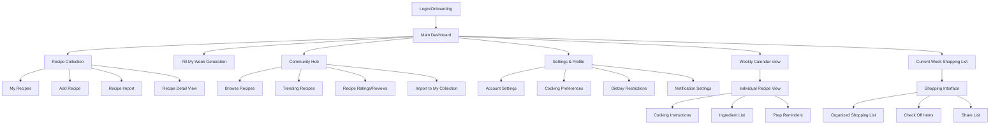
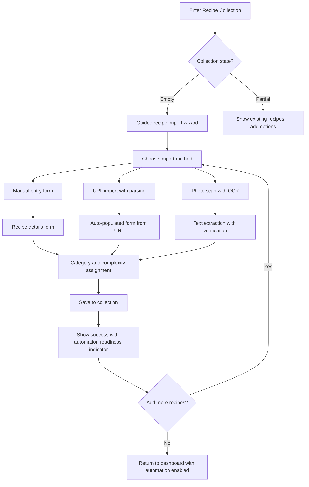
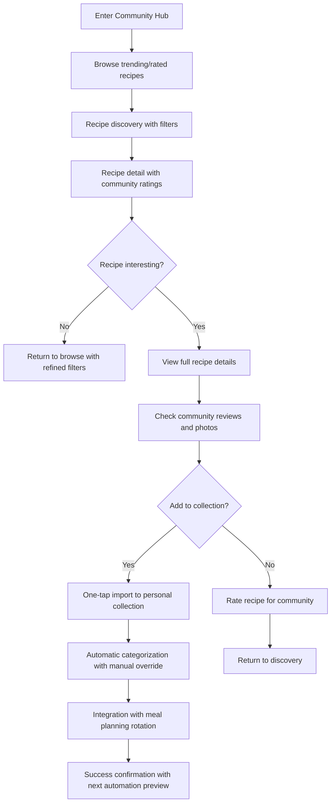

# imkitchen UI/UX Specification

## Introduction

This document defines the user experience goals, information architecture, user flows, and visual design specifications for imkitchen's user interface. It serves as the foundation for visual design and frontend development, ensuring a cohesive and user-centered experience focused on **intelligent meal planning automation**.

### Overall UX Goals & Principles

#### Target User Personas

**Primary: Cooking Enthusiasts with Complex Recipe Collections**
- Ages 28-45, established professionals with 20+ favorite recipes but regularly cook only 5-7 due to planning complexity
- Intermediate to advanced cooking skills, comfortable with complex recipes when properly planned
- Currently use manual systems (browser favorites, recipe apps without automation) creating decision fatigue
- Want to access their full recipe repertoire without timing complexity barriers

**Secondary: Busy Families Seeking Meal Planning Efficiency**
- Dual-income households with children, limited time for meal planning but committed to home cooking
- Currently rely on rotation of 10-15 "safe" recipes due to time constraints
- Need meal planning that coordinates with complex family schedules and provides emergency alternatives

#### Usability Goals

1. **Effortless Automation**: Users can generate a complete weekly meal plan in under 10 seconds with one tap
2. **Trust Building**: Automated suggestions feel intelligent and personalized, not random
3. **Cognitive Load Reduction**: Interface eliminates decision paralysis while maintaining user control
4. **Recipe Collection Unlock**: Users discover and cook from 40%+ more of their recipe collection
5. **Mobile Kitchen Optimization**: All core functions accessible one-handed while cooking

#### Design Principles

1. **Automation with Transparency** - Make automation feel magical while showing the intelligent logic behind decisions
2. **Progressive Disclosure** - Start with the simplest possible interaction ("Fill My Week") then reveal complexity as needed
3. **Warm Efficiency** - Combine task efficiency with the warmth and joy of home cooking
4. **Mobile-First Confidence** - Every interaction works perfectly on mobile with large touch targets and clear feedback
5. **Community Without Overwhelm** - Social features enhance personal meal planning without creating complexity

## Information Architecture (IA)

### Site Map / Screen Inventory



### Navigation Structure

**Primary Navigation:** Bottom tab bar optimized for mobile one-handed use
- **Dashboard** (home icon): Weekly calendar + "Fill My Week" button - primary landing
- **My Recipes** (recipe book icon): Personal recipe collection management
- **Community** (users icon): Recipe discovery and social features  
- **Profile** (user icon): Settings, preferences, and account management

**Secondary Navigation:** Contextual within each primary section
- Dashboard: Week navigation arrows, meal slot selection, shopping list access
- My Recipes: Search/filter bar, category tabs, add/import actions
- Community: Search, trending tabs, rating filters
- Profile: Settings categories, preference sections

**Breadcrumb Strategy:** Minimal breadcrumbs due to mobile-first approach - rely on clear back navigation and contextual headers showing current location

## User Flows

### Flow 1: "Fill My Week" Automation

**User Goal:** Generate a complete weekly meal plan with one tap while feeling confident in the automated selections

**Entry Points:** Main dashboard "Fill My Week" button, empty calendar slots, weekly regeneration prompt

**Success Criteria:** Complete weekly calendar populated within 2 seconds, user understands rotation logic, can modify if desired

#### Flow Diagram

```mermaid
graph TD
    A[User lands on Dashboard] --> B{Has recipe collection?}
    B -->|No| C[Guided onboarding to add recipes]
    B -->|Yes| D[Prominent "Fill My Week" button visible]
    D --> E[User taps "Fill My Week"]
    E --> F[Loading animation with rotation logic explanation]
    F --> G[Weekly calendar populates with meals]
    G --> H[Success animation with rotation insights]
    H --> I{User satisfied?}
    I -->|Yes| J[Auto-generate shopping list]
    I -->|No| K[Show manual override options]
    K --> L[User makes adjustments]
    L --> M[Calendar updates automatically]
    M --> J
    J --> N[User reviews/shares shopping list]
```

#### Edge Cases & Error Handling:
- Insufficient recipe variety (< 7 recipes): Prompt to add more or accept repeats
- Complex dietary restrictions conflict: Show ingredient substitution options
- Previous week's plan still active: Offer to replace or create new week
- Network interruption during generation: Save partial progress, allow retry
- Algorithm timeout (>2 seconds): Show simplified fallback plan with manual refinement

**Notes:** Critical flow must feel magical yet transparent. Loading state should educate users about intelligent rotation logic to build trust.

### Flow 2: Recipe Collection Building

**User Goal:** Easily add and organize favorite recipes to enable automation

**Entry Points:** Onboarding wizard, "My Recipes" tab, recipe import prompts, empty state suggestions

**Success Criteria:** User has minimum viable recipe collection (10+ recipes) with proper categorization

#### Flow Diagram



#### Edge Cases & Error Handling:
- URL import failure: Offer manual entry with partial data
- Photo scan poor quality: Provide manual text correction interface
- Duplicate recipe detection: Show merge/keep separate options
- Missing crucial information (cook time): Prompt for completion with smart defaults
- Category assignment confusion: Provide smart suggestions based on ingredients

**Notes:** Must feel effortless while ensuring data quality for automation. Progressive completion allows users to start with basic info and refine later.

### Flow 3: Community Recipe Discovery

**User Goal:** Find new recipes from community ratings while easily adding them to personal collection

**Entry Points:** Community tab, empty meal slots, recipe variety suggestions, trending notifications

**Success Criteria:** User discovers and imports quality recipes that enhance their automated meal plans

#### Flow Diagram



#### Edge Cases & Error Handling:
- Recipe import conflicts with existing: Show comparison and merge options
- Community content inappropriate: Report mechanism with immediate removal
- Rating submission failure: Cache locally and retry
- Recipe missing key information: Flag for community editing
- Category mismatch with personal preferences: Smart recategorization suggestions

**Notes:** Community features must enhance rather than complicate personal meal planning. Integration with automation should feel seamless.

## Wireframes & Mockups

**Primary Design Files:** Design files will be created in Figma for detailed visual specifications, component library, and developer handoff. Figma enables collaborative design iteration and maintains design system consistency across all screens.

### Key Screen Layouts

#### Main Dashboard

**Purpose:** Central hub featuring weekly calendar and prominent "Fill My Week" automation - the heart of the user experience

**Key Elements:**
- Large, visually prominent "Fill My Week" button above calendar (primary CTA)
- Weekly calendar grid with color-coded meal complexity indicators
- Current week navigation with subtle left/right arrows
- Quick access to shopping list (floating action or tab)
- Empty state messaging for new users encouraging recipe collection

**Interaction Notes:** "Fill My Week" button uses progressive enhancement - loading animation educates users about rotation logic. Calendar slots tap to reveal recipe details or manual assignment options. Smooth week transitions with gesture support.

**Design File Reference:** [Figma Dashboard Frame - TBD]

#### Recipe Collection Management

**Purpose:** Streamlined interface for adding, organizing, and managing personal recipe library

**Key Elements:**  
- Search/filter bar prominently placed for quick recipe finding
- Grid/list toggle for recipe browsing preferences
- Category tabs (Breakfast, Lunch, Dinner, Favorites) with badge counts
- Floating add button with quick actions (manual entry, URL import, photo scan)
- Recipe cards showing key info: photo, title, complexity, prep time

**Interaction Notes:** Search with smart autocomplete and filtering. Card interactions reveal quick preview before full recipe view. Batch selection for category management. Swipe gestures for quick actions (edit, delete, favorite).

**Design File Reference:** [Figma Recipe Collection Frame - TBD]

#### Community Discovery Hub  

**Purpose:** Social recipe exploration with rating system and easy import to personal collection

**Key Elements:**
- Trending recipes carousel at top for immediate engagement
- Search bar with community-specific filters (rating, difficulty, cuisine)
- Recipe feed with community ratings, photos, and quick import buttons
- Filter chips for dietary restrictions, prep time, popularity
- User-generated content with attribution and reporting options

**Interaction Notes:** Infinite scroll with intelligent content curation. One-tap import with success confirmation. Rating system with visual feedback. Content moderation accessible through long-press menu.

**Design File Reference:** [Figma Community Hub Frame - TBD]

#### Individual Recipe View

**Purpose:** Comprehensive recipe display optimized for kitchen use with cooking guidance

**Key Elements:**
- Large hero image with ingredient overlay option  
- Tabbed interface: Ingredients, Instructions, Reviews, Nutrition
- Shopping list integration toggle for ingredients
- Prep time, difficulty, and serving size prominently displayed
- Community ratings and personal notes section

**Interaction Notes:** Kitchen mode with larger text and simplified navigation. Voice control integration for hands-free use. Progress tracking through cooking steps. Share functionality for successful meal results.

**Design File Reference:** [Figma Recipe Detail Frame - TBD]

## Component Library / Design System

**Design System Approach:** Create a new, focused design system optimized for mobile meal planning workflows. While leveraging proven patterns from established design systems (Material Design, Human Interface Guidelines), the system will be custom-built to support the unique automation-first experience and warm kitchen aesthetic defined in the PRD.

### Core Components

#### Fill My Week Button

**Purpose:** Primary automation trigger - the most critical interactive element in the entire application

**Variants:** 
- Default state: Large, prominent with cooking-inspired gradient
- Loading state: Animated with rotation logic explanation text
- Disabled state: When insufficient recipe collection (< 7 recipes)
- Success state: Momentary celebration animation before showing results

**States:** Default, Hover, Active, Loading, Disabled, Success, Error

**Usage Guidelines:** Must be the most prominent element on dashboard. Always accompanied by clear explanation of automation logic during loading. Never hidden or diminished - this is the core value proposition.

#### Recipe Card

**Purpose:** Standardized display for recipes across personal collection and community discovery

**Variants:**
- Compact: Grid view in recipe collection (image, title, complexity indicator)
- Detailed: List view with prep time, rating, description preview
- Community: Includes rating stars, import button, user attribution
- Calendar: Simplified version for weekly calendar slots

**States:** Default, Hover, Selected, Importing, Favorited, Rated

**Usage Guidelines:** Consistent information hierarchy across all contexts. Community recipes always show rating and import status. Personal recipes show usage frequency and last cooked indicators.

#### Meal Calendar Grid

**Purpose:** Weekly view displaying automated meal planning with visual complexity indicators

**Variants:**
- Week view: 7-day grid with breakfast/lunch/dinner slots
- Day detail: Expanded single-day view with prep timeline
- Empty state: Encouraging "Fill My Week" usage with visual prompts

**States:** Empty, Populated, Loading, Manual Override, Locked Meals

**Usage Guidelines:** Color coding must be consistent and accessible. Empty slots should encourage automation usage. Manual overrides clearly distinguished from automated selections.

#### Navigation Tabs (Bottom)

**Purpose:** Primary navigation optimized for mobile one-handed operation

**Variants:** Dashboard, My Recipes, Community, Profile

**States:** Default, Active, Badge (notification count), Disabled

**Usage Guidelines:** Icons with text labels for clarity. Dashboard always returns to current week view. Badge indicators for new community content or meal planning reminders.

#### Shopping List Component

**Purpose:** Organized ingredient display generated from meal planning automation

**Variants:**
- Categorized: Grouped by grocery store sections (produce, dairy, pantry)
- Flat list: Simple checkbox list for quick shopping
- Shared: Multi-user collaboration view for families

**States:** Unchecked, Checked, Partial (some items completed), Shared

**Usage Guidelines:** Automatic categorization with manual override option. Check-off interactions must be satisfying and persistent across sessions. Share functionality prominent for family users.

## Branding & Style Guide

### Visual Identity

**Brand Guidelines:** New brand identity development focusing on intelligent automation that feels warm and approachable rather than cold and technical. Inspired by modern kitchen design principles - clean lines with warm materials, efficiency with comfort.

### Color Palette

| Color Type | Hex Code | Usage |
|------------|----------|--------|
| Primary | #FF6B47 | "Fill My Week" button, primary CTAs, complexity indicators |
| Secondary | #2E7D5E | Community features, rating stars, success states |
| Accent | #FFA726 | Recipe favorites, highlighted content, warm accents |
| Success | #66BB6A | Completed tasks, successful automations, positive feedback |
| Warning | #FFC107 | Prep time alerts, missing information, important notices |
| Error | #F44336 | Recipe conflicts, automation failures, critical errors |
| Neutral | #F5F5F5, #9E9E9E, #424242 | Text hierarchy, borders, backgrounds, subtle elements |

### Typography

#### Font Families
- **Primary:** Inter (clean, highly readable for mobile interfaces)
- **Secondary:** Playfair Display (elegant serif for recipe titles and special moments)  
- **Monospace:** SF Mono (cooking times, measurements, technical details)

#### Type Scale

| Element | Size | Weight | Line Height |
|---------|------|--------|-------------|
| H1 | 32px | 700 | 1.2 |
| H2 | 24px | 600 | 1.3 |
| H3 | 20px | 600 | 1.4 |
| Body | 16px | 400 | 1.5 |
| Small | 14px | 400 | 1.4 |

### Iconography

**Icon Library:** Custom icon set supplementing Feather Icons base library, optimized for kitchen/cooking context

**Usage Guidelines:** Consistent 24px grid system, filled variants for active states, outlined for inactive. Custom icons for meal complexity, prep time indicators, and automation status.

### Spacing & Layout

**Grid System:** 8px base unit system for consistent spacing and alignment across all screen sizes

**Spacing Scale:** 4px, 8px, 16px, 24px, 32px, 48px, 64px increments ensuring visual rhythm and hierarchy

## Accessibility Requirements

### Compliance Target

**Standard:** WCAG 2.1 AA compliance ensuring usability for users with disabilities while maintaining optimal meal planning experience

### Key Requirements

**Visual:**
- Color contrast ratios: 4.5:1 minimum for normal text, 3:1 for large text and UI components
- Focus indicators: 2px solid outline with high contrast color, visible on all interactive elements
- Text sizing: Supports up to 200% zoom without horizontal scrolling, maintains all functionality

**Interaction:**
- Keyboard navigation: Full app functionality accessible via keyboard with logical tab order
- Screen reader support: Semantic HTML, ARIA labels for complex interactions, live region announcements for automation results
- Touch targets: Minimum 44px × 44px for all interactive elements, adequate spacing between adjacent targets

**Content:**
- Alternative text: Descriptive alt text for all recipe images, automation status graphics, and UI icons
- Heading structure: Logical H1-H6 hierarchy throughout all screens for navigation context
- Form labels: Clear, descriptive labels for all input fields with error messaging

### Testing Strategy

**Automated Testing:** Integration with axe-core accessibility testing in CI/CD pipeline for continuous compliance validation

**Manual Testing:** Monthly testing with screen readers (VoiceOver on iOS, TalkBack on Android), keyboard-only navigation validation, color contrast verification

**User Testing:** Quarterly accessibility testing sessions with users who have visual, motor, and cognitive disabilities to validate real-world usability

## Responsiveness Strategy

### Breakpoints

| Breakpoint | Min Width | Max Width | Target Devices |
|------------|-----------|-----------|----------------|
| Mobile | 320px | 767px | iPhone SE to iPhone Pro Max, Android phones |
| Tablet | 768px | 1023px | iPad Mini to iPad Pro, Android tablets |
| Desktop | 1024px | 1439px | Laptops, small desktop screens |
| Wide | 1440px | - | Large desktop monitors, external displays |

### Adaptation Patterns

**Layout Changes:** Mobile uses single-column layouts with full-width components. Tablet introduces sidebar navigation with main content area. Desktop adds multi-column layouts for recipe browsing and detailed views.

**Navigation Changes:** Mobile relies on bottom tab bar. Tablet introduces collapsible side navigation. Desktop features persistent sidebar with enhanced secondary navigation options.

**Content Priority:** Mobile prioritizes automation ("Fill My Week") with progressive disclosure. Tablet shows more recipe details in grid views. Desktop enables simultaneous recipe browsing and calendar management.

**Interaction Changes:** Mobile optimized for touch with large targets and gestures. Tablet supports both touch and basic keyboard navigation. Desktop includes full keyboard shortcuts and hover states.

## Animation & Micro-interactions

### Motion Principles

**Purposeful Animation:** Every animation serves a functional purpose - providing feedback, indicating system status, or guiding user attention. Avoid decorative motion that doesn't enhance the core meal planning experience.

**Trust Through Transparency:** Loading animations for "Fill My Week" generation educate users about the intelligent rotation logic, building confidence in automation decisions.

**Kitchen-Appropriate Timing:** Motion respects the cooking context - not too fast to feel jarring in a calm kitchen environment, not too slow to impede efficiency.

### Key Animations

- **"Fill My Week" Loading:** Gentle pulsing with rotation explanation text (Duration: 2000ms, Easing: ease-in-out)
- **Recipe Card Import:** Smooth slide-in animation with success checkmark (Duration: 300ms, Easing: ease-out) 
- **Calendar Population:** Sequential appearance of meal slots, left-to-right (Duration: 150ms per slot, Easing: ease-out)
- **Shopping List Generation:** Items fade-in grouped by category with subtle bounce (Duration: 100ms per item, Easing: ease-out)
- **Navigation Transitions:** Smooth slide transitions maintaining spatial relationship (Duration: 250ms, Easing: ease-in-out)
- **Success Celebrations:** Brief, joyful animation for completed automations (Duration: 800ms, Easing: elastic)

## Performance Considerations

### Performance Goals

- **Page Load:** All critical animations optimized for 60fps performance on mid-range mobile devices
- **Interaction Response:** Touch feedback animations complete within 100ms for immediate user response
- **Animation FPS:** Consistent 60fps target with graceful degradation to 30fps on older devices

### Design Strategies

**Reduced Motion Support:** Respect user preferences for reduced motion with alternative static feedback states. Essential automation feedback maintained through color and text changes rather than motion.

**Battery Optimization:** Animations pause during low battery states and use CSS transforms and opacity for GPU acceleration rather than CPU-intensive properties.

## Next Steps

### Immediate Actions

1. **Stakeholder Review & Approval** - Present complete UX specification to product team and key stakeholders for validation of automation-first design approach
2. **Create Figma Design System** - Build comprehensive design system in Figma including all defined components, color palette, typography, and spacing scales  
3. **Develop High-Fidelity Mockups** - Create detailed mockups for all key screens focusing on mobile-first "Fill My Week" experience
4. **Accessibility Validation** - Review color contrast ratios and interaction patterns with accessibility expert to ensure WCAG AA compliance
5. **Design-Development Handoff Preparation** - Organize Figma files with developer-friendly naming and clear component specifications

### Design Handoff Checklist

- [x] All user flows documented
- [x] Component inventory complete  
- [x] Accessibility requirements defined
- [x] Responsive strategy clear
- [x] Brand guidelines incorporated
- [x] Performance goals established
- [ ] High-fidelity mockups created in Figma
- [ ] Design system tokens exported for development  
- [ ] Component specifications documented for Lynx.js implementation
- [ ] Animation specifications detailed with easing and duration values
- [ ] Accessibility testing completed with screen readers

### Change Log
| Date | Version | Description | Author |
|------|---------|-------------|---------|
| 2025-09-06 | 1.0 | Initial UI/UX specification based on comprehensive PRD | Sally (UX Expert) |
