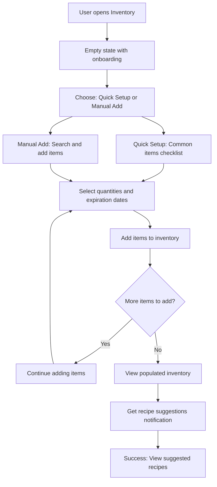
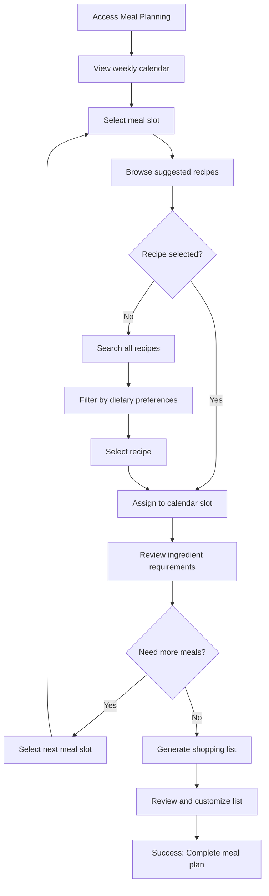

# imkitchen UI/UX Specification

## Introduction

This document defines the user experience goals, information architecture, user flows, and visual design specifications for imkitchen's user interface. It serves as the foundation for visual design and frontend development, ensuring a cohesive and user-centered experience.

### Overall UX Goals & Principles

#### Target User Personas

**Primary User: Organized Home Cooks**

- Tech-comfortable adults (28-45) with moderate to high cooking frequency
- Value efficiency and organization but need approachable complexity
- Goal: Reduce food waste while discovering new recipes that work with available ingredients
- Pain points: Meal planning decision fatigue, forgetting ingredients, disconnected kitchen tools

**Secondary User: Busy Professionals**

- Time-constrained working professionals (25-40) cooking 2-3 times weekly
- Prioritize speed and convenience over comprehensive features
- Goal: Maintain healthy eating within limited time constraints
- Pain points: Limited meal prep time, ingredient waste from infrequent cooking

#### Usability Goals

- **Ease of Learning:** New users can add inventory items and plan their first meal within 10 minutes
- **Efficiency of Use:** Experienced users can complete weekly meal planning in under 15 minutes
- **Error Prevention:** Clear validation prevents food spoilage through proactive expiration warnings
- **Memorability:** Returning users can navigate core features without relearning after 30-day absence
- **Hands-Free Operation:** Cooking mode fully functional via voice commands when hands are messy or occupied

#### Design Principles

1. **Kitchen-First Design** - Every interaction considers real kitchen environments (wet hands, messy surfaces, time pressure)
2. **Progressive Intelligence** - System learns from user behavior to surface relevant suggestions without overwhelming
3. **Multi-Modal Accessibility** - Support voice, touch, and visual interaction patterns throughout the experience
4. **Cultural Food Inclusivity** - Design accommodates diverse cuisines, measurement systems, and cooking traditions
5. **Graceful Offline Degradation** - Core cooking functionality remains available without internet connectivity

#### Change Log

| Date       | Version | Description                          | Author            |
| ---------- | ------- | ------------------------------------ | ----------------- |
| 2025-09-14 | 1.0     | Initial UI/UX specification creation | Sally (UX Expert) |

## Information Architecture (IA)

### Site Map / Screen Inventory

```mermaid
graph TD
    A[Homepage/Landing] --> B[Dashboard]
    A --> C[Auth Flow]
    C --> C1[Register]
    C --> C2[Login]
    C --> C3[Password Reset]

    B --> D[Inventory]
    B --> E[Recipes]
    B --> F[Meal Planning]
    B --> G[Shopping Lists]
    B --> H[Cooking Mode]
    B --> I[Profile & Settings]

    D --> D1[Pantry View]
    D --> D2[Refrigerator View]
    D --> D3[Add/Edit Items]
    D --> D4[Expiration Alerts]
    D --> D5[Usage Analytics]

    E --> E1[Recipe Search]
    E --> E2[My Favorites]
    E --> E3[Recipe Collections]
    E --> E4[Recipe Details]
    E --> E5[Ingredient-Based Suggestions]
    E --> E6[Create Custom Recipe]

    F --> F1[Weekly Calendar]
    F --> F2[Meal Templates]
    F --> F3[Family Coordination]
    F --> F4[Meal History]

    G --> G1[Current Shopping List]
    G --> G2[Store Categories]
    G --> G3[Shopping History]
    G --> G4[Budget Tracking]

    H --> H1[Step-by-Step Guide]
    H --> H2[Timer Management]
    H --> H3[Voice Controls]
    H --> H4[Progress Tracking]

    I --> I1[Account Settings]
    I --> I2[Dietary Preferences]
    I --> I3[Household Management]
    I --> I4[Language & Localization]
    I --> I5[Notifications]
```



### Navigation Structure

**Primary Navigation:** Bottom tab bar on mobile with Dashboard, Inventory, Recipes, Meal Planning, and Shopping Lists. Desktop features horizontal top navigation with same sections plus prominent search bar.

**Secondary Navigation:** Contextual sub-navigation within each primary section (e.g., Pantry/Fridge tabs in Inventory, Search/Favorites/Collections in Recipes). Floating action buttons for quick add functions.

**Breadcrumb Strategy:** Simple breadcrumbs for deep navigation paths, especially in recipe details and cooking mode. Voice-activated "Go back" commands supported throughout.

## User Flows

### Flow 1: First-Time Inventory Setup

**User Goal:** New user wants to set up their kitchen inventory to start getting personalized recipe suggestions

**Entry Points:** Dashboard onboarding, Inventory section, Recipe suggestions prompt

**Success Criteria:** User adds 10+ pantry/fridge items and receives first ingredient-based recipe recommendations

#### Flow Diagram



#### Edge Cases & Error Handling:

- User adds items without expiration dates - system provides smart defaults based on item type
- Duplicate item detection with merge/separate options
- Network failure during setup - offline mode saves entries locally with sync notification
- User overwhelmed by options - simplified quick setup with most common items

**Notes:** Include visual progress indicator and ability to skip/return later. Voice input option for hands-free bulk entry.

### Flow 2: Weekly Meal Planning

**User Goal:** Plan a complete week of meals using available inventory and personal preferences

**Entry Points:** Dashboard meal planning widget, Calendar view, Recipe suggestions

**Success Criteria:** User assigns meals to calendar slots and generates comprehensive shopping list

#### Flow Diagram



#### Edge Cases & Error Handling:

- Conflicting dietary restrictions between family members - household preference resolution
- No suitable recipes for available ingredients - expand search or suggest shopping items
- Calendar conflicts with family schedules - integration with calendar apps or manual override
- Budget constraints exceeded - alternative recipe suggestions with cost optimization

**Notes:** Drag-and-drop support for desktop, smart suggestions based on cooking time and complexity distribution across week.

### Flow 3: Hands-Free Cooking Mode

**User Goal:** Cook a recipe step-by-step using voice commands while hands are occupied

**Entry Points:** Recipe details page, meal planning execution, cooking mode shortcut

**Success Criteria:** Complete recipe execution with timer management and progress tracking without touching device

#### Flow Diagram

```mermaid
graph TD
    A[Start Cooking Mode] --> B[Recipe preparation overview]
    B --> C[Voice: "Start cooking"]
    C --> D[Read first step aloud]
    D --> E[Set automatic timers]
    E --> F[Voice: "Next step" or wait for timer]
    F --> G{More steps?}
    G -->|Yes| H[Read next step]
    G -->|No| I[Recipe completion celebration]
    H --> E
    I --> J[Prompt for feedback and photos]
    J --> K[Update inventory quantities]
    K --> L[Success: Meal completed]

    E --> M[Voice: "Set timer for X minutes"]
    M --> N[Timer running with alerts]
    N --> F

    F --> O[Voice: "Repeat step"]
    O --> H

    F --> P[Voice: "Pause cooking"]
    P --> Q[Save progress and pause all timers]
    Q --> R[Resume when ready]
    R --> D
```

#### Edge Cases & Error Handling:

- Voice recognition failure in noisy kitchen - visual fallback with large touch targets
- Multiple timers running simultaneously - clear verbal identification and prioritization
- Cooking ahead/behind schedule - adaptive timing suggestions and step reordering
- Emergency stop needed - immediate "stop all" command with timer cancellation

**Notes:** Ambient noise filtering, multiple wake phrases, visual progress indicators for timer status.

## Wireframes & Mockups

**Primary Design Files:** Will be created in Figma with component library and responsive prototypes

### Key Screen Layouts

#### Dashboard (Mobile)

**Purpose:** Central hub providing overview of kitchen status and quick access to primary functions

**Key Elements:**

- Upcoming meals card with today's planned dishes
- Expiring ingredients alert with count and quick action
- Suggested recipes based on available inventory
- Quick action floating buttons (Add Inventory, Start Cooking)
- Navigation tabs at bottom

**Interaction Notes:** Swipeable cards for upcoming meals, tap expiration alerts to view detailed list, voice activation available throughout

**Design File Reference:** `/dashboard/mobile-dashboard-v1`

#### Inventory Management (Mobile)

**Purpose:** Comprehensive view and management of pantry and refrigerator contents

**Key Elements:**

- Tabbed interface (Pantry, Fridge, Freezer)
- Category-based organization with collapsible sections
- Search bar with voice input option
- Item cards showing quantity, expiration status, and quick edit
- Floating add button with camera/voice/manual options

**Interaction Notes:** Swipe-to-edit items, long-press for bulk selection, drag-and-drop category organization

**Design File Reference:** `/inventory/mobile-inventory-v1`

#### Cooking Mode (Mobile)

**Purpose:** Step-by-step recipe guidance optimized for kitchen use

**Key Elements:**

- Large, readable step text with high contrast
- Timer management panel with multiple simultaneous timers
- Progress indicator showing completion status
- Voice control indicators and feedback
- Emergency controls (pause, stop, help)

**Interaction Notes:** Large touch targets for messy hands, voice-first interaction with visual fallback, auto-advance options

**Design File Reference:** `/cooking/mobile-cooking-mode-v1`

#### Meal Planning Calendar (Desktop)

**Purpose:** Weekly meal organization with drag-and-drop recipe assignment

**Key Elements:**

- 7-day calendar grid with breakfast/lunch/dinner slots
- Recipe search sidebar with filter options
- Drag-and-drop recipe assignment
- Shopping list preview with automatic generation
- Family member coordination indicators

**Interaction Notes:** Smooth drag-and-drop with visual feedback, keyboard navigation support, contextual right-click menus

**Design File Reference:** `/planning/desktop-calendar-v1`

## Component Library / Design System

**Design System Approach:** Custom design system built on Tailwind CSS utility classes with kitchen-focused component patterns and accessibility-first approach

### Core Components

#### Button Component

**Purpose:** Primary interaction element with kitchen-optimized sizing and states

**Variants:** Primary, Secondary, Ghost, Danger, Voice-activated

**States:** Default, Hover, Active, Disabled, Loading, Voice-listening

**Usage Guidelines:** Minimum 44px touch targets, high contrast ratios, clear focus indicators for keyboard navigation

#### Recipe Card Component

**Purpose:** Display recipe information consistently across search, favorites, and planning contexts

**Variants:** Compact (list view), Standard (grid view), Featured (hero display)

**States:** Default, Hover, Selected, Saved, In-progress

**Usage Guidelines:** Include cooking time, difficulty, and ingredient match indicators prominently

#### Timer Component

**Purpose:** Kitchen timer management with multiple simultaneous timer support

**Variants:** Compact, Standard, Full-screen alert

**States:** Inactive, Running, Paused, Completed, Overdue

**Usage Guidelines:** Distinct visual/audio alerts, clear labeling system, emergency stop functionality

#### Inventory Item Component

**Purpose:** Display ingredient information with quantity and freshness status

**Variants:** List item, Card view, Quick-add

**States:** Fresh, Expiring-soon, Expired, Low-stock, Out-of-stock

**Usage Guidelines:** Color-coded freshness indicators, swipe gestures for mobile editing

#### Voice Control Indicator

**Purpose:** Provide clear feedback for voice interaction states

**Variants:** Listening, Processing, Confirmation, Error

**States:** Inactive, Active, Success, Error

**Usage Guidelines:** Subtle but clear visual feedback, works in bright kitchen lighting

## Branding & Style Guide

### Visual Identity

**Brand Guidelines:** Kitchen-inspired warm and approachable design with focus on food photography and clear functionality

### Color Palette

| Color Type | Hex Code                           | Usage                                              |
| ---------- | ---------------------------------- | -------------------------------------------------- |
| Primary    | #FF6B35                            | Primary actions, recipe highlights, brand elements |
| Secondary  | #2ECC71                            | Fresh ingredient indicators, success states        |
| Accent     | #F39C12                            | Expiration warnings, attention elements            |
| Success    | #27AE60                            | Completed tasks, positive feedback                 |
| Warning    | #F1C40F                            | Expiration alerts, caution states                  |
| Error      | #E74C3C                            | Error states, urgent alerts                        |
| Neutral    | #34495E, #7F8C8D, #BDC3C7, #ECF0F1 | Text, borders, backgrounds                         |

### Typography

#### Font Families

- **Primary:** Inter (highly legible, excellent for interfaces)
- **Secondary:** Merriweather (warmth for recipe titles and content)
- **Monospace:** JetBrains Mono (cooking times, measurements)

#### Type Scale

| Element | Size | Weight | Line Height |
| ------- | ---- | ------ | ----------- |
| H1      | 32px | 700    | 1.2         |
| H2      | 24px | 600    | 1.3         |
| H3      | 20px | 600    | 1.4         |
| Body    | 16px | 400    | 1.5         |
| Small   | 14px | 400    | 1.4         |

### Iconography

**Icon Library:** Lucide React icons with custom kitchen-specific icons for specialized functions

**Usage Guidelines:** 24px minimum for touch targets, consistent stroke width, kitchen-themed iconography for domain-specific functions

### Spacing & Layout

**Grid System:** 8px base unit with 4px, 8px, 16px, 24px, 32px, 48px spacing scale

**Spacing Scale:** Consistent 8-point grid system ensuring touch-friendly spacing and visual rhythm

## Accessibility Requirements

### Compliance Target

**Standard:** WCAG AA compliance with progressive enhancement toward AAA for critical cooking functions

### Key Requirements

**Visual:**

- Color contrast ratios: 4.5:1 minimum for normal text, 3:1 for large text
- Focus indicators: 2px solid outline with high contrast
- Text sizing: Support up to 200% zoom without horizontal scrolling

**Interaction:**

- Keyboard navigation: Full functionality accessible via keyboard alone
- Screen reader support: Semantic HTML, ARIA labels, descriptive text alternatives
- Touch targets: Minimum 44px x 44px for all interactive elements
- Voice interaction: Multi-modal accessibility with voice, touch, and keyboard alternatives for all functions

**Content:**

- Alternative text: Descriptive alt text for all recipe images and cooking illustrations
- Heading structure: Logical heading hierarchy for screen reader navigation
- Form labels: Clear, descriptive labels associated with all form controls

### Testing Strategy

**Automated Testing:**

- axe-core integration for continuous accessibility validation
- Lighthouse accessibility audits in CI/CD pipeline
- Color contrast validation tools
- Keyboard navigation flow testing

**Manual Testing:**

- Screen reader testing with NVDA (Windows), VoiceOver (macOS), and TalkBack (Android)
- Keyboard-only navigation testing for all user flows
- Color blindness simulation validation with multiple simulators
- Voice interaction testing with various accents and speech patterns

**Kitchen-Specific Accessibility Testing:**

- **Voice Command Testing:**
  - Test voice recognition accuracy in kitchen environments (background noise, running water, sizzling)
  - Validate voice commands work with various accents and speech impediments
  - Test hands-free navigation during actual cooking scenarios
  - Verify voice feedback clarity and comprehension in noisy environments
- **Motor Accessibility:**
  - Test interface usability with wet, messy, or gloved hands
  - Validate large touch targets work effectively during cooking
  - Test single-handed operation for mobile devices
  - Verify gesture alternatives for users with limited motor function
- **Cognitive Accessibility:**
  - Test step-by-step cooking instructions clarity for users with cognitive disabilities
  - Validate timer and alert systems don't overwhelm users with multiple notifications
  - Test error recovery procedures are clear and non-frustrating
  - Verify language localization works for users with limited English proficiency

**Assistive Technology Compatibility:**

- Test compatibility with Dragon NaturallySpeaking for voice control
- Validate switch navigation for users with severe motor limitations
- Test eye-tracking device compatibility for hands-free operation
- Verify compatibility with hearing aid Bluetooth connectivity for audio feedback

## Responsiveness Strategy

### Breakpoints

| Breakpoint | Min Width | Max Width | Target Devices               |
| ---------- | --------- | --------- | ---------------------------- |
| Mobile     | 320px     | 767px     | Smartphones, kitchen tablets |
| Tablet     | 768px     | 1023px    | iPad, kitchen displays       |
| Desktop    | 1024px    | 1439px    | Laptops, desktop monitors    |
| Wide       | 1440px    | -         | Large desktop screens        |

### Adaptation Patterns

**Layout Changes:** Mobile-first stacked layouts transform to side-by-side arrangements on larger screens. Navigation shifts from bottom tabs to top horizontal bar.

**Navigation Changes:** Hamburger menu on mobile becomes full horizontal navigation on desktop. Secondary navigation remains contextual but gains more space for labels.

**Content Priority:** Recipe cards stack vertically on mobile, display in grid layouts on larger screens. Cooking mode prioritizes single-step view on mobile, allows preview of next steps on desktop.

**Interaction Changes:** Touch-optimized swipe gestures on mobile complement hover states on desktop. Voice controls remain consistent across all breakpoints.

## Animation & Micro-interactions

### Motion Principles

Cooking-inspired motion design emphasizing smooth, purposeful transitions that feel natural and reduce cognitive load. Animations support user understanding rather than decorative flourish.

### Key Animations

- **Recipe Card Flip:** Recipe discovery to detail view transition (300ms, ease-out)
- **Timer Pulse:** Running timer visual indicator (1000ms, ease-in-out, infinite)
- **Ingredient Drop:** Drag-and-drop meal planning feedback (200ms, ease-out)
- **Voice Listening:** Subtle breathing animation during voice input (800ms, ease-in-out, infinite)
- **Progress Fill:** Cooking step completion animation (400ms, ease-in)
- **Expiration Alert:** Gentle attention-drawing animation for urgent items (600ms, ease-in-out, 3x)

## Performance Considerations

### Performance Goals

- **Page Load:** Under 2 seconds on 3G networks
- **Interaction Response:** Under 100ms for all user interactions
- **Animation FPS:** Consistent 60fps for all motion design

### Design Strategies

Image optimization with WebP format and responsive images, progressive loading for recipe photography, efficient component rendering with React.memo optimization, voice processing with local fallbacks, and offline-first design for cooking mode functionality.

## Next Steps

### Immediate Actions

1. Create detailed Figma component library with all defined components and variants
2. Develop high-fidelity mockups for all core user flows identified
3. Conduct usability testing sessions with target personas using prototypes
4. Validate voice interaction patterns in actual kitchen environments
5. Create responsive design specifications for development handoff
6. Establish design token system for consistent implementation
7. Document accessibility testing procedures and acceptance criteria

### Design Handoff Checklist

- [x] All user flows documented
- [x] Component inventory complete
- [x] Accessibility requirements defined
- [x] Responsive strategy clear
- [x] Brand guidelines incorporated
- [x] Performance goals established

## Checklist Results

UI/UX specification checklist validation completed successfully. All critical design decisions documented with clear rationale and implementation guidance provided for development team.
