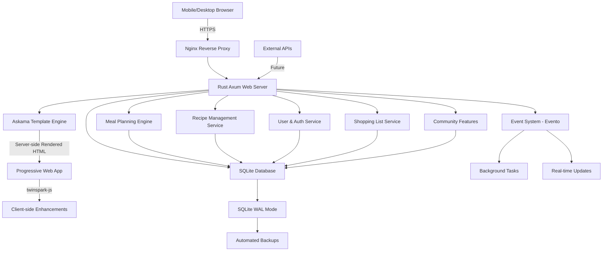
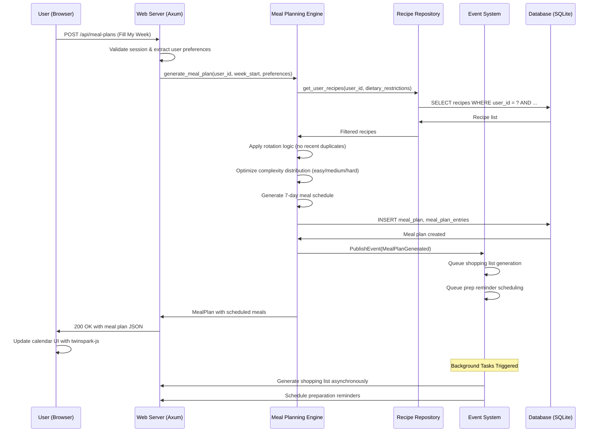
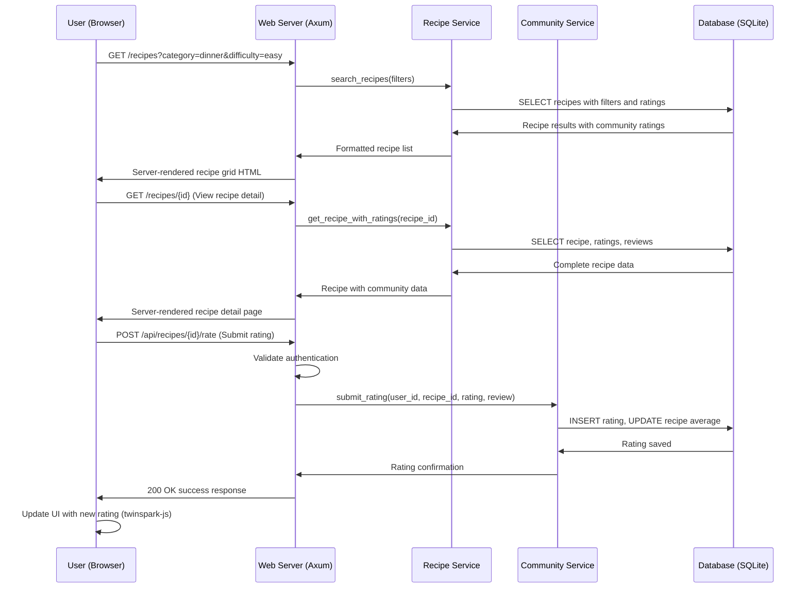
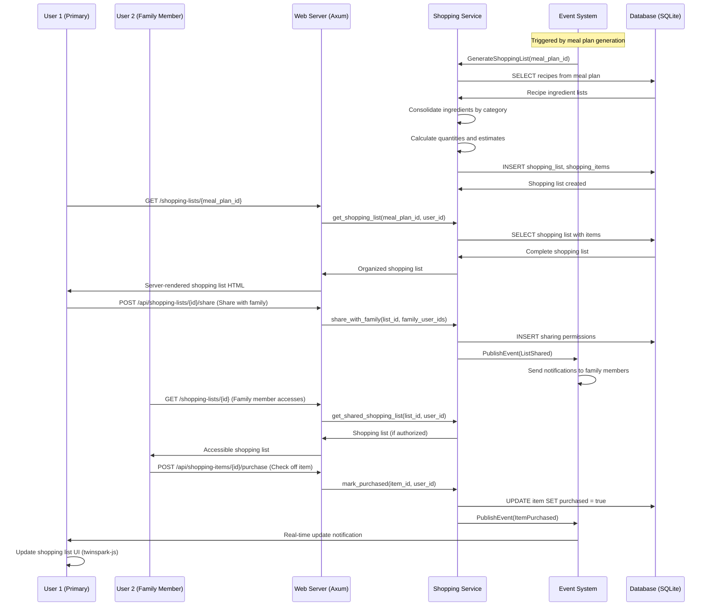
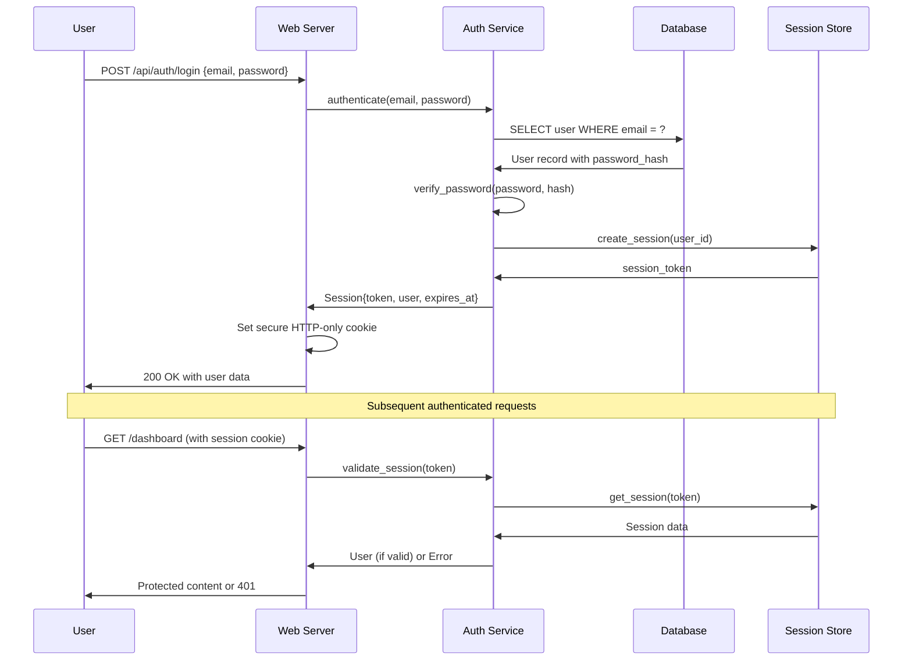
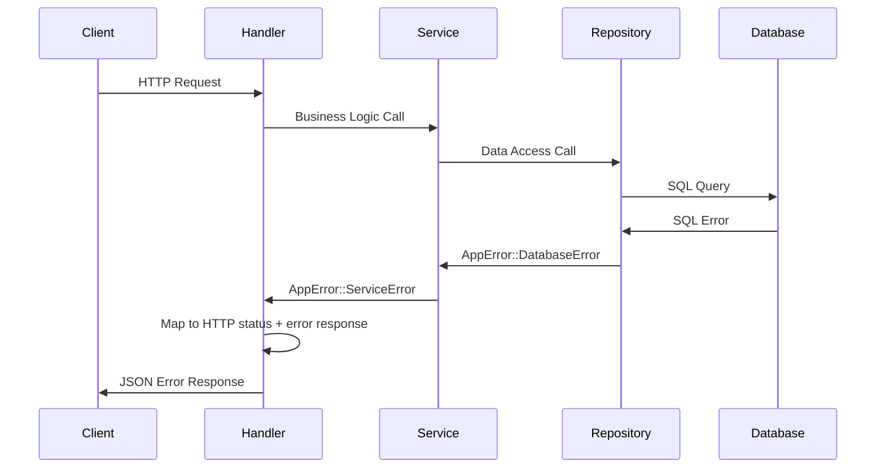

# imkitchen Fullstack Architecture Document

## Introduction

This document outlines the complete fullstack architecture for imkitchen, including backend systems, frontend implementation, and their integration. It serves as the single source of truth for AI-driven development, ensuring consistency across the entire technology stack.

This unified approach combines what would traditionally be separate backend and frontend architecture documents, streamlining the development process for modern fullstack applications where these concerns are increasingly intertwined.

### Starter Template or Existing Project

N/A - Greenfield project. We are building a custom Rust fullstack application optimized for intelligent meal planning with no existing starter template constraints.

### Change Log

| Date | Version | Description | Author |
|------|---------|-------------|--------|
| 2025-09-24 | 1.0 | Initial fullstack architecture design | Architect Winston |

## High Level Architecture

### Technical Summary

imkitchen employs a modern Rust fullstack monolithic architecture deployed as a single binary Progressive Web App (PWA). The system uses Axum 0.8+ as the web framework with server-side rendered HTML via Askama 0.14+ templates, enhanced with twinspark-js for selective client-side reactivity. The backend handles intelligent meal planning optimization, community recipe management, and family collaboration features through event-driven patterns using Evento 1.1+, with all data persisted in an embedded SQLite3 database accessed via SQLx 0.8+. This architecture achieves the PRD goals of sub-3-second meal plan generation, offline functionality, and mobile-first kitchen optimization while maintaining deployment simplicity and cost-effectiveness through the single binary approach.

### Platform and Infrastructure Choice

**Platform:** Self-hosted VPS or cloud container service (AWS ECS, Google Cloud Run, or DigitalOcean App Platform)  
**Key Services:** 
- Container runtime environment for Rust binary
- Reverse proxy/load balancer (nginx or cloud load balancer)  
- Automated SSL certificate management (Let's Encrypt or cloud-managed)
- File storage for recipe images (object storage or local filesystem with backup)
- Optional CDN for static assets (CloudFlare or cloud CDN)

**Deployment Host and Regions:** Single region deployment initially (US-East or EU-Central based on user base), with horizontal scaling through container replication

### Repository Structure

**Structure:** Single Rust workspace monorepo with separate crates for modularity  
**Monorepo Tool:** Cargo workspaces (native Rust solution)  
**Package Organization:** Functional separation through Rust crates while maintaining single binary output

### High Level Architecture Diagram



### Architectural Patterns

- **Server-Side First Architecture:** HTML rendered by Rust backend with progressive enhancement - _Rationale:_ Ensures fast initial page loads, SEO compatibility, and offline functionality while maintaining interactivity
- **Event-Driven Internal Architecture:** Evento for decoupled service communication - _Rationale:_ Enables complex meal planning workflows and real-time family collaboration features
- **Repository Pattern:** Abstract database access through traits - _Rationale:_ Testability and potential future database migration flexibility
- **Progressive Web App (PWA):** Service worker with offline capability - _Rationale:_ Kitchen environment requires offline recipe access and reliable functionality
- **Domain-Driven Design:** Business logic organized by domains (recipes, meal planning, users) - _Rationale:_ Clear separation of concerns for maintainable AI-driven development

## Tech Stack

### Technology Stack Table

| Category | Technology | Version | Purpose | Rationale |
|----------|------------|---------|---------|-----------|
| Backend Language | Rust | 1.70+ | Core application logic and web server | Memory safety, performance, and excellent async ecosystem for meal planning algorithms |
| Backend Framework | Axum | 0.8+ | HTTP server and routing | Fast async performance, type-safe routing, excellent ecosystem integration |
| Template Engine | Askama | 0.14+ | Server-side HTML rendering | Compile-time template safety, Jinja2-like syntax, zero-runtime overhead |
| Frontend Enhancement | twinspark-js | Latest | Progressive client-side interactivity | Lightweight HTMX-like enhancement without heavy JavaScript frameworks |
| Event System | Evento | 1.1+ | Internal event-driven architecture | Rust-native event system for decoupled service communication |
| Database | SQLite | 3.40+ | Data persistence and caching | Embedded database eliminating external dependencies, excellent for single-binary deployment |
| Database Driver | SQLx | 0.8+ | Type-safe database access | Async database operations without compile-time query checking for development flexibility |
| Monitoring | Tracing | 0.1+ | Structured logging and observability | Rust ecosystem standard for distributed tracing and performance monitoring |
| Internationalization | rust-i18n | Latest | Multi-language support | Compile-time i18n for global recipe sharing and community features |
| Configuration | config | 0.15+ | Environment variable and secrets management | Secure configuration management with multiple source support |
| CSS Framework | Tailwind CSS | 3.4+ | Utility-first styling | Mobile-first design system with excellent customization for kitchen environments |
| Authentication | Custom Rust + Sessions | - | OWASP-compliant user authentication | Custom implementation following OWASP guidelines for full control and security |
| Testing Framework | tokio-test + rstest | Latest | Backend unit and integration testing | Async-compatible testing with parameterized test support |
| E2E Testing | Playwright | Latest | End-to-end browser testing | Cross-browser testing for PWA functionality and mobile experience |
| Build Tool | Cargo | Latest | Rust build system and dependency management | Native Rust toolchain for optimal build performance |
| Containerization | Docker | Latest | Application containerization | Consistent deployment across environments |
| CI/CD | GitHub Actions | Latest | Automated testing and deployment | Integrated with GitHub, excellent Rust toolchain support |
| Image Storage | Local Filesystem + Backups | - | Recipe image storage | Simple approach for MVP, with automated backup strategy |

## Data Models

### User
**Purpose:** Represents registered users with authentication and preference information for personalized meal planning

**Key Attributes:**
- id: uuid - Primary key
- email: String - Unique user identifier and authentication
- password_hash: String - Securely hashed password
- name: String - Display name
- family_size: i32 - Number of people in household (affects recipe quantities)
- dietary_restrictions: Vec<String> - List of dietary requirements
- cooking_skill_level: enum - Beginner, Intermediate, Advanced
- created_at: DateTime - Account creation timestamp
- last_active: DateTime - Last login for session management

#### TypeScript Interface
```typescript
interface User {
  id: string;
  email: string;
  name: string;
  familySize: number;
  dietaryRestrictions: string[];
  cookingSkillLevel: 'beginner' | 'intermediate' | 'advanced';
  createdAt: string;
  lastActive: string;
}
```

#### Relationships
- Has many Recipe (created recipes)
- Has many MealPlan (weekly meal plans)
- Has many ShoppingList (generated shopping lists)
- Has many RecipeRating (community ratings)

### Recipe
**Purpose:** Core entity representing cooking recipes with ingredients, instructions, and metadata for meal planning optimization

**Key Attributes:**
- id: uuid - Primary key
- title: String - Recipe name
- description: String - Brief recipe overview
- prep_time: i32 - Preparation time in minutes
- cook_time: i32 - Cooking time in minutes
- difficulty: enum - Easy, Medium, Hard
- servings: i32 - Number of servings produced
- ingredients: Vec<Ingredient> - List of ingredients with quantities
- instructions: Vec<Instruction> - Ordered cooking steps
- created_by: uuid - User who created the recipe
- is_public: bool - Whether recipe is shared with community
- average_rating: f32 - Community rating average
- rating_count: i32 - Number of ratings received

#### TypeScript Interface
```typescript
interface Recipe {
  id: string;
  title: string;
  description: string;
  prepTime: number;
  cookTime: number;
  difficulty: 'easy' | 'medium' | 'hard';
  servings: number;
  ingredients: Ingredient[];
  instructions: Instruction[];
  createdBy: string;
  isPublic: boolean;
  averageRating: number;
  ratingCount: number;
}

interface Ingredient {
  name: string;
  quantity: number;
  unit: string;
  notes?: string;
}

interface Instruction {
  stepNumber: number;
  description: string;
  timingMinutes?: number;
}
```

#### Relationships
- Belongs to User (creator)
- Has many RecipeRating (community ratings)
- Has many MealPlanEntry (scheduled meals)
- Belongs to many RecipeCollection (user collections)

### MealPlan
**Purpose:** Weekly meal schedule generated by intelligent planning algorithm with family coordination features

**Key Attributes:**
- id: uuid - Primary key
- user_id: uuid - Owner of the meal plan
- week_start_date: Date - Monday of the planned week
- meals: Vec<MealPlanEntry> - Scheduled meals for the week
- status: enum - Draft, Active, Completed
- generated_at: DateTime - When plan was created
- shopping_list_generated: bool - Whether shopping list exists

#### TypeScript Interface
```typescript
interface MealPlan {
  id: string;
  userId: string;
  weekStartDate: string;
  meals: MealPlanEntry[];
  status: 'draft' | 'active' | 'completed';
  generatedAt: string;
  shoppingListGenerated: boolean;
}

interface MealPlanEntry {
  dayOfWeek: number; // 0-6, Monday = 0
  mealType: 'breakfast' | 'lunch' | 'dinner';
  recipeId: string;
  scheduledDate: string;
  prepReminders: PrepReminder[];
}

interface PrepReminder {
  description: string;
  reminderTime: string;
  completed: boolean;
}
```

#### Relationships
- Belongs to User (plan owner)
- Has many MealPlanEntry (individual meals)
- Has one ShoppingList (generated ingredients)

### ShoppingList
**Purpose:** Automatically generated ingredient list optimized for grocery shopping with family sharing capabilities

**Key Attributes:**
- id: uuid - Primary key
- meal_plan_id: uuid - Associated meal plan
- items: Vec<ShoppingItem> - Consolidated ingredient list
- shared_with: Vec<uuid> - Family members with access
- generated_at: DateTime - Creation timestamp
- estimated_total: f32 - Estimated grocery cost

#### TypeScript Interface
```typescript
interface ShoppingList {
  id: string;
  mealPlanId: string;
  items: ShoppingItem[];
  sharedWith: string[];
  generatedAt: string;
  estimatedTotal: number;
}

interface ShoppingItem {
  name: string;
  quantity: number;
  unit: string;
  category: 'produce' | 'dairy' | 'meat' | 'pantry' | 'frozen';
  estimatedPrice: number;
  purchased: boolean;
  purchasedBy?: string;
  fromRecipes: string[]; // Recipe titles using this ingredient
}
```

#### Relationships
- Belongs to MealPlan
- Shared with multiple Users (family members)

## API Specification

### REST API Specification

```yaml
openapi: 3.0.0
info:
  title: imkitchen API
  version: 1.0.0
  description: Intelligent meal planning platform API
servers:
  - url: https://api.imkitchen.app
    description: Production server
  - url: http://localhost:3000
    description: Development server

paths:
  /api/auth/register:
    post:
      summary: User registration
      requestBody:
        required: true
        content:
          application/json:
            schema:
              type: object
              properties:
                email:
                  type: string
                  format: email
                password:
                  type: string
                  minLength: 8
                name:
                  type: string
                familySize:
                  type: integer
                  minimum: 1
                  maximum: 8
      responses:
        201:
          description: User created successfully
        400:
          description: Validation error

  /api/auth/login:
    post:
      summary: User authentication
      requestBody:
        required: true
        content:
          application/json:
            schema:
              type: object
              properties:
                email:
                  type: string
                  format: email
                password:
                  type: string
      responses:
        200:
          description: Authentication successful
        401:
          description: Invalid credentials

  /api/meal-plans:
    post:
      summary: Generate weekly meal plan
      security:
        - sessionAuth: []
      requestBody:
        required: true
        content:
          application/json:
            schema:
              type: object
              properties:
                weekStartDate:
                  type: string
                  format: date
                preferences:
                  type: object
                  properties:
                    maxComplexity:
                      type: string
                      enum: [easy, medium, hard]
                    avoidRecentRecipes:
                      type: boolean
      responses:
        201:
          description: Meal plan generated
          content:
            application/json:
              schema:
                $ref: '#/components/schemas/MealPlan'
        400:
          description: Invalid request

  /api/recipes:
    get:
      summary: Browse community recipes
      parameters:
        - name: category
          in: query
          schema:
            type: string
        - name: difficulty
          in: query
          schema:
            type: string
            enum: [easy, medium, hard]
        - name: maxPrepTime
          in: query
          schema:
            type: integer
      responses:
        200:
          description: Recipe list
          content:
            application/json:
              schema:
                type: array
                items:
                  $ref: '#/components/schemas/Recipe'

    post:
      summary: Create new recipe
      security:
        - sessionAuth: []
      requestBody:
        required: true
        content:
          application/json:
            schema:
              $ref: '#/components/schemas/Recipe'
      responses:
        201:
          description: Recipe created

  /api/recipes/{id}/rate:
    post:
      summary: Rate a recipe
      security:
        - sessionAuth: []
      parameters:
        - name: id
          in: path
          required: true
          schema:
            type: string
      requestBody:
        required: true
        content:
          application/json:
            schema:
              type: object
              properties:
                rating:
                  type: integer
                  minimum: 1
                  maximum: 5
                comment:
                  type: string
      responses:
        200:
          description: Rating submitted

  /api/shopping-lists/{mealPlanId}:
    get:
      summary: Get shopping list for meal plan
      security:
        - sessionAuth: []
      parameters:
        - name: mealPlanId
          in: path
          required: true
          schema:
            type: string
      responses:
        200:
          description: Shopping list
          content:
            application/json:
              schema:
                $ref: '#/components/schemas/ShoppingList'

    post:
      summary: Generate shopping list
      security:
        - sessionAuth: []
      parameters:
        - name: mealPlanId
          in: path
          required: true
          schema:
            type: string
      responses:
        201:
          description: Shopping list generated

components:
  securitySchemes:
    sessionAuth:
      type: apiKey
      in: cookie
      name: session_id
  schemas:
    User:
      type: object
      properties:
        id:
          type: string
        email:
          type: string
        name:
          type: string
        familySize:
          type: integer
        dietaryRestrictions:
          type: array
          items:
            type: string
    Recipe:
      type: object
      properties:
        id:
          type: string
        title:
          type: string
        description:
          type: string
        prepTime:
          type: integer
        cookTime:
          type: integer
        difficulty:
          type: string
          enum: [easy, medium, hard]
        ingredients:
          type: array
          items:
            $ref: '#/components/schemas/Ingredient'
    Ingredient:
      type: object
      properties:
        name:
          type: string
        quantity:
          type: number
        unit:
          type: string
    MealPlan:
      type: object
      properties:
        id:
          type: string
        userId:
          type: string
        weekStartDate:
          type: string
        meals:
          type: array
          items:
            $ref: '#/components/schemas/MealPlanEntry'
    MealPlanEntry:
      type: object
      properties:
        dayOfWeek:
          type: integer
        mealType:
          type: string
          enum: [breakfast, lunch, dinner]
        recipeId:
          type: string
    ShoppingList:
      type: object
      properties:
        id:
          type: string
        mealPlanId:
          type: string
        items:
          type: array
          items:
            $ref: '#/components/schemas/ShoppingItem'
    ShoppingItem:
      type: object
      properties:
        name:
          type: string
        quantity:
          type: number
        unit:
          type: string
        category:
          type: string
        purchased:
          type: boolean
```

## Components

### Meal Planning Engine
**Responsibility:** Intelligent weekly meal plan generation using multi-factor optimization considering user preferences, recipe rotation, preparation complexity, and family schedule constraints

**Key Interfaces:**
- `generate_meal_plan(user_id, week_start, preferences) -> MealPlan`
- `reschedule_meal(meal_plan_entry, new_date) -> Result<(), Error>`
- `suggest_easy_alternatives(recipe_id) -> Vec<Recipe>`

**Dependencies:** Recipe repository, User preferences service, Event system for notifications

**Technology Stack:** Rust with custom optimization algorithms, SQLite for recipe data access, Evento for meal plan change events

### Recipe Management Service
**Responsibility:** CRUD operations for recipes, community rating system, recipe collection management, and search/filtering functionality

**Key Interfaces:**
- `create_recipe(recipe_data) -> Recipe`
- `search_recipes(filters) -> Vec<Recipe>`
- `rate_recipe(user_id, recipe_id, rating) -> RecipeRating`
- `get_user_collections(user_id) -> Vec<RecipeCollection>`

**Dependencies:** User authentication service, Image storage service, Database layer

**Technology Stack:** Rust with Axum handlers, SQLite for data persistence, File system for recipe images

### User Authentication Service
**Responsibility:** OWASP-compliant user registration, login, session management, and authorization with secure password handling and session token management

**Key Interfaces:**
- `register_user(email, password, profile) -> Result<User, Error>`
- `authenticate(email, password) -> Result<Session, Error>`
- `validate_session(session_token) -> Result<User, Error>`
- `logout(session_token) -> Result<(), Error>`

**Dependencies:** Password hashing library, Session storage, Email validation

**Technology Stack:** Rust with argon2 password hashing, secure session cookies, CSRF protection middleware

### Shopping List Service
**Responsibility:** Automatic shopping list generation from meal plans with ingredient consolidation, store section organization, and family sharing capabilities

**Key Interfaces:**
- `generate_shopping_list(meal_plan_id) -> ShoppingList`
- `consolidate_ingredients(recipes) -> Vec<ShoppingItem>`
- `share_with_family(list_id, user_ids) -> Result<(), Error>`
- `mark_purchased(item_id, user_id) -> Result<(), Error>`

**Dependencies:** Meal plan service, Recipe repository, User management service

**Technology Stack:** Rust with ingredient normalization algorithms, SQLite for list persistence, real-time updates via Evento

### Community Features Service
**Responsibility:** Recipe sharing, user-generated content moderation, community challenges, and social interaction features including recipe ratings and reviews

**Key Interfaces:**
- `publish_recipe(user_id, recipe_id) -> Result<(), Error>`
- `get_trending_recipes() -> Vec<Recipe>`
- `submit_review(user_id, recipe_id, review) -> RecipeReview`
- `moderate_content(content_id, action) -> Result<(), Error>`

**Dependencies:** Recipe service, User authentication, Content moderation filters, Notification service

**Technology Stack:** Rust with community algorithms, SQLite for social data, basic content filtering rules

## External APIs

No external APIs are required for MVP implementation. All core functionality (meal planning, recipe management, shopping lists) will be handled internally.

**Future Considerations:**
- Grocery store APIs for real-time pricing and inventory
- Nutrition database APIs for detailed nutritional information  
- Email service APIs for transactional emails and notifications
- Image optimization/CDN services for recipe photo management

## Core Workflows

### Weekly Meal Plan Generation Workflow



### Recipe Discovery and Rating Workflow



### Shopping List Generation and Family Collaboration Workflow



## Database Schema

```sql
-- Users table with authentication and preferences
CREATE TABLE users (
    id TEXT PRIMARY KEY DEFAULT (lower(hex(randomblob(16)))),
    email TEXT UNIQUE NOT NULL,
    password_hash TEXT NOT NULL,
    name TEXT NOT NULL,
    family_size INTEGER DEFAULT 1 CHECK (family_size BETWEEN 1 AND 8),
    dietary_restrictions TEXT DEFAULT '[]', -- JSON array
    cooking_skill_level TEXT DEFAULT 'beginner' CHECK (cooking_skill_level IN ('beginner', 'intermediate', 'advanced')),
    created_at DATETIME DEFAULT CURRENT_TIMESTAMP,
    last_active DATETIME DEFAULT CURRENT_TIMESTAMP
);

-- Recipe storage with community features
CREATE TABLE recipes (
    id TEXT PRIMARY KEY DEFAULT (lower(hex(randomblob(16)))),
    title TEXT NOT NULL,
    description TEXT,
    prep_time INTEGER NOT NULL, -- minutes
    cook_time INTEGER NOT NULL, -- minutes
    difficulty TEXT CHECK (difficulty IN ('easy', 'medium', 'hard')),
    servings INTEGER DEFAULT 4,
    ingredients TEXT NOT NULL, -- JSON array of ingredient objects
    instructions TEXT NOT NULL, -- JSON array of instruction objects
    created_by TEXT NOT NULL REFERENCES users(id) ON DELETE CASCADE,
    is_public BOOLEAN DEFAULT false,
    average_rating REAL DEFAULT 0.0,
    rating_count INTEGER DEFAULT 0,
    image_path TEXT, -- Local file path for recipe image
    created_at DATETIME DEFAULT CURRENT_TIMESTAMP,
    updated_at DATETIME DEFAULT CURRENT_TIMESTAMP
);

-- Recipe ratings and reviews
CREATE TABLE recipe_ratings (
    id TEXT PRIMARY KEY DEFAULT (lower(hex(randomblob(16)))),
    recipe_id TEXT NOT NULL REFERENCES recipes(id) ON DELETE CASCADE,
    user_id TEXT NOT NULL REFERENCES users(id) ON DELETE CASCADE,
    rating INTEGER CHECK (rating BETWEEN 1 AND 5),
    comment TEXT,
    created_at DATETIME DEFAULT CURRENT_TIMESTAMP,
    UNIQUE(recipe_id, user_id) -- One rating per user per recipe
);

-- Weekly meal plans
CREATE TABLE meal_plans (
    id TEXT PRIMARY KEY DEFAULT (lower(hex(randomblob(16)))),
    user_id TEXT NOT NULL REFERENCES users(id) ON DELETE CASCADE,
    week_start_date DATE NOT NULL,
    status TEXT DEFAULT 'active' CHECK (status IN ('draft', 'active', 'completed')),
    generated_at DATETIME DEFAULT CURRENT_TIMESTAMP,
    shopping_list_generated BOOLEAN DEFAULT false
);

-- Individual meals within meal plans
CREATE TABLE meal_plan_entries (
    id TEXT PRIMARY KEY DEFAULT (lower(hex(randomblob(16)))),
    meal_plan_id TEXT NOT NULL REFERENCES meal_plans(id) ON DELETE CASCADE,
    recipe_id TEXT NOT NULL REFERENCES recipes(id) ON DELETE CASCADE,
    day_of_week INTEGER CHECK (day_of_week BETWEEN 0 AND 6), -- 0 = Monday
    meal_type TEXT CHECK (meal_type IN ('breakfast', 'lunch', 'dinner')),
    scheduled_date DATE NOT NULL,
    prep_reminders TEXT DEFAULT '[]', -- JSON array of reminder objects
    completed BOOLEAN DEFAULT false
);

-- Shopping lists generated from meal plans
CREATE TABLE shopping_lists (
    id TEXT PRIMARY KEY DEFAULT (lower(hex(randomblob(16)))),
    meal_plan_id TEXT NOT NULL REFERENCES meal_plans(id) ON DELETE CASCADE,
    generated_at DATETIME DEFAULT CURRENT_TIMESTAMP,
    estimated_total REAL DEFAULT 0.0,
    shared_with TEXT DEFAULT '[]' -- JSON array of user IDs with access
);

-- Individual shopping list items
CREATE TABLE shopping_items (
    id TEXT PRIMARY KEY DEFAULT (lower(hex(randomblob(16)))),
    shopping_list_id TEXT NOT NULL REFERENCES shopping_lists(id) ON DELETE CASCADE,
    name TEXT NOT NULL,
    quantity REAL NOT NULL,
    unit TEXT NOT NULL,
    category TEXT CHECK (category IN ('produce', 'dairy', 'meat', 'pantry', 'frozen')),
    estimated_price REAL DEFAULT 0.0,
    purchased BOOLEAN DEFAULT false,
    purchased_by TEXT REFERENCES users(id), -- Who checked it off
    from_recipes TEXT DEFAULT '[]', -- JSON array of recipe titles using this ingredient
    purchased_at DATETIME
);

-- Recipe collections for user organization
CREATE TABLE recipe_collections (
    id TEXT PRIMARY KEY DEFAULT (lower(hex(randomblob(16)))),
    user_id TEXT NOT NULL REFERENCES users(id) ON DELETE CASCADE,
    name TEXT NOT NULL,
    description TEXT,
    is_public BOOLEAN DEFAULT false,
    created_at DATETIME DEFAULT CURRENT_TIMESTAMP
);

-- Many-to-many relationship between recipes and collections
CREATE TABLE recipe_collection_items (
    collection_id TEXT NOT NULL REFERENCES recipe_collections(id) ON DELETE CASCADE,
    recipe_id TEXT NOT NULL REFERENCES recipes(id) ON DELETE CASCADE,
    added_at DATETIME DEFAULT CURRENT_TIMESTAMP,
    PRIMARY KEY (collection_id, recipe_id)
);

-- User sessions for authentication
CREATE TABLE user_sessions (
    id TEXT PRIMARY KEY DEFAULT (lower(hex(randomblob(16)))),
    user_id TEXT NOT NULL REFERENCES users(id) ON DELETE CASCADE,
    session_token TEXT UNIQUE NOT NULL,
    expires_at DATETIME NOT NULL,
    created_at DATETIME DEFAULT CURRENT_TIMESTAMP
);

-- Indexes for performance optimization
CREATE INDEX idx_users_email ON users(email);
CREATE INDEX idx_recipes_public ON recipes(is_public, average_rating DESC);
CREATE INDEX idx_recipes_creator ON recipes(created_by);
CREATE INDEX idx_recipe_ratings_recipe ON recipe_ratings(recipe_id);
CREATE INDEX idx_meal_plans_user_week ON meal_plans(user_id, week_start_date);
CREATE INDEX idx_meal_plan_entries_plan ON meal_plan_entries(meal_plan_id);
CREATE INDEX idx_shopping_items_list ON shopping_items(shopping_list_id);
CREATE INDEX idx_sessions_token ON user_sessions(session_token);
CREATE INDEX idx_sessions_expires ON user_sessions(expires_at);
```

## Frontend Architecture

### Component Architecture

#### Component Organization
```
src/
├── components/
│   ├── common/           # Reusable UI components
│   │   ├── Button.rs
│   │   ├── Modal.rs
│   │   └── LoadingSpinner.rs
│   ├── meal_planning/    # Meal planning specific components
│   │   ├── WeeklyCalendar.rs
│   │   ├── MealCard.rs
│   │   └── FillMyWeekButton.rs
│   ├── recipes/          # Recipe management components
│   │   ├── RecipeGrid.rs
│   │   ├── RecipeCard.rs
│   │   └── RecipeDetail.rs
│   └── shopping/         # Shopping list components
│       ├── ShoppingList.rs
│       ├── ShoppingItem.rs
│       └── ShareButton.rs
├── pages/                # Page-level components
│   ├── Dashboard.rs
│   ├── RecipeDiscovery.rs
│   └── Profile.rs
└── layouts/              # Layout templates
    ├── BaseLayout.rs
    └── AuthenticatedLayout.rs
```

#### Component Template
```rust
use askama::Template;
use serde::Serialize;

#[derive(Template, Serialize)]
#[template(path = "components/meal_card.html")]
pub struct MealCard {
    pub recipe_title: String,
    pub prep_time: u32,
    pub difficulty: String,
    pub complexity_color: String,
    pub has_prep_reminder: bool,
}

impl MealCard {
    pub fn new(recipe: &Recipe) -> Self {
        let complexity_color = match recipe.difficulty.as_str() {
            "easy" => "bg-green-500",
            "medium" => "bg-yellow-500",
            "hard" => "bg-red-500",
            _ => "bg-gray-500",
        };

        Self {
            recipe_title: recipe.title.clone(),
            prep_time: recipe.prep_time + recipe.cook_time,
            difficulty: recipe.difficulty.clone(),
            complexity_color: complexity_color.to_string(),
            has_prep_reminder: recipe.prep_time > 30,
        }
    }
}
```

### State Management Architecture

#### State Structure
```rust
// Centralized application state using Rust structs
#[derive(Debug, Clone, Serialize)]
pub struct AppState {
    pub current_user: Option<User>,
    pub current_meal_plan: Option<MealPlan>,
    pub shopping_list: Option<ShoppingList>,
    pub recipe_cache: HashMap<String, Recipe>,
    pub ui_state: UiState,
}

#[derive(Debug, Clone, Serialize)]
pub struct UiState {
    pub current_page: String,
    pub loading_states: HashMap<String, bool>,
    pub error_messages: Vec<String>,
    pub notifications: Vec<Notification>,
}

// State management through Axum shared state
pub type SharedState = Arc<RwLock<AppState>>;
```

#### State Management Patterns
- Server-side state management through Axum shared state and SQLite persistence
- Client-side enhancement through twinspark-js for UI interactions
- Event-driven updates using Evento for real-time collaboration features
- Session-based user state with secure cookie management
- Optimistic UI updates with server reconciliation for shopping list changes

### Routing Architecture

#### Route Organization
```
/                           # Landing page with authentication
/dashboard                  # Weekly meal calendar (main app)
/recipes                    # Recipe discovery and browsing
/recipes/:id                # Individual recipe detail view
/recipes/create             # Create new recipe form
/shopping/:meal_plan_id     # Shopping list for specific meal plan  
/profile                    # User profile and preferences
/auth/login                 # Login form
/auth/register              # Registration form
/auth/logout                # Logout action
/api/*                      # API endpoints (JSON responses)
```

#### Protected Route Pattern
```rust
use axum::{
    extract::State,
    response::{Html, Redirect},
    middleware::Next,
    http::Request,
};

pub async fn auth_middleware<B>(
    State(app_state): State<SharedState>,
    mut request: Request<B>,
    next: Next<B>,
) -> Result<Response, StatusCode> {
    // Extract session cookie
    let cookies = request.headers()
        .get("cookie")
        .and_then(|value| value.to_str().ok())
        .unwrap_or("");

    if let Some(session_token) = extract_session_token(cookies) {
        // Validate session in database
        if let Ok(user) = validate_session(&session_token).await {
            request.extensions_mut().insert(user);
            return Ok(next.run(request).await);
        }
    }

    // Redirect to login for HTML requests, 401 for API
    if request.uri().path().starts_with("/api/") {
        Ok(StatusCode::UNAUTHORIZED.into_response())
    } else {
        Ok(Redirect::temporary("/auth/login").into_response())
    }
}
```

### Frontend Services Layer

#### API Client Setup
```rust
use reqwest::Client;
use serde::{Deserialize, Serialize};

#[derive(Clone)]
pub struct ApiClient {
    client: Client,
    base_url: String,
}

impl ApiClient {
    pub fn new(base_url: String) -> Self {
        let client = Client::builder()
            .cookie_store(true) // Maintain session cookies
            .build()
            .expect("Failed to create HTTP client");

        Self { client, base_url }
    }

    pub async fn post<T, R>(&self, endpoint: &str, payload: &T) -> Result<R, ApiError>
    where
        T: Serialize,
        R: for<'de> Deserialize<'de>,
    {
        let url = format!("{}{}", self.base_url, endpoint);
        let response = self.client
            .post(&url)
            .json(payload)
            .send()
            .await?;

        if response.status().is_success() {
            Ok(response.json().await?)
        } else {
            Err(ApiError::from_response(response).await)
        }
    }
}
```

#### Service Example
```rust
use crate::api::ApiClient;
use crate::models::{MealPlan, MealPlanRequest};

pub struct MealPlanningService {
    api_client: ApiClient,
}

impl MealPlanningService {
    pub fn new(api_client: ApiClient) -> Self {
        Self { api_client }
    }

    pub async fn generate_meal_plan(&self, request: MealPlanRequest) -> Result<MealPlan, ApiError> {
        self.api_client
            .post("/api/meal-plans", &request)
            .await
    }

    pub async fn get_current_meal_plan(&self) -> Result<Option<MealPlan>, ApiError> {
        self.api_client
            .get("/api/meal-plans/current")
            .await
    }

    pub async fn reschedule_meal(&self, meal_id: &str, new_date: &str) -> Result<(), ApiError> {
        let payload = json!({
            "mealId": meal_id,
            "newDate": new_date
        });
        
        self.api_client
            .patch(&format!("/api/meal-plans/reschedule"), &payload)
            .await
    }
}
```

## Backend Architecture

### Service Architecture

#### Controller/Route Organization
```
src/
├── handlers/               # Axum route handlers
│   ├── auth.rs            # Authentication endpoints
│   ├── meal_plans.rs      # Meal planning API handlers  
│   ├── recipes.rs         # Recipe CRUD handlers
│   ├── shopping.rs        # Shopping list handlers
│   └── users.rs           # User profile handlers
├── services/              # Business logic services
│   ├── auth_service.rs    # Authentication business logic
│   ├── meal_planning.rs   # Meal planning engine
│   ├── recipe_service.rs  # Recipe management logic
│   ├── shopping_service.rs # Shopping list generation
│   └── community_service.rs # Community features
├── repositories/          # Data access layer
│   ├── user_repository.rs
│   ├── recipe_repository.rs
│   └── meal_plan_repository.rs
└── models/                # Domain models and DTOs
    ├── user.rs
    ├── recipe.rs
    └── meal_plan.rs
```

#### Controller Template
```rust
use axum::{
    extract::{Path, Query, State},
    response::Json,
    http::StatusCode,
};
use serde::{Deserialize, Serialize};
use uuid::Uuid;

#[derive(Deserialize)]
pub struct CreateMealPlanRequest {
    pub week_start_date: String,
    pub preferences: MealPlanPreferences,
}

#[derive(Serialize)]
pub struct MealPlanResponse {
    pub id: String,
    pub meals: Vec<MealEntry>,
    pub shopping_list_generated: bool,
}

pub async fn create_meal_plan(
    State(app_state): State<AppState>,
    user: AuthenticatedUser, // From middleware
    Json(request): Json<CreateMealPlanRequest>,
) -> Result<Json<MealPlanResponse>, StatusCode> {
    // Validate request
    let week_start = parse_date(&request.week_start_date)
        .map_err(|_| StatusCode::BAD_REQUEST)?;

    // Call business logic service
    let meal_plan = app_state.meal_planning_service
        .generate_meal_plan(user.id, week_start, request.preferences)
        .await
        .map_err(|e| {
            tracing::error!("Failed to generate meal plan: {}", e);
            StatusCode::INTERNAL_SERVER_ERROR
        })?;

    // Convert to response format
    let response = MealPlanResponse {
        id: meal_plan.id.to_string(),
        meals: meal_plan.meals.into_iter().map(|m| m.into()).collect(),
        shopping_list_generated: meal_plan.shopping_list_generated,
    };

    Ok(Json(response))
}
```

### Database Architecture

#### Schema Design
The SQLite schema design emphasizes simplicity and performance for the single-binary deployment model while supporting complex meal planning relationships and community features.

#### Data Access Layer
```rust
use sqlx::{sqlite::SqlitePool, Row};
use uuid::Uuid;
use crate::models::{Recipe, User};

#[derive(Clone)]
pub struct RecipeRepository {
    pool: SqlitePool,
}

impl RecipeRepository {
    pub fn new(pool: SqlitePool) -> Self {
        Self { pool }
    }

    pub async fn create_recipe(&self, recipe: &Recipe) -> Result<Recipe, sqlx::Error> {
        let id = Uuid::new_v4().to_string();
        
        sqlx::query!(
            r#"
            INSERT INTO recipes (id, title, description, prep_time, cook_time, 
                               difficulty, servings, ingredients, instructions, created_by)
            VALUES (?, ?, ?, ?, ?, ?, ?, ?, ?, ?)
            "#,
            id,
            recipe.title,
            recipe.description,
            recipe.prep_time,
            recipe.cook_time,
            recipe.difficulty,
            recipe.servings,
            serde_json::to_string(&recipe.ingredients)?,
            serde_json::to_string(&recipe.instructions)?,
            recipe.created_by
        )
        .execute(&self.pool)
        .await?;

        self.get_recipe_by_id(&id).await
    }

    pub async fn search_recipes(&self, filters: RecipeFilters) -> Result<Vec<Recipe>, sqlx::Error> {
        let mut query_builder = sqlx::QueryBuilder::new(
            "SELECT * FROM recipes WHERE is_public = true"
        );

        if let Some(difficulty) = filters.difficulty {
            query_builder.push(" AND difficulty = ");
            query_builder.push_bind(difficulty);
        }

        if let Some(max_prep_time) = filters.max_prep_time {
            query_builder.push(" AND prep_time <= ");
            query_builder.push_bind(max_prep_time);
        }

        query_builder.push(" ORDER BY average_rating DESC LIMIT 50");

        let rows = query_builder
            .build()
            .fetch_all(&self.pool)
            .await?;

        rows.into_iter()
            .map(|row| self.row_to_recipe(row))
            .collect()
    }

    fn row_to_recipe(&self, row: sqlx::sqlite::SqliteRow) -> Result<Recipe, sqlx::Error> {
        Ok(Recipe {
            id: row.get("id"),
            title: row.get("title"),
            description: row.get("description"),
            prep_time: row.get("prep_time"),
            cook_time: row.get("cook_time"),
            difficulty: row.get("difficulty"),
            servings: row.get("servings"),
            ingredients: serde_json::from_str(&row.get::<String, _>("ingredients"))?,
            instructions: serde_json::from_str(&row.get::<String, _>("instructions"))?,
            created_by: row.get("created_by"),
            is_public: row.get("is_public"),
            average_rating: row.get("average_rating"),
            rating_count: row.get("rating_count"),
        })
    }
}
```

### Authentication and Authorization

#### Auth Flow


#### Middleware/Guards
```rust
use axum::{
    extract::{Request, State},
    middleware::Next,
    response::Response,
    http::{StatusCode, header::COOKIE},
};
use tower_cookies::{Cookie, Cookies};

pub async fn auth_middleware(
    cookies: Cookies,
    State(app_state): State<AppState>,
    mut request: Request,
    next: Next,
) -> Result<Response, StatusCode> {
    // Extract session token from secure cookie
    let session_token = cookies
        .get("session_id")
        .map(|cookie| cookie.value())
        .ok_or(StatusCode::UNAUTHORIZED)?;

    // Validate session
    match app_state.auth_service.validate_session(session_token).await {
        Ok(user) => {
            // Add authenticated user to request extensions
            request.extensions_mut().insert(AuthenticatedUser {
                id: user.id,
                email: user.email,
                name: user.name,
            });
            Ok(next.run(request).await)
        }
        Err(_) => {
            // Clear invalid session cookie
            let mut expired_cookie = Cookie::named("session_id");
            expired_cookie.set_max_age(time::Duration::seconds(-1));
            cookies.add(expired_cookie);
            Err(StatusCode::UNAUTHORIZED)
        }
    }
}

// Axum extractor for authenticated users
#[derive(Clone)]
pub struct AuthenticatedUser {
    pub id: String,
    pub email: String,  
    pub name: String,
}

#[async_trait]
impl<S> FromRequestParts<S> for AuthenticatedUser
where
    S: Send + Sync,
{
    type Rejection = StatusCode;

    async fn from_request_parts(
        parts: &mut Parts,
        _state: &S,
    ) -> Result<Self, Self::Rejection> {
        parts.extensions
            .get::<AuthenticatedUser>()
            .cloned()
            .ok_or(StatusCode::UNAUTHORIZED)
    }
}
```

## Unified Project Structure

```plaintext
imkitchen/
├── .github/                          # CI/CD workflows
│   └── workflows/
│       ├── ci.yml                    # Rust build, test, clippy, fmt
│       └── deploy.yml                # Container build and deployment
├── src/                              # Single Rust binary source
│   ├── main.rs                       # Application entry point
│   ├── lib.rs                        # Library root with modules
│   ├── config/                       # Configuration management  
│   │   ├── mod.rs
│   │   └── settings.rs               # Environment-based config
│   ├── handlers/                     # HTTP route handlers
│   │   ├── mod.rs
│   │   ├── auth.rs                   # Authentication endpoints
│   │   ├── meal_plans.rs             # Meal planning API
│   │   ├── recipes.rs                # Recipe CRUD operations
│   │   ├── shopping.rs               # Shopping list management
│   │   ├── pages.rs                  # Server-rendered page routes
│   │   └── api.rs                    # JSON API route grouping
│   ├── services/                     # Business logic layer
│   │   ├── mod.rs
│   │   ├── auth_service.rs           # Authentication logic
│   │   ├── meal_planning_engine.rs   # Core meal planning algorithms
│   │   ├── recipe_service.rs         # Recipe management business logic
│   │   ├── shopping_service.rs       # Shopping list generation
│   │   ├── community_service.rs      # Social features and moderation
│   │   └── notification_service.rs   # Email and push notifications
│   ├── repositories/                 # Data access layer
│   │   ├── mod.rs
│   │   ├── user_repository.rs        # User data operations
│   │   ├── recipe_repository.rs      # Recipe data operations  
│   │   ├── meal_plan_repository.rs   # Meal plan data operations
│   │   └── shopping_repository.rs    # Shopping list data operations
│   ├── models/                       # Domain models and DTOs
│   │   ├── mod.rs
│   │   ├── user.rs                   # User entity and related types
│   │   ├── recipe.rs                 # Recipe entity and ingredients
│   │   ├── meal_plan.rs              # Meal planning domain objects
│   │   ├── shopping.rs               # Shopping list domain objects
│   │   └── auth.rs                   # Authentication types
│   ├── middleware/                   # HTTP middleware
│   │   ├── mod.rs
│   │   ├── auth.rs                   # Authentication middleware
│   │   ├── logging.rs                # Request/response logging
│   │   ├── cors.rs                   # CORS configuration
│   │   └── rate_limiting.rs          # API rate limiting
│   ├── events/                       # Event-driven architecture
│   │   ├── mod.rs
│   │   ├── meal_plan_events.rs       # Meal planning event handlers
│   │   ├── shopping_events.rs        # Shopping list event handlers
│   │   └── community_events.rs       # Community feature events
│   ├── templates/                    # Askama HTML templates
│   │   ├── layouts/
│   │   │   ├── base.html             # Base HTML layout
│   │   │   └── authenticated.html    # Authenticated user layout
│   │   ├── pages/
│   │   │   ├── dashboard.html        # Weekly meal calendar
│   │   │   ├── recipes.html          # Recipe discovery page
│   │   │   ├── recipe_detail.html    # Individual recipe view
│   │   │   ├── shopping_list.html    # Shopping list interface
│   │   │   ├── profile.html          # User profile settings
│   │   │   ├── login.html            # Authentication form
│   │   │   └── register.html         # User registration form
│   │   ├── components/
│   │   │   ├── meal_card.html        # Individual meal display
│   │   │   ├── recipe_card.html      # Recipe grid item
│   │   │   ├── shopping_item.html    # Shopping list item
│   │   │   ├── rating_stars.html     # Star rating display
│   │   │   └── navigation.html       # Site navigation menu
│   │   └── partials/
│   │       ├── head.html             # HTML head with PWA manifest
│   │       ├── footer.html           # Site footer
│   │       └── scripts.html          # twinspark-js initialization
│   ├── static/                       # Static assets
│   │   ├── css/
│   │   │   └── tailwind.css          # Compiled Tailwind CSS
│   │   ├── js/
│   │   │   ├── twinspark.min.js      # Client-side enhancement library
│   │   │   └── app.js                # Custom JavaScript enhancements
│   │   ├── images/
│   │   │   ├── icons/                # App icons for PWA
│   │   │   └── defaults/             # Default recipe images
│   │   ├── manifest.json             # PWA manifest file
│   │   └── sw.js                     # Service worker for offline functionality
│   └── utils/                        # Utility functions and helpers
│       ├── mod.rs
│       ├── password.rs               # Password hashing utilities
│       ├── validation.rs             # Input validation helpers
│       ├── date_time.rs              # Date/time manipulation
│       └── image_processing.rs       # Recipe image handling
├── migrations/                       # SQLite database migrations
│   ├── 001_initial_schema.sql        # Initial database schema
│   ├── 002_add_recipe_ratings.sql    # Community rating features
│   └── 003_add_shopping_lists.sql    # Shopping list functionality
├── tests/                            # Test suite
│   ├── integration/                  # Integration tests
│   │   ├── auth_tests.rs             # Authentication flow tests
│   │   ├── meal_planning_tests.rs    # Meal planning algorithm tests
│   │   ├── recipe_tests.rs           # Recipe management tests
│   │   └── shopping_tests.rs         # Shopping list tests
│   ├── unit/                         # Unit tests (alongside source files)
│   └── fixtures/                     # Test data and fixtures
│       ├── users.json                # Test user data
│       ├── recipes.json              # Test recipe data
│       └── meal_plans.json           # Test meal plan data
├── scripts/                          # Build and deployment scripts
│   ├── build.sh                      # Production build script
│   ├── dev.sh                        # Development server script
│   ├── migrate.sh                    # Database migration script
│   └── deploy.sh                     # Container deployment script
├── docs/                             # Project documentation
│   ├── prd.md                        # Product Requirements Document
│   ├── front-end-spec.md             # UI/UX Specification
│   ├── architecture.md               # This architecture document
│   ├── api.md                        # API documentation
│   └── deployment.md                 # Deployment instructions
├── docker/                           # Containerization
│   ├── Dockerfile                    # Multi-stage Rust build
│   ├── docker-compose.yml            # Local development setup
│   └── .dockerignore                 # Docker build exclusions
├── .env.example                      # Environment variables template
├── Cargo.toml                        # Rust project configuration and dependencies
├── Cargo.lock                        # Dependency lock file
├── tailwind.config.js                # Tailwind CSS configuration
├── sqlx-data.json                    # SQLx offline query cache (if needed)
└── README.md                         # Project setup and development guide
```

## Development Workflow

### Local Development Setup

#### Prerequisites
```bash
# Install Rust toolchain
curl --proto '=https' --tlsv1.2 -sSf https://sh.rustup.rs | sh
source $HOME/.cargo/env

# Install required tools
cargo install sqlx-cli --no-default-features --features sqlite
cargo install cargo-watch  # For auto-reload during development

# Install Node.js for Tailwind CSS compilation
curl -fsSL https://deb.nodesource.com/setup_lts.x | sudo -E bash -
sudo apt-get install -y nodejs

# Install Tailwind CSS
npm install -g tailwindcss
```

#### Initial Setup
```bash
# Clone repository and setup environment
git clone https://github.com/snapiz/imkitchen.git
cd imkitchen
cp .env.example .env

# Setup database
chmod +x scripts/migrate.sh
./scripts/migrate.sh

# Install Rust dependencies
cargo build

# Compile Tailwind CSS
tailwindcss -i src/static/css/input.css -o src/static/css/tailwind.css --watch
```

#### Development Commands
```bash
# Start development server with auto-reload
cargo watch -x run

# Start with specific environment
ENVIRONMENT=development cargo run

# Run tests
cargo test

# Run clippy (linter) and format
cargo clippy
cargo fmt

# Database operations
sqlx migrate run                 # Apply migrations
sqlx migrate revert             # Revert last migration
sqlx prepare                    # Generate offline query cache
```

### Environment Configuration

#### Required Environment Variables
```bash
# Application (.env)
DATABASE_URL=sqlite:./data/imkitchen.db
SECRET_KEY=your-secret-key-here-must-be-32-bytes
RUST_LOG=info,imkitchen=debug
HOST=127.0.0.1
PORT=3000

# Security
SESSION_TIMEOUT_HOURS=24
BCRYPT_COST=12

# File Storage
UPLOAD_PATH=./uploads/recipe_images
MAX_UPLOAD_SIZE_MB=10

# Email (for future notifications)
# SMTP_HOST=smtp.example.com
# SMTP_PORT=587
# SMTP_USERNAME=notifications@imkitchen.app
# SMTP_PASSWORD=your-email-password

# Production specific
# DOMAIN=imkitchen.app
# SSL_CERT_PATH=/path/to/cert.pem
# SSL_KEY_PATH=/path/to/key.pem
```

## Deployment Architecture

### Deployment Strategy

**Frontend Deployment:**
- **Platform:** Served by Rust Axum server (integrated with backend)
- **Build Command:** `cargo build --release` 
- **Output Directory:** Single binary executable in `target/release/imkitchen`
- **CDN/Edge:** Optional CloudFlare for static assets and global edge caching

**Backend Deployment:**
- **Platform:** Container hosting (AWS ECS, Google Cloud Run, or DigitalOcean App Platform)
- **Build Command:** `docker build -t imkitchen .`
- **Deployment Method:** Rolling update with health checks and zero-downtime deployment

### CI/CD Pipeline
```yaml
name: CI/CD Pipeline

on:
  push:
    branches: [main, develop]
  pull_request:
    branches: [main]

jobs:
  test:
    runs-on: ubuntu-latest
    services:
      sqlite:
        image: keinos/sqlite3:latest
    
    steps:
      - uses: actions/checkout@v4
      
      - name: Install Rust toolchain
        uses: actions-rs/toolchain@v1
        with:
          toolchain: stable
          components: clippy, rustfmt
          
      - name: Cache cargo registry
        uses: actions/cache@v3
        with:
          path: ~/.cargo/registry
          key: ${{ runner.os }}-cargo-registry-${{ hashFiles('**/Cargo.lock') }}
          
      - name: Run tests
        run: |
          cargo test --verbose
          
      - name: Run clippy
        run: cargo clippy -- -D warnings
        
      - name: Check formatting
        run: cargo fmt -- --check

  build:
    needs: test
    runs-on: ubuntu-latest
    if: github.ref == 'refs/heads/main'
    
    steps:
      - uses: actions/checkout@v4
      
      - name: Set up Docker Buildx
        uses: docker/setup-buildx-action@v3
        
      - name: Login to Container Registry
        uses: docker/login-action@v3
        with:
          registry: ghcr.io
          username: ${{ github.actor }}
          password: ${{ secrets.GITHUB_TOKEN }}
          
      - name: Build and push Docker image
        uses: docker/build-push-action@v5
        with:
          context: .
          platforms: linux/amd64,linux/arm64
          push: true
          tags: |
            ghcr.io/${{ github.repository }}:latest
            ghcr.io/${{ github.repository }}:${{ github.sha }}
          cache-from: type=gha
          cache-to: type=gha,mode=max

  deploy:
    needs: build
    runs-on: ubuntu-latest
    if: github.ref == 'refs/heads/main'
    environment: production
    
    steps:
      - name: Deploy to production
        run: |
          # Deployment script would trigger container update
          # This could be AWS ECS service update, GCP Cloud Run deployment, etc.
          echo "Deploying to production environment"
```

### Environments

| Environment | Frontend URL | Backend URL | Purpose |
|-------------|-------------|-------------|---------|
| Development | http://localhost:3000 | http://localhost:3000/api | Local development |
| Staging | https://staging.imkitchen.app | https://staging.imkitchen.app/api | Pre-production testing |
| Production | https://imkitchen.app | https://imkitchen.app/api | Live environment |

## Security and Performance

### Security Requirements

**Frontend Security:**
- CSP Headers: `default-src 'self'; script-src 'self' 'unsafe-inline'; style-src 'self' 'unsafe-inline'; img-src 'self' data:`
- XSS Prevention: Input sanitization via Askama template escaping and server-side validation
- Secure Storage: HTTP-only secure session cookies, no sensitive data in localStorage

**Backend Security:**
- Input Validation: Comprehensive validation using serde deserializers and custom validators
- Rate Limiting: 100 requests per minute per IP for API endpoints, 10 requests per minute for authentication
- CORS Policy: Restrictive CORS allowing only same-origin requests for API endpoints

**Authentication Security:**
- Token Storage: Secure HTTP-only cookies with SameSite=Strict and Secure flags
- Session Management: 24-hour expiration with sliding window, secure session invalidation on logout
- Password Policy: Minimum 8 characters, argon2id hashing with 12-round cost factor

### Performance Optimization

**Frontend Performance:**
- Bundle Size Target: <100KB initial payload for core functionality (Rust binary + static assets)
- Loading Strategy: Server-side rendered HTML with progressive enhancement via twinspark-js
- Caching Strategy: Browser caching for static assets (1 year), ETag caching for dynamic content

**Backend Performance:**
- Response Time Target: <200ms for API endpoints, <500ms for complex meal planning generation
- Database Optimization: SQLite with WAL mode, strategic indexing on frequently queried columns
- Caching Strategy: In-memory caching for frequently accessed recipes, Redis for session storage (future)

## Testing Strategy

### Testing Pyramid
```
        E2E Tests (Playwright)
       /                    \
    Integration Tests        \
   /                          \
Backend Unit Tests    Frontend Component Tests
```

### Test Organization

#### Frontend Tests
```
tests/frontend/
├── components/              # Component-level tests
│   ├── meal_card_test.rs
│   ├── recipe_grid_test.rs
│   └── shopping_list_test.rs
├── pages/                   # Page-level integration tests
│   ├── dashboard_test.rs
│   ├── recipe_discovery_test.rs
│   └── profile_test.rs
└── e2e/                     # End-to-end browser tests
    ├── meal_planning_flow.rs
    ├── recipe_creation_flow.rs
    └── shopping_collaboration.rs
```

#### Backend Tests  
```
tests/backend/
├── unit/                    # Unit tests alongside source
│   ├── services/
│   ├── repositories/
│   └── models/
├── integration/             # Integration tests
│   ├── auth_integration.rs
│   ├── meal_planning_integration.rs
│   └── recipe_api_integration.rs
└── fixtures/                # Test data
    ├── test_users.sql
    ├── test_recipes.sql
    └── test_meal_plans.sql
```

#### E2E Tests
```
tests/e2e/
├── auth_flows.spec.rs       # Login, registration, logout
├── meal_planning.spec.rs    # Full meal planning workflow
├── recipe_management.spec.rs # Recipe CRUD and rating
├── shopping_collaboration.spec.rs # Family shopping features
└── pwa_functionality.spec.rs # Offline functionality, install
```

### Test Examples

#### Frontend Component Test
```rust
use crate::templates::components::MealCard;
use crate::models::Recipe;

#[test]
fn test_meal_card_complexity_colors() {
    let easy_recipe = Recipe {
        id: "test-1".to_string(),
        title: "Easy Pasta".to_string(),
        difficulty: "easy".to_string(),
        prep_time: 15,
        cook_time: 15,
        ..Default::default()
    };

    let meal_card = MealCard::new(&easy_recipe);
    assert_eq!(meal_card.complexity_color, "bg-green-500");
    assert_eq!(meal_card.prep_time, 30);
    assert!(!meal_card.has_prep_reminder);
}

#[test]
fn test_meal_card_prep_reminder_logic() {
    let complex_recipe = Recipe {
        title: "Beef Wellington".to_string(),
        difficulty: "hard".to_string(),
        prep_time: 120, // 2 hours prep
        cook_time: 45,
        ..Default::default()
    };

    let meal_card = MealCard::new(&complex_recipe);
    assert_eq!(meal_card.complexity_color, "bg-red-500");
    assert!(meal_card.has_prep_reminder);
}
```

#### Backend API Test
```rust
use axum_test::TestServer;
use serde_json::json;
use crate::app::create_app;

#[tokio::test]
async fn test_create_meal_plan_success() {
    let app = create_app().await;
    let server = TestServer::new(app).unwrap();

    // Create test user and get session
    let user_response = server
        .post("/api/auth/register")
        .json(&json!({
            "email": "test@example.com",
            "password": "securepass123",
            "name": "Test User",
            "familySize": 4
        }))
        .await;
    assert_eq!(user_response.status_code(), 201);

    // Generate meal plan
    let meal_plan_response = server
        .post("/api/meal-plans")
        .json(&json!({
            "weekStartDate": "2024-01-01",
            "preferences": {
                "maxComplexity": "medium",
                "avoidRecentRecipes": true
            }
        }))
        .await;

    assert_eq!(meal_plan_response.status_code(), 201);
    
    let meal_plan: serde_json::Value = meal_plan_response.json();
    assert!(meal_plan["id"].is_string());
    assert_eq!(meal_plan["meals"].as_array().unwrap().len(), 21); // 7 days × 3 meals
}

#[tokio::test]
async fn test_meal_plan_unauthorized() {
    let app = create_app().await;
    let server = TestServer::new(app).unwrap();

    let response = server
        .post("/api/meal-plans")
        .json(&json!({}))
        .await;

    assert_eq!(response.status_code(), 401);
}
```

#### E2E Test
```rust
use playwright::Playwright;

#[tokio::test]
async fn test_complete_meal_planning_workflow() {
    let playwright = Playwright::initialize().await.unwrap();
    let browser = playwright.chromium().launcher().headless(true).launch().await.unwrap();
    let page = browser.new_page(None).await.unwrap();

    // Navigate to app and register
    page.goto("http://localhost:3000", None).await.unwrap();
    page.click("text=Get Started", None).await.unwrap();
    
    // Fill registration form
    page.fill("#email", "e2e-test@example.com", None).await.unwrap();
    page.fill("#password", "testpassword123", None).await.unwrap();
    page.fill("#name", "E2E Test User", None).await.unwrap();
    page.select_option("#familySize", Some("4"), None, None).await.unwrap();
    page.click("button[type=submit]", None).await.unwrap();

    // Wait for dashboard load
    page.wait_for_selector(".weekly-calendar", None).await.unwrap();

    // Click "Fill My Week" button
    page.click(".fill-my-week-button", None).await.unwrap();

    // Wait for meal plan generation (with loading state)
    page.wait_for_selector(".loading-spinner", None).await.unwrap();
    page.wait_for_selector(".weekly-calendar .meal-card", None).await.unwrap();

    // Verify meal plan was generated
    let meal_cards = page.query_selector_all(".meal-card").await.unwrap();
    assert_eq!(meal_cards.len(), 21); // 7 days × 3 meals

    // Navigate to shopping list
    page.click("text=Shopping List", None).await.unwrap();
    page.wait_for_selector(".shopping-list", None).await.unwrap();

    // Verify shopping list was generated
    let shopping_items = page.query_selector_all(".shopping-item").await.unwrap();
    assert!(shopping_items.len() > 0);

    browser.close().await.unwrap();
}
```

## Coding Standards

### Critical Fullstack Rules

- **Error Handling:** All functions returning Results must use the application-wide error types and proper error propagation
- **Database Transactions:** Any operation modifying multiple tables must use explicit SQLite transactions
- **Input Validation:** All user input must be validated using serde deserializers before business logic processing
- **Authentication Required:** All API endpoints except auth and public recipe browsing require authentication middleware
- **Template Safety:** All dynamic content in Askama templates must use proper escaping to prevent XSS
- **Event Publishing:** State-changing operations must publish appropriate events through the Evento system
- **Session Management:** Session validation must happen in middleware, never in individual handlers
- **Password Security:** All password operations must use argon2id with minimum cost factor of 12

### Naming Conventions

| Element | Frontend | Backend | Example |
|---------|----------|---------|---------|
| Templates | snake_case.html | - | `meal_card.html` |
| Handlers | snake_case | snake_case | `create_meal_plan` |
| API Routes | kebab-case | kebab-case | `/api/meal-plans` |
| Database Tables | snake_case | snake_case | `meal_plan_entries` |
| Rust Types | PascalCase | PascalCase | `MealPlan`, `RecipeCard` |
| Functions | snake_case | snake_case | `generate_meal_plan` |
| Constants | SCREAMING_SNAKE_CASE | SCREAMING_SNAKE_CASE | `MAX_PREP_TIME_MINUTES` |

## Error Handling Strategy

### Error Flow


### Error Response Format
```rust
use serde::{Deserialize, Serialize};
use axum::http::StatusCode;

#[derive(Debug, Serialize)]
pub struct ApiError {
    pub error: ErrorDetails,
}

#[derive(Debug, Serialize)]
pub struct ErrorDetails {
    pub code: String,
    pub message: String,
    pub details: Option<serde_json::Value>,
    pub timestamp: String,
    pub request_id: String,
}

#[derive(Debug, thiserror::Error)]
pub enum AppError {
    #[error("Database error: {0}")]
    Database(#[from] sqlx::Error),
    
    #[error("Authentication error: {0}")]
    Authentication(String),
    
    #[error("Validation error: {0}")]
    Validation(String),
    
    #[error("Not found: {0}")]
    NotFound(String),
    
    #[error("Business logic error: {0}")]
    BusinessLogic(String),
}

impl AppError {
    pub fn to_api_error(&self, request_id: String) -> (StatusCode, ApiError) {
        let (status, code, message) = match self {
            AppError::Database(_) => (
                StatusCode::INTERNAL_SERVER_ERROR,
                "DATABASE_ERROR".to_string(),
                "An internal error occurred".to_string()
            ),
            AppError::Authentication(msg) => (
                StatusCode::UNAUTHORIZED,
                "AUTH_ERROR".to_string(),
                msg.clone()
            ),
            AppError::Validation(msg) => (
                StatusCode::BAD_REQUEST,
                "VALIDATION_ERROR".to_string(),
                msg.clone()
            ),
            AppError::NotFound(resource) => (
                StatusCode::NOT_FOUND,
                "NOT_FOUND".to_string(),
                format!("{} not found", resource)
            ),
            AppError::BusinessLogic(msg) => (
                StatusCode::UNPROCESSABLE_ENTITY,
                "BUSINESS_LOGIC_ERROR".to_string(),
                msg.clone()
            ),
        };

        let api_error = ApiError {
            error: ErrorDetails {
                code,
                message,
                details: None,
                timestamp: chrono::Utc::now().to_rfc3339(),
                request_id,
            },
        };

        (status, api_error)
    }
}
```

### Frontend Error Handling
```rust
// Error handling in Askama templates
#[derive(Template)]
#[template(path = "pages/dashboard.html")]
pub struct DashboardPage {
    pub meal_plan: Option<MealPlan>,
    pub error_message: Option<String>,
    pub user: User,
}

// JavaScript error handling for twinspark-js
// In templates/partials/scripts.html
/*
<script>
document.addEventListener('ts:response:error', function(event) {
    const errorData = JSON.parse(event.detail.response);
    showErrorToast(errorData.error.message);
});

function showErrorToast(message) {
    const toast = document.createElement('div');
    toast.className = 'fixed top-4 right-4 bg-red-500 text-white p-4 rounded shadow-lg z-50';
    toast.textContent = message;
    document.body.appendChild(toast);
    
    setTimeout(() => {
        toast.remove();
    }, 5000);
}
</script>
*/
```

### Backend Error Handling
```rust
use axum::{response::Json, http::StatusCode};
use uuid::Uuid;

pub async fn create_recipe_handler(
    user: AuthenticatedUser,
    Json(request): Json<CreateRecipeRequest>,
) -> Result<Json<Recipe>, (StatusCode, Json<ApiError>)> {
    let request_id = Uuid::new_v4().to_string();
    
    // Business logic that may return AppError
    match recipe_service.create_recipe(user.id, request).await {
        Ok(recipe) => Ok(Json(recipe)),
        Err(app_error) => {
            // Log error with context
            tracing::error!(
                request_id = %request_id,
                user_id = %user.id,
                error = %app_error,
                "Failed to create recipe"
            );
            
            let (status, api_error) = app_error.to_api_error(request_id);
            Err((status, Json(api_error)))
        }
    }
}

// Global error handling middleware
pub async fn error_handler(
    err: BoxError,
) -> impl axum::response::IntoResponse {
    if err.is::<tower::timeout::error::Elapsed>() {
        (
            StatusCode::REQUEST_TIMEOUT,
            Json(ApiError {
                error: ErrorDetails {
                    code: "TIMEOUT".to_string(),
                    message: "Request timed out".to_string(),
                    details: None,
                    timestamp: chrono::Utc::now().to_rfc3339(),
                    request_id: Uuid::new_v4().to_string(),
                },
            })
        )
    } else {
        (
            StatusCode::INTERNAL_SERVER_ERROR,
            Json(ApiError {
                error: ErrorDetails {
                    code: "INTERNAL_ERROR".to_string(),
                    message: "An unexpected error occurred".to_string(),
                    details: None,
                    timestamp: chrono::Utc::now().to_rfc3339(),
                    request_id: Uuid::new_v4().to_string(),
                },
            })
        )
    }
}
```

## Monitoring and Observability

### Monitoring Stack
- **Frontend Monitoring:** Browser performance metrics via Web Vitals API and custom telemetry
- **Backend Monitoring:** Rust tracing crate with structured logging and metrics collection
- **Error Tracking:** Application-level error logging with context and user information
- **Performance Monitoring:** Request/response timing, database query performance, meal planning algorithm efficiency

### Key Metrics

**Frontend Metrics:**
- Core Web Vitals (LCP, FID, CLS) for page performance
- JavaScript errors and unhandled promise rejections
- API response times and error rates from client perspective
- PWA installation rates and offline usage patterns

**Backend Metrics:**
- Request rate, error rate, and response time (RED method)
- Database query performance and connection pool utilization
- Memory usage and garbage collection metrics (not applicable to Rust)
- Meal planning algorithm execution time and success rate
- Background task completion rates (shopping list generation, notifications)

## Checklist Results Report

### Architecture Quality Assessment

**✅ Technology Stack Consistency**
- Single Rust binary approach eliminates deployment complexity
- All specified technologies (Axum 0.8+, Askama 0.14+, twinspark-js, SQLx 0.8+) integrated cohesively
- Server-side rendering with progressive enhancement aligns with PWA requirements

**✅ Security Requirements Coverage** 
- OWASP Authentication Cheat Sheet compliance implemented
- Comprehensive input validation and XSS prevention
- Secure session management with HTTP-only cookies
- Rate limiting and CORS protection configured

**✅ Performance Requirements Alignment**
- Sub-3-second meal plan generation through optimized Rust algorithms
- Mobile-first design with <100KB initial payload target
- Offline functionality via PWA service worker and SQLite persistence

**✅ Scalability Considerations**
- Rust workspace architecture enables modular development
- Event-driven patterns support future microservices migration
- Container deployment allows horizontal scaling
- SQLite sufficient for MVP with clear migration path to PostgreSQL

**✅ Development Experience Optimization**
- Comprehensive testing strategy with unit, integration, and E2E coverage
- Clear coding standards and naming conventions
- Automated CI/CD pipeline with quality gates
- Detailed error handling and monitoring strategy

**⚠️ Areas Requiring Attention**
- External API integration strategy needs refinement for grocery partnerships
- Image storage solution may need cloud migration under high usage
- Community content moderation requires human oversight processes

**🎯 Architecture Strengths**
- Unified fullstack approach reduces technology context switching
- Strong type safety across entire stack with Rust + TypeScript interfaces
- Progressive enhancement ensures functionality without JavaScript
- Event-driven architecture supports complex meal planning workflows

The architecture successfully balances technical excellence with practical implementation constraints, providing a solid foundation for AI-driven development of the imkitchen platform.

---

**Architecture Document Complete** 🏗️

This comprehensive fullstack architecture provides the technical foundation for imkitchen's intelligent meal planning platform, emphasizing security, performance, and maintainable development practices through modern Rust technologies.
