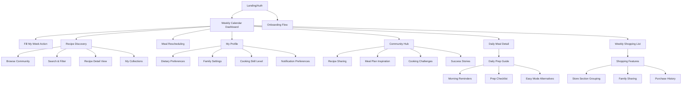
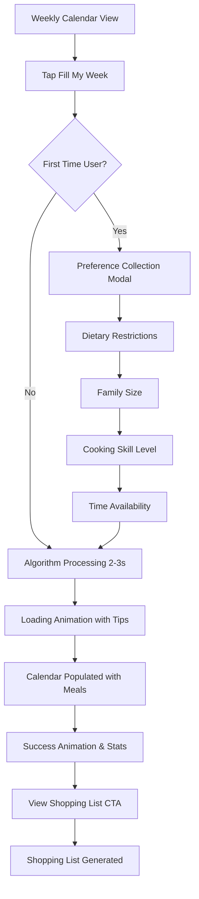
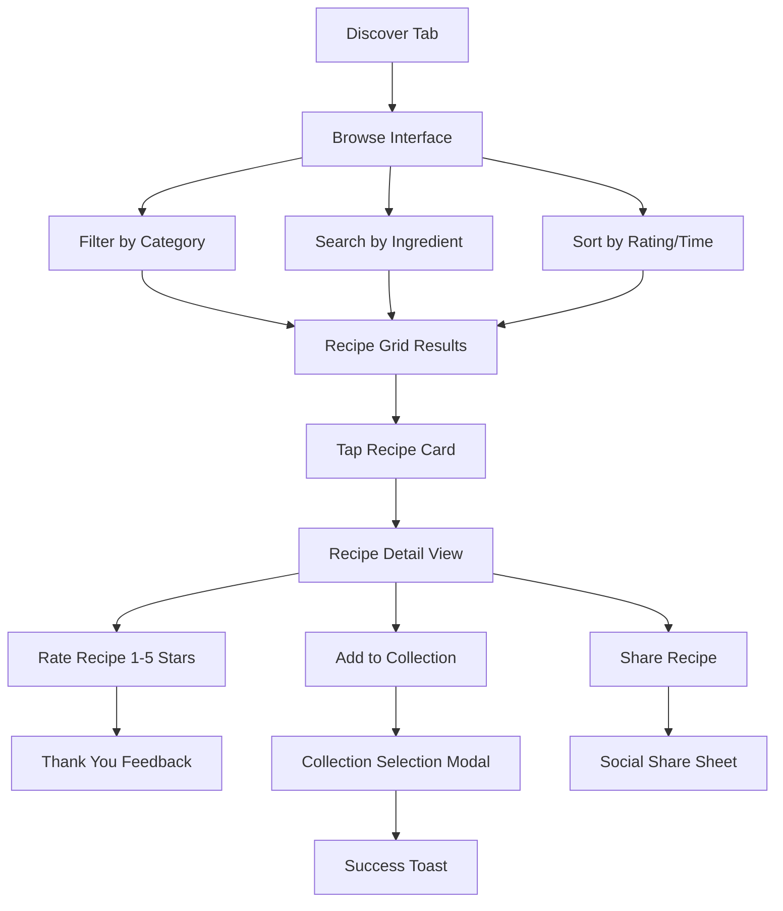

# imkitchen UI/UX Specification

## Introduction

This document defines the user experience goals, information architecture, user flows, and visual design specifications for imkitchen's user interface. It serves as the foundation for visual design and frontend development, ensuring a cohesive and user-centered experience.

### Overall UX Goals & Principles

#### Target User Personas

**Primary Persona: The Overwhelmed Home Cook**
- Demographics: Working parents (28-45), cooking for families of 2-6 people
- Pain Points: Daily decision fatigue, timing complexity preventing recipe exploration, ingredient waste
- Goals: Stress-free meal planning, accessing full recipe collection, family satisfaction with variety
- Kitchen Context: Mobile phone in hand, multitasking environment, varying energy levels throughout week

**Secondary Persona: The Culinary Explorer**
- Demographics: Cooking enthusiasts (25-50), individuals or couples without children
- Pain Points: Recipe discovery limitations, avoiding repetitive cooking, lack of community connection
- Goals: Expanding culinary skills, sharing cooking successes, discovering unique recipes
- Kitchen Context: Tablet/phone for detailed recipes, social sharing focus, quality over convenience

#### Usability Goals

- **Instant Automation:** "Fill My Week" generates complete meal plan in under 3 seconds with visual feedback
- **One-Hand Operation:** All primary actions accessible with thumb navigation on mobile devices (44px+ touch targets)
- **Kitchen Durability:** Interface remains usable with wet hands, varying lighting, cooking distractions
- **Cognitive Load Reduction:** Users make 70% fewer meal-related decisions compared to manual planning
- **Community Engagement:** 40% of users actively rate or share recipes within first 30 days of usage

#### Design Principles

1. **Kitchen-First Design** - Optimize for actual cooking environments with large touch targets, high contrast, and distraction-resistant layouts
2. **Intelligent Automation** - Hide algorithmic complexity behind simple actions while showing clear progress and outcomes
3. **Visual Clarity** - Use color coding, meaningful icons, and strategic whitespace to reduce cognitive load during meal planning
4. **Progressive Enhancement** - Core meal planning works offline; enhanced features (community, sync) require connectivity
5. **Delightful Efficiency** - Celebrate cooking successes and completed meal plans while eliminating planning friction

### Change Log

| Date | Version | Description | Author |
|------|---------|-------------|--------|
| 2025-09-24 | 1.0 | Initial UI/UX specification based on PRD | UX Expert Sally |

## Information Architecture (IA)

### Site Map / Screen Inventory

### Navigation Structure

**Primary Navigation:** Bottom tab bar (mobile) with 4 core sections:
- Home (Weekly Calendar) - primary dashboard
- Discover (Recipe browsing and community)  
- Lists (Shopping lists and meal prep)
- Profile (Settings and preferences)

**Secondary Navigation:** Context-aware action buttons and swipe gestures:
- Calendar: Swipe between weeks, tap dates for daily view
- Recipe Detail: Save to collections, rate, share actions
- Shopping: Check off items, share list, add custom items

**Breadcrumb Strategy:** Minimal breadcrumbs due to mobile-first design; rely on clear screen titles, back buttons, and contextual navigation cues

## User Flows

### Weekly Meal Planning Flow

**User Goal:** Generate a complete weekly meal plan without manual recipe selection

**Entry Points:** 
- Weekly Calendar dashboard "Fill My Week" button
- Empty calendar state with prominent call-to-action
- Onboarding completion pathway

**Success Criteria:** 
- 7 days populated with breakfast/lunch/dinner
- No duplicate recipes (until collection exhausted)  
- Color-coded prep complexity indicators visible
- Shopping list automatically generated and accessible

#### Flow Diagram

#### Edge Cases & Error Handling:
- Insufficient recipes in collections → suggest community recipe discovery
- Algorithm timeout (>5 seconds) → offer simplified weekly template
- All dietary restrictions → graceful degradation with substitution suggestions
- Network failure → offline mode with cached recipes, sync when available

**Notes:** Algorithm must balance variety, complexity distribution, and prep timing. Weekend meals can be more complex. Success feedback shows stats (variety improvement, time saved).

### Recipe Discovery & Rating Flow

**User Goal:** Find new recipes from community and build personal collection

**Entry Points:**
- Discover tab in primary navigation
- Empty meal slot "Browse recipes" action
- Community recommendations in weekly planning

**Success Criteria:**
- Recipe collection expanded with rated items
- Community ratings contributed for recipe quality
- Personal collections organized by user preferences

#### Flow Diagram

#### Edge Cases & Error Handling:
- No search results → suggest related recipes or community-suggested alternatives
- Rating submission failure → queue for offline submission, retry automatically
- Full collections → suggest creating new collection or removing old recipes
- Inappropriate content → report mechanism with community moderation

**Notes:** Discovery emphasizes visual recipe cards with ratings, prep time, and difficulty. Personal collections sync across devices. Community ratings build recipe quality intelligence.

## Wireframes & Mockups

### Design Files
**Primary Design Files:** Figma workspace to be created - [imkitchen Design System](https://figma.com/imkitchen-design-system)

### Key Screen Layouts

#### Weekly Calendar Dashboard
**Purpose:** Primary interface for viewing and managing weekly meal plans with quick access to all core features

**Key Elements:**
- Week navigation with swipe gestures (current week highlighted)
- 7-day calendar grid with 3 meal slots per day (breakfast/lunch/dinner)  
- Color-coded meal complexity indicators (green=easy, yellow=medium, red=complex)
- Prominent "Fill My Week" floating action button
- Quick access to shopping list with badge showing item count
- Prep reminder notifications integrated into daily slots

**Interaction Notes:** Drag-and-drop meal rescheduling between days, tap meals for detail view, swipe weeks horizontally, pull-to-refresh for sync

**Design File Reference:** [Weekly Dashboard - Frame 1.1](https://figma.com/weekly-dashboard)

#### Recipe Discovery Interface  
**Purpose:** Community recipe browsing with filtering, search, and personal collection management

**Key Elements:**
- Search bar with autocomplete and voice input
- Filter chips for dietary restrictions, prep time, difficulty
- Recipe card grid with large images, ratings, prep time
- Collection management shortcuts  
- Trending and recommended recipe sections
- Social proof indicators (community ratings, recent activity)

**Interaction Notes:** Infinite scroll loading, heart icon for favorites, swipe recipe cards for quick actions

**Design File Reference:** [Recipe Discovery - Frame 2.1](https://figma.com/recipe-discovery)

#### Shopping List View
**Purpose:** Organized ingredient management with family sharing and store section grouping

**Key Elements:**
- Store section headers (Produce, Dairy, Meat, Pantry)
- Checkable ingredient items with quantities  
- Family sharing status indicators
- Add custom item quick action
- Export options (email, text, apps)
- Purchase history and price estimates

**Interaction Notes:** Swipe to check off items, tap sections to collapse/expand, shake phone to add custom item

**Design File Reference:** [Shopping List - Frame 3.1](https://figma.com/shopping-list)

## Component Library / Design System

### Design System Approach
**Design System Approach:** Custom component library built on atomic design principles, optimized for mobile-first PWA with kitchen environment considerations

### Core Components

#### Meal Card Component
**Purpose:** Display meal information in calendar and list contexts with clear visual hierarchy

**Variants:** 
- Calendar slot (compact)
- Detail view (expanded) 
- Shopping list meal reference (minimal)

**States:** 
- Default, Selected, Completed, Needs Prep, Easy Mode Alternative

**Usage Guidelines:** Always include prep time indicator, use consistent color coding for complexity, ensure 44px minimum touch target

#### Recipe Rating Component  
**Purpose:** Capture and display community recipe ratings with 5-star system

**Variants:**
- Input mode (interactive stars)
- Display mode (readonly with aggregate)
- Compact mode (small rating badge)

**States:**
- Not rated, User rated, Average rating, Loading submission

**Usage Guidelines:** Prominent placement on recipe cards, immediate visual feedback on rating submission

#### Action Button Component
**Purpose:** Primary call-to-action buttons for key user flows

**Variants:**
- Primary (Fill My Week, Generate List)
- Secondary (Save Recipe, Share)  
- Floating Action Button (context-aware)

**States:**
- Default, Loading, Success, Disabled

**Usage Guidelines:** Maximum one primary action per screen, loading states with progress indication

## Branding & Style Guide

### Visual Identity
**Brand Guidelines:** [imkitchen Brand Guidelines](https://imkitchen-brand-guide.com) - warm, approachable, kitchen-focused visual identity

### Color Palette

| Color Type | Hex Code | Usage |
|------------|----------|--------|
| Primary | #2D5A27 | Main actions, navigation highlights, "Fill My Week" button |
| Secondary | #8FBC8F | Secondary actions, success states, completed meals |
| Accent | #FF6B47 | Urgent notifications, prep reminders, error states |
| Success | #4CAF50 | Positive feedback, confirmations, completed tasks |
| Warning | #FF9800 | Cautions, important notices, prep timing alerts |
| Error | #F44336 | Errors, destructive actions, failed operations |
| Neutral | #F5F5F5, #9E9E9E, #424242 | Text, borders, backgrounds, disabled states |

### Typography

#### Font Families
- **Primary:** Inter (system font fallback: -apple-system, BlinkMacSystemFont)
- **Secondary:** Inter (consistent for simplicity)
- **Monospace:** SF Mono (system fallback: 'Monaco', 'Consolas')

#### Type Scale

| Element | Size | Weight | Line Height |
|---------|------|---------|-------------|
| H1 | 2.5rem | 700 | 1.2 |
| H2 | 2rem | 600 | 1.3 |  
| H3 | 1.5rem | 600 | 1.4 |
| Body | 1rem | 400 | 1.6 |
| Small | 0.875rem | 400 | 1.4 |

### Iconography
**Icon Library:** Lucide Icons with custom kitchen-themed additions for meal types, prep indicators, and cooking actions

**Usage Guidelines:** 24px standard size, consistent stroke width (2px), meaningful labels for accessibility

### Spacing & Layout
**Grid System:** 8px base unit system with 16px, 24px, 32px, 48px increments for consistent spacing

**Spacing Scale:** Mobile-optimized with generous touch targets, adequate whitespace for kitchen environment readability

## Accessibility Requirements

### Compliance Target
**Standard:** WCAG 2.1 AA compliance with enhanced considerations for kitchen environment usage

### Key Requirements

**Visual:**
- Color contrast ratios: 4.5:1 for normal text, 3:1 for large text (18pt+)
- Focus indicators: 3px high-contrast outline with rounded corners  
- Text sizing: Minimum 16px body text, scalable up to 200% without horizontal scroll

**Interaction:**
- Keyboard navigation: Full functionality via tab/enter/arrow keys
- Screen reader support: Semantic HTML, ARIA labels, live regions for dynamic content
- Touch targets: Minimum 44x44px with adequate spacing (8px minimum between targets)

**Content:**
- Alternative text: Descriptive text for recipe images, prep icons, rating displays
- Heading structure: Logical H1-H6 hierarchy for navigation and content organization
- Form labels: Clear, descriptive labels associated with all form controls

### Testing Strategy
Automated testing with axe-core, manual keyboard navigation testing, screen reader verification with VoiceOver/NVDA, color contrast validation, and user testing with accessibility needs

## Responsiveness Strategy

### Breakpoints

| Breakpoint | Min Width | Max Width | Target Devices |
|------------|-----------|-----------|----------------|
| Mobile | 320px | 767px | Phones, small tablets in portrait |
| Tablet | 768px | 1023px | iPads, Android tablets, small laptops |
| Desktop | 1024px | 1439px | Laptops, desktop monitors |
| Wide | 1440px | - | Large desktop monitors, ultra-wide displays |

### Adaptation Patterns

**Layout Changes:** Single column on mobile, progressive multi-column on larger screens. Calendar remains week-view on all sizes with adaptive spacing.

**Navigation Changes:** Bottom tabs on mobile, side navigation on desktop. Recipe discovery switches from grid to enhanced grid with larger previews.

**Content Priority:** Mobile shows essential meal information, desktop reveals additional metadata (nutrition, cook notes, community stats).

**Interaction Changes:** Touch-optimized on mobile (swipe, drag), mouse/keyboard enhanced on desktop (hover states, keyboard shortcuts, right-click menus).

## Animation & Micro-interactions

### Motion Principles
Subtle, purposeful motion that provides feedback without distraction. Kitchen-appropriate timing (not too fast for multitasking context). Respect user preferences for reduced motion.

### Key Animations

- **Fill My Week Loading:** Pulsing meal slots fill progressively with gentle bounce (Duration: 2-3s, Easing: ease-out)
- **Recipe Card Interactions:** Scale on tap (1.05x), heart animation on favorite (Duration: 300ms, Easing: cubic-bezier)
- **Shopping List Check-off:** Strikethrough animation with subtle fade (Duration: 200ms, Easing: ease-in)
- **Meal Plan Success:** Celebration animation with confetti and stats reveal (Duration: 1.5s, Easing: bounce)
- **Prep Reminder Notifications:** Gentle slide-in from top with cooking-related icons (Duration: 400ms, Easing: ease-out)

## Performance Considerations

### Performance Goals
- **Page Load:** <3 seconds on mobile 3G connections
- **Interaction Response:** <100ms for touch feedback, <300ms for data operations
- **Animation FPS:** 60fps for all transitions and micro-interactions

### Design Strategies
Progressive image loading for recipe photos, skeleton screens during data loading, critical CSS inlined, lazy loading for community content below fold, efficient icon sprite usage, minimal JavaScript for core functionality (leverage server-side rendering)

## Next Steps

### Immediate Actions
1. Create detailed Figma designs for core screens (Weekly Calendar, Recipe Discovery, Shopping List)
2. Develop interactive prototype for "Fill My Week" flow user testing
3. Establish design token system for consistent implementation
4. Create accessibility testing checklist specific to kitchen environment usage
5. Design and test notification patterns for prep reminders
6. Plan user testing sessions with target personas for flow validation

### Design Handoff Checklist
- [x] All user flows documented
- [x] Component inventory complete  
- [x] Accessibility requirements defined
- [x] Responsive strategy clear
- [x] Brand guidelines incorporated
- [x] Performance goals established

## Checklist Results

UI/UX specification complete and ready for technical architecture phase. All critical user journeys mapped, component library defined, and accessibility requirements established for WCAG AA compliance with kitchen-environment enhancements.