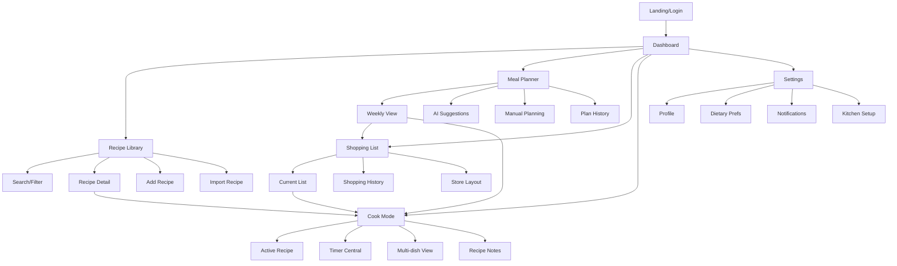
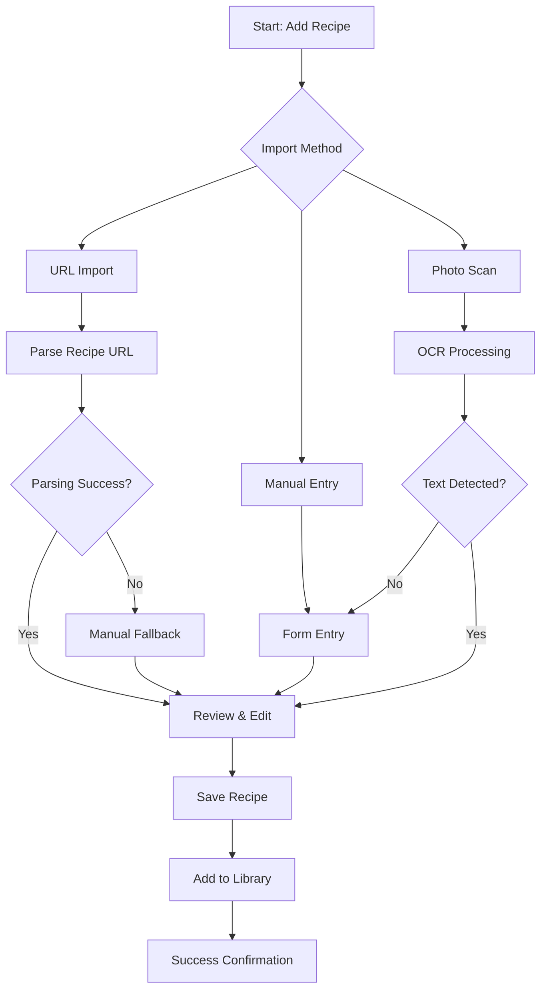
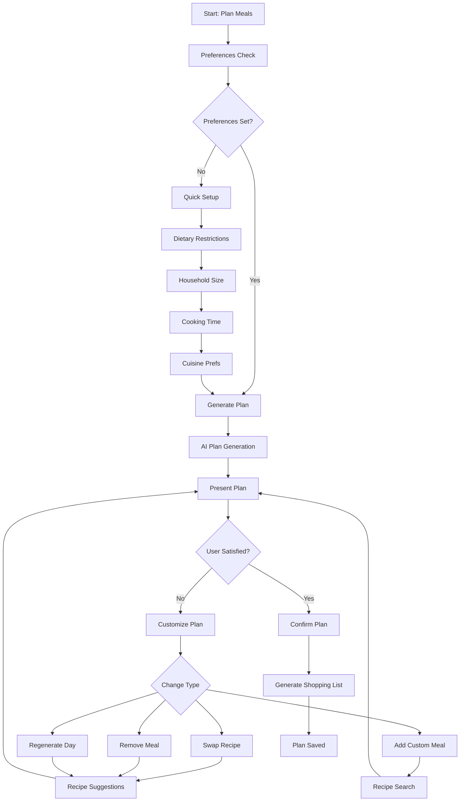
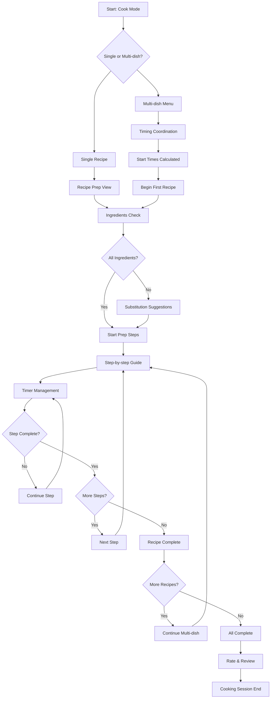

# ImKitchen UI/UX Specification

## Introduction

This document defines the user experience goals, information architecture, user flows, and visual design specifications for ImKitchen's user interface. It serves as the foundation for visual design and frontend development, ensuring a cohesive and user-centered experience.

ImKitchen is an AI-powered cooking companion that addresses the execution gap in home cooking by providing timing intelligence and seamless workflow from meal planning through cooking execution. The interface must prioritize ease of use during active cooking scenarios where users may have dirty hands, be multitasking, or have limited visual attention.

### Change Log

| Date | Version | Description | Author |
|------|---------|-------------|---------|
| 2025-09-13 | 1.0 | Initial UI/UX specification creation | Sally (UX Expert) |

## Overall UX Goals & Principles

### Target User Personas

**Primary: Busy Professional Households**
Working professionals and families (ages 28-45) with household income $50K+ who cook 3-5 times per week but struggle with consistency. They use meal kits occasionally but find them expensive, rely on phone photos for grocery lists, and experience cooking stress during weekday meal prep. They need time-efficient meal planning that adapts to work schedules, reliable timing guidance, and shopping optimization to reduce store trips.

**Secondary: Cooking Enthusiasts**  
Home cooks who enjoy cooking as a hobby but want better organization. They collect recipes from multiple sources, experiment with new cuisines, share cooking experiences with others, and struggle with scaling and meal planning for entertaining. They need advanced recipe organization, community features, support for complex meal timing, and integration with specialized dietary approaches.

### Usability Goals

- **Cooking Context Optimization:** Interface remains usable with wet/dirty hands, poor lighting, and divided attention
- **Rapid Task Completion:** Core tasks (finding recipes, starting timers, checking shopping lists) completable in <30 seconds
- **Timing Accuracy:** Users can successfully coordinate multiple dishes with <10 minute variance from predicted timing
- **Cognitive Load Reduction:** Meal planning time reduced from 45 minutes to <10 minutes per week
- **Accessibility in Kitchen:** All critical functions accessible via large touch targets, voice commands, and screen readers
- **Error Recovery:** Clear recovery paths when timing goes wrong or ingredients are missing

### Design Principles

1. **Kitchen-First Design** - Every interaction designed for real cooking environments with potential distractions and physical limitations
2. **Progressive Disclosure** - Start simple, reveal complexity only when needed, never overwhelm during active cooking
3. **Timing is Everything** - Time-sensitive information gets highest visual priority and clearest communication
4. **Graceful Degradation** - Core functionality works offline and with limited device capabilities
5. **Immediate Feedback** - Every action provides instant, clear response especially for timing-critical operations

## Information Architecture (IA)

### Site Map / Screen Inventory

### Navigation Structure

**Primary Navigation:** Bottom tab bar (mobile) / Left sidebar (desktop) with 5 core sections:
- Dashboard (home icon) - Central hub and today's focus
- Recipes (book icon) - Library and recipe management
- Planning (calendar icon) - Meal planning and scheduling
- Shopping (cart icon) - Shopping lists and grocery management  
- Cook (chef hat icon) - Active cooking mode and timers

**Secondary Navigation:** Context-aware top navigation and floating action buttons based on current task phase

**Breadcrumb Strategy:** Minimal breadcrumbs only in Cook Mode to show recipe → step progression; elsewhere rely on clear back/close actions

## User Flows

### Recipe Import & Management Flow

**User Goal:** Add new recipes to personal collection from various sources

**Entry Points:** Recipe Library "Add Recipe" button, URL sharing into app, dashboard quick actions

**Success Criteria:** Recipe successfully parsed, stored, and available in searchable library

#### Flow Diagram

#### Edge Cases & Error Handling:
- URL parsing failures trigger manual entry mode with pre-filled detected text
- Duplicate recipe detection offers merge/replace options
- Network failures during import save partial data locally for retry
- Image upload failures provide camera retry and skip options

**Notes:** Import flow emphasizes quick success with graceful fallback options for parsing failures

### Meal Planning Flow

**User Goal:** Generate and customize weekly meal plan based on preferences and constraints

**Entry Points:** Dashboard meal planning widget, dedicated Planning tab, empty meal plan state

**Success Criteria:** Complete weekly meal plan with balanced nutrition, optimized ingredients, and timing feasibility

#### Flow Diagram

#### Edge Cases & Error Handling:
- No suitable recipes found for constraints offers relaxed criteria options
- Conflicting dietary preferences show trade-off explanations
- Plan generation failures provide manual planning tools
- Ingredient conflicts in customization trigger optimization suggestions

**Notes:** Flow balances AI automation with user control, always allowing manual override

### Cook Mode Flow

**User Goal:** Execute recipe(s) successfully with timing coordination and step-by-step guidance

**Entry Points:** Recipe detail "Start Cooking", meal plan "Cook Now", dashboard active cooking widget

**Success Criteria:** All dishes completed within timing targets with successful coordination

#### Flow Diagram

#### Edge Cases & Error Handling:
- Timer failures provide manual time tracking and notifications
- Recipe modifications during cooking recalculate all dependent timings
- Emergency pause stops all timers and provides restart options
- Missing ingredients mid-cooking offer substitution or adaptation guidance

**Notes:** Cook Mode prioritizes clear progression and timing accuracy above all other features

## Wireframes & Mockups

**Primary Design Files:** Figma workspace - [TBD: Link to be added when design files created]

### Key Screen Layouts

#### Dashboard (Mobile)

**Purpose:** Central hub showing today's meal plan, active timers, and quick actions

**Key Elements:**
- Today's meal cards with prep time and difficulty indicators
- Active cooking status with timer countdown
- Quick actions: Add Recipe, Start Planning, View Shopping List
- Weather-based cooking suggestions
- Upcoming meal notifications

**Interaction Notes:** Large touch targets for primary actions, swipe gestures for meal browsing, pull-to-refresh for plan updates

**Design File Reference:** [TBD: Figma frame link]

#### Cook Mode (Mobile)

**Purpose:** Step-by-step cooking guidance with timing coordination and distraction-free interface

**Key Elements:**
- Current step with large, readable text and imagery
- Progress indicator showing step position
- Active timers with prominent countdown displays  
- Emergency pause/help floating action button
- Next/previous step navigation with swipe support

**Interaction Notes:** Voice command integration, minimal cognitive load, one-handed operation support, spill-resistant design considerations

**Design File Reference:** [TBD: Figma frame link]

#### Recipe Library (Desktop)

**Purpose:** Browse, search, and manage personal recipe collection with advanced filtering

**Key Elements:**
- Search bar with intelligent filters (dietary, time, difficulty)
- Recipe grid with hover previews and quick actions
- Sidebar filters for cuisine, ingredients, tags
- Bulk selection tools for meal planning
- Import recipe floating action button

**Interaction Notes:** Keyboard shortcuts for power users, drag-and-drop for meal planning, responsive grid layout

**Design File Reference:** [TBD: Figma frame link]

#### Meal Planner (Tablet)

**Purpose:** Weekly meal planning interface with drag-and-drop customization and AI suggestions

**Key Elements:**
- 7-day calendar grid with meal slots
- AI suggestions panel with rationale explanations
- Recipe recommendation carousel
- Nutritional balance indicators
- Shopping list preview and generation

**Interaction Notes:** Touch-friendly drag-and-drop, multi-select capabilities, quick swap gestures

**Design File Reference:** [TBD: Figma frame link]

## Component Library / Design System

**Design System Approach:** Custom design system optimized for kitchen environments and cooking workflows, built on accessibility-first principles with large touch targets and high contrast ratios

### Core Components

#### Cooking Timer Component

**Purpose:** Display countdown timers with clear visual hierarchy and multiple simultaneous timer support

**Variants:** 
- Compact (dashboard widget)
- Prominent (cook mode primary)  
- Multi-timer (coordination view)

**States:** Active, Paused, Complete, Warning (<2 min remaining), Critical (<30 sec)

**Usage Guidelines:** Always use high contrast colors, provide both visual and audio alerts, support custom labels

#### Recipe Card Component  

**Purpose:** Display recipe information consistently across library, planning, and search contexts

**Variants:**
- Compact (list view)
- Featured (dashboard highlight)
- Detailed (planning selection)

**States:** Default, Hover/Focus, Selected, Cooking, Favorited, Offline Available

**Usage Guidelines:** Include difficulty, time, and dietary indicators, support offline imagery caching

#### Step Indicator Component

**Purpose:** Show cooking progress through recipe steps with clear current position

**Variants:**
- Linear (mobile)
- Circular (tablet/desktop)
- Minimal (overlay)

**States:** Completed, Current, Upcoming, Skipped, In Progress

**Usage Guidelines:** Large touch targets for navigation, clear visual hierarchy, works in poor lighting

#### Notification Banner Component

**Purpose:** Communicate timing alerts, system status, and critical cooking updates

**Variants:**
- Timing Alert (high priority)
- System Status (medium priority)  
- Tips & Suggestions (low priority)

**States:** Active, Dismissible, Persistent, Action Required

**Usage Guidelines:** Never obscure critical cooking information, provide clear dismiss actions, stack appropriately

## Branding & Style Guide

### Visual Identity

**Brand Guidelines:** Clean, approachable cooking companion aesthetic emphasizing reliability and warmth over flashiness

### Color Palette

| Color Type | Hex Code | Usage |
|------------|----------|-------|
| Primary | #FF6B35 | Main brand color, primary CTAs, active timers |
| Secondary | #2E8B57 | Success states, completed tasks, positive feedback |  
| Accent | #FFD23F | Warning states, attention-needed items, highlights |
| Success | #28A745 | Confirmations, completed recipes, achievements |
| Warning | #FFC107 | Timer warnings, ingredient substitutions, cautions |
| Error | #DC3545 | Critical alerts, failed operations, urgent attention |
| Neutral | #343A40, #6C757D, #ADB5BD, #F8F9FA | Text, borders, backgrounds, secondary information |

### Typography

#### Font Families
- **Primary:** Inter (highly legible, modern sans-serif optimized for screens)
- **Secondary:** Playfair Display (elegant serif for branding and headings)  
- **Monospace:** JetBrains Mono (timer displays and precise measurements)

#### Type Scale

| Element | Size | Weight | Line Height |
|---------|------|---------|-------------|
| H1 | 2rem (32px) | 700 | 1.2 |
| H2 | 1.5rem (24px) | 600 | 1.3 |
| H3 | 1.25rem (20px) | 600 | 1.4 |
| Body | 1rem (16px) | 400 | 1.5 |
| Small | 0.875rem (14px) | 400 | 1.4 |

### Iconography

**Icon Library:** Heroicons v2 with custom cooking-specific icons for specialized actions

**Usage Guidelines:** Minimum 24px touch targets, consistent stroke width, maintain meaning across cultures

### Spacing & Layout

**Grid System:** 8px base unit with 4px micro-adjustments for fine-tuning

**Spacing Scale:** 4px, 8px, 16px, 24px, 32px, 48px, 64px progression for consistent spatial relationships

## Accessibility Requirements

### Compliance Target

**Standard:** WCAG AA with additional considerations for kitchen environment limitations

### Key Requirements

**Visual:**
- Color contrast ratios: 4.5:1 minimum for normal text, 3:1 for large text and UI elements
- Focus indicators: 2px solid outline with high contrast, visible in all lighting conditions
- Text sizing: Minimum 16px body text, scalable to 200% without horizontal scrolling

**Interaction:**
- Keyboard navigation: Full functionality accessible via keyboard with logical tab order
- Screen reader support: Semantic HTML, descriptive labels, cooking progress announcements
- Touch targets: Minimum 44px for all interactive elements, larger for critical cooking actions

**Content:**
- Alternative text: Descriptive alt text for recipe images and cooking step illustrations
- Heading structure: Logical H1-H6 hierarchy for screen reader navigation
- Form labels: Clear, descriptive labels associated with all form inputs

### Testing Strategy

Automated accessibility testing with axe-core, manual testing with screen readers (NVDA, VoiceOver), usability testing with users with disabilities, high contrast and magnification testing

## Responsiveness Strategy

### Breakpoints

| Breakpoint | Min Width | Max Width | Target Devices |
|------------|-----------|-----------|----------------|
| Mobile | 320px | 767px | Smartphones, kitchen displays |
| Tablet | 768px | 1023px | Tablets, small laptops |
| Desktop | 1024px | 1439px | Laptops, desktop monitors |
| Wide | 1440px | - | Large monitors, kitchen displays |

### Adaptation Patterns

**Layout Changes:** Single column (mobile) → multi-column (tablet) → sidebar navigation (desktop) → dashboard layout (wide)

**Navigation Changes:** Bottom tabs (mobile) → side navigation (tablet+) → persistent sidebar with breadcrumbs (desktop+)

**Content Priority:** Timer/cooking content always prioritized, secondary features collapsed on mobile, progressive enhancement for larger screens

**Interaction Changes:** Touch-first design scales to mouse/keyboard, gestures supplement click interactions, voice integration available across all breakpoints

## Animation & Micro-interactions

### Motion Principles

Cooking-focused motion design emphasizing clarity and timing awareness: subtle transitions that don't distract during active cooking, clear feedback for time-sensitive actions, reduced motion for accessibility, performance-conscious animations that work on older kitchen tablets

### Key Animations

- **Timer Countdown:** Smooth numeric transitions with color changes at critical thresholds (Duration: 1s, Easing: ease-out)
- **Step Progression:** Slide transitions between recipe steps with progress indication (Duration: 300ms, Easing: ease-in-out)  
- **Recipe Card Hover:** Gentle lift and shadow increase for desktop interaction feedback (Duration: 200ms, Easing: ease-out)
- **Notification Entrance:** Slide-in from top with attention-grabbing bounce (Duration: 400ms, Easing: cubic-bezier)
- **Loading States:** Skeleton screens and progress indicators for recipe parsing (Duration: variable, Easing: linear)

## Performance Considerations

### Performance Goals

- **Page Load:** <2 second initial load, <1 second navigation between cached screens
- **Interaction Response:** <100ms for touch feedback, <16ms for timer updates (60fps)
- **Animation FPS:** Consistent 60fps for all animations, 30fps minimum on low-end devices

### Design Strategies

Progressive image loading with recipe photo optimization, efficient timer update patterns using RAF, minimal DOM manipulation during active cooking, aggressive caching of frequently accessed recipes, offline-first design with service worker implementation

## Next Steps

### Immediate Actions

1. Create detailed visual designs in Figma based on this specification
2. Develop interactive prototypes for core user flows (Cook Mode, Meal Planning)
3. Conduct usability testing with target users in kitchen environments
4. Create comprehensive component library with code examples
5. Establish design token system for consistent implementation
6. Plan user testing sessions focusing on timing intelligence and accessibility

### Design Handoff Checklist

- [x] All user flows documented
- [x] Component inventory complete  
- [x] Accessibility requirements defined
- [x] Responsive strategy clear
- [x] Brand guidelines incorporated
- [x] Performance goals established
