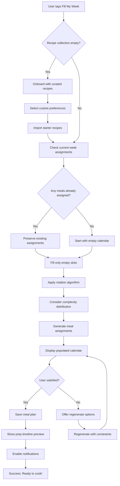
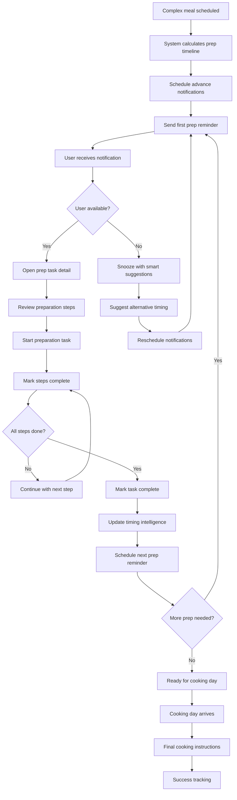
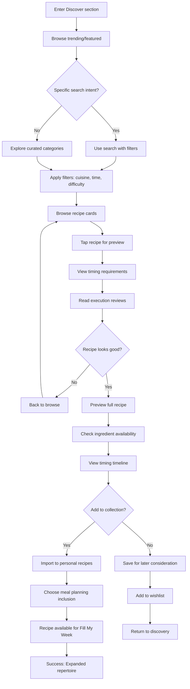

# ImKitchen UI/UX Specification

This document defines the user experience goals, information architecture, user flows, and visual design specifications for ImKitchen's user interface. It serves as the foundation for visual design and frontend development, ensuring a cohesive and user-centered experience.

## Introduction

### Overall UX Goals & Principles

#### Target User Personas

**Primary Persona - Busy Home Cooking Enthusiast:**
- Ages 25-45, professionals and parents with household income $50K-$150K
- Tech-comfortable smartphone users who cook 4-6 meals weekly but feel limited by time constraints
- Want culinary variety without increased mental overhead or planning time
- Experience meal planning stress and struggle with complex recipe timing coordination

**Secondary Persona - Recipe Creator & Cooking Enthusiast:**
- Ages 28-55, includes hobbyists and semi-professional home cooks
- Regularly experiment with recipes and want to share practical cooking knowledge
- Frustrated by platforms that focus on visual presentation over execution guidance
- Seek recognition for practical cooking expertise and community building

#### Usability Goals

- **Instant Value**: Users can generate a weekly meal plan in under 30 seconds with "Fill My Week" automation
- **Kitchen Context**: Interface remains usable during cooking with messy hands, poor lighting, and divided attention
- **Timing Clarity**: Complex recipe preparation sequences are visually clear and actionable
- **Mobile Mastery**: 90% of interactions optimized for one-handed smartphone use
- **Learning Curve**: New users complete first meal plan within 5 minutes of onboarding

#### Design Principles

1. **Automation over Configuration** - Reduce decision fatigue through intelligent defaults while preserving user control
2. **Context-Aware Guidance** - Information appears when and where users need it, especially during cooking
3. **Execution over Aesthetics** - Prioritize practical utility and timing accuracy over visual presentation
4. **Progressive Complexity** - Simple entry points lead to powerful features without overwhelming casual users
5. **Trust through Transparency** - Make timing intelligence algorithms understandable and adjustable

### Change Log

| Date | Version | Description | Author |
|------|---------|-------------|--------|
| 2025-09-10 | v1.0 | Initial UI/UX specification creation | UX Expert |

## Information Architecture (IA)

### Site Map / Screen Inventory

```mermaid
graph TD
    A[Home Dashboard] --> B[Meal Calendar]
    A --> C[Recipe Collection]
    A --> D[Discover Recipes]
    A --> E[Shopping Lists]
    A --> F[Prep Tasks]
    A --> G[Profile & Settings]
    
    B --> B1[Week View]
    B --> B2[Day Detail]
    B --> B3[Fill My Week]
    B --> B4[Meal Rescheduling]
    
    C --> C1[My Recipes]
    C --> C2[Favorited Recipes]
    C --> C3[Recipe Creation]
    C --> C4[Recipe Detail View]
    C --> C5[Recipe Editing]
    
    D --> D1[Browse Community]
    D --> D2[Search & Filter]
    D --> D3[Trending Recipes]
    D --> D4[Recipe Preview]
    D5[Import to Collection]
    
    E --> E1[Current Week List]
    E --> E2[Shopping History]
    E --> E3[Custom Items]
    
    F --> F1[Today's Tasks]
    F --> F2[Upcoming Prep]
    F3[Task History]
    F --> F4[Timing Insights]
    
    G --> G1[Account Settings]
    G --> G2[Notification Preferences]
    G --> G3[Dietary Preferences]
    G --> G4[Collection Management]
    
    C4 --> C4A[Ingredients & Steps]
    C4 --> C4B[Timing Timeline]
    C4 --> C4C[Community Reviews]
    C4 --> C4D[Nutritional Info]
```

### Navigation Structure

**Primary Navigation (Bottom Tab Bar - Mobile):**
- Home Dashboard (central hub with today's meals and tasks)
- Calendar (meal planning and weekly overview)
- Recipes (personal collection and creation)
- Discover (community recipes and trends)
- Profile (settings and preferences)

**Secondary Navigation:**
- Contextual actions within each primary section (search, filter, add, edit)
- Quick access floating action buttons for "Fill My Week" and "Add Recipe"
- Swipe gestures for common actions (mark task complete, reschedule meals)

**Breadcrumb Strategy:**
- Minimal breadcrumbs due to mobile-first design
- Clear "Back" navigation with contextual labels ("Back to Recipe", "Back to Calendar")
- Tab state persistence when navigating deep into sections

## User Flows

### Flow 1: "Fill My Week" Automation

**User Goal:** Generate a complete weekly meal plan in under 30 seconds to eliminate decision fatigue

**Entry Points:** 
- Dashboard "Fill My Week" button
- Empty calendar state prompt
- Weekly planning reminder notification

**Success Criteria:** User has 7 days of meals assigned with visible prep timing indicators

#### Flow Diagram

#### Edge Cases & Error Handling:
- Recipe collection too small (< 7 recipes): Prompt to add more or accept repeats
- All recipes too complex for week: Suggest simpler alternatives or spread complexity
- User dietary restrictions conflict: Filter incompatible recipes automatically
- Technical failure during generation: Graceful degradation with manual assignment option
- Network offline: Use cached recipes and sync when reconnected

### Flow 2: Timing Intelligence Workflow

**User Goal:** Successfully coordinate complex recipe preparation through automated notifications and task management

**Entry Points:**
- Meal calendar showing upcoming complex recipes
- Notification prompt for advance preparation
- Recipe detail view timing timeline

**Success Criteria:** User completes all preparation steps on time and cooks meal successfully

#### Flow Diagram

#### Edge Cases & Error Handling:
- User misses critical prep window: Suggest recipe modifications or substitutions
- Preparation takes longer than estimated: Learn and adjust future timing
- User reports timing inaccuracy: Collect feedback and update algorithm
- Notification delivery failure: Use multiple delivery methods and in-app fallbacks
- Life disrupts schedule: Intelligent rescheduling with minimal user input

### Flow 3: Community Recipe Discovery

**User Goal:** Find new recipes with confidence in execution success based on community feedback

**Entry Points:**
- Discover tab exploration
- Search for specific cuisine or dish
- Trending recipe notifications
- Similar recipe suggestions

**Success Criteria:** User adds new recipe to collection and successfully cooks it

#### Flow Diagram

#### Edge Cases & Error Handling:
- No recipes match search criteria: Suggest broader search or alternative cuisines
- Recipe has poor timing reviews: Display warnings and alternative suggestions
- Ingredient unavailability: Suggest substitutions or seasonal alternatives
- Network issues during import: Queue for later sync with clear status indication
- User reaches collection limits: Prompt for curation or premium upgrade

## Wireframes & Mockups

**Primary Design Files:** Design work will be completed in Figma for collaborative design and developer handoff - [Figma Project Link to be established]

### Key Screen Layouts

#### Home Dashboard

**Purpose:** Central hub providing immediate access to today's cooking tasks, upcoming meals, and quick actions

**Key Elements:**
- Today's meal cards with prep status indicators and timing countdown
- Quick access "Fill My Week" button prominently placed
- Active prep tasks with completion tracking and time-sensitive alerts
- Recent notifications and timing reminders
- Weather-aware suggestions (comfort food on rainy days, lighter meals when hot)
- One-tap access to shopping list and recipe details

**Interaction Notes:** Dashboard uses card-based layout with swipe actions for quick task completion. Cards dynamically resize based on urgency and user context. Pull-to-refresh updates meal status and prep timing.

**Design File Reference:** [Dashboard_Mobile_v1.fig]

#### Meal Calendar View

**Purpose:** Visual weekly meal planning interface with drag-and-drop rescheduling and timing intelligence display

**Key Elements:**
- 7-day grid with breakfast/lunch/dinner slots clearly defined
- Color-coded prep indicators (green=ready, yellow=prep needed, red=overdue)
- Meal complexity visual indicators (simple, moderate, complex prep requirements)
- Drag handles for easy meal rescheduling on touch devices
- Empty slot prompts with "Add Meal" and "Fill My Week" options
- Week navigation with swipe gestures and clear date indicators
- Compact daily view mode for smaller screens

**Interaction Notes:** Calendar supports both drag-and-drop and tap-to-assign workflows. Visual feedback shows valid drop zones and timing conflicts. Long-press reveals quick actions menu for each meal slot.

**Design File Reference:** [Calendar_Mobile_v1.fig]

#### Recipe Detail with Timing Timeline

**Purpose:** Comprehensive recipe view emphasizing execution guidance and timing coordination over visual presentation

**Key Elements:**
- Recipe hero image with cooking time and difficulty indicators
- Interactive timing timeline showing prep phases and dependencies
- Ingredient list with quantity scaling and shopping list integration
- Step-by-step instructions optimized for kitchen reading (large text, high contrast)
- Community execution ratings and timing accuracy feedback
- "Add to Calendar" quick action with smart scheduling suggestions
- Timing customization based on user's historical cooking patterns

**Interaction Notes:** Timeline is interactive - users can tap phases for detailed breakdowns. Recipe scales with family size settings. Hands-free voice navigation for cooking mode.

**Design File Reference:** [Recipe_Detail_Mobile_v1.fig]

#### "Fill My Week" Automation Interface

**Purpose:** Guided automation experience that feels magical while providing user control over meal selection

**Key Elements:**
- Large, inviting "Fill My Week" button with subtle animation
- Week preview showing current assignments and empty slots
- Constraint controls (avoid repeats, balance complexity, dietary preferences)
- Real-time generation progress with engaging micro-animations
- Generated plan preview with easy swap/regenerate options
- Confidence indicators showing recipe success rates and timing reliability
- One-tap confirmation to apply the complete meal plan

**Interaction Notes:** Process feels instant for small collections, shows progress for larger ones. Users can interrupt generation to adjust constraints. Preview allows individual meal swapping before committing.

**Design File Reference:** [Fill_Week_Mobile_v1.fig]

#### Prep Tasks Dashboard

**Purpose:** Task management interface optimized for kitchen use with timing-critical information prominently displayed

**Key Elements:**
- Today's tasks with countdown timers and priority indicators
- Tomorrow's prep preview to help with planning
- Task completion checkboxes with satisfying completion animations
- Snooze options with intelligent time suggestions
- Recipe context links for quick reference during prep
- Historical timing data showing personal patterns and improvements
- Emergency rescheduling for when life disrupts plans

**Interaction Notes:** Large touch targets for kitchen use. Voice commands for hands-free task completion. Smart snoozing preserves recipe timing integrity.

**Design File Reference:** [Prep_Tasks_Mobile_v1.fig]

## Component Library / Design System

**Design System Approach:** Create a custom design system optimized for cooking contexts, building on Tailwind CSS utilities with custom components for timing intelligence and meal planning. Focus on kitchen-friendly interactions (large touch targets, high contrast, readable in various lighting) while maintaining modern, trustworthy aesthetics.

### Core Components

#### Meal Card

**Purpose:** Displays meal information across calendar, dashboard, and list views with consistent timing intelligence integration

**Variants:** 
- Calendar slot (compact with timing indicators)
- Dashboard card (expanded with prep status)
- List item (medium with quick actions)
- Preview card (detailed with ratings)

**States:** 
- Empty/placeholder, assigned, prep needed, prep overdue, ready to cook, completed
- Selected/unselected, dragging, error state

**Usage Guidelines:** Always include timing information when available. Use color coding consistently for prep status. Ensure touch targets meet minimum 44px requirement for kitchen use.

#### Timing Timeline

**Purpose:** Visual representation of recipe preparation phases and dependencies, core to ImKitchen's value proposition

**Variants:**
- Compact horizontal (recipe cards and calendar)
- Expanded vertical (recipe detail view)
- Interactive (with phase selection and customization)
- Progress view (showing completion during cooking)

**States:**
- Planning (shows estimated timing)
- Active (shows progress and remaining time)
- Completed (shows actual vs. estimated timing)
- Modified (user has adjusted default timing)

**Usage Guidelines:** Always show relative timing (2 hours before, 1 day ahead) rather than absolute times when possible. Use visual hierarchy to emphasize critical timing points.

#### Recipe Difficulty Indicator

**Purpose:** Communicate recipe complexity focusing on timing coordination rather than cooking skill

**Variants:**
- Icon only (for compact spaces)
- Icon with label (standard usage)
- Detailed breakdown (prep time, active time, complexity factors)

**States:**
- Simple (minimal prep, straightforward timing)
- Moderate (some advance prep or timing coordination)
- Complex (multiple timing dependencies, extensive prep)

**Usage Guidelines:** Base complexity on timing coordination requirements, not cooking techniques. Include prep time estimates prominently.

#### Action Button

**Purpose:** Primary and secondary actions optimized for mobile cooking contexts

**Variants:**
- Primary (Fill My Week, Add Recipe, Start Cooking)
- Secondary (Edit, Share, Favorite)
- Floating Action Button (quick access to core actions)
- Icon button (compact actions in lists and cards)

**States:**
- Default, hover, active, disabled, loading
- Success (with confirmation animation)
- Error (with clear recovery options)

**Usage Guidelines:** Minimum 44px touch targets. Use loading states for any action taking >1 second. Provide clear visual feedback for state changes.

#### Navigation Tab Bar

**Purpose:** Bottom navigation optimized for one-handed mobile use with cooking-specific considerations

**Variants:**
- Standard 5-tab layout
- Adaptive layout (hide less critical tabs on smaller screens)
- Badge indicators (for notifications and pending tasks)

**States:**
- Active/inactive tabs with clear visual distinction
- Notification badges with counts
- Contextual states (prep tasks urgent indicator)

**Usage Guidelines:** Keep tab labels short and universally understood. Use icons that test well with users. Ensure navigation works with kitchen gloves.

#### Calendar Grid

**Purpose:** Weekly meal planning interface with drag-and-drop capabilities and timing visualization

**Variants:**
- Week view (7 days visible)
- Day view (single day expanded)
- Compact view (for smaller screens)

**States:**
- Empty slots with clear add prompts
- Filled slots with meal and timing information
- Drag states (source, target, invalid drop zones)
- Conflict indicators (timing or dietary issues)

**Usage Guidelines:** Clearly indicate drop zones during drag operations. Use consistent color coding for timing status across all calendar components.

#### Prep Task Item

**Purpose:** Individual preparation task display optimized for kitchen workflow management

**Variants:**
- Compact list item (task lists)
- Expanded card (task detail)
- Notification format (push and in-app notifications)

**States:**
- Pending (not yet time to start)
- Ready (time to begin prep)
- In progress (user has started)
- Completed (task finished)
- Overdue (missed optimal timing)

**Usage Guidelines:** Always include estimated duration and deadline information. Use progressive disclosure for task details. Enable quick completion gestures.

## Branding & Style Guide

### Visual Identity

**Brand Guidelines:** Custom brand identity emphasizing reliability, warmth, and practical expertise in cooking. Visual design should feel like a knowledgeable friend rather than a flashy tech product.

### Color Palette

| Color Type | Hex Code | Usage |
|------------|----------|--------|
| Primary | #2D5E3D | Primary actions, timing indicators, brand elements |
| Secondary | #8B4513 | Secondary actions, warm accents, recipe categories |
| Accent | #FF7F50 | Highlighting urgent timing, call-to-action elements |
| Success | #4CAF50 | Completed tasks, successful recipe execution |
| Warning | #FF9800 | Timing alerts, preparation reminders |
| Error | #F44336 | Overdue tasks, timing conflicts, system errors |
| Neutral | #F5F5F5, #E0E0E0, #757575, #212121 | Text hierarchy, borders, backgrounds, disabled states |

### Typography

#### Font Families
- **Primary:** Inter (clear, readable sans-serif optimized for screens and various lighting conditions)
- **Secondary:** Merriweather (warm serif for recipe titles and featured content)
- **Monospace:** JetBrains Mono (timing displays, measurements, technical information)

#### Type Scale

| Element | Size | Weight | Line Height |
|---------|------|--------|-------------|
| H1 | 2.5rem (40px) | 700 Bold | 1.2 |
| H2 | 2rem (32px) | 600 SemiBold | 1.3 |
| H3 | 1.5rem (24px) | 600 SemiBold | 1.4 |
| Body | 1rem (16px) | 400 Regular | 1.6 |
| Small | 0.875rem (14px) | 400 Regular | 1.5 |

### Iconography

**Icon Library:** Lucide Icons for their clean, consistent style and excellent kitchen/cooking icon coverage

**Usage Guidelines:** 
- 24px minimum size for interactive icons (kitchen glove compatibility)
- 16px for inline text icons and compact displays
- Consistent stroke width (2px) across all icons
- Use filled versions for active states, outlined for inactive
- Custom cooking-specific icons for timing phases and recipe complexity

### Spacing & Layout

**Grid System:** 8px base unit grid system ensuring consistent spacing and alignment across all components

**Spacing Scale:** 
- xs: 4px (tight spacing within components)
- sm: 8px (standard component internal spacing)
- md: 16px (component margins, card padding)
- lg: 24px (section spacing, major layout gaps)
- xl: 32px (page margins, major content separation)
- 2xl: 48px (hero sections, primary content blocks)

## Accessibility Requirements

### Compliance Target

**Standard:** WCAG 2.1 AA compliance with selected AAA enhancements for critical cooking workflows

### Key Requirements

**Visual:**
- Color contrast ratios: Minimum 4.5:1 for normal text, 3:1 for large text, 7:1 for timing-critical information
- Focus indicators: 2px solid outline with high contrast color, visible on all interactive elements
- Text sizing: Minimum 16px base font size, scalable up to 200% without horizontal scrolling

**Interaction:**
- Keyboard navigation: Full functionality accessible via keyboard with logical tab order and visible focus
- Screen reader support: Semantic HTML, ARIA labels for complex interactions, live regions for timing updates
- Touch targets: Minimum 44px tap targets with 8px spacing, essential for kitchen glove compatibility

**Content:**
- Alternative text: Descriptive alt text for recipe images focusing on cooking techniques and visual cues
- Heading structure: Logical H1-H6 hierarchy for screen reader navigation and content understanding
- Form labels: Clear, descriptive labels for all form inputs with error messaging linked to fields

### Testing Strategy

**Automated Testing:**
- axe-core integration in development workflow
- Lighthouse accessibility audits in CI/CD pipeline
- Color contrast validation with Stark or similar tools

**Manual Testing:**
- Keyboard-only navigation testing for all user flows
- Screen reader testing with NVDA, JAWS, and VoiceOver
- Voice control testing (Dragon, Voice Control) for hands-free cooking scenarios

**User Testing:**
- Testing with users who have visual, motor, or cognitive disabilities
- Kitchen context testing with simulated impairments (oven mitts, bright lighting, steam)
- Elderly user testing for age-related accessibility needs

## Responsiveness Strategy

### Breakpoints

| Breakpoint | Min Width | Max Width | Target Devices |
|------------|-----------|-----------|----------------|
| Mobile | 320px | 767px | Smartphones, primary cooking interface |
| Tablet | 768px | 1023px | iPads, kitchen tablets, recipe stands |
| Desktop | 1024px | 1439px | Laptops, desktop computers, meal planning |
| Wide | 1440px | - | Large monitors, kitchen displays, multi-user planning |

### Adaptation Patterns

**Layout Changes:**
- Mobile: Single column layout with bottom navigation, card-based interface optimized for one-handed use
- Tablet: Two-column layout where appropriate (recipe list + detail view), larger touch targets for kitchen tablet use
- Desktop: Three-column layout for power users (navigation + content + sidebar), enhanced keyboard shortcuts
- Wide: Multi-panel interface with simultaneous calendar, recipe, and task views for comprehensive meal planning

**Navigation Changes:**
- Mobile: Bottom tab bar with 5 primary sections, hamburger menu for secondary functions
- Tablet: Side navigation drawer with persistent visibility option, larger tap targets for kitchen use
- Desktop: Persistent sidebar navigation with expanded labels and secondary menu items
- Wide: Expanded navigation with preview panes and quick access to all major functions

**Content Priority:**
- Mobile: Timing information and next actions prioritized, progressive disclosure for detailed content
- Tablet: Balanced view with both overview and detail information visible simultaneously
- Desktop: Full information hierarchy visible, enhanced filtering and search capabilities
- Wide: Dashboard-style layout with multiple concurrent views and enhanced productivity features

**Interaction Changes:**
- Mobile: Swipe gestures, pull-to-refresh, floating action buttons for primary actions
- Tablet: Drag-and-drop meal planning, split-screen recipe viewing while cooking
- Desktop: Keyboard shortcuts, right-click context menus, hover states for enhanced productivity
- Wide: Multi-window workflows, bulk operations, advanced calendar management features

## Animation & Micro-interactions

### Motion Principles

**Purposeful Motion:** Every animation serves a functional purpose - providing feedback, guiding attention, or reducing cognitive load. No decorative animations that might distract during cooking.

**Kitchen-Appropriate Timing:** Animations are fast enough to feel responsive but slow enough to be perceived clearly in high-stress cooking moments. Default to slightly slower timing than typical mobile apps.

**Reduced Motion Respect:** Full support for prefers-reduced-motion with meaningful alternatives that maintain functionality without motion.

**Battery Awareness:** Lightweight animations that don't drain device batteries during extended cooking sessions.

### Key Animations

- **Fill My Week Generation:** Subtle card shuffle animation showing meal selection process (Duration: 800ms, Easing: ease-out)

- **Meal Card Assignment:** Smooth slide-in with gentle bounce when meals are added to calendar slots (Duration: 400ms, Easing: cubic-bezier(0.34, 1.56, 0.64, 1))

- **Prep Task Completion:** Satisfying checkmark animation with subtle scale and color transition (Duration: 300ms, Easing: ease-in-out)

- **Timing Countdown:** Smooth progress bar animation for active prep timers with pulsing for urgency (Duration: 1000ms, Easing: linear)

- **Calendar Navigation:** Horizontal slide transition between weeks with momentum-based easing (Duration: 350ms, Easing: ease-out)

- **Recipe Card Flip:** 3D flip animation for showing recipe details vs. timing information (Duration: 500ms, Easing: ease-in-out)

- **Drag and Drop Feedback:** Real-time visual feedback during meal rescheduling with drop zone highlighting (Duration: immediate, Easing: ease-out)

- **Error State Recovery:** Gentle shake animation for invalid actions with clear recovery guidance (Duration: 600ms, Easing: ease-in-out)

- **Loading States:** Skeleton screens with subtle shimmer effect during content loading (Duration: 1200ms, Easing: ease-in-out)

- **Success Confirmations:** Brief scale-up with color transition for successful actions like saving recipes (Duration: 200ms, Easing: ease-out)

- **Notification Entrance:** Slide-down from top with gentle bounce for timing alerts (Duration: 450ms, Easing: cubic-bezier(0.68, -0.55, 0.265, 1.55))

- **Page Transitions:** Fade with subtle scale for navigation between major sections (Duration: 250ms, Easing: ease-in-out)

## Performance Considerations

### Performance Goals

- **Page Load:** Initial page load under 2 seconds on 3G networks, under 1 second on WiFi
- **Interaction Response:** All user interactions respond within 100ms, complex operations show immediate feedback
- **Animation FPS:** Maintain 60fps for all animations with graceful degradation to 30fps on slower devices

### Design Strategies

**Image Optimization:**
- Progressive JPEG loading for recipe images with low-quality placeholders
- WebP format with JPEG fallbacks for maximum compression
- Responsive image sizing with Next.js Image component automatic optimization
- Lazy loading for recipe galleries and community content
- Recipe hero images prioritized for immediate loading

**Content Strategy:**
- Progressive enhancement with core functionality working without JavaScript
- Critical timing information prioritized in initial HTML payload
- Recipe content pre-cached based on user's meal calendar
- Skeleton screens for perceived performance during loading states
- Minimal initial bundle size with code splitting for advanced features

**Interaction Optimization:**
- Optimistic UI updates for common actions (marking tasks complete, favoriting recipes)
- Local state management to reduce server round-trips during cooking
- Intelligent pre-loading of likely next actions (tomorrow's prep tasks, related recipes)
- Debounced search inputs to reduce API calls during recipe discovery
- Cached user preferences and settings for immediate app startup

**Network Resilience:**
- Offline-first design for core cooking workflows using service workers
- Background sync for non-critical updates when connectivity returns
- Network-aware loading strategies (reduce image quality on slow connections)
- Critical timing data cached locally to ensure reliability during cooking
- Graceful degradation when offline with clear user communication

## Next Steps

### Immediate Actions

1. **Stakeholder Review and Approval** - Present this specification to key stakeholders for feedback and sign-off before proceeding to detailed design work

2. **Create Figma Design System** - Build the comprehensive design system in Figma including all components, color palette, typography, and spacing guidelines defined in this specification

3. **Design High-Fidelity Mockups** - Create detailed mockups for the five key screens identified (Dashboard, Calendar, Recipe Detail, Fill My Week, Prep Tasks) with mobile-first approach

4. **Conduct User Testing** - Test key user flows with target personas using interactive prototypes, focusing on timing intelligence and meal planning workflows

5. **Technical Architecture Handoff** - Collaborate with the Design Architect to ensure UX requirements can be implemented effectively with Next.js/TypeScript stack

6. **Accessibility Audit Setup** - Establish accessibility testing procedures and automated checks to ensure WCAG 2.1 AA compliance from the start

### Design Handoff Checklist

- [x] All user flows documented
- [x] Component inventory complete  
- [x] Accessibility requirements defined
- [x] Responsive strategy clear
- [x] Brand guidelines incorporated
- [x] Performance goals established

### Recommended Design Timeline

**Week 1-2: Design System Creation**
- Build comprehensive Figma design system
- Create component library with all defined variants and states
- Establish design tokens for colors, typography, and spacing

**Week 3-4: High-Fidelity Mockups**
- Design mobile-first mockups for all key screens
- Create responsive variations for tablet and desktop
- Include timing intelligence interface details

**Week 5-6: Interactive Prototyping**
- Build clickable prototypes for key user flows
- Test "Fill My Week" automation experience
- Validate timing intelligence interface usability

**Week 7-8: User Testing and Iteration**
- Conduct usability testing with target personas
- Test kitchen context scenarios with realistic constraints
- Iterate designs based on user feedback

This UI/UX specification provides the foundation for ImKitchen's frontend development. The design approach balances automation and user control while maintaining focus on the cooking context that makes ImKitchen unique.
