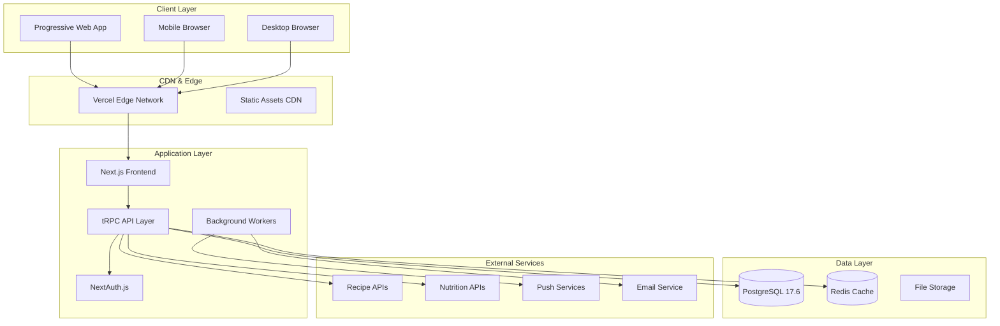

# 2. High Level Architecture

## 2.1 System Overview

## 2.2 Architecture Principles

**Mobile-First Design:**
- Progressive Web App (PWA) with offline capabilities
- Touch-optimized interface with kitchen-friendly interactions
- Responsive design adapting from mobile to desktop experiences
- Service Worker for background sync and caching

**Type Safety & Developer Experience:**
- End-to-end TypeScript coverage from database to UI
- tRPC for type-safe API contracts with automatic client generation
- Prisma for database type safety and migration management
- Comprehensive testing strategy with strong type guarantees

**Performance & Reliability:**
- Server-side rendering with Next.js App Router for optimal loading
- Multi-level caching strategy (CDN, application, database)
- Horizontal scaling through containerized deployment
- 99.5% notification delivery through multi-channel redundancy

**Vendor Neutrality:**
- Kubernetes deployment supporting multi-cloud strategies
- Containerized services reducing platform lock-in
- Hybrid approach: Vercel frontend + vendor-neutral backend
- Standard protocols and open-source technology stack

## 2.3 Data Flow Architecture

**Real-time Timing Notifications:**
1. User creates meal plan with target serving time
2. System calculates optimal cooking start times for each recipe component
3. Background workers schedule notifications across multiple channels
4. Delivery verification with fallback channel activation
5. User receives precise cooking timing alerts

**Offline-First Meal Planning:**
1. Service Worker caches frequently accessed recipes and meal plans
2. Local storage maintains user preferences and draft meal plans
3. Background sync queues changes when network connectivity restored
4. Conflict resolution for concurrent modifications across devices
