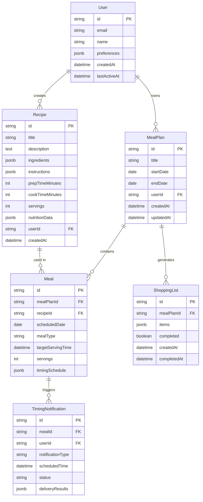

# 4. Data Models

## 4.1 Core Entity Relationships



## 4.2 Prisma Schema Definition

```prisma
// User and Authentication
model User {
  id                    String    @id @default(cuid())
  email                 String    @unique
  name                  String?
  image                 String?
  emailVerified         DateTime?
  preferences           Json?     // Dietary restrictions, cooking skill level, etc.
  notificationSettings  Json?     // Push, email, timing preferences
  createdAt            DateTime  @default(now())
  lastActiveAt         DateTime  @default(now())
  
  accounts     Account[]
  sessions     Session[]
  recipes      Recipe[]
  mealPlans    MealPlan[]
  notifications TimingNotification[]
  
  @@map("users")
}

// Recipe Management
model Recipe {
  id              String   @id @default(cuid())
  title           String
  description     String?
  ingredients     Json     // Array of ingredient objects with amounts
  instructions    Json     // Array of step objects with timing
  prepTimeMinutes Int
  cookTimeMinutes Int
  totalTimeMinutes Int
  servings        Int      @default(4)
  difficulty      String?  // Easy, Medium, Hard
  cuisine         String?
  dietaryTags     String[] // Vegetarian, Vegan, Gluten-Free, etc.
  nutritionData   Json?    // Calories, protein, carbs, etc.
  imageUrl        String?
  sourceUrl       String?
  isPublic        Boolean  @default(false)
  userId          String
  createdAt       DateTime @default(now())
  updatedAt       DateTime @updatedAt
  
  user  User   @relation(fields: [userId], references: [id], onDelete: Cascade)
  meals Meal[]
  
  @@index([userId])
  @@index([isPublic])
  @@map("recipes")
}

// Meal Planning
model MealPlan {
  id          String   @id @default(cuid())
  title       String
  description String?
  startDate   DateTime
  endDate     DateTime
  userId      String
  createdAt   DateTime @default(now())
  updatedAt   DateTime @updatedAt
  
  user         User           @relation(fields: [userId], references: [id], onDelete: Cascade)
  meals        Meal[]
  shoppingLists ShoppingList[]
  
  @@index([userId])
  @@index([startDate, endDate])
  @@map("meal_plans")
}

model Meal {
  id                 String    @id @default(cuid())
  mealPlanId         String
  recipeId           String
  scheduledDate      DateTime
  mealType           String    // breakfast, lunch, dinner, snack
  targetServingTime  DateTime?
  servings           Int       @default(4)
  timingSchedule     Json?     // Calculated cooking timeline
  notes              String?
  completed          Boolean   @default(false)
  createdAt          DateTime  @default(now())
  
  mealPlan      MealPlan             @relation(fields: [mealPlanId], references: [id], onDelete: Cascade)
  recipe        Recipe               @relation(fields: [recipeId], references: [id])
  notifications TimingNotification[]
  
  @@index([mealPlanId])
  @@index([scheduledDate])
  @@map("meals")
}
```

## 4.3 Timing Intelligence Data Structure

```typescript
// Timing Schedule JSON Structure
interface TimingSchedule {
  targetServingTime: string; // ISO datetime
  totalDuration: number;     // Total time in minutes
  steps: TimingStep[];
  criticalPath: string[];    // Step IDs on critical path
}

interface TimingStep {
  id: string;
  description: string;
  startTime: string;         // ISO datetime when to start
  duration: number;          // Duration in minutes
  type: 'prep' | 'cook' | 'rest' | 'serve';
  dependencies: string[];    // Step IDs that must complete first
  notifications: {
    beforeStart: number[];   // Minutes before to notify
    duringStep: number[];    // Minutes into step to notify
    beforeEnd: number[];     // Minutes before completion
  };
}

// Example timing schedule for complex meal
const exampleTiming: TimingSchedule = {
  targetServingTime: "2024-01-15T18:00:00Z",
  totalDuration: 90,
  steps: [
    {
      id: "prep-vegetables",
      description: "Prep all vegetables",
      startTime: "2024-01-15T16:30:00Z",
      duration: 15,
      type: "prep",
      dependencies: [],
      notifications: {
        beforeStart: [5],
        duringStep: [],
        beforeEnd: [2]
      }
    },
    {
      id: "start-rice",
      description: "Start rice cooking",
      startTime: "2024-01-15T17:15:00Z", 
      duration: 20,
      type: "cook",
      dependencies: ["prep-vegetables"],
      notifications: {
        beforeStart: [2],
        duringStep: [10],
        beforeEnd: [5]
      }
    }
  ],
  criticalPath: ["prep-vegetables", "start-rice", "final-plating"]
};
```

## 4.4 Shopping List Data Structure

```typescript
interface ShoppingListItem {
  id: string;
  name: string;
  amount: number;
  unit: string;
  category: 'produce' | 'meat' | 'dairy' | 'pantry' | 'frozen' | 'other';
  checked: boolean;
  recipeIds: string[];  // Which recipes need this ingredient
  notes?: string;
}

interface ShoppingList {
  id: string;
  mealPlanId: string;
  title: string;
  items: ShoppingListItem[];
  estimatedTotal?: number;
  storeLayout?: {
    [category: string]: number;  // Aisle number for organization
  };
  completed: boolean;
  createdAt: string;
  completedAt?: string;
}
```
