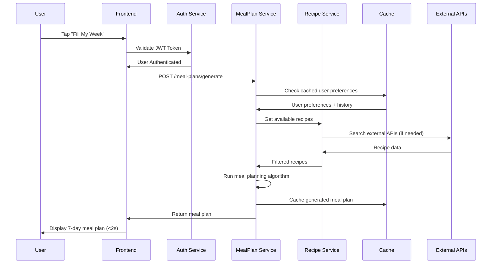

# 8. Core Workflows

## Primary Workflow: "Fill My Week" Meal Plan Generation

### Workflow Overview


### Detailed Workflow Steps

**Step 1: User Authentication & Preferences Retrieval**
```typescript
async function initiateWeeklyMealPlan(userId: string): Promise<MealPlanWorkflow> {
  // 1. Validate user session
  const user = await authService.validateUser(userId);
  
  // 2. Get user preferences (cached)
  const preferences = await userService.getPreferences(userId);
  
  // 3. Get meal plan history for variety
  const history = await mealPlanService.getRecentHistory(userId, 4); // 4 weeks
  
  return {
    user,
    preferences,
    recentMeals: history.flatMap(plan => plan.meals),
    workflowId: generateWorkflowId()
  };
}
```

**Step 2: Recipe Pool Generation**
```go
// Recipe selection algorithm
func (s *MealPlanService) buildRecipePool(ctx context.Context, req MealPlanRequest) (*RecipePool, error) {
    pool := &RecipePool{
        Breakfast: make([]Recipe, 0),
        Lunch:     make([]Recipe, 0),
        Dinner:    make([]Recipe, 0),
        Snacks:    make([]Recipe, 0),
    }
    
    // Get recipes from cache first
    cachedRecipes, err := s.cacheService.GetRecipesByPreferences(req.UserPreferences)
    if err == nil && len(cachedRecipes) > 100 {
        return s.filterAndCategorizeRecipes(cachedRecipes, req), nil
    }
    
    // Fallback to external APIs
    searchParams := RecipeSearchParams{
        Diet:               req.UserPreferences.DietaryRestrictions,
        Intolerances:       req.UserPreferences.Allergies,
        MaxReadyTime:       req.UserPreferences.MaxCookTime,
        ExcludeIngredients: req.RecentIngredients, // avoid repetition
        Number:             150, // request extra for filtering
    }
    
    recipes, err := s.recipeAPI.SearchRecipes(ctx, searchParams)
    if err != nil {
        return nil, fmt.Errorf("failed to fetch recipes: %w", err)
    }
    
    return s.filterAndCategorizeRecipes(recipes, req), nil
}
```

**Step 3: Intelligent Meal Plan Algorithm**
```go
func (s *MealPlanService) generateOptimalMealPlan(pool *RecipePool, constraints MealPlanConstraints) (*MealPlan, error) {
    mealPlan := &MealPlan{
        ID:        uuid.New().String(),
        UserID:    constraints.UserID,
        WeekStart: constraints.WeekStart,
        Meals:     make(map[string][]MealEntry),
    }
    
    // Algorithm priorities:
    // 1. Dietary restrictions compliance (hard constraint)
    // 2. Variety across week (avoid same meal type repetition)
    // 3. Cooking skill level appropriateness
    // 4. Prep time distribution (balance quick vs. complex meals)
    // 5. Ingredient overlap optimization (reduce shopping list)
    
    days := []string{"monday", "tuesday", "wednesday", "thursday", "friday", "saturday", "sunday"}
    
    for _, day := range days {
        dayMeals, err := s.selectDayMeals(pool, constraints, mealPlan, day)
        if err != nil {
            return nil, fmt.Errorf("failed to generate meals for %s: %w", day, err)
        }
        mealPlan.Meals[day] = dayMeals
    }
    
    // Final optimization pass
    mealPlan = s.optimizeIngredientOverlap(mealPlan)
    mealPlan = s.validateNutritionalBalance(mealPlan)
    
    return mealPlan, nil
}
```

## Secondary Workflow: Recipe Discovery and Curation

### User-Driven Recipe Search
```typescript
// Advanced recipe search with filters
interface RecipeSearchWorkflow {
  searchQuery: string;
  filters: {
    mealType: MealType[];
    dietaryRestrictions: string[];
    cookingTime: TimeRange;
    difficulty: SkillLevel;
    cuisineType: string[];
    rating: number; // minimum rating
  };
  pagination: {
    page: number;
    limit: number; // max 50
  };
}

async function searchRecipes(workflow: RecipeSearchWorkflow): Promise<RecipeSearchResult> {
  // 1. Build search query with filters
  const searchParams = buildSearchParameters(workflow);
  
  // 2. Check cache for similar searches
  const cacheKey = generateSearchCacheKey(searchParams);
  const cachedResults = await cacheService.get(cacheKey);
  
  if (cachedResults && !isStale(cachedResults)) {
    return cachedResults;
  }
  
  // 3. Execute parallel searches across APIs
  const [spoonacularResults, edamamResults] = await Promise.allSettled([
    spoonacularAPI.search(searchParams),
    edamamAPI.search(searchParams)
  ]);
  
  // 4. Merge and rank results
  const mergedResults = mergeAndDeduplicateResults(spoonacularResults, edamamResults);
  const rankedResults = applyPersonalizedRanking(mergedResults, workflow.userId);
  
  // 5. Cache results
  await cacheService.set(cacheKey, rankedResults, RECIPE_CACHE_TTL);
  
  return rankedResults;
}
```

## Workflow: Shopping List Generation

```go
// Automated shopping list creation from meal plan
func (s *ShoppingListService) generateFromMealPlan(mealPlanID string, userID string) (*ShoppingList, error) {
    mealPlan, err := s.mealPlanRepo.FindByID(mealPlanID)
    if err != nil {
        return nil, err
    }
    
    // 1. Extract all ingredients from meal plan
    allIngredients := s.extractIngredients(mealPlan)
    
    // 2. Consolidate similar ingredients (e.g., "1 cup flour" + "2 tbsp flour")
    consolidatedIngredients := s.consolidateIngredients(allIngredients)
    
    // 3. Check user's pantry (if available)
    pantryItems, _ := s.userRepo.GetPantryItems(userID)
    neededIngredients := s.filterOutPantryItems(consolidatedIngredients, pantryItems)
    
    // 4. Categorize by store section
    categorizedList := s.categorizeIngredients(neededIngredients)
    
    // 5. Apply user's store preferences (aisle ordering)
    storePrefs, _ := s.userRepo.GetStorePreferences(userID)
    optimizedList := s.optimizeForStore(categorizedList, storePrefs)
    
    shoppingList := &ShoppingList{
        ID:           uuid.New().String(),
        UserID:       userID,
        MealPlanID:   mealPlanID,
        Items:        optimizedList,
        CreatedAt:    time.Now(),
        EstimatedCost: s.calculateEstimatedCost(optimizedList),
    }
    
    return s.shoppingListRepo.Create(shoppingList)
}
```

## Workflow: User Onboarding and Preference Learning

```typescript
// Progressive user preference learning
interface OnboardingWorkflow {
  step1_BasicInfo: {
    dietaryRestrictions: string[];
    allergies: string[];
    cookingSkillLevel: SkillLevel;
  };
  
  step2_PreferenceQuiz: {
    favoriteCuisines: string[];
    dislikedIngredients: string[];
    cookingTimePreference: 'quick' | 'moderate' | 'elaborate';
    mealComplexityPreference: 'simple' | 'varied' | 'adventurous';
  };
  
  step3_TrialMealPlan: {
    generateSamplePlan: boolean;
    collectFeedback: boolean;
  };
}

async function executeOnboardingWorkflow(userId: string): Promise<UserProfile> {
  const workflow = new OnboardingWorkflow();
  
  // Step 1: Collect basic dietary requirements
  const basicPrefs = await collectBasicPreferences(userId);
  workflow.step1_BasicInfo = basicPrefs;
  
  // Step 2: Preference discovery through interactive quiz
  const detailedPrefs = await runPreferenceQuiz(userId, basicPrefs);
  workflow.step2_PreferenceQuiz = detailedPrefs;
  
  // Step 3: Generate trial meal plan for immediate feedback
  const trialMealPlan = await generateTrialMealPlan(userId, {
    ...basicPrefs,
    ...detailedPrefs
  });
  
  // Step 4: Collect initial feedback
  const feedback = await collectTrialFeedback(userId, trialMealPlan.id);
  
  // Step 5: Create refined user profile
  const userProfile = await createRefinedUserProfile(userId, workflow, feedback);
  
  return userProfile;
}
```

## Workflow Error Handling and Recovery

```go
// Workflow-level error handling
type WorkflowError struct {
    WorkflowID   string    `json:"workflowId"`
    StepID       string    `json:"stepId"`
    ErrorType    string    `json:"errorType"`
    ErrorMessage string    `json:"errorMessage"`
    RetryCount   int       `json:"retryCount"`
    Timestamp    time.Time `json:"timestamp"`
    UserID       string    `json:"userId"`
}

// Automatic retry with exponential backoff
func (s *WorkflowService) executeWithRetry(ctx context.Context, step WorkflowStep) error {
    maxRetries := 3
    baseDelay := time.Second
    
    for attempt := 0; attempt <= maxRetries; attempt++ {
        err := step.Execute(ctx)
        if err == nil {
            return nil // Success
        }
        
        if !isRetryableError(err) {
            return fmt.Errorf("non-retryable error in step %s: %w", step.ID, err)
        }
        
        if attempt == maxRetries {
            return fmt.Errorf("step %s failed after %d attempts: %w", step.ID, maxRetries, err)
        }
        
        // Exponential backoff
        delay := baseDelay * time.Duration(1<<attempt)
        time.Sleep(delay)
        
        s.logRetryAttempt(step.WorkflowID, step.ID, attempt+1, err)
    }
    
    return nil
}
```

## Workflow Performance Monitoring

```go
// Workflow step timing and performance tracking
func (s *WorkflowService) trackStepPerformance(workflowID, stepID string) func() {
    startTime := time.Now()
    
    return func() {
        duration := time.Since(startTime)
        
        // Record metrics
        s.metricsService.RecordStepDuration(workflowID, stepID, duration)
        
        // Alert if step is taking too long
        if stepID == "meal_plan_generation" && duration > 2*time.Second {
            s.alertService.SendAlert(AlertCritical, fmt.Sprintf(
                "Meal plan generation exceeded 2s threshold: %v", duration))
        }
        
        s.logger.Info("workflow step completed",
            "workflowId", workflowID,
            "stepId", stepID,
            "duration", duration.String(),
        )
    }
}
```
