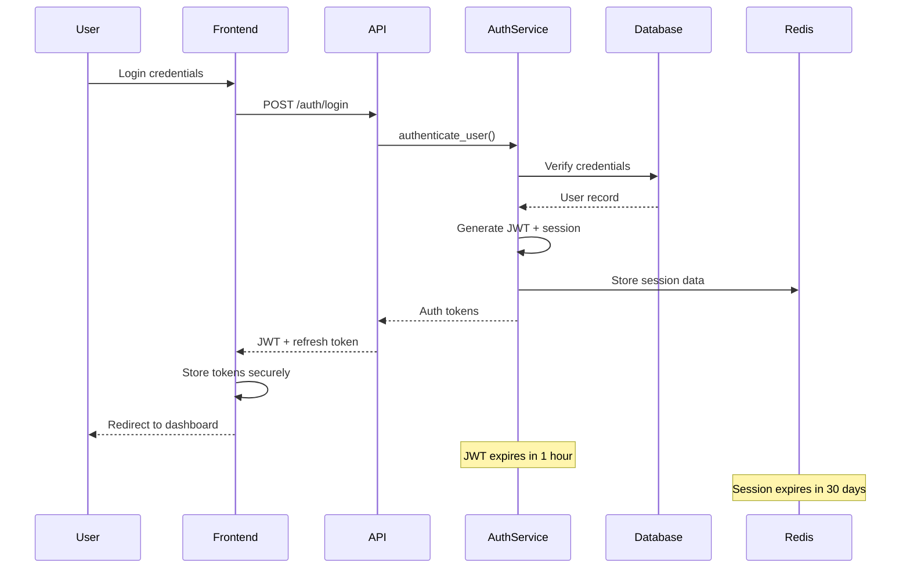

# Backend Architecture

## Service Architecture

### Controller/Route Organization

```text
apps/backend/src/
├── main.rs                   # Application entry point
├── config/                   # Configuration management
│   ├── mod.rs
│   ├── database.rs
│   └── settings.rs
├── routes/                   # HTTP route handlers
│   ├── mod.rs
│   ├── auth.rs               # Authentication endpoints
│   ├── recipes.rs            # Recipe CRUD operations
│   ├── meal_plans.rs         # Meal planning endpoints
│   └── cooking.rs            # Cooking session management
├── services/                 # Business logic layer
│   ├── mod.rs
│   ├── recipe_parser.rs      # Recipe import/parsing
│   ├── meal_planner.rs       # AI meal planning
│   ├── timing_engine.rs      # Cooking coordination
│   └── notification.rs       # Push notifications
├── repositories/             # Data access layer
│   ├── mod.rs
│   ├── user_repo.rs
│   ├── recipe_repo.rs
│   └── session_repo.rs
├── models/                   # Domain models
│   ├── mod.rs
│   ├── user.rs
│   ├── recipe.rs
│   └── cooking.rs
└── middleware/               # HTTP middleware
    ├── auth.rs
    ├── cors.rs
    └── logging.rs
```

### Controller Template

```rust
use axum::{extract::Path, response::Json, Extension};
use uuid::Uuid;
use crate::{services::CookingService, models::CookingSession, auth::UserClaims};

pub async fn start_cooking_session(
    Extension(cooking_service): Extension<CookingService>,
    Extension(user): Extension<UserClaims>,
    Json(request): Json<StartCookingRequest>,
) -> Result<Json<CookingSession>, AppError> {
    let session = cooking_service
        .start_session(user.sub, request.recipe_id, request.scaling_factor)
        .await?;
    
    Ok(Json(session))
}

pub async fn get_cooking_session(
    Extension(cooking_service): Extension<CookingService>,
    Extension(user): Extension<UserClaims>,
    Path(session_id): Path<Uuid>,
) -> Result<Json<CookingSession>, AppError> {
    let session = cooking_service
        .get_session(session_id, user.sub)
        .await?;
    
    Ok(Json(session))
}
```

## Database Architecture

### Schema Design

The PostgreSQL schema (defined above) uses modern PostgreSQL features:
- UUID primary keys for security and distribution
- JSONB for flexible nested data (ingredients, instructions, timers)
- Generated columns for computed values (total_time)
- GIN indexes for full-text search and array operations
- Partial indexes for query optimization (active sessions only)

### Data Access Layer

```rust
use sqlx::{PgPool, Row};
use uuid::Uuid;
use crate::models::{Recipe, User};

pub struct RecipeRepository {
    pool: PgPool,
}

impl RecipeRepository {
    pub fn new(pool: PgPool) -> Self {
        Self { pool }
    }

    pub async fn find_by_user_id(&self, user_id: Uuid) -> Result<Vec<Recipe>, sqlx::Error> {
        let recipes = sqlx::query_as!(
            Recipe,
            r#"
            SELECT id, user_id, title, description, ingredients, instructions,
                   prep_time, cook_time, total_time, servings, difficulty as "difficulty: _",
                   cuisine_type, tags, nutritional_info, source_url, image_path,
                   created_at, updated_at
            FROM recipes 
            WHERE user_id = $1 
            ORDER BY created_at DESC
            "#,
            user_id
        )
        .fetch_all(&self.pool)
        .await?;

        Ok(recipes)
    }

    pub async fn search(&self, user_id: Uuid, query: &str) -> Result<Vec<Recipe>, sqlx::Error> {
        let recipes = sqlx::query_as!(
            Recipe,
            r#"
            SELECT id, user_id, title, description, ingredients, instructions,
                   prep_time, cook_time, total_time, servings, difficulty as "difficulty: _",
                   cuisine_type, tags, nutritional_info, source_url, image_path,
                   created_at, updated_at
            FROM recipes 
            WHERE user_id = $1 AND search_vector @@ plainto_tsquery('english', $2)
            ORDER BY ts_rank(search_vector, plainto_tsquery('english', $2)) DESC
            "#,
            user_id,
            query
        )
        .fetch_all(&self.pool)
        .await?;

        Ok(recipes)
    }
}
```

## Authentication and Authorization

### Auth Flow



### Middleware/Guards

```rust
use axum::{
    extract::Request,
    middleware::Next,
    response::Response,
    http::StatusCode,
};
use jsonwebtoken::{decode, DecodingKey, Validation, Algorithm};

pub async fn require_authentication(
    mut request: Request,
    next: Next,
) -> Result<Response, StatusCode> {
    let auth_header = request
        .headers()
        .get("authorization")
        .and_then(|header| header.to_str().ok())
        .ok_or(StatusCode::UNAUTHORIZED)?;

    if !auth_header.starts_with("Bearer ") {
        return Err(StatusCode::UNAUTHORIZED);
    }

    let token = &auth_header[7..];
    let secret = std::env::var("JWT_SECRET").expect("JWT_SECRET must be set");
    
    let token_data = decode::<UserClaims>(
        token,
        &DecodingKey::from_secret(secret.as_ref()),
        &Validation::new(Algorithm::HS256),
    ).map_err(|_| StatusCode::UNAUTHORIZED)?;

    request.extensions_mut().insert(token_data.claims);
    Ok(next.run(request).await)
}
```
