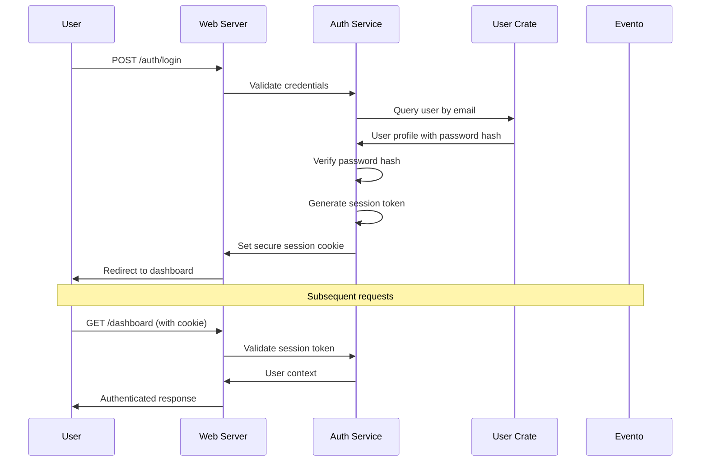

# Backend Architecture

## Service Architecture

### Traditional Server Architecture

#### Controller/Route Organization
```
src/
├── handlers/
│   ├── mod.rs                 # Handler module exports
│   ├── auth.rs                # Authentication endpoints
│   ├── dashboard.rs           # Dashboard and calendar
│   ├── recipes.rs             # Recipe management
│   ├── meal_planning.rs       # Meal plan generation
│   ├── shopping.rs            # Shopping list management
│   └── profile.rs             # User profile management
├── middleware/
│   ├── auth.rs                # Authentication middleware
│   ├── error.rs               # Error handling middleware
│   └── logging.rs             # Request logging
└── lib.rs                     # Web server library exports
```

#### Controller Template
```rust
use axum::{extract::State, response::Html, Form};
use crate::domain::meal_planning::{GenerateMealPlanCommand, MealPlanningService};
use crate::templates::calendar::WeeklyCalendarTemplate;
use crate::auth::AuthenticatedUser;

pub async fn generate_meal_plan_handler(
    State(app_state): State<AppState>,
    user: AuthenticatedUser,
    Form(request): Form<GenerateMealPlanRequest>,
) -> Result<Html<String>, AppError> {
    // Validate request
    request.validate()?;
    
    // Execute command through meal planning crate
    let command = GenerateMealPlanCommand::new(user.id, request.into());
    let meal_plan = app_state.meal_planning_service
        .handle_generate_command(command)
        .await?;
    
    // Render response template
    let template = WeeklyCalendarTemplate::new(meal_plan, user.preferences);
    Ok(Html(template.render()?))
}
```

## Database Architecture

### Schema Design
```sql
-- Application-specific read models only
-- Evento manages all event sourcing infrastructure automatically
```

### Data Access Layer
```rust
use evento::{create, Context};
use axum::{extract::State, response::Html, Form};
use askama::Template;

#[derive(Template)]
#[template(path = "recipe_list.html")]
pub struct RecipeListTemplate {
    pub recipes: Vec<Recipe>,
    pub search_query: String,
}

// Direct Axum handler pattern from Evento example
pub async fn create_recipe_handler(
    State(context): State<Context>,
    user: AuthenticatedUser,
    Form(request): Form<CreateRecipeRequest>,
) -> Result<Html<String>, AppError> {
    // Create recipe event using Evento
    let recipe_id = create::<Recipe>()
        .data(&RecipeCreated {
            title: request.title,
            ingredients: request.ingredients,
            instructions: request.instructions,
            created_by: user.id,
        })?
        .commit(&context)
        .await?;

    // Load updated recipe to render
    let recipe = context.load::<Recipe>(&recipe_id).await?;
    
    // Return HTML fragment for TwinSpark replacement
    let template = RecipeCardTemplate { recipe };
    Ok(Html(template.render()?))
}

pub async fn search_recipes_handler(
    State(context): State<Context>,
    Query(params): Query<SearchParams>,
) -> Result<Html<String>, AppError> {
    // Query read model for fast search
    // (Evento handles write side, read model for queries)
    let recipes = search_recipes_in_read_model(&params.query).await?;
    
    let template = RecipeListTemplate {
        recipes,
        search_query: params.query,
    };
    
    Ok(Html(template.render()?))
}

// Evento event handlers for side effects (like the todos example)
#[evento::handler(Recipe)]
async fn on_recipe_created(
    context: &Context,
    event: EventDetails<RecipeCreated>
) -> Result<()> {
    // Update search index, send notifications, etc.
    update_search_index(&event.aggregate_id, &event.data).await?;
    Ok(())
}
```

## Authentication and Authorization

### Auth Flow


### Middleware/Guards
```rust
use axum::{
    extract::{Request, State},
    middleware::Next,
    response::Response,
};
use tower_cookies::{Cookie, Cookies};

pub struct AuthMiddleware;

impl AuthMiddleware {
    pub async fn require_auth(
        State(app_state): State<AppState>,
        cookies: Cookies,
        mut request: Request,
        next: Next,
    ) -> Result<Response, AuthError> {
        let session_token = cookies
            .get("session_token")
            .ok_or(AuthError::MissingToken)?;
            
        let user = app_state.auth_service
            .validate_session(session_token.value())
            .await?;
            
        request.extensions_mut().insert(user);
        Ok(next.run(request).await)
    }
}
```
