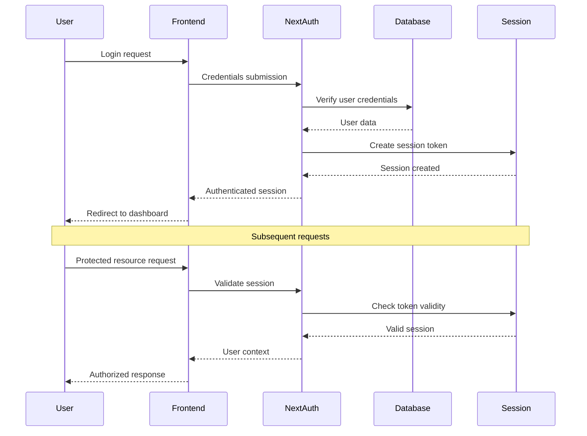

# Backend Architecture

## Service Architecture

### Controller Organization

```text
src/
├── app/
│   ├── api/
│   │   ├── auth/
│   │   │   ├── login/route.ts
│   │   │   ├── register/route.ts
│   │   │   └── session/route.ts
│   │   ├── inventory/
│   │   │   ├── route.ts
│   │   │   ├── [itemId]/route.ts
│   │   │   └── expiring/route.ts
│   │   ├── recipes/
│   │   │   ├── route.ts
│   │   │   ├── search/route.ts
│   │   │   ├── [recipeId]/route.ts
│   │   │   └── suggestions/route.ts
│   │   ├── meal-plans/
│   │   │   ├── route.ts
│   │   │   ├── [planId]/route.ts
│   │   │   └── generate/route.ts
│   │   ├── shopping/
│   │   │   ├── route.ts
│   │   │   ├── lists/route.ts
│   │   │   └── [listId]/route.ts
│   │   └── voice/
│   │       ├── process/route.ts
│   │       ├── cooking/route.ts
│   │       └── commands/route.ts
├── lib/
│   ├── services/
│   ├── repositories/
│   ├── middleware/
│   ├── utils/
│   └── validators/
└── types/
```

### Controller Template

```typescript
import { NextRequest, NextResponse } from 'next/server';
import { z } from 'zod';
import { auth } from '@/lib/auth';
import { InventoryService } from '@/lib/services/inventory-service';
import { withErrorHandler } from '@/lib/middleware/error-handler';
import { validateRequest } from '@/lib/middleware/validation';

const CreateInventoryItemSchema = z.object({
  name: z.string().min(1).max(255),
  quantity: z.number().positive(),
  unit: z.string().min(1).max(50),
  category: z.enum([
    'proteins',
    'vegetables',
    'fruits',
    'grains',
    'dairy',
    'spices',
    'condiments',
    'beverages',
    'baking',
    'frozen',
  ]),
  location: z.enum(['pantry', 'refrigerator', 'freezer']),
  expirationDate: z
    .string()
    .optional()
    .transform(str => (str ? new Date(str) : undefined)),
  estimatedCost: z.number().optional(),
});

export async function GET(request: NextRequest) {
  return withErrorHandler(async () => {
    const session = await auth();
    if (!session?.user?.householdId) {
      return NextResponse.json({ error: 'Unauthorized' }, { status: 401 });
    }

    const { searchParams } = new URL(request.url);
    const location = searchParams.get('location');
    const category = searchParams.get('category');

    const items = await InventoryService.getHouseholdItems(
      session.user.householdId,
      { location, category }
    );

    return NextResponse.json(items);
  });
}

export async function POST(request: NextRequest) {
  return withErrorHandler(async () => {
    const session = await auth();
    if (!session?.user?.householdId) {
      return NextResponse.json({ error: 'Unauthorized' }, { status: 401 });
    }

    const body = await request.json();
    const validatedData = await validateRequest(
      CreateInventoryItemSchema,
      body
    );

    const item = await InventoryService.createItem({
      ...validatedData,
      householdId: session.user.householdId,
      addedBy: session.user.id,
    });

    return NextResponse.json(item, { status: 201 });
  });
}
```

## Database Architecture

### Schema Design

```sql
-- Database schema defined in previous section
-- Key design principles:
-- 1. UUID primary keys for security and distribution
-- 2. JSONB for flexible nested data (ingredients, instructions)
-- 3. Proper foreign key constraints
-- 4. Enum types for controlled vocabularies
-- 5. Indexes for performance-critical queries
-- 6. Full-text search capabilities
```

### Data Access Layer

```typescript
import { PrismaClient } from '@prisma/client';
import { z } from 'zod';

const prisma = new PrismaClient();

export class InventoryRepository {
  static async findByHousehold(
    householdId: string,
    filters?: {
      location?: string;
      category?: string;
      expiringSoon?: boolean;
    }
  ) {
    const where: any = { householdId };

    if (filters?.location) {
      where.location = filters.location;
    }

    if (filters?.category) {
      where.category = filters.category;
    }

    if (filters?.expiringSoon) {
      const futureDate = new Date();
      futureDate.setDate(futureDate.getDate() + 7);
      where.expirationDate = {
        lte: futureDate,
        gte: new Date(),
      };
    }

    return prisma.inventoryItem.findMany({
      where,
      orderBy: [{ expirationDate: 'asc' }, { name: 'asc' }],
      include: {
        addedBy: {
          select: { name: true },
        },
      },
    });
  }

  static async create(data: {
    name: string;
    quantity: number;
    unit: string;
    category: string;
    location: string;
    expirationDate?: Date;
    estimatedCost?: number;
    householdId: string;
    addedBy: string;
  }) {
    return prisma.inventoryItem.create({
      data,
      include: {
        addedBy: {
          select: { name: true },
        },
      },
    });
  }

  static async update(
    id: string,
    data: Partial<{
      quantity: number;
      expirationDate: Date;
      location: string;
      estimatedCost: number;
    }>
  ) {
    return prisma.inventoryItem.update({
      where: { id },
      data: {
        ...data,
        updatedAt: new Date(),
      },
    });
  }

  static async delete(id: string) {
    return prisma.inventoryItem.delete({
      where: { id },
    });
  }

  static async findExpiring(householdId: string, days: number = 7) {
    const futureDate = new Date();
    futureDate.setDate(futureDate.getDate() + days);

    return prisma.inventoryItem.findMany({
      where: {
        householdId,
        expirationDate: {
          lte: futureDate,
          gte: new Date(),
        },
      },
      orderBy: { expirationDate: 'asc' },
    });
  }
}
```

## Authentication and Authorization

### Auth Flow



### Middleware/Guards

```typescript
import { NextRequest, NextResponse } from 'next/server';
import { getToken } from 'next-auth/jwt';

export async function middleware(request: NextRequest) {
  // Check authentication for API routes
  if (request.nextUrl.pathname.startsWith('/api/')) {
    const token = await getToken({ req: request });

    // Public API routes that don't require authentication
    const publicRoutes = ['/api/auth', '/api/health', '/api/recipes/public'];
    const isPublicRoute = publicRoutes.some(route =>
      request.nextUrl.pathname.startsWith(route)
    );

    if (!isPublicRoute && !token) {
      return NextResponse.json(
        { error: 'Authentication required' },
        { status: 401 }
      );
    }

    // Add user context to headers for API routes
    if (token) {
      const requestHeaders = new Headers(request.headers);
      requestHeaders.set('x-user-id', token.sub!);
      requestHeaders.set('x-household-id', token.householdId as string);

      return NextResponse.next({
        request: {
          headers: requestHeaders,
        },
      });
    }
  }

  // Check authentication for protected pages
  const protectedPaths = [
    '/dashboard',
    '/inventory',
    '/recipes',
    '/meal-planning',
    '/shopping',
    '/cooking',
  ];
  const isProtectedPath = protectedPaths.some(path =>
    request.nextUrl.pathname.startsWith(path)
  );

  if (isProtectedPath) {
    const token = await getToken({ req: request });

    if (!token) {
      const url = request.nextUrl.clone();
      url.pathname = '/login';
      url.searchParams.set('callbackUrl', request.nextUrl.pathname);
      return NextResponse.redirect(url);
    }
  }

  return NextResponse.next();
}

export const config = {
  matcher: [
    '/api/:path*',
    '/dashboard/:path*',
    '/inventory/:path*',
    '/recipes/:path*',
    '/meal-planning/:path*',
    '/shopping/:path*',
    '/cooking/:path*',
  ],
};
```
