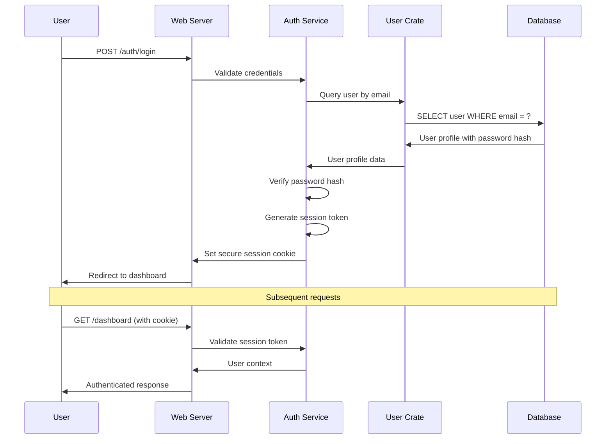

# Backend Architecture

## Service Architecture

### Traditional Server Architecture

#### Controller/Route Organization
```
src/
├── handlers/
│   ├── mod.rs                 # Handler module exports
│   ├── auth.rs                # Authentication endpoints
│   ├── dashboard.rs           # Dashboard and calendar
│   ├── recipes.rs             # Recipe management
│   ├── meal_planning.rs       # Meal plan generation
│   ├── shopping.rs            # Shopping list management
│   └── profile.rs             # User profile management
├── middleware/
│   ├── auth.rs                # Authentication middleware
│   ├── error.rs               # Error handling middleware
│   └── logging.rs             # Request logging
└── lib.rs                     # Web server library exports
```

#### Controller Template
```rust
use axum::{extract::State, response::Html, Form};
use crate::domain::meal_planning::{GenerateMealPlanRequest, MealPlanningService};
use crate::templates::calendar::WeeklyCalendarTemplate;
use crate::auth::AuthenticatedUser;

pub async fn generate_meal_plan_handler(
    State(app_state): State<AppState>,
    user: AuthenticatedUser,
    Form(request): Form<GenerateMealPlanRequest>,
) -> Result<Html<String>, AppError> {
    // Validate request
    request.validate()?;
    
    // Execute business logic through meal planning service
    let meal_plan = app_state.meal_planning_service
        .generate_meal_plan(user.id, request)
        .await?;
    
    // Render response template
    let template = WeeklyCalendarTemplate::new(meal_plan, user.preferences);
    Ok(Html(template.render()?))
}
```

## Database Architecture

### Schema Design
```sql
-- Direct SQLite schema for application data
CREATE TABLE recipes (
    id TEXT PRIMARY KEY,
    title TEXT NOT NULL,
    ingredients TEXT NOT NULL,
    instructions TEXT NOT NULL,
    created_by TEXT NOT NULL,
    created_at DATETIME DEFAULT CURRENT_TIMESTAMP,
    updated_at DATETIME DEFAULT CURRENT_TIMESTAMP
);

CREATE TABLE meal_plans (
    id TEXT PRIMARY KEY,
    user_id TEXT NOT NULL,
    week_start DATE NOT NULL,
    plan_data TEXT NOT NULL, -- JSON
    created_at DATETIME DEFAULT CURRENT_TIMESTAMP
);
```

### Data Access Layer
```rust
use sqlx::{SqlitePool, query_as};
use axum::{extract::State, response::Html, Form};
use askama::Template;

#[derive(Template)]
#[template(path = "recipe_list.html")]
pub struct RecipeListTemplate {
    pub recipes: Vec<Recipe>,
    pub search_query: String,
}

// Direct database operation with SQLx
pub async fn create_recipe_handler(
    State(pool): State<SqlitePool>,
    user: AuthenticatedUser,
    Form(request): Form<CreateRecipeRequest>,
) -> Result<Html<String>, AppError> {
    // Validate request
    request.validate()?;
    
    // Insert recipe into database
    let recipe_id = Uuid::new_v4();
    sqlx::query!(
        "INSERT INTO recipes (id, title, ingredients, instructions, created_by) 
         VALUES (?, ?, ?, ?, ?)",
        recipe_id.to_string(),
        request.title,
        request.ingredients,
        request.instructions,
        user.id.to_string()
    )
    .execute(&pool)
    .await?;

    // Load created recipe
    let recipe = sqlx::query_as!(Recipe,
        "SELECT * FROM recipes WHERE id = ?",
        recipe_id.to_string()
    )
    .fetch_one(&pool)
    .await?;
    
    // Return HTML fragment for TwinSpark replacement
    let template = RecipeCardTemplate { recipe };
    Ok(Html(template.render()?))
}

pub async fn search_recipes_handler(
    State(pool): State<SqlitePool>,
    Query(params): Query<SearchParams>,
) -> Result<Html<String>, AppError> {
    // Direct SQL query for search
    let recipes = sqlx::query_as!(Recipe,
        "SELECT * FROM recipes WHERE title LIKE ? OR ingredients LIKE ? 
         ORDER BY created_at DESC LIMIT 50",
        format!("%{}%", params.query),
        format!("%{}%", params.query)
    )
    .fetch_all(&pool)
    .await?;
    
    let template = RecipeListTemplate {
        recipes,
        search_query: params.query,
    };
    
    Ok(Html(template.render()?))
}
```

## Authentication and Authorization

### Auth Flow


### Middleware/Guards
```rust
use axum::{
    extract::{Request, State},
    middleware::Next,
    response::Response,
};
use tower_cookies::{Cookie, Cookies};

pub struct AuthMiddleware;

impl AuthMiddleware {
    pub async fn require_auth(
        State(app_state): State<AppState>,
        cookies: Cookies,
        mut request: Request,
        next: Next,
    ) -> Result<Response, AuthError> {
        let session_token = cookies
            .get("session_token")
            .ok_or(AuthError::MissingToken)?;
            
        let user = app_state.auth_service
            .validate_session(session_token.value())
            .await?;
            
        request.extensions_mut().insert(user);
        Ok(next.run(request).await)
    }
}
```
