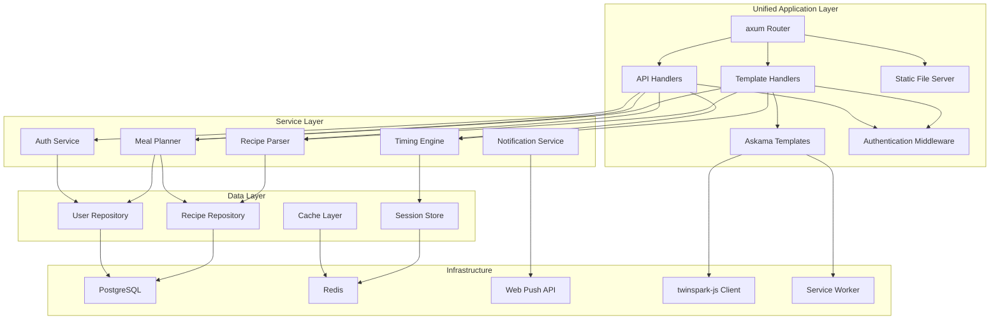

# Components

## Recipe Parser Service

**Responsibility:** Extract and normalize recipe data from external URLs and user inputs with high accuracy

**Key Interfaces:**
- `parse_recipe_url(url: String) -> Result<Recipe, ParseError>`
- `extract_ingredients(text: String) -> Vec<Ingredient>`
- `parse_cooking_instructions(text: String) -> Vec<Instruction>`

**Dependencies:** HTTP client for fetching, HTML parser, NLP library for text processing

**Technology Stack:** Rust with reqwest HTTP client, scraper for HTML parsing, regex for pattern matching, potential integration with recipe microdata standards (JSON-LD)

## Meal Planning Engine

**Responsibility:** Generate optimized weekly meal plans based on user preferences, dietary constraints, and ingredient availability

**Key Interfaces:**
- `generate_meal_plan(user_id: Uuid, preferences: PlanPreferences) -> MealPlan`
- `optimize_ingredient_usage(recipes: Vec<Recipe>) -> ShoppingList`
- `calculate_nutritional_balance(meal_plan: &MealPlan) -> NutritionalSummary`

**Dependencies:** Recipe repository, user preferences, nutritional database

**Technology Stack:** Rust with constraint satisfaction algorithms, PostgreSQL for recipe queries, Redis for caching frequently accessed combinations

## Timing Coordination Engine

**Responsibility:** Calculate optimal cooking schedules and provide real-time timing guidance for single and multi-dish cooking

**Key Interfaces:**
- `calculate_cooking_schedule(recipes: Vec<Recipe>, target_time: DateTime) -> CookingSchedule`
- `start_cooking_session(recipe_id: Uuid, scaling: f32) -> CookingSession`
- `update_timer_status(session_id: Uuid, timer_id: String, status: TimerStatus) -> Result<(), TimerError>`

**Dependencies:** Recipe timing data, user feedback history, notification service

**Technology Stack:** Rust with async timers using tokio, WebSocket connections for real-time updates, Redis pub/sub for timer events

## Authentication Service

**Responsibility:** Manage user registration, login, session management, and access control

**Key Interfaces:**
- `register_user(email: String, password: String) -> Result<User, AuthError>`
- `authenticate_user(email: String, password: String) -> Result<AuthToken, AuthError>`
- `validate_token(token: String) -> Result<UserClaims, AuthError>`

**Dependencies:** User repository, password hashing, JWT library

**Technology Stack:** Rust with argon2 password hashing, jsonwebtoken for JWT handling, Redis for session storage

## Notification Service

**Responsibility:** Deliver timing alerts, cooking reminders, and system notifications across devices

**Key Interfaces:**
- `send_timer_alert(user_id: Uuid, message: String, urgency: Priority)`
- `schedule_cooking_reminder(user_id: Uuid, recipe_id: Uuid, start_time: DateTime)`
- `register_push_subscription(user_id: Uuid, subscription: PushSubscription)`

**Dependencies:** Web Push API, timing engine events, user preferences

**Technology Stack:** Rust with web-push crate for push notifications, WebSocket connections for real-time alerts

## Component Diagrams

