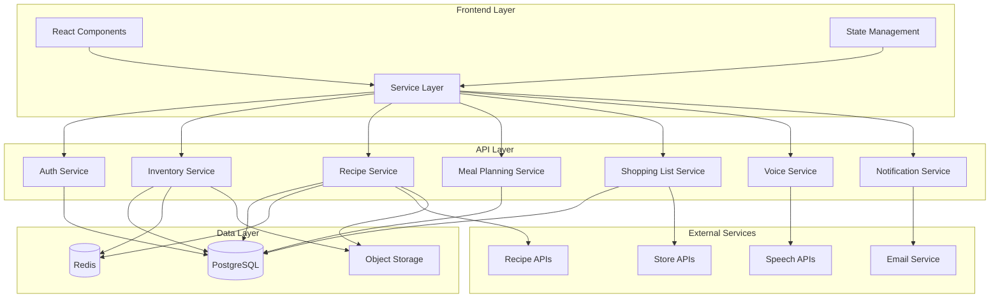

# Components

## Authentication Service

**Responsibility:** User authentication, session management, and household access control

**Key Interfaces:**

- POST /api/auth/login - User login with email/password
- POST /api/auth/register - New user registration
- GET /api/auth/session - Current session validation
- POST /api/auth/logout - Session termination

**Dependencies:** NextAuth.js, PostgreSQL, Redis (session storage)

**Technology Stack:** NextAuth.js with JWT tokens, secure HTTP-only cookies, CSRF protection

## Inventory Management Service

**Responsibility:** Pantry and refrigerator tracking, expiration monitoring, quantity management

**Key Interfaces:**

- GET /api/inventory - Retrieve household inventory with filtering
- POST /api/inventory - Add new inventory items
- PUT /api/inventory/[id] - Update item quantities and expiration dates
- DELETE /api/inventory/[id] - Remove inventory items

**Dependencies:** Recipe Service (ingredient matching), Shopping List Service (replenishment)

**Technology Stack:** Prisma ORM with PostgreSQL, Redis caching for frequent lookups, image storage abstraction

## Recipe Management Service

**Responsibility:** Recipe search, storage, rating, and ingredient-based suggestions

**Key Interfaces:**

- GET /api/recipes/search - Recipe search with filters and available ingredients
- GET /api/recipes/[id] - Recipe details with instructions and nutrition
- POST /api/recipes/rate - User recipe ratings and reviews
- GET /api/recipes/suggestions - Personalized recipe recommendations

**Dependencies:** External Recipe APIs, Inventory Service (ingredient matching), User Preferences

**Technology Stack:** External API integration (Spoonacular/Edamam), PostgreSQL for user recipes, Redis for search caching

## Meal Planning Service

**Responsibility:** Weekly/monthly meal scheduling, family coordination, calendar management

**Key Interfaces:**

- GET /api/meal-plans - Retrieve meal plans for date range
- POST /api/meal-plans - Create new meal plan with recipe assignments
- PUT /api/meal-plans/[id]/entries - Update specific meal assignments
- GET /api/meal-plans/suggestions - AI-powered meal plan generation

**Dependencies:** Recipe Service (meal assignment), Inventory Service (ingredient availability), Shopping List Service (list generation)

**Technology Stack:** PostgreSQL with date indexing, real-time updates via WebSocket, Calendar integration APIs

## Shopping List Service

**Responsibility:** Automated list generation, store organization, purchase tracking

**Key Interfaces:**

- GET /api/shopping-lists - Retrieve active shopping lists
- POST /api/shopping-lists/generate - Generate list from meal plans
- PUT /api/shopping-lists/[id]/items - Mark items as purchased
- GET /api/shopping-lists/[id]/optimize - Store-optimized shopping routes

**Dependencies:** Meal Planning Service (source data), Inventory Service (current stock), Store APIs (pricing/availability)

**Technology Stack:** PostgreSQL with JSON fields for flexible item data, integration with grocery store APIs, geolocation services

## Voice Interaction Service

**Responsibility:** Voice command processing, cooking mode assistance, hands-free navigation

**Key Interfaces:**

- POST /api/voice/process - Voice command interpretation
- POST /api/voice/cooking/next - Advance cooking step via voice
- POST /api/voice/timer - Voice-activated timer management
- GET /api/voice/status - Current voice session state

**Dependencies:** All services (voice commands can access any feature), External Speech-to-Text APIs

**Technology Stack:** WebSpeech API with fallback to cloud services, real-time WebSocket connections, context-aware command processing

## Notification Service

**Responsibility:** Expiration alerts, meal reminders, cooking timers, family coordination

**Key Interfaces:**

- POST /api/notifications/send - Send immediate notifications
- GET /api/notifications/settings - User notification preferences
- POST /api/notifications/schedule - Schedule future notifications
- WebSocket /api/notifications/live - Real-time notification delivery

**Dependencies:** All services (notifications triggered by various events), Email Service (external notifications)

**Technology Stack:** WebSocket for real-time notifications, scheduled jobs with node-cron, email abstraction layer, push notification support

## Component Diagrams

