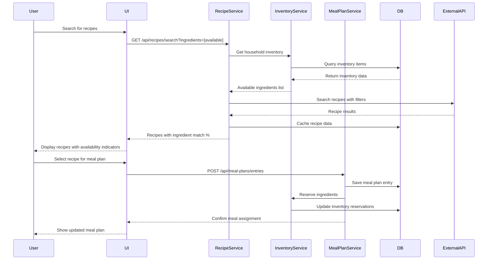
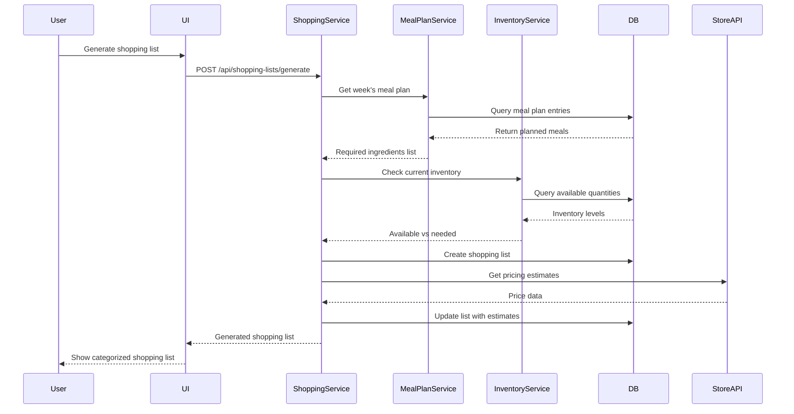
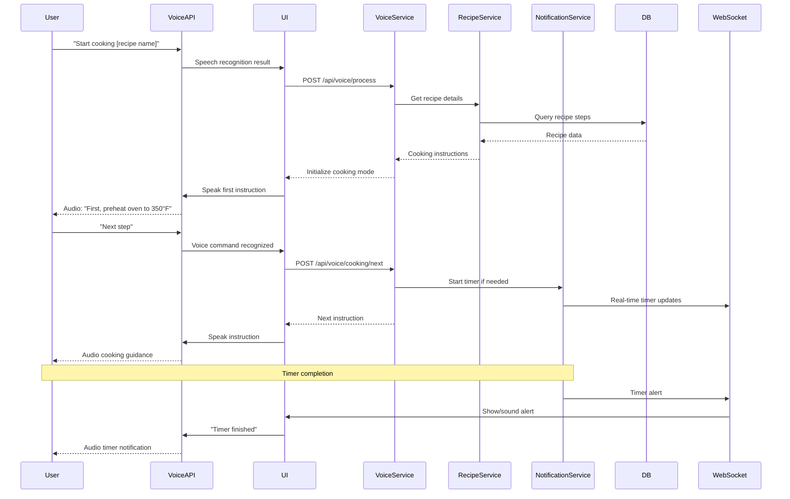

# Core Workflows

## Recipe Discovery to Meal Planning Workflow

```mermaid
sequenceDiagram
    participant User
    participant UI
    participant RecipeService
    participant InventoryService
    participant MealPlanService
    participant DB

    User->>UI: Search for recipes
    UI->>RecipeService: GET /api/recipes/search?ingredients=[available]
    RecipeService->>InventoryService: Get household inventory
    InventoryService->>DB: Query inventory items
    DB-->>InventoryService: Return inventory data
    InventoryService-->>RecipeService: Available ingredients list
    RecipeService->>ExternalAPI: Search recipes with filters
    ExternalAPI-->>RecipeService: Recipe results
    RecipeService->>DB: Cache recipe data
    RecipeService-->>UI: Recipes with ingredient match %
    UI-->>User: Display recipes with availability indicators

    User->>UI: Select recipe for meal plan
    UI->>MealPlanService: POST /api/meal-plans/entries
    MealPlanService->>DB: Save meal plan entry
    MealPlanService->>InventoryService: Reserve ingredients
    InventoryService->>DB: Update inventory reservations
    MealPlanService-->>UI: Confirm meal assignment
    UI-->>User: Show updated meal plan
```

## Shopping List Generation Workflow

```mermaid
sequenceDiagram
    participant User
    participant UI
    participant ShoppingService
    participant MealPlanService
    participant InventoryService
    participant DB

    User->>UI: Generate shopping list
    UI->>ShoppingService: POST /api/shopping-lists/generate
    ShoppingService->>MealPlanService: Get week's meal plan
    MealPlanService->>DB: Query meal plan entries
    DB-->>MealPlanService: Return planned meals
    MealPlanService-->>ShoppingService: Required ingredients list

    ShoppingService->>InventoryService: Check current inventory
    InventoryService->>DB: Query available quantities
    DB-->>InventoryService: Inventory levels
    InventoryService-->>ShoppingService: Available vs needed

    ShoppingService->>DB: Create shopping list
    ShoppingService->>StoreAPI: Get pricing estimates
    StoreAPI-->>ShoppingService: Price data
    ShoppingService->>DB: Update list with estimates
    ShoppingService-->>UI: Generated shopping list
    UI-->>User: Show categorized shopping list
```

## Voice-Controlled Cooking Workflow

```mermaid
sequenceDiagram
    participant User
    participant VoiceAPI
    participant UI
    participant VoiceService
    participant RecipeService
    participant NotificationService

    User->>VoiceAPI: "Start cooking [recipe name]"
    VoiceAPI->>UI: Speech recognition result
    UI->>VoiceService: POST /api/voice/process
    VoiceService->>RecipeService: Get recipe details
    RecipeService->>DB: Query recipe steps
    DB-->>RecipeService: Recipe data
    RecipeService-->>VoiceService: Cooking instructions
    VoiceService-->>UI: Initialize cooking mode
    UI->>VoiceAPI: Speak first instruction
    VoiceAPI-->>User: Audio: "First, preheat oven to 350°F"

    User->>VoiceAPI: "Next step"
    VoiceAPI->>UI: Voice command recognized
    UI->>VoiceService: POST /api/voice/cooking/next
    VoiceService->>NotificationService: Start timer if needed
    NotificationService->>WebSocket: Real-time timer updates
    VoiceService-->>UI: Next instruction
    UI->>VoiceAPI: Speak instruction
    VoiceAPI-->>User: Audio cooking guidance

    Note over User,NotificationService: Timer completion
    NotificationService->>WebSocket: Timer alert
    WebSocket->>UI: Show/sound alert
    UI->>VoiceAPI: "Timer finished"
    VoiceAPI-->>User: Audio timer notification
```
