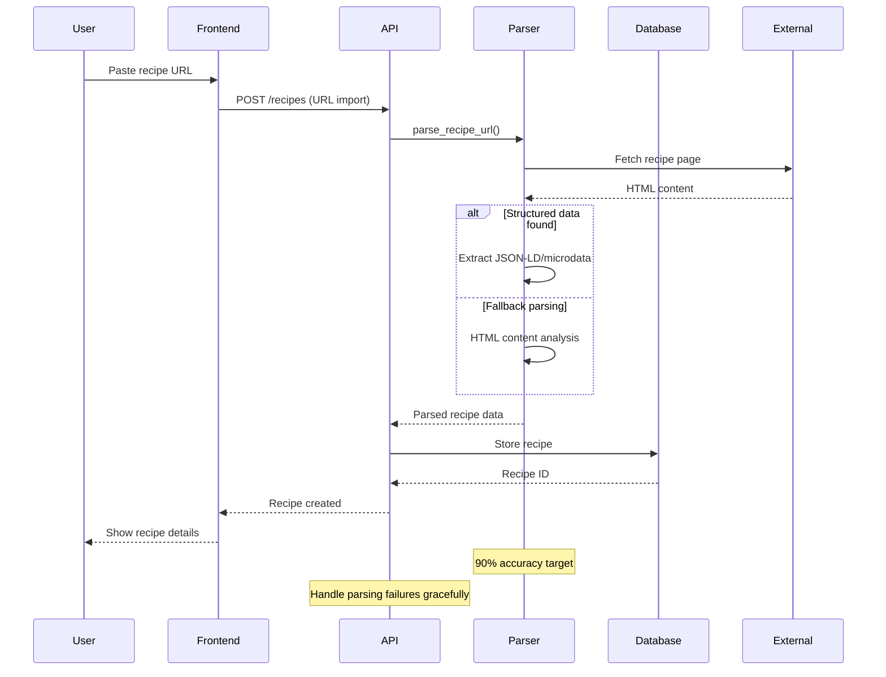
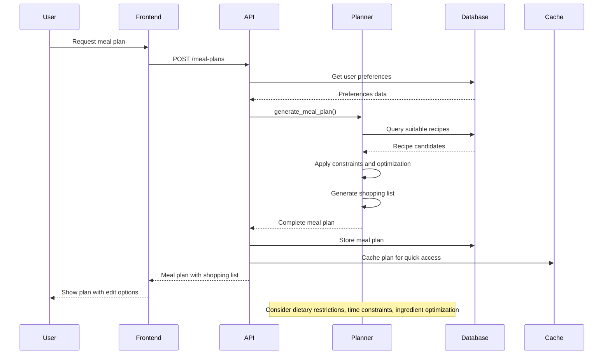
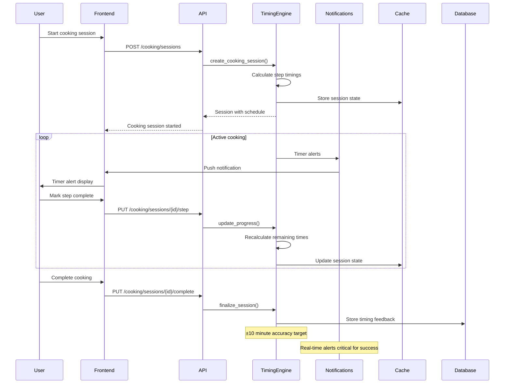

# Core Workflows

## Recipe Import and Processing Workflow

```mermaid
sequenceDiagram
    participant User
    participant Frontend
    participant API
    participant Parser
    participant Database
    participant External

    User->>Frontend: Paste recipe URL
    Frontend->>API: POST /recipes (URL import)
    API->>Parser: parse_recipe_url()
    Parser->>External: Fetch recipe page
    External-->>Parser: HTML content
    
    alt Structured data found
        Parser->>Parser: Extract JSON-LD/microdata
    else Fallback parsing
        Parser->>Parser: HTML content analysis
    end
    
    Parser-->>API: Parsed recipe data
    API->>Database: Store recipe
    Database-->>API: Recipe ID
    API-->>Frontend: Recipe created
    Frontend-->>User: Show recipe details
    
    note over Parser: 90% accuracy target
    note over API: Handle parsing failures gracefully
```

## Meal Planning Generation Workflow

```mermaid
sequenceDiagram
    participant User
    participant Frontend
    participant API
    participant Planner
    participant Database
    participant Cache

    User->>Frontend: Request meal plan
    Frontend->>API: POST /meal-plans
    API->>Database: Get user preferences
    Database-->>API: Preferences data
    
    API->>Planner: generate_meal_plan()
    Planner->>Database: Query suitable recipes
    Database-->>Planner: Recipe candidates
    
    Planner->>Planner: Apply constraints and optimization
    Planner->>Planner: Generate shopping list
    Planner-->>API: Complete meal plan
    
    API->>Database: Store meal plan
    API->>Cache: Cache plan for quick access
    API-->>Frontend: Meal plan with shopping list
    Frontend-->>User: Show plan with edit options
    
    note over Planner: Consider dietary restrictions, time constraints, ingredient optimization
```

## Cook Mode Timing Coordination Workflow

```mermaid
sequenceDiagram
    participant User
    participant Frontend
    participant API
    participant TimingEngine
    participant Notifications
    participant Cache

    User->>Frontend: Start cooking session
    Frontend->>API: POST /cooking/sessions
    API->>TimingEngine: create_cooking_session()
    TimingEngine->>TimingEngine: Calculate step timings
    TimingEngine->>Cache: Store session state
    TimingEngine-->>API: Session with schedule
    API-->>Frontend: Cooking session started
    
    loop Active cooking
        TimingEngine->>Notifications: Timer alerts
        Notifications->>Frontend: Push notification
        Frontend->>User: Timer alert display
        
        User->>Frontend: Mark step complete
        Frontend->>API: PUT /cooking/sessions/{id}/step
        API->>TimingEngine: update_progress()
        TimingEngine->>TimingEngine: Recalculate remaining times
        TimingEngine->>Cache: Update session state
    end
    
    User->>Frontend: Complete cooking
    Frontend->>API: PUT /cooking/sessions/{id}/complete
    API->>TimingEngine: finalize_session()
    TimingEngine->>Database: Store timing feedback
    
    note over TimingEngine: ±10 minute accuracy target
    note over Notifications: Real-time alerts critical for success
```
