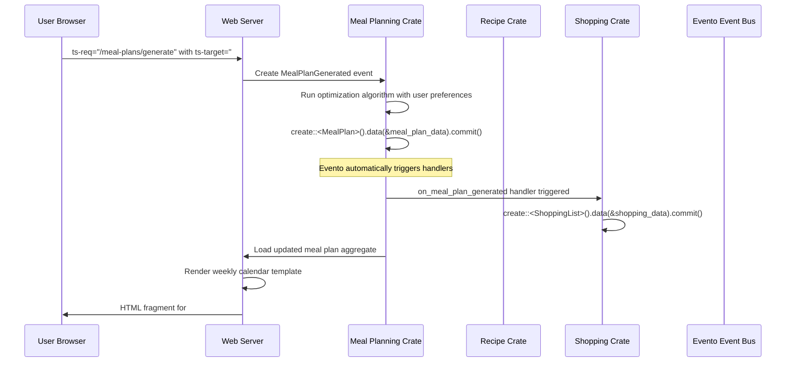
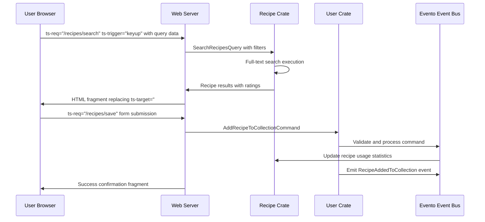

# Core Workflows

## Weekly Meal Plan Generation Workflow

```mermaid
sequenceDiagram
    participant U as User Browser
    participant W as Web Server
    participant MP as Meal Planning Crate
    participant R as Recipe Crate
    participant SL as Shopping Crate
    participant E as Evento Event Bus

    U->>W: ts-req="/meal-plans/generate" with ts-target="#weekly-calendar"
    W->>MP: Create MealPlanGenerated event
    MP->>MP: Run optimization algorithm with user preferences
    MP->>MP: create::<MealPlan>().data(&meal_plan_data).commit()
    Note over MP: Evento automatically triggers handlers
    MP->>SL: on_meal_plan_generated handler triggered
    SL->>SL: create::<ShoppingList>().data(&shopping_data).commit()
    MP->>W: Load updated meal plan aggregate
    W->>W: Render weekly calendar template
    W->>U: HTML fragment for #weekly-calendar
```

## Recipe Discovery and Collection Building

```mermaid
sequenceDiagram
    participant U as User Browser
    participant W as Web Server
    participant R as Recipe Crate
    participant UC as User Crate
    participant E as Evento Event Bus

    U->>W: ts-req="/recipes/search" ts-trigger="keyup" with query data
    W->>R: SearchRecipesQuery with filters
    R->>R: Full-text search execution
    R->>W: Recipe results with ratings
    W->>U: HTML fragment replacing ts-target="#search-results"
    
    U->>W: ts-req="/recipes/save" form submission
    W->>UC: AddRecipeToCollectionCommand
    UC->>E: Validate and process command
    E->>R: Update recipe usage statistics
    UC->>E: Emit RecipeAddedToCollection event
    W->>U: Success confirmation fragment
```
