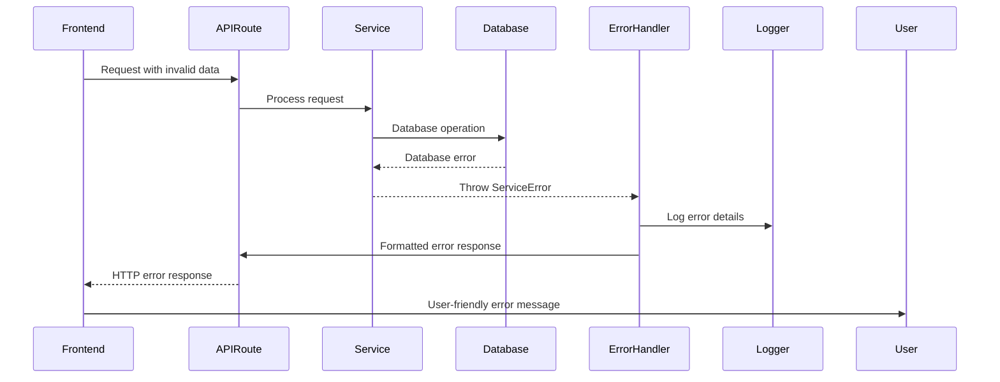

# Error Handling Strategy

## Error Flow



## Error Response Format

```typescript
interface ApiError {
  error: {
    code: string;
    message: string;
    details?: Record<string, any>;
    timestamp: string;
    requestId: string;
  };
}
```

## Frontend Error Handling

```typescript
import { toast } from '@/components/ui/toast';
import { ApiError } from '@/types/api';

export class ErrorHandler {
  static handle(error: unknown, context?: string) {
    console.error(`Error in ${context}:`, error);
    
    if (error instanceof ApiError) {
      return this.handleApiError(error);
    }
    
    if (error instanceof ValidationError) {
      return this.handleValidationError(error);
    }
    
    if (error instanceof NetworkError) {
      return this.handleNetworkError(error);
    }
    
    // Generic error handling
    toast.error('An unexpected error occurred. Please try again.');
    return {
      title: 'Error',
      message: 'An unexpected error occurred',
      type: 'error' as const,
    };
  }
  
  private static handleApiError(error: ApiError) {
    const userMessage = this.getUserFriendlyMessage(error.code);
    toast.error(userMessage);
    
    return {
      title: 'Error',
      message: userMessage,
      type: 'error' as const,
      code: error.code,
    };
  }
  
  private static getUserFriendlyMessage(errorCode: string): string {
    const messages: Record<string, string> = {
      'INVENTORY_ITEM_NOT_FOUND': 'The inventory item you\'re looking for doesn\'t exist.',
      'RECIPE_NOT_FOUND': 'This recipe is no longer available.',
      'MEAL_PLAN_CONFLICT': 'There\'s a conflict with your meal plan. Please check your scheduled meals.',
      'VOICE_COMMAND_NOT_RECOGNIZED': 'I didn\'t understand that command. Please try again.',
      'INSUFFICIENT_INGREDIENTS': 'You don\'t have enough ingredients for this recipe.',
      'HOUSEHOLD_ACCESS_DENIED': 'You don\'t have permission to access this household\'s data.',
      'EXPIRED_SESSION': 'Your session has expired. Please log in again.',
      'RATE_LIMIT_EXCEEDED': 'Too many requests. Please wait a moment and try again.',
    };
    
    return messages[errorCode] || 'Something went wrong. Please try again.';
  }
}

// Usage in components
export const useErrorHandler = () => {
  return (error: unknown, context?: string) => {
    return ErrorHandler.handle(error, context);
  };
};
```

## Backend Error Handling

```typescript
import { NextRequest, NextResponse } from 'next/server';
import { v4 as uuidv4 } from 'uuid';
import { logger } from '@/lib/logger';

export class ServiceError extends Error {
  constructor(
    message: string,
    public code: string,
    public statusCode: number = 500,
    public details?: Record<string, any>
  ) {
    super(message);
    this.name = 'ServiceError';
  }
}

export class ValidationError extends Error {
  constructor(
    message: string,
    public field: string,
    public value?: any
  ) {
    super(message);
    this.name = 'ValidationError';
  }
}

export function withErrorHandler<T>(
  handler: () => Promise<T>
): Promise<T | NextResponse> {
  return handler().catch((error: unknown) => {
    const requestId = uuidv4();
    const timestamp = new Date().toISOString();
    
    logger.error('API Error', {
      requestId,
      timestamp,
      error: error instanceof Error ? error.message : 'Unknown error',
      stack: error instanceof Error ? error.stack : undefined,
    });
    
    if (error instanceof ServiceError) {
      return NextResponse.json({
        error: {
          code: error.code,
          message: error.message,
          details: error.details,
          timestamp,
          requestId,
        },
      }, { status: error.statusCode });
    }
    
    if (error instanceof ValidationError) {
      return NextResponse.json({
        error: {
          code: 'VALIDATION_ERROR',
          message: error.message,
          details: { field: error.field, value: error.value },
          timestamp,
          requestId,
        },
      }, { status: 400 });
    }
    
    // Generic error response
    return NextResponse.json({
      error: {
        code: 'INTERNAL_SERVER_ERROR',
        message: 'An internal server error occurred',
        timestamp,
        requestId,
      },
    }, { status: 500 });
  });
}

// Usage in API routes
export async function POST(request: NextRequest) {
  return withErrorHandler(async () => {
    // Your API logic here
    const data = await request.json();
    
    if (!data.name) {
      throw new ValidationError('Name is required', 'name', data.name);
    }
    
    const result = await SomeService.create(data);
    return NextResponse.json(result);
  });
}
```
