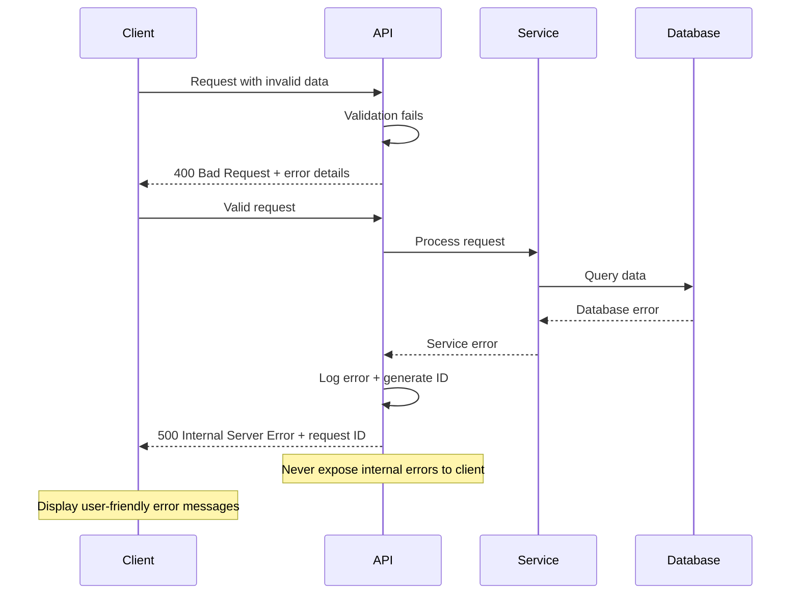

# Error Handling Strategy

## Error Flow



## Error Response Format

```typescript
interface ApiError {
  error: {
    code: string;           // Machine-readable error code
    message: string;        // Human-readable error message
    details?: Record<string, any>; // Additional error context
    timestamp: string;      // ISO timestamp
    requestId: string;      // Unique request identifier for debugging
  };
}
```

## Frontend Error Handling

```typescript
class ApiErrorHandler {
  static handle(error: ApiError): void {
    const { code, message, requestId } = error.error;
    
    switch (code) {
      case 'VALIDATION_ERROR':
        NotificationService.showError('Please check your input and try again.');
        break;
      case 'RECIPE_PARSE_FAILED':
        NotificationService.showError('Unable to parse recipe. Try entering manually.');
        break;
      case 'NETWORK_ERROR':
        NotificationService.showError('Connection issue. Changes saved locally.');
        OfflineQueue.enqueue(error.originalRequest);
        break;
      default:
        NotificationService.showError(`Something went wrong. Reference ID: ${requestId}`);
        console.error('Unhandled API error:', error);
    }
  }
}
```

## Backend Error Handling

```rust
use axum::{response::Response, http::StatusCode};
use serde_json::json;
use uuid::Uuid;

#[derive(Debug)]
pub enum AppError {
    ValidationError(String),
    RecipeParseFailed(String),
    DatabaseError(sqlx::Error),
    Unauthorized,
    NotFound,
}

impl IntoResponse for AppError {
    fn into_response(self) -> Response {
        let request_id = Uuid::new_v4().to_string();
        
        let (status, code, message) = match self {
            AppError::ValidationError(msg) => {
                (StatusCode::BAD_REQUEST, "VALIDATION_ERROR", msg)
            }
            AppError::RecipeParseFailed(msg) => {
                (StatusCode::UNPROCESSABLE_ENTITY, "RECIPE_PARSE_FAILED", msg)
            }
            AppError::DatabaseError(err) => {
                tracing::error!("Database error {}: {:?}", request_id, err);
                (StatusCode::INTERNAL_SERVER_ERROR, "DATABASE_ERROR", 
                 "A database error occurred".to_string())
            }
            AppError::Unauthorized => {
                (StatusCode::UNAUTHORIZED, "UNAUTHORIZED", 
                 "Authentication required".to_string())
            }
            AppError::NotFound => {
                (StatusCode::NOT_FOUND, "NOT_FOUND", 
                 "Resource not found".to_string())
            }
        };

        let body = json!({
            "error": {
                "code": code,
                "message": message,
                "timestamp": chrono::Utc::now().to_rfc3339(),
                "requestId": request_id
            }
        });

        (status, Json(body)).into_response()
    }
}
```
