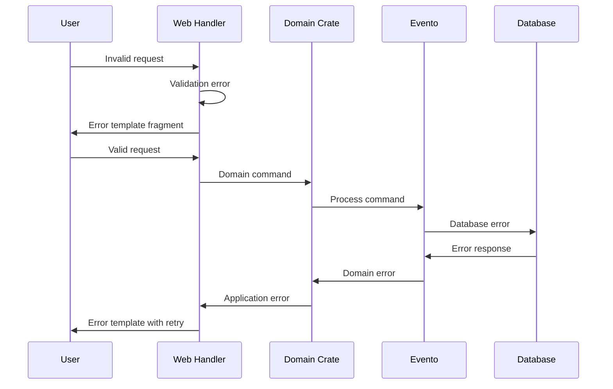

# Error Handling Strategy

## Error Flow


## Error Response Format
```rust
#[derive(Debug, thiserror::Error)]
pub enum AppError {
    #[error("Validation error: {0}")]
    Validation(#[from] validator::ValidationErrors),
    
    #[error("Domain error: {0}")]
    Domain(#[from] DomainError),
    
    #[error("Database error: {0}")]
    Database(#[from] sqlx::Error),
    
    #[error("Template error: {0}")]
    Template(#[from] askama::Error),
}
```

## Frontend Error Handling
```rust
use axum::{response::Html, http::StatusCode};
use crate::templates::errors::ErrorTemplate;

impl IntoResponse for AppError {
    fn into_response(self) -> Response {
        let (status, message) = match self {
            AppError::Validation(errors) => (StatusCode::BAD_REQUEST, format!("Validation: {}", errors)),
            AppError::Domain(error) => (StatusCode::UNPROCESSABLE_ENTITY, error.to_string()),
            AppError::Database(_) => (StatusCode::INTERNAL_SERVER_ERROR, "Database error".to_string()),
            AppError::Template(_) => (StatusCode::INTERNAL_SERVER_ERROR, "Template error".to_string()),
        };
        
        let template = ErrorTemplate { message, status: status.as_u16() };
        (status, Html(template.render().unwrap_or_default())).into_response()
    }
}
```

## Backend Error Handling
```rust
use evento::EventStoreError;
use tracing::error;

pub fn handle_domain_error(error: DomainError) -> AppError {
    match error {
        DomainError::RecipeNotFound(id) => {
            error!("Recipe not found: {}", id);
            AppError::NotFound("Recipe not found".to_string())
        }
        DomainError::InvalidMealPlan(reason) => {
            error!("Invalid meal plan: {}", reason);
            AppError::Validation(reason)
        }
        DomainError::InsufficientRecipes => {
            AppError::BusinessLogic("Need more recipes in collection".to_string())
        }
    }
}
```
