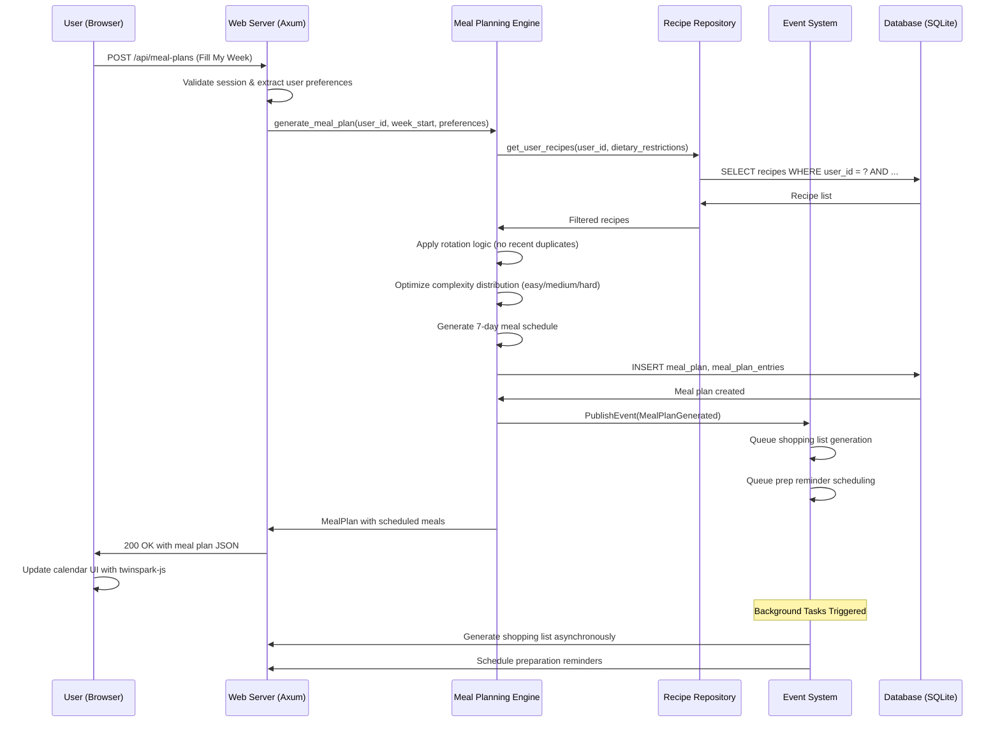
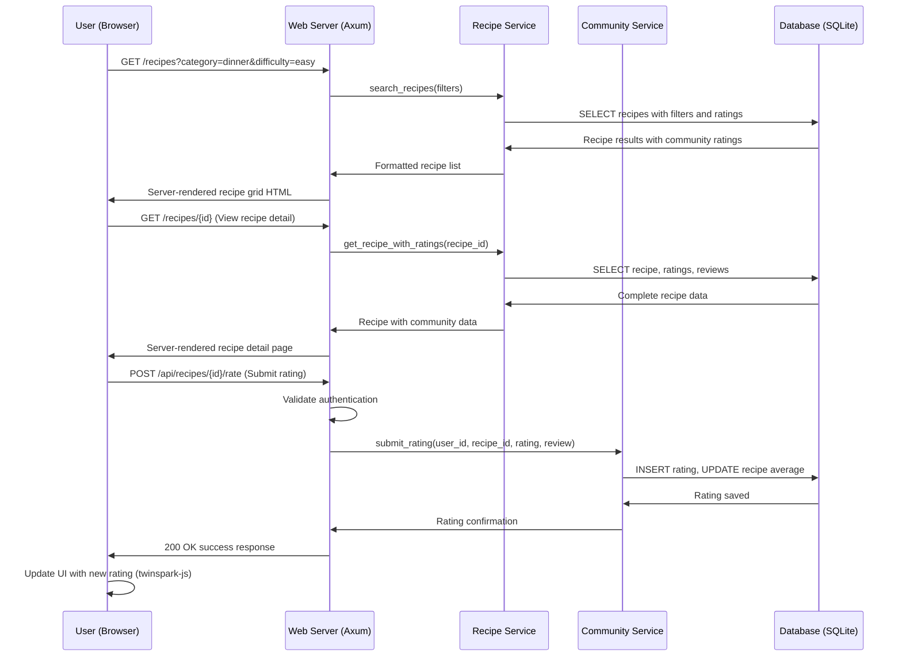
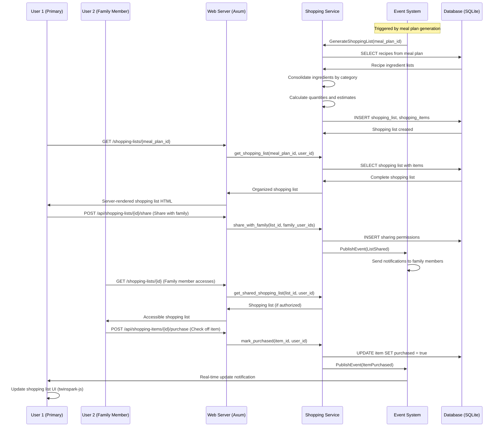
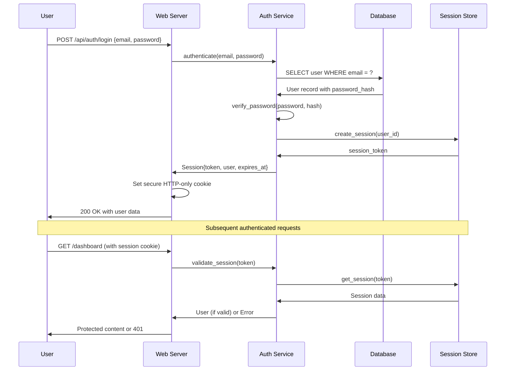

# External APIs

## MVP Implementation
No external APIs are required for MVP implementation. All core functionality (meal planning, recipe management, shopping lists) will be handled internally with fallback mechanisms.

## Future API Integrations

### Grocery Store API Integration
**Purpose:** Real-time pricing, inventory checking, and order fulfillment for shopping lists
**Implementation Pattern:**
```rust
use reqwest::Client;
use serde::{Deserialize, Serialize};
use tokio_retry::{strategy::ExponentialBackoff, Retry};

#[derive(Clone)]
pub struct GroceryApiClient {
    client: Client,
    base_url: String,
    api_key: String,
    circuit_breaker: CircuitBreaker,
}

#[derive(Serialize)]
pub struct PriceCheckRequest {
    pub items: Vec<GroceryItem>,
    pub store_id: String,
    pub zip_code: String,
}

impl GroceryApiClient {
    pub async fn check_prices(&self, request: PriceCheckRequest) -> Result<Vec<ItemPrice>, ApiError> {
        // Circuit breaker pattern
        if self.circuit_breaker.is_open() {
            return Err(ApiError::ServiceUnavailable("Grocery API circuit breaker open".to_string()));
        }

        // Retry with exponential backoff
        let retry_strategy = ExponentialBackoff::from_millis(100).max_delay(Duration::from_secs(5)).take(3);
        
        let result = Retry::spawn(retry_strategy, || async {
            self.client
                .post(&format!("{}/api/v1/prices", self.base_url))
                .header("Authorization", format!("Bearer {}", self.api_key))
                .json(&request)
                .timeout(Duration::from_secs(10))
                .send()
                .await?
                .json::<Vec<ItemPrice>>()
                .await
        }).await;

        match result {
            Ok(prices) => {
                self.circuit_breaker.record_success();
                Ok(prices)
            }
            Err(e) => {
                self.circuit_breaker.record_failure();
                // Fallback to cached pricing
                self.get_cached_prices(&request.items).await
            }
        }
    }

    async fn get_cached_prices(&self, items: &[GroceryItem]) -> Result<Vec<ItemPrice>, ApiError> {
        // Fallback mechanism using cached pricing data
        let cached_prices = self.load_cached_prices().await?;
        Ok(items.iter()
            .filter_map(|item| cached_prices.get(&item.name).cloned())
            .collect())
    }
}
```

**Fallback Strategy:**
- Cached pricing data updated weekly
- Generic price estimates based on item categories
- Manual price entry by users for accuracy

### Email Service Integration  
**Purpose:** Transactional emails for notifications, password resets, shopping list sharing
**Implementation Pattern:**
```rust
#[derive(Clone)]
pub struct EmailService {
    client: Client,
    api_key: String,
    circuit_breaker: CircuitBreaker,
}

impl EmailService {
    pub async fn send_shopping_list(&self, email: &str, shopping_list: &ShoppingList) -> Result<(), EmailError> {
        if self.circuit_breaker.is_open() {
            // Fallback: Queue email for later delivery
            return self.queue_email_for_retry(email, shopping_list).await;
        }

        let email_request = EmailRequest {
            to: vec![email.to_string()],
            subject: format!("Shopping List for {}", shopping_list.week_start_date),
            html_body: self.render_shopping_list_template(shopping_list)?,
            text_body: self.render_shopping_list_text(shopping_list)?,
        };

        // Implement similar retry/circuit breaker pattern as grocery API
        self.send_with_retry(email_request).await
    }
}
```

**Fallback Strategy:**
- Email queue with retry mechanism
- In-app notifications as primary communication
- SMS fallback for critical notifications

### Nutrition Database API
**Purpose:** Detailed nutritional information for recipes and meal planning
**Example Integration:**
```rust
pub struct NutritionService {
    usda_client: UsdaApiClient,
    spoonacular_client: SpoonacularClient,
    cache: NutritionCache,
}

impl NutritionService {
    pub async fn get_nutrition_info(&self, ingredients: &[Ingredient]) -> Result<NutritionInfo, NutritionError> {
        // Primary: USDA FoodData Central API
        match self.usda_client.lookup_ingredients(ingredients).await {
            Ok(nutrition) => Ok(nutrition),
            Err(_) => {
                // Fallback: Spoonacular API
                match self.spoonacular_client.get_nutrition(ingredients).await {
                    Ok(nutrition) => Ok(nutrition),
                    Err(_) => {
                        // Final fallback: Cached/estimated data
                        self.estimate_nutrition(ingredients).await
                    }
                }
            }
        }
    }
}
```

## Circuit Breaker Implementation
```rust
use std::sync::{Arc, RwLock};
use std::time::{Duration, Instant};

#[derive(Clone)]
pub struct CircuitBreaker {
    state: Arc<RwLock<CircuitBreakerState>>,
    failure_threshold: usize,
    timeout: Duration,
    recovery_timeout: Duration,
}

#[derive(Debug)]
enum CircuitBreakerState {
    Closed { failure_count: usize },
    Open { opened_at: Instant },
    HalfOpen,
}

impl CircuitBreaker {
    pub fn new(failure_threshold: usize, timeout: Duration, recovery_timeout: Duration) -> Self {
        Self {
            state: Arc::new(RwLock::new(CircuitBreakerState::Closed { failure_count: 0 })),
            failure_threshold,
            timeout,
            recovery_timeout,
        }
    }

    pub fn is_open(&self) -> bool {
        let state = self.state.read().unwrap();
        match *state {
            CircuitBreakerState::Open { opened_at } => {
                if opened_at.elapsed() > self.recovery_timeout {
                    // Transition to half-open
                    drop(state);
                    *self.state.write().unwrap() = CircuitBreakerState::HalfOpen;
                    false
                } else {
                    true
                }
            }
            CircuitBreakerState::Closed { .. } => false,
            CircuitBreakerState::HalfOpen => false,
        }
    }

    pub fn record_success(&self) {
        let mut state = self.state.write().unwrap();
        *state = CircuitBreakerState::Closed { failure_count: 0 };
    }

    pub fn record_failure(&self) {
        let mut state = self.state.write().unwrap();
        match *state {
            CircuitBreakerState::Closed { failure_count } => {
                let new_count = failure_count + 1;
                if new_count >= self.failure_threshold {
                    *state = CircuitBreakerState::Open { opened_at: Instant::now() };
                } else {
                    *state = CircuitBreakerState::Closed { failure_count: new_count };
                }
            }
            CircuitBreakerState::HalfOpen => {
                *state = CircuitBreakerState::Open { opened_at: Instant::now() };
            }
            _ => {} // Already open
        }
    }
}

# Core Workflows

## Weekly Meal Plan Generation Workflow



## Recipe Discovery and Rating Workflow



## Shopping List Generation and Family Collaboration Workflow



# Database Schema

```sql
-- Users table with authentication and preferences
CREATE TABLE users (
    id TEXT PRIMARY KEY DEFAULT (lower(hex(randomblob(16)))),
    email TEXT UNIQUE NOT NULL,
    password_hash TEXT NOT NULL,
    name TEXT NOT NULL,
    family_size INTEGER DEFAULT 1 CHECK (family_size BETWEEN 1 AND 8),
    dietary_restrictions TEXT DEFAULT '[]', -- JSON array
    cooking_skill_level TEXT DEFAULT 'beginner' CHECK (cooking_skill_level IN ('beginner', 'intermediate', 'advanced')),
    created_at DATETIME DEFAULT CURRENT_TIMESTAMP,
    last_active DATETIME DEFAULT CURRENT_TIMESTAMP
);

-- Recipe storage with community features
CREATE TABLE recipes (
    id TEXT PRIMARY KEY DEFAULT (lower(hex(randomblob(16)))),
    title TEXT NOT NULL,
    description TEXT,
    prep_time INTEGER NOT NULL, -- minutes
    cook_time INTEGER NOT NULL, -- minutes
    difficulty TEXT CHECK (difficulty IN ('easy', 'medium', 'hard')),
    servings INTEGER DEFAULT 4,
    ingredients TEXT NOT NULL, -- JSON array of ingredient objects
    instructions TEXT NOT NULL, -- JSON array of instruction objects
    created_by TEXT NOT NULL REFERENCES users(id) ON DELETE CASCADE,
    is_public BOOLEAN DEFAULT false,
    average_rating REAL DEFAULT 0.0,
    rating_count INTEGER DEFAULT 0,
    image_path TEXT, -- Local file path for recipe image
    created_at DATETIME DEFAULT CURRENT_TIMESTAMP,
    updated_at DATETIME DEFAULT CURRENT_TIMESTAMP
);

-- Recipe ratings and reviews
CREATE TABLE recipe_ratings (
    id TEXT PRIMARY KEY DEFAULT (lower(hex(randomblob(16)))),
    recipe_id TEXT NOT NULL REFERENCES recipes(id) ON DELETE CASCADE,
    user_id TEXT NOT NULL REFERENCES users(id) ON DELETE CASCADE,
    rating INTEGER CHECK (rating BETWEEN 1 AND 5),
    comment TEXT,
    created_at DATETIME DEFAULT CURRENT_TIMESTAMP,
    UNIQUE(recipe_id, user_id) -- One rating per user per recipe
);

-- Weekly meal plans
CREATE TABLE meal_plans (
    id TEXT PRIMARY KEY DEFAULT (lower(hex(randomblob(16)))),
    user_id TEXT NOT NULL REFERENCES users(id) ON DELETE CASCADE,
    week_start_date DATE NOT NULL,
    status TEXT DEFAULT 'active' CHECK (status IN ('draft', 'active', 'completed')),
    generated_at DATETIME DEFAULT CURRENT_TIMESTAMP,
    shopping_list_generated BOOLEAN DEFAULT false
);

-- Individual meals within meal plans
CREATE TABLE meal_plan_entries (
    id TEXT PRIMARY KEY DEFAULT (lower(hex(randomblob(16)))),
    meal_plan_id TEXT NOT NULL REFERENCES meal_plans(id) ON DELETE CASCADE,
    recipe_id TEXT NOT NULL REFERENCES recipes(id) ON DELETE CASCADE,
    day_of_week INTEGER CHECK (day_of_week BETWEEN 0 AND 6), -- 0 = Monday
    meal_type TEXT CHECK (meal_type IN ('breakfast', 'lunch', 'dinner')),
    scheduled_date DATE NOT NULL,
    prep_reminders TEXT DEFAULT '[]', -- JSON array of reminder objects
    completed BOOLEAN DEFAULT false
);

-- Shopping lists generated from meal plans
CREATE TABLE shopping_lists (
    id TEXT PRIMARY KEY DEFAULT (lower(hex(randomblob(16)))),
    meal_plan_id TEXT NOT NULL REFERENCES meal_plans(id) ON DELETE CASCADE,
    generated_at DATETIME DEFAULT CURRENT_TIMESTAMP,
    estimated_total REAL DEFAULT 0.0,
    shared_with TEXT DEFAULT '[]' -- JSON array of user IDs with access
);

-- Individual shopping list items
CREATE TABLE shopping_items (
    id TEXT PRIMARY KEY DEFAULT (lower(hex(randomblob(16)))),
    shopping_list_id TEXT NOT NULL REFERENCES shopping_lists(id) ON DELETE CASCADE,
    name TEXT NOT NULL,
    quantity REAL NOT NULL,
    unit TEXT NOT NULL,
    category TEXT CHECK (category IN ('produce', 'dairy', 'meat', 'pantry', 'frozen')),
    estimated_price REAL DEFAULT 0.0,
    purchased BOOLEAN DEFAULT false,
    purchased_by TEXT REFERENCES users(id), -- Who checked it off
    from_recipes TEXT DEFAULT '[]', -- JSON array of recipe titles using this ingredient
    purchased_at DATETIME
);

-- Recipe collections for user organization
CREATE TABLE recipe_collections (
    id TEXT PRIMARY KEY DEFAULT (lower(hex(randomblob(16)))),
    user_id TEXT NOT NULL REFERENCES users(id) ON DELETE CASCADE,
    name TEXT NOT NULL,
    description TEXT,
    is_public BOOLEAN DEFAULT false,
    created_at DATETIME DEFAULT CURRENT_TIMESTAMP
);

-- Many-to-many relationship between recipes and collections
CREATE TABLE recipe_collection_items (
    collection_id TEXT NOT NULL REFERENCES recipe_collections(id) ON DELETE CASCADE,
    recipe_id TEXT NOT NULL REFERENCES recipes(id) ON DELETE CASCADE,
    added_at DATETIME DEFAULT CURRENT_TIMESTAMP,
    PRIMARY KEY (collection_id, recipe_id)
);

-- User sessions for authentication
CREATE TABLE user_sessions (
    id TEXT PRIMARY KEY DEFAULT (lower(hex(randomblob(16)))),
    user_id TEXT NOT NULL REFERENCES users(id) ON DELETE CASCADE,
    session_token TEXT UNIQUE NOT NULL,
    expires_at DATETIME NOT NULL,
    created_at DATETIME DEFAULT CURRENT_TIMESTAMP
);

-- Indexes for performance optimization
CREATE INDEX idx_users_email ON users(email);
CREATE INDEX idx_recipes_public ON recipes(is_public, average_rating DESC);
CREATE INDEX idx_recipes_creator ON recipes(created_by);
CREATE INDEX idx_recipe_ratings_recipe ON recipe_ratings(recipe_id);
CREATE INDEX idx_meal_plans_user_week ON meal_plans(user_id, week_start_date);
CREATE INDEX idx_meal_plan_entries_plan ON meal_plan_entries(meal_plan_id);
CREATE INDEX idx_shopping_items_list ON shopping_items(shopping_list_id);
CREATE INDEX idx_sessions_token ON user_sessions(session_token);
CREATE INDEX idx_sessions_expires ON user_sessions(expires_at);
```

# Frontend Architecture

## Component Architecture

### Component Organization
```
src/
├── components/
│   ├── common/           # Reusable UI components
│   │   ├── Button.rs
│   │   ├── Modal.rs
│   │   └── LoadingSpinner.rs
│   ├── meal_planning/    # Meal planning specific components
│   │   ├── WeeklyCalendar.rs
│   │   ├── MealCard.rs
│   │   └── FillMyWeekButton.rs
│   ├── recipes/          # Recipe management components
│   │   ├── RecipeGrid.rs
│   │   ├── RecipeCard.rs
│   │   └── RecipeDetail.rs
│   └── shopping/         # Shopping list components
│       ├── ShoppingList.rs
│       ├── ShoppingItem.rs
│       └── ShareButton.rs
├── pages/                # Page-level components
│   ├── Dashboard.rs
│   ├── RecipeDiscovery.rs
│   └── Profile.rs
└── layouts/              # Layout templates
    ├── BaseLayout.rs
    └── AuthenticatedLayout.rs
```

### Component Template
```rust
use askama::Template;
use serde::Serialize;

#[derive(Template, Serialize)]
#[template(path = "components/meal_card.html")]
pub struct MealCard {
    pub recipe_title: String,
    pub prep_time: u32,
    pub difficulty: String,
    pub complexity_color: String,
    pub has_prep_reminder: bool,
}

impl MealCard {
    pub fn new(recipe: &Recipe) -> Self {
        let complexity_color = match recipe.difficulty.as_str() {
            "easy" => "bg-green-500",
            "medium" => "bg-yellow-500",
            "hard" => "bg-red-500",
            _ => "bg-gray-500",
        };

        Self {
            recipe_title: recipe.title.clone(),
            prep_time: recipe.prep_time + recipe.cook_time,
            difficulty: recipe.difficulty.clone(),
            complexity_color: complexity_color.to_string(),
            has_prep_reminder: recipe.prep_time > 30,
        }
    }
}
```

## State Management Architecture

### State Structure
```rust
// Centralized application state using Rust structs
#[derive(Debug, Clone, Serialize)]
pub struct AppState {
    pub current_user: Option<User>,
    pub current_meal_plan: Option<MealPlan>,
    pub shopping_list: Option<ShoppingList>,
    pub recipe_cache: HashMap<String, Recipe>,
    pub ui_state: UiState,
}

#[derive(Debug, Clone, Serialize)]
pub struct UiState {
    pub current_page: String,
    pub loading_states: HashMap<String, bool>,
    pub error_messages: Vec<String>,
    pub notifications: Vec<Notification>,
}

// State management through Axum shared state
pub type SharedState = Arc<RwLock<AppState>>;
```

### State Management Patterns
- Server-side state management through Axum shared state and SQLite persistence
- Client-side enhancement through twinspark-js for UI interactions
- Event-driven updates using Evento for real-time collaboration features
- Session-based user state with secure cookie management
- Optimistic UI updates with server reconciliation for shopping list changes

## Routing Architecture

### Route Organization
```
/                           # Landing page with authentication
/dashboard                  # Weekly meal calendar (main app)
/recipes                    # Recipe discovery and browsing
/recipes/:id                # Individual recipe detail view
/recipes/create             # Create new recipe form
/shopping/:meal_plan_id     # Shopping list for specific meal plan  
/profile                    # User profile and preferences
/auth/login                 # Login form
/auth/register              # Registration form
/auth/logout                # Logout action
/api/*                      # API endpoints (JSON responses)
```

### Protected Route Pattern
```rust
use axum::{
    extract::State,
    response::{Html, Redirect},
    middleware::Next,
    http::Request,
};

pub async fn auth_middleware<B>(
    State(app_state): State<SharedState>,
    mut request: Request<B>,
    next: Next<B>,
) -> Result<Response, StatusCode> {
    // Extract session cookie
    let cookies = request.headers()
        .get("cookie")
        .and_then(|value| value.to_str().ok())
        .unwrap_or("");

    if let Some(session_token) = extract_session_token(cookies) {
        // Validate session in database
        if let Ok(user) = validate_session(&session_token).await {
            request.extensions_mut().insert(user);
            return Ok(next.run(request).await);
        }
    }

    // Redirect to login for HTML requests, 401 for API
    if request.uri().path().starts_with("/api/") {
        Ok(StatusCode::UNAUTHORIZED.into_response())
    } else {
        Ok(Redirect::temporary("/auth/login").into_response())
    }
}
```

## Frontend Services Layer

### API Client Setup
```rust
use reqwest::Client;
use serde::{Deserialize, Serialize};

#[derive(Clone)]
pub struct ApiClient {
    client: Client,
    base_url: String,
}

impl ApiClient {
    pub fn new(base_url: String) -> Self {
        let client = Client::builder()
            .cookie_store(true) // Maintain session cookies
            .build()
            .expect("Failed to create HTTP client");

        Self { client, base_url }
    }

    pub async fn post<T, R>(&self, endpoint: &str, payload: &T) -> Result<R, ApiError>
    where
        T: Serialize,
        R: for<'de> Deserialize<'de>,
    {
        let url = format!("{}{}", self.base_url, endpoint);
        let response = self.client
            .post(&url)
            .json(payload)
            .send()
            .await?;

        if response.status().is_success() {
            Ok(response.json().await?)
        } else {
            Err(ApiError::from_response(response).await)
        }
    }
}
```

### Service Example
```rust
use crate::api::ApiClient;
use crate::models::{MealPlan, MealPlanRequest};

pub struct MealPlanningService {
    api_client: ApiClient,
}

impl MealPlanningService {
    pub fn new(api_client: ApiClient) -> Self {
        Self { api_client }
    }

    pub async fn generate_meal_plan(&self, request: MealPlanRequest) -> Result<MealPlan, ApiError> {
        self.api_client
            .post("/api/meal-plans", &request)
            .await
    }

    pub async fn get_current_meal_plan(&self) -> Result<Option<MealPlan>, ApiError> {
        self.api_client
            .get("/api/meal-plans/current")
            .await
    }

    pub async fn reschedule_meal(&self, meal_id: &str, new_date: &str) -> Result<(), ApiError> {
        let payload = json!({
            "mealId": meal_id,
            "newDate": new_date
        });
        
        self.api_client
            .patch(&format!("/api/meal-plans/reschedule"), &payload)
            .await
    }
}
```

# Backend Architecture

## Service Architecture

### Controller/Route Organization
```
src/
├── handlers/               # Axum route handlers
│   ├── auth.rs            # Authentication endpoints
│   ├── meal_plans.rs      # Meal planning API handlers  
│   ├── recipes.rs         # Recipe CRUD handlers
│   ├── shopping.rs        # Shopping list handlers
│   └── users.rs           # User profile handlers
├── services/              # Business logic services
│   ├── auth_service.rs    # Authentication business logic
│   ├── meal_planning.rs   # Meal planning engine
│   ├── recipe_service.rs  # Recipe management logic
│   ├── shopping_service.rs # Shopping list generation
│   └── community_service.rs # Community features
├── repositories/          # Data access layer
│   ├── user_repository.rs
│   ├── recipe_repository.rs
│   └── meal_plan_repository.rs
└── models/                # Domain models and DTOs
    ├── user.rs
    ├── recipe.rs
    └── meal_plan.rs
```

### Controller Template
```rust
use axum::{
    extract::{Path, Query, State},
    response::Json,
    http::StatusCode,
};
use serde::{Deserialize, Serialize};
use uuid::Uuid;

#[derive(Deserialize)]
pub struct CreateMealPlanRequest {
    pub week_start_date: String,
    pub preferences: MealPlanPreferences,
}

#[derive(Serialize)]
pub struct MealPlanResponse {
    pub id: String,
    pub meals: Vec<MealEntry>,
    pub shopping_list_generated: bool,
}

pub async fn create_meal_plan(
    State(app_state): State<AppState>,
    user: AuthenticatedUser, // From middleware
    Json(request): Json<CreateMealPlanRequest>,
) -> Result<Json<MealPlanResponse>, StatusCode> {
    // Validate request
    let week_start = parse_date(&request.week_start_date)
        .map_err(|_| StatusCode::BAD_REQUEST)?;

    // Call business logic service
    let meal_plan = app_state.meal_planning_service
        .generate_meal_plan(user.id, week_start, request.preferences)
        .await
        .map_err(|e| {
            tracing::error!("Failed to generate meal plan: {}", e);
            StatusCode::INTERNAL_SERVER_ERROR
        })?;

    // Convert to response format
    let response = MealPlanResponse {
        id: meal_plan.id.to_string(),
        meals: meal_plan.meals.into_iter().map(|m| m.into()).collect(),
        shopping_list_generated: meal_plan.shopping_list_generated,
    };

    Ok(Json(response))
}
```

## Database Architecture

### Schema Design
The SQLite schema design emphasizes simplicity and performance for the single-binary deployment model while supporting complex meal planning relationships and community features.

### Data Access Layer
```rust
use sqlx::{sqlite::SqlitePool, Row};
use uuid::Uuid;
use crate::models::{Recipe, User};

#[derive(Clone)]
pub struct RecipeRepository {
    pool: SqlitePool,
}

impl RecipeRepository {
    pub fn new(pool: SqlitePool) -> Self {
        Self { pool }
    }

    pub async fn create_recipe(&self, recipe: &Recipe) -> Result<Recipe, sqlx::Error> {
        let id = Uuid::new_v4().to_string();
        
        sqlx::query!(
            r#"
            INSERT INTO recipes (id, title, description, prep_time, cook_time, 
                               difficulty, servings, ingredients, instructions, created_by)
            VALUES (?, ?, ?, ?, ?, ?, ?, ?, ?, ?)
            "#,
            id,
            recipe.title,
            recipe.description,
            recipe.prep_time,
            recipe.cook_time,
            recipe.difficulty,
            recipe.servings,
            serde_json::to_string(&recipe.ingredients)?,
            serde_json::to_string(&recipe.instructions)?,
            recipe.created_by
        )
        .execute(&self.pool)
        .await?;

        self.get_recipe_by_id(&id).await
    }

    pub async fn search_recipes(&self, filters: RecipeFilters) -> Result<Vec<Recipe>, sqlx::Error> {
        let mut query_builder = sqlx::QueryBuilder::new(
            "SELECT * FROM recipes WHERE is_public = true"
        );

        if let Some(difficulty) = filters.difficulty {
            query_builder.push(" AND difficulty = ");
            query_builder.push_bind(difficulty);
        }

        if let Some(max_prep_time) = filters.max_prep_time {
            query_builder.push(" AND prep_time <= ");
            query_builder.push_bind(max_prep_time);
        }

        query_builder.push(" ORDER BY average_rating DESC LIMIT 50");

        let rows = query_builder
            .build()
            .fetch_all(&self.pool)
            .await?;

        rows.into_iter()
            .map(|row| self.row_to_recipe(row))
            .collect()
    }

    fn row_to_recipe(&self, row: sqlx::sqlite::SqliteRow) -> Result<Recipe, sqlx::Error> {
        Ok(Recipe {
            id: row.get("id"),
            title: row.get("title"),
            description: row.get("description"),
            prep_time: row.get("prep_time"),
            cook_time: row.get("cook_time"),
            difficulty: row.get("difficulty"),
            servings: row.get("servings"),
            ingredients: serde_json::from_str(&row.get::<String, _>("ingredients"))?,
            instructions: serde_json::from_str(&row.get::<String, _>("instructions"))?,
            created_by: row.get("created_by"),
            is_public: row.get("is_public"),
            average_rating: row.get("average_rating"),
            rating_count: row.get("rating_count"),
        })
    }
}
```

## Authentication and Authorization

### Auth Flow


### Middleware/Guards
```rust
use axum::{
    extract::{Request, State},
    middleware::Next,
    response::Response,
    http::{StatusCode, header::COOKIE},
};
use tower_cookies::{Cookie, Cookies};

pub async fn auth_middleware(
    cookies: Cookies,
    State(app_state): State<AppState>,
    mut request: Request,
    next: Next,
) -> Result<Response, StatusCode> {
    // Extract session token from secure cookie
    let session_token = cookies
        .get("session_id")
        .map(|cookie| cookie.value())
        .ok_or(StatusCode::UNAUTHORIZED)?;

    // Validate session
    match app_state.auth_service.validate_session(session_token).await {
        Ok(user) => {
            // Add authenticated user to request extensions
            request.extensions_mut().insert(AuthenticatedUser {
                id: user.id,
                email: user.email,
                name: user.name,
            });
            Ok(next.run(request).await)
        }
        Err(_) => {
            // Clear invalid session cookie
            let mut expired_cookie = Cookie::named("session_id");
            expired_cookie.set_max_age(time::Duration::seconds(-1));
            cookies.add(expired_cookie);
            Err(StatusCode::UNAUTHORIZED)
        }
    }
}

// Axum extractor for authenticated users
#[derive(Clone)]
pub struct AuthenticatedUser {
    pub id: String,
    pub email: String,  
    pub name: String,
}

#[async_trait]
impl<S> FromRequestParts<S> for AuthenticatedUser
where
    S: Send + Sync,
{
    type Rejection = StatusCode;

    async fn from_request_parts(
        parts: &mut Parts,
        _state: &S,
    ) -> Result<Self, Self::Rejection> {
        parts.extensions
            .get::<AuthenticatedUser>()
            .cloned()
            .ok_or(StatusCode::UNAUTHORIZED)
    }
}
```

# Unified Project Structure

```plaintext
imkitchen/
├── .github/                          # CI/CD workflows
│   └── workflows/
│       ├── ci.yml                    # Rust build, test, clippy, fmt
│       └── deploy.yml                # Container build and deployment
├── src/                              # Single Rust binary source
│   ├── main.rs                       # Application entry point
│   ├── lib.rs                        # Library root with modules
│   ├── config/                       # Configuration management  
│   │   ├── mod.rs
│   │   └── settings.rs               # Environment-based config
│   ├── handlers/                     # HTTP route handlers
│   │   ├── mod.rs
│   │   ├── auth.rs                   # Authentication endpoints
│   │   ├── meal_plans.rs             # Meal planning API
│   │   ├── recipes.rs                # Recipe CRUD operations
│   │   ├── shopping.rs               # Shopping list management
│   │   ├── pages.rs                  # Server-rendered page routes
│   │   └── api.rs                    # JSON API route grouping
│   ├── services/                     # Business logic layer
│   │   ├── mod.rs
│   │   ├── auth_service.rs           # Authentication logic
│   │   ├── meal_planning_engine.rs   # Core meal planning algorithms
│   │   ├── recipe_service.rs         # Recipe management business logic
│   │   ├── shopping_service.rs       # Shopping list generation
│   │   ├── community_service.rs      # Social features and moderation
│   │   └── notification_service.rs   # Email and push notifications
│   ├── repositories/                 # Data access layer
│   │   ├── mod.rs
│   │   ├── user_repository.rs        # User data operations
│   │   ├── recipe_repository.rs      # Recipe data operations  
│   │   ├── meal_plan_repository.rs   # Meal plan data operations
│   │   └── shopping_repository.rs    # Shopping list data operations
│   ├── models/                       # Domain models and DTOs
│   │   ├── mod.rs
│   │   ├── user.rs                   # User entity and related types
│   │   ├── recipe.rs                 # Recipe entity and ingredients
│   │   ├── meal_plan.rs              # Meal planning domain objects
│   │   ├── shopping.rs               # Shopping list domain objects
│   │   └── auth.rs                   # Authentication types
│   ├── middleware/                   # HTTP middleware
│   │   ├── mod.rs
│   │   ├── auth.rs                   # Authentication middleware
│   │   ├── logging.rs                # Request/response logging
│   │   ├── cors.rs                   # CORS configuration
│   │   └── rate_limiting.rs          # API rate limiting
│   ├── events/                       # Event-driven architecture
│   │   ├── mod.rs
│   │   ├── meal_plan_events.rs       # Meal planning event handlers
│   │   ├── shopping_events.rs        # Shopping list event handlers
│   │   └── community_events.rs       # Community feature events
│   ├── templates/                    # Askama HTML templates
│   │   ├── layouts/
│   │   │   ├── base.html             # Base HTML layout
│   │   │   └── authenticated.html    # Authenticated user layout
│   │   ├── pages/
│   │   │   ├── dashboard.html        # Weekly meal calendar
│   │   │   ├── recipes.html          # Recipe discovery page
│   │   │   ├── recipe_detail.html    # Individual recipe view
│   │   │   ├── shopping_list.html    # Shopping list interface
│   │   │   ├── profile.html          # User profile settings
│   │   │   ├── login.html            # Authentication form
│   │   │   └── register.html         # User registration form
│   │   ├── components/
│   │   │   ├── meal_card.html        # Individual meal display
│   │   │   ├── recipe_card.html      # Recipe grid item
│   │   │   ├── shopping_item.html    # Shopping list item
│   │   │   ├── rating_stars.html     # Star rating display
│   │   │   └── navigation.html       # Site navigation menu
│   │   └── partials/
│   │       ├── head.html             # HTML head with PWA manifest
│   │       ├── footer.html           # Site footer
│   │       └── scripts.html          # twinspark-js initialization
│   ├── static/                       # Static assets
│   │   ├── css/
│   │   │   └── tailwind.css          # Compiled Tailwind CSS
│   │   ├── js/
│   │   │   ├── twinspark.min.js      # Client-side enhancement library
│   │   │   └── app.js                # Custom JavaScript enhancements
│   │   ├── images/
│   │   │   ├── icons/                # App icons for PWA
│   │   │   └── defaults/             # Default recipe images
│   │   ├── manifest.json             # PWA manifest file
│   │   └── sw.js                     # Service worker for offline functionality
│   └── utils/                        # Utility functions and helpers
│       ├── mod.rs
│       ├── password.rs               # Password hashing utilities
│       ├── validation.rs             # Input validation helpers
│       ├── date_time.rs              # Date/time manipulation
│       └── image_processing.rs       # Recipe image handling
├── migrations/                       # SQLite database migrations
│   ├── 001_initial_schema.sql        # Initial database schema
│   ├── 002_add_recipe_ratings.sql    # Community rating features
│   └── 003_add_shopping_lists.sql    # Shopping list functionality
├── tests/                            # Test suite
│   ├── integration/                  # Integration tests
│   │   ├── auth_tests.rs             # Authentication flow tests
│   │   ├── meal_planning_tests.rs    # Meal planning algorithm tests
│   │   ├── recipe_tests.rs           # Recipe management tests
│   │   └── shopping_tests.rs         # Shopping list tests
│   ├── unit/                         # Unit tests (alongside source files)
│   └── fixtures/                     # Test data and fixtures
│       ├── users.json                # Test user data
│       ├── recipes.json              # Test recipe data
│       └── meal_plans.json           # Test meal plan data
├── scripts/                          # Build and deployment scripts
│   ├── build.sh                      # Production build script
│   ├── dev.sh                        # Development server script
│   ├── migrate.sh                    # Database migration script
│   └── deploy.sh                     # Container deployment script
├── docs/                             # Project documentation
│   ├── prd.md                        # Product Requirements Document
│   ├── front-end-spec.md             # UI/UX Specification
│   ├── architecture.md               # This architecture document
│   ├── api.md                        # API documentation
│   └── deployment.md                 # Deployment instructions
├── docker/                           # Containerization
│   ├── Dockerfile                    # Multi-stage Rust build
│   ├── docker-compose.yml            # Local development setup
│   └── .dockerignore                 # Docker build exclusions
├── .env.example                      # Environment variables template
├── Cargo.toml                        # Rust project configuration and dependencies
├── Cargo.lock                        # Dependency lock file
├── tailwind.config.js                # Tailwind CSS configuration
├── sqlx-data.json                    # SQLx offline query cache (if needed)
└── README.md                         # Project setup and development guide
```

# Development Workflow

## Local Development Setup

### Prerequisites
```bash