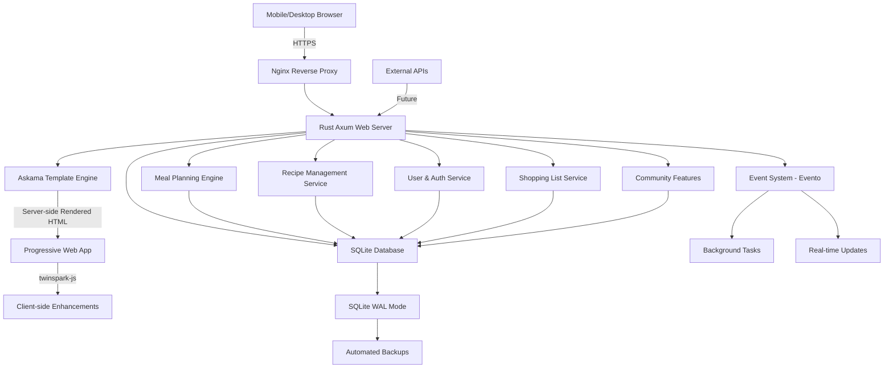

# High Level Architecture

## Technical Summary

imkitchen employs a modern Rust fullstack monolithic architecture deployed as a single binary Progressive Web App (PWA). The system uses Axum 0.8+ as the web framework with server-side rendered HTML via Askama 0.14+ templates, enhanced with twinspark-js for selective client-side reactivity. The backend handles intelligent meal planning optimization, community recipe management, and family collaboration features through event-driven patterns using Evento 1.1+, with all data persisted in an embedded SQLite3 database accessed via SQLx 0.8+. This architecture achieves the PRD goals of sub-3-second meal plan generation, offline functionality, and mobile-first kitchen optimization while maintaining deployment simplicity and cost-effectiveness through the single binary approach.

## Platform and Infrastructure Choice

**Platform:** Self-hosted VPS or cloud container service (AWS ECS, Google Cloud Run, or DigitalOcean App Platform)  
**Key Services:** 
- Container runtime environment for Rust binary
- Reverse proxy/load balancer (nginx or cloud load balancer)  
- Automated SSL certificate management (Let's Encrypt or cloud-managed)
- File storage for recipe images (object storage or local filesystem with backup)
- Optional CDN for static assets (CloudFlare or cloud CDN)

**Deployment Host and Regions:** Single region deployment initially (US-East or EU-Central based on user base), with horizontal scaling through container replication

## Repository Structure

**Structure:** Single Rust workspace monorepo with separate crates for modularity  
**Monorepo Tool:** Cargo workspaces (native Rust solution)  
**Package Organization:** Functional separation through Rust crates while maintaining single binary output

## High Level Architecture Diagram

## Architectural Patterns

- **Server-Side First Architecture:** HTML rendered by Rust backend with progressive enhancement - _Rationale:_ Ensures fast initial page loads, SEO compatibility, and offline functionality while maintaining interactivity
- **Event-Driven Internal Architecture:** Evento for decoupled service communication - _Rationale:_ Enables complex meal planning workflows and real-time family collaboration features
- **Repository Pattern:** Abstract database access through traits - _Rationale:_ Testability and potential future database migration flexibility
- **Progressive Web App (PWA):** Service worker with offline capability - _Rationale:_ Kitchen environment requires offline recipe access and reliable functionality
- **Domain-Driven Design:** Business logic organized by domains (recipes, meal planning, users) - _Rationale:_ Clear separation of concerns for maintainable AI-driven development
