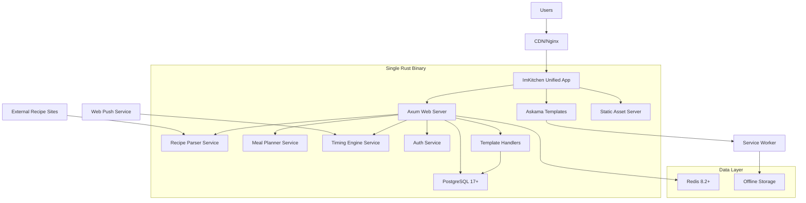

# High Level Architecture

## Technical Summary

ImKitchen employs a monolithic Rust backend with axum 0.8+ web framework, PostgreSQL 17+ for structured data, and Redis 8.2+ for caching and session management. The frontend utilizes Askama 0.14+ templating with twinspark-js for reactive UI components, minimizing JavaScript complexity while maintaining rich interactivity. The architecture emphasizes offline-first capabilities through service workers, real-time timing coordination via WebSockets, and recipe parsing accuracy through natural language processing. The system is containerized with Docker for consistent deployment and designed to scale horizontally to support 10,000 daily active users while maintaining sub-2-second response times.

## Platform and Infrastructure Choice

**Platform:** Self-hosted with Docker containerization and cloud deployment flexibility

**Key Services:** 
- Application: Docker containers with Rust backend + Askama frontend
- Database: PostgreSQL 17+ with Redis 8.2+ caching layer  
- Storage: Local filesystem with optional cloud storage for recipe images
- Monitoring: Prometheus + Grafana for metrics, structured logging with tracing
- Load Balancing: Nginx reverse proxy with SSL termination

**Deployment Host and Regions:** Initially single-region deployment (US-East) with CDN for global asset distribution, designed for multi-region expansion

## Repository Structure

**Structure:** Monorepo with workspace-based organization supporting shared types and utilities

**Monorepo Tool:** Rust workspace with Cargo, npm for frontend asset tooling only

**Package Organization:** 
- `src/` - Unified Rust application with axum server, templates, and handlers
- `static/` - Static assets (CSS, JS, images) served by axum
- `templates/` - Askama templates embedded in the binary
- `shared/` - Shared types and utilities within the workspace
- `infrastructure/` - Docker and deployment configurations

## High Level Architecture Diagram

## Architectural Patterns

- **Monolithic Architecture:** Single deployable unit with clear internal service boundaries - _Rationale:_ Simplifies deployment and development for single developer while maintaining clear separation of concerns
- **Server-Side Rendering (SSR):** Askama templates rendered server-side with progressive enhancement - _Rationale:_ Optimal performance and SEO while supporting offline functionality through service workers
- **Repository Pattern:** Abstract data access with trait-based interfaces - _Rationale:_ Enables testing, database flexibility, and clean business logic separation
- **Service Layer Pattern:** Domain services for recipe parsing, meal planning, and timing calculations - _Rationale:_ Encapsulates complex business logic and enables unit testing
- **Command Query Responsibility Segregation (CQRS):** Separate read/write paths for complex operations - _Rationale:_ Optimizes performance for recipe queries vs meal plan modifications
- **Event-Driven Architecture:** Internal events for timing notifications and cooking state changes - _Rationale:_ Supports real-time features and future extensibility
