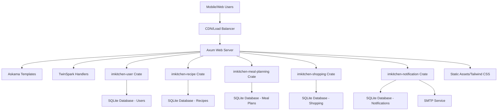

# High Level Architecture

## Technical Summary

IMKitchen employs a **Rust-based modular monolithic architecture** with bounded context crates, deployed as a single CLI binary. The **Axum web server** serves **Askama-rendered HTML templates** with **TwinSpark declarative interactivity**, eliminating traditional API complexity. **Domain-Driven CRUD** with **SQLx** provides robust state management across **SQLite databases** per bounded context. The **Progressive Web App (PWA)** delivers kitchen-optimized mobile experiences with **Tailwind CSS styling** and **offline functionality**. This architecture achieves the PRD goals of intelligent meal planning automation while maintaining type safety, performance, and developer productivity through Rust's ecosystem.

## Platform and Infrastructure Choice

**Platform:** Containerized deployment with Docker + Kubernetes orchestration  
**Key Services:** Single Rust binary, SQLite databases per bounded context, SMTP service integration, static asset serving  
**Deployment Host and Regions:** Multi-cloud capable (AWS/GCP/Azure) with primary deployment in US-East for performance

## Repository Structure

**Structure:** Cargo workspace monorepo with bounded context crates  
**Monorepo Tool:** Cargo workspaces (native Rust tooling)  
**Package Organization:** Domain-driven crate separation with shared libraries and clear dependency boundaries

## High Level Architecture Diagram

## Architectural Patterns

- **Domain-Driven Design (DDD):** Bounded contexts as separate crates with ubiquitous language - _Rationale:_ Clear business domain separation and independent evolution of meal planning, recipe management, and user management concerns
- **CRUD with Domain Validation:** Direct database operations with domain model validation - _Rationale:_ Simplified development workflow, faster feature delivery, and reduced complexity while maintaining data integrity
- **Server-Side Rendering (SSR):** Askama templates with progressive enhancement - _Rationale:_ Optimal mobile performance, SEO benefits, and reduced client-side complexity for kitchen environments
- **Progressive Web App (PWA):** Installable with offline capabilities - _Rationale:_ Native app experience for kitchen usage with unreliable connectivity
- **Modular Monolith:** Single binary with crate boundaries - _Rationale:_ Type safety across boundaries, simplified deployment, while maintaining domain separation
