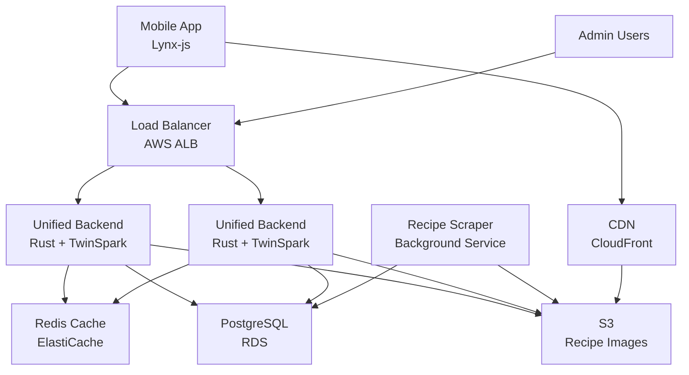

# High Level Architecture

## Technical Summary

imkitchen employs a **traditional server architecture** with a unified Rust backend combining API services and TwinSpark admin interface. The system centers around a high-performance meal planning engine delivering sub-2-second automated weekly meal generation through PostgreSQL recipe storage and Redis caching optimization. Frontend integration emphasizes mobile-first responsive design (320px-1440px+ breakpoints) with kitchen-optimized UX including voice commands, offline shopping capability, and hands-free cooking mode. Infrastructure deployment targets containerized services with horizontal scaling to support community features and recipe sharing.

## Platform and Infrastructure Choice

Based on PRD requirements, unified backend approach, and performance demands:

**Recommendation: AWS Container Stack** for reliable performance, mature services ecosystem, and simplified operations without serverless cold start concerns.

**Platform:** AWS  
**Key Services:** ECS Fargate (unified Rust backend), RDS PostgreSQL, ElastiCache Redis, ALB (load balancer), S3 (recipe images), CloudFront CDN  
**Deployment Host and Regions:** us-east-1 (primary), us-west-2 (failover)

## Repository Structure

**Structure:** Monorepo with unified backend service  
**Monorepo Tool:** Cargo workspaces (native Rust) with npm workspaces for frontend  
**Package Organization:**
- `apps/mobile` (Lynx-js cross-platform)
- `services/backend` (unified Rust API + TwinSpark admin)
- `services/recipe-scraper` (background job service)
- `shared/types` (TypeScript/Rust type definitions)
- `shared/ui` (mobile component library)

## High Level Architecture Diagram

## Architectural Patterns

- **Monolithic Service Architecture:** Single Rust service combining API and admin interface - *Rationale:* Simplifies deployment, reduces network latency, and enables tight integration between admin functions and core business logic
- **Mobile-First Progressive Web App:** Lynx-js framework with offline-first data sync - *Rationale:* Cross-platform development efficiency with native performance for kitchen environments
- **Command Query Responsibility Segregation (CQRS):** Separate read/write models for recipe management and meal planning - *Rationale:* Optimizes complex meal generation queries while maintaining simple recipe CRUD operations
- **Repository Pattern:** Abstract data access across PostgreSQL and Redis layers - *Rationale:* Enables testing and future database optimization without business logic changes
- **Background Job Processing:** Separate service for recipe scraping and heavy operations - *Rationale:* Prevents blocking main API while handling external service dependencies
- **Layered Architecture:** Clear separation between web layer (API/admin), business logic, and data access - *Rationale:* Maintainable code organization with testable business rules