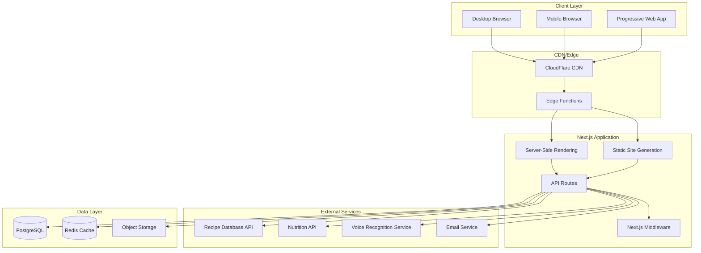

# High Level Architecture

## Technical Summary

imkitchen utilizes a modern Next.js 14+ fullstack architecture with App Router, combining server-side rendering, static generation, and API routes in a unified TypeScript codebase. The platform leverages PostgreSQL with Prisma ORM for type-safe database operations, implements comprehensive internationalization via next-intl, and provides progressive web app capabilities with offline cooking mode functionality. The architecture prioritizes vendor independence through Docker containerization and abstraction layers, while maintaining kitchen-optimized performance with voice interaction support and mobile-first responsive design.

## Platform and Infrastructure Choice

**Platform:** Multi-cloud compatible with Docker deployment
**Key Services:** 
- **Compute:** Docker containers (supports AWS ECS, GCP Cloud Run, Azure Container Instances, DigitalOcean App Platform)
- **Database:** PostgreSQL (supports AWS RDS, GCP Cloud SQL, Azure Database, managed providers)
- **Storage:** S3-compatible object storage with abstraction layer
- **CDN:** CloudFlare or equivalent for global content delivery
- **Email:** SMTP abstraction supporting multiple providers (SendGrid, AWS SES, etc.)

**Deployment Host and Regions:** Global deployment capability with regional data compliance (US, EU, Asia-Pacific)

## Repository Structure

**Structure:** Monorepo with integrated Next.js fullstack application
**Monorepo Tool:** Native Next.js App Router with organized folder structure
**Package Organization:** Feature-based organization with shared utilities, types, and components

## High Level Architecture Diagram

## Architectural Patterns

- **Jamstack with Dynamic APIs:** Static generation for public content with server-side APIs for dynamic functionality - _Rationale:_ Optimal performance for recipe discovery while supporting real-time inventory management
- **Component-Based UI with Server Components:** React Server Components with client-side hydration for interactive features - _Rationale:_ Reduced bundle size and improved performance for kitchen-optimized mobile experience
- **Repository Pattern with Prisma:** Abstract data access through service layer with type-safe ORM - _Rationale:_ Enables testing, caching strategies, and future database migration flexibility
- **API-First Design:** RESTful API routes with OpenAPI documentation and type-safe client generation - _Rationale:_ Supports future mobile app development and third-party integrations
- **Progressive Enhancement:** Core functionality works without JavaScript, enhanced with interactive features - _Rationale:_ Ensures cooking mode reliability in various network conditions
- **Multi-Tenant Architecture:** Household-based data isolation with shared recipe content - _Rationale:_ Supports family coordination while maintaining data privacy and enabling recipe community features
