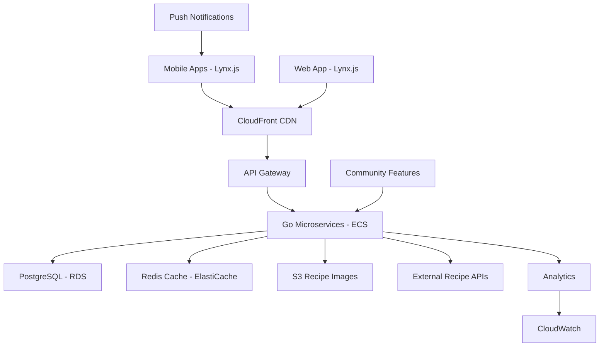

# High Level Architecture

## Technical Summary

**imkitchen** implements a modern hybrid architecture combining mobile-first cross-platform development with high-performance backend services. The Lynx.js frontend delivers native mobile experiences on iOS/Android plus responsive web, while Go-based microservices handle performance-critical meal planning algorithms and recipe management. PostgreSQL provides robust relational data storage with Redis caching to achieve the 2-second "Fill My Week" generation requirement. The system deploys as a cloud-native architecture supporting horizontal scaling for community features, with clear API boundaries enabling independent frontend/backend development and deployment.

## Platform and Infrastructure Choice

Based on the PRD's mobile-first requirements, performance targets, and scalability needs, I present three viable platform options:

**Option 1: AWS Full Stack** (Recommended)
- **Pros:** Mature ecosystem, excellent Go Lambda support, PostgreSQL RDS, Redis ElastiCache, comprehensive mobile app deployment
- **Cons:** Higher complexity, potential vendor lock-in, learning curve for team
- **Key Services:** ECS/Lambda, RDS PostgreSQL, ElastiCache Redis, API Gateway, CloudFront CDN

**Option 2: Vercel + Supabase**
- **Pros:** Rapid development, excellent DX, built-in auth, real-time features
- **Cons:** Limited Go support, newer platform, potential scaling limitations
- **Key Services:** Vercel hosting, Supabase PostgreSQL, built-in auth/storage

**Option 3: Google Cloud Platform**
- **Pros:** Strong mobile analytics, excellent Go support, competitive pricing
- **Cons:** Smaller ecosystem than AWS, less Lynx.js community examples
- **Key Services:** Cloud Run, Cloud SQL, Memorystore Redis, Cloud CDN

**Recommendation:** AWS Full Stack for production-grade requirements, mature Go ecosystem, and comprehensive mobile app deployment support.

**Platform:** AWS  
**Key Services:** ECS (Go services), RDS PostgreSQL, ElastiCache Redis, API Gateway, CloudFront, S3 (recipe images)  
**Deployment Host and Regions:** us-east-1 (primary), us-west-2 (failover), eu-west-1 (international expansion)

## Repository Structure

**Structure:** Monorepo with clear package boundaries for mobile, API, and shared components  
**Monorepo Tool:** Nx for comprehensive build orchestration, dependency management, and cross-platform code sharing  
**Package Organization:** Apps (mobile, web, api), packages (shared-types, ui-components, recipe-utils), tools (build-scripts, deployment-configs)

## High Level Architecture Diagram

## Architectural Patterns

- **Microservices Architecture:** Separate services for meal planning, recipe management, user management, and community features - _Rationale:_ Enables independent scaling of performance-critical meal planning algorithms while maintaining development velocity

- **API Gateway Pattern:** Single entry point with authentication, rate limiting, and routing to appropriate microservices - _Rationale:_ Centralizes cross-cutting concerns and provides clean abstraction for mobile clients

- **Repository Pattern:** Abstract data access layer with interface-driven design - _Rationale:_ Enables comprehensive testing and future database optimization without business logic changes

- **CQRS (Command Query Responsibility Segregation):** Separate read/write models for recipe data and meal planning - _Rationale:_ Optimizes read performance for recipe browsing while maintaining write consistency for meal plan generation

- **Event-Driven Architecture:** Asynchronous processing for meal plan generation and community notifications - _Rationale:_ Supports sub-2-second response times by offloading heavy computations

- **Component-Based Frontend:** Lynx.js components with shared design system across mobile and web - _Rationale:_ Maximizes code reuse while maintaining platform-specific optimizations
