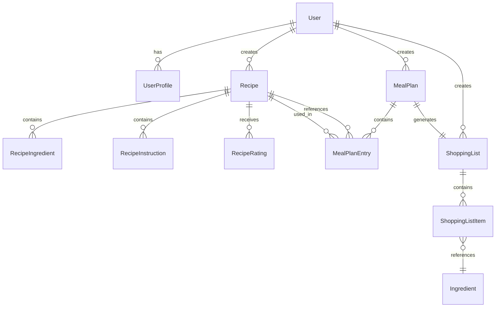

# Database Documentation

IMKitchen uses SQLite with SQLx for type-safe database operations and event sourcing patterns. This documentation covers the database schema, design decisions, and development procedures.

## Table of Contents

- [Overview](#overview)
- [Schema Design](#schema-design)
- [Entity Relationships](#entity-relationships)
- [Bounded Context Schemas](#bounded-context-schemas)
- [Event Sourcing Patterns](#event-sourcing-patterns)
- [Migration Procedures](#migration-procedures)
- [Connection and Pooling](#connection-and-pooling)
- [Development Workflows](#development-workflows)
- [Performance Considerations](#performance-considerations)

## Overview

### Database Technology Stack

| Component | Technology | Version | Purpose |
|-----------|------------|---------|---------|
| **Database** | SQLite | 3.40+ | Embedded ACID-compliant database |
| **ORM** | SQLx | 0.8+ | Type-safe database operations |
| **Migrations** | SQLx CLI | 0.8+ | Schema version management |
| **Connection Pooling** | SQLx Pool | Built-in | Connection lifecycle management |

### Design Principles

- **Type Safety**: All database operations are compile-time checked
- **Event Sourcing**: Domain events stored immutably with projections
- **Bounded Contexts**: Clear separation between domain schemas
- **ACID Compliance**: Full transaction support for data integrity
- **Performance**: Optimized indexes and query patterns

## Schema Design

### Database File Structure

```
imkitchen.db                  # Main SQLite database file
├── User Context Tables       # User management and authentication
├── Recipe Context Tables     # Recipe storage and management
├── Meal Planning Tables      # Meal planning and nutrition
├── Shopping Context Tables   # Shopping lists and ingredients
├── Notification Tables       # Email and notification logs
└── Event Store Tables        # Domain events and projections
```

### Design Decisions

#### 1. SQLite Choice
- **Embedded**: No separate database server required
- **ACID Compliance**: Full transaction support
- **Type Safety**: Excellent Rust integration with SQLx
- **Simplicity**: Single file deployment
- **Performance**: Fast for read-heavy workloads

#### 2. Event Sourcing Architecture
- **Immutable Events**: All domain changes stored as events
- **Projections**: Read-optimized views built from events
- **Audit Trail**: Complete history of all changes
- **Replay Capability**: Ability to rebuild state from events

#### 3. Bounded Context Separation
- **User Context**: Authentication, profiles, preferences
- **Recipe Context**: Recipe storage, ratings, collections
- **Meal Planning**: Weekly plans, nutritional analysis
- **Shopping Context**: Lists, ingredients, store integration
- **Notification Context**: Email logs, preferences

## Entity Relationships

### High-Level Entity Relationship Diagram



### Core Entity Definitions

#### User Management Entities
```sql
-- Users table (authentication)
CREATE TABLE users (
    id TEXT PRIMARY KEY,           -- UUID
    email TEXT UNIQUE NOT NULL,    -- User email (unique)
    password_hash TEXT NOT NULL,   -- Bcrypt hashed password
    created_at TIMESTAMP NOT NULL, -- Account creation time
    updated_at TIMESTAMP NOT NULL, -- Last modification time
    is_verified BOOLEAN DEFAULT false, -- Email verification status
    is_active BOOLEAN DEFAULT true     -- Account active status
);

-- User profiles (preferences and settings)
CREATE TABLE user_profiles (
    user_id TEXT PRIMARY KEY,     -- Foreign key to users.id
    display_name TEXT,            -- User display name
    family_size INTEGER DEFAULT 1, -- Household size (1-8)
    dietary_restrictions TEXT,     -- JSON array of restrictions
    skill_level TEXT DEFAULT 'beginner', -- cooking skill level
    preferred_cuisines TEXT,       -- JSON array of cuisine preferences
    created_at TIMESTAMP NOT NULL,
    updated_at TIMESTAMP NOT NULL,
    FOREIGN KEY (user_id) REFERENCES users(id) ON DELETE CASCADE
);
```

#### Recipe Management Entities
```sql
-- Recipes table
CREATE TABLE recipes (
    id TEXT PRIMARY KEY,           -- UUID
    user_id TEXT NOT NULL,         -- Recipe creator
    title TEXT NOT NULL,           -- Recipe title
    description TEXT,              -- Recipe description
    prep_time_minutes INTEGER,     -- Preparation time
    cook_time_minutes INTEGER,     -- Cooking time
    servings INTEGER DEFAULT 4,    -- Number of servings
    difficulty TEXT DEFAULT 'medium', -- easy, medium, hard
    cuisine_type TEXT,             -- Cuisine category
    image_url TEXT,                -- Recipe image path
    created_at TIMESTAMP NOT NULL,
    updated_at TIMESTAMP NOT NULL,
    FOREIGN KEY (user_id) REFERENCES users(id) ON DELETE CASCADE
);

-- Recipe ingredients
CREATE TABLE recipe_ingredients (
    id TEXT PRIMARY KEY,           -- UUID
    recipe_id TEXT NOT NULL,       -- Parent recipe
    ingredient_name TEXT NOT NULL, -- Ingredient name
    quantity REAL NOT NULL,        -- Amount needed
    unit TEXT NOT NULL,            -- Measurement unit
    preparation TEXT,              -- Preparation notes (e.g., "diced")
    order_index INTEGER NOT NULL,  -- Display order
    FOREIGN KEY (recipe_id) REFERENCES recipes(id) ON DELETE CASCADE
);

-- Recipe instructions
CREATE TABLE recipe_instructions (
    id TEXT PRIMARY KEY,           -- UUID
    recipe_id TEXT NOT NULL,       -- Parent recipe
    step_number INTEGER NOT NULL,  -- Step order
    instruction TEXT NOT NULL,     -- Step instructions
    duration_minutes INTEGER,      -- Time for this step
    FOREIGN KEY (recipe_id) REFERENCES recipes(id) ON DELETE CASCADE
);
```

#### Meal Planning Entities
```sql
-- Meal plans (weekly planning)
CREATE TABLE meal_plans (
    id TEXT PRIMARY KEY,           -- UUID
    user_id TEXT NOT NULL,         -- Plan owner
    week_start_date DATE NOT NULL, -- Monday of the week
    title TEXT,                    -- Plan title
    is_active BOOLEAN DEFAULT true, -- Currently active plan
    created_at TIMESTAMP NOT NULL,
    updated_at TIMESTAMP NOT NULL,
    FOREIGN KEY (user_id) REFERENCES users(id) ON DELETE CASCADE
);

-- Individual meal entries
CREATE TABLE meal_plan_entries (
    id TEXT PRIMARY KEY,           -- UUID
    meal_plan_id TEXT NOT NULL,    -- Parent meal plan
    recipe_id TEXT,                -- Associated recipe
    day_of_week INTEGER NOT NULL,  -- 0=Monday, 6=Sunday
    meal_type TEXT NOT NULL,       -- breakfast, lunch, dinner, snack
    planned_date DATE NOT NULL,    -- Specific date
    servings INTEGER DEFAULT 4,    -- Number of servings
    notes TEXT,                    -- Additional notes
    FOREIGN KEY (meal_plan_id) REFERENCES meal_plans(id) ON DELETE CASCADE,
    FOREIGN KEY (recipe_id) REFERENCES recipes(id) ON DELETE SET NULL
);
```

#### Shopping List Entities
```sql
-- Shopping lists
CREATE TABLE shopping_lists (
    id TEXT PRIMARY KEY,           -- UUID
    user_id TEXT NOT NULL,         -- List owner
    meal_plan_id TEXT,             -- Associated meal plan
    title TEXT NOT NULL,           -- List title
    store_name TEXT,               -- Target store
    is_completed BOOLEAN DEFAULT false, -- Shopping completed
    created_at TIMESTAMP NOT NULL,
    updated_at TIMESTAMP NOT NULL,
    FOREIGN KEY (user_id) REFERENCES users(id) ON DELETE CASCADE,
    FOREIGN KEY (meal_plan_id) REFERENCES meal_plans(id) ON DELETE SET NULL
);

-- Shopping list items
CREATE TABLE shopping_list_items (
    id TEXT PRIMARY KEY,           -- UUID
    shopping_list_id TEXT NOT NULL, -- Parent shopping list
    ingredient_name TEXT NOT NULL, -- Item name
    quantity REAL NOT NULL,        -- Amount needed
    unit TEXT NOT NULL,            -- Measurement unit
    category TEXT,                 -- Store section/category
    is_purchased BOOLEAN DEFAULT false, -- Item purchased
    estimated_price REAL,          -- Estimated cost
    actual_price REAL,             -- Actual cost
    notes TEXT,                    -- Additional notes
    FOREIGN KEY (shopping_list_id) REFERENCES shopping_lists(id) ON DELETE CASCADE
);
```

## Bounded Context Schemas

### User Context Schema
**Location**: `crates/imkitchen-user/migrations/`

```sql
-- 001_create_users.sql
CREATE TABLE users (
    id TEXT PRIMARY KEY,
    email TEXT UNIQUE NOT NULL,
    password_hash TEXT NOT NULL,
    created_at TIMESTAMP NOT NULL DEFAULT CURRENT_TIMESTAMP,
    updated_at TIMESTAMP NOT NULL DEFAULT CURRENT_TIMESTAMP,
    is_verified BOOLEAN DEFAULT false,
    is_active BOOLEAN DEFAULT true
);

CREATE INDEX idx_users_email ON users(email);
CREATE INDEX idx_users_created_at ON users(created_at);

-- 002_create_user_profiles.sql
CREATE TABLE user_profiles (
    user_id TEXT PRIMARY KEY,
    display_name TEXT,
    family_size INTEGER DEFAULT 1 CHECK (family_size >= 1 AND family_size <= 8),
    dietary_restrictions TEXT, -- JSON array
    skill_level TEXT DEFAULT 'beginner' CHECK (skill_level IN ('beginner', 'intermediate', 'advanced')),
    preferred_cuisines TEXT,   -- JSON array
    created_at TIMESTAMP NOT NULL DEFAULT CURRENT_TIMESTAMP,
    updated_at TIMESTAMP NOT NULL DEFAULT CURRENT_TIMESTAMP,
    FOREIGN KEY (user_id) REFERENCES users(id) ON DELETE CASCADE
);

-- 003_create_user_sessions.sql
CREATE TABLE user_sessions (
    id TEXT PRIMARY KEY,
    user_id TEXT NOT NULL,
    session_token TEXT UNIQUE NOT NULL,
    expires_at TIMESTAMP NOT NULL,
    created_at TIMESTAMP NOT NULL DEFAULT CURRENT_TIMESTAMP,
    FOREIGN KEY (user_id) REFERENCES users(id) ON DELETE CASCADE
);

CREATE INDEX idx_sessions_token ON user_sessions(session_token);
CREATE INDEX idx_sessions_expires ON user_sessions(expires_at);
```

### Recipe Context Schema
**Location**: `crates/imkitchen-recipe/migrations/`

```sql
-- 001_create_recipes.sql
CREATE TABLE recipes (
    id TEXT PRIMARY KEY,
    user_id TEXT NOT NULL,
    title TEXT NOT NULL,
    description TEXT,
    prep_time_minutes INTEGER CHECK (prep_time_minutes >= 0),
    cook_time_minutes INTEGER CHECK (cook_time_minutes >= 0),
    servings INTEGER DEFAULT 4 CHECK (servings > 0),
    difficulty TEXT DEFAULT 'medium' CHECK (difficulty IN ('easy', 'medium', 'hard')),
    cuisine_type TEXT,
    image_url TEXT,
    is_public BOOLEAN DEFAULT false,
    created_at TIMESTAMP NOT NULL DEFAULT CURRENT_TIMESTAMP,
    updated_at TIMESTAMP NOT NULL DEFAULT CURRENT_TIMESTAMP
);

CREATE INDEX idx_recipes_user_id ON recipes(user_id);
CREATE INDEX idx_recipes_cuisine ON recipes(cuisine_type);
CREATE INDEX idx_recipes_difficulty ON recipes(difficulty);
CREATE INDEX idx_recipes_public ON recipes(is_public);
```

### Event Store Schema
**Location**: `crates/imkitchen-shared/migrations/`

```sql
-- 001_create_event_store.sql
CREATE TABLE event_store (
    id TEXT PRIMARY KEY,           -- Event UUID
    aggregate_id TEXT NOT NULL,    -- Aggregate root ID
    aggregate_type TEXT NOT NULL,  -- Aggregate type name
    event_type TEXT NOT NULL,      -- Event type name
    event_data TEXT NOT NULL,      -- JSON event payload
    event_version INTEGER NOT NULL, -- Event schema version
    sequence_number INTEGER NOT NULL, -- Order within aggregate
    occurred_at TIMESTAMP NOT NULL DEFAULT CURRENT_TIMESTAMP,
    correlation_id TEXT,           -- Request correlation ID
    causation_id TEXT              -- Causing event ID
);

CREATE UNIQUE INDEX idx_event_store_aggregate_sequence 
ON event_store(aggregate_id, sequence_number);

CREATE INDEX idx_event_store_aggregate_type ON event_store(aggregate_type);
CREATE INDEX idx_event_store_event_type ON event_store(event_type);
CREATE INDEX idx_event_store_occurred_at ON event_store(occurred_at);
```

## Event Sourcing Patterns

### Event Store Design

IMKitchen uses event sourcing for capturing all domain changes:

```rust
// Event structure
#[derive(Debug, Serialize, Deserialize)]
pub struct StoredEvent {
    pub id: String,
    pub aggregate_id: String,
    pub aggregate_type: String,
    pub event_type: String,
    pub event_data: serde_json::Value,
    pub event_version: i32,
    pub sequence_number: i64,
    pub occurred_at: DateTime<Utc>,
    pub correlation_id: Option<String>,
    pub causation_id: Option<String>,
}
```

### Domain Events

#### User Domain Events
```sql
-- Example events in event_store table
INSERT INTO event_store VALUES (
    'evt-001',                    -- id
    'user-123',                   -- aggregate_id
    'User',                       -- aggregate_type
    'UserRegistered',             -- event_type
    '{"email":"user@example.com","password_hash":"..."}', -- event_data
    1,                            -- event_version
    1,                            -- sequence_number
    '2025-09-29 10:00:00',       -- occurred_at
    'req-456',                    -- correlation_id
    NULL                          -- causation_id
);
```

#### Recipe Domain Events
```sql
INSERT INTO event_store VALUES (
    'evt-002',
    'recipe-789',
    'Recipe',
    'RecipeCreated',
    '{"title":"Pasta Carbonara","user_id":"user-123","prep_time":15}',
    1,
    1,
    '2025-09-29 10:30:00',
    'req-457',
    NULL
);
```

### Projection Patterns

Events are projected into read-optimized tables:

```sql
-- Projection: User summary view
CREATE VIEW user_summary AS
SELECT 
    u.id,
    u.email,
    up.display_name,
    up.family_size,
    COUNT(r.id) as recipe_count,
    COUNT(mp.id) as meal_plan_count
FROM users u
LEFT JOIN user_profiles up ON u.id = up.user_id
LEFT JOIN recipes r ON u.id = r.user_id
LEFT JOIN meal_plans mp ON u.id = mp.user_id
GROUP BY u.id, u.email, up.display_name, up.family_size;
```

## Migration Procedures

### Database Migration Workflow

#### 1. Creating Migrations

```bash
# Create new migration
sqlx migrate add create_users_table

# This creates: migrations/{timestamp}_create_users_table.sql
```

#### 2. Writing Migration Files

```sql
-- migrations/20251129100000_create_users_table.sql
-- Create users table with proper constraints and indexes

CREATE TABLE users (
    id TEXT PRIMARY KEY,
    email TEXT UNIQUE NOT NULL,
    password_hash TEXT NOT NULL,
    created_at TIMESTAMP NOT NULL DEFAULT CURRENT_TIMESTAMP,
    updated_at TIMESTAMP NOT NULL DEFAULT CURRENT_TIMESTAMP,
    is_verified BOOLEAN DEFAULT false,
    is_active BOOLEAN DEFAULT true
);

-- Add indexes for performance
CREATE INDEX idx_users_email ON users(email);
CREATE INDEX idx_users_created_at ON users(created_at);

-- Add triggers for updated_at
CREATE TRIGGER users_updated_at 
    AFTER UPDATE ON users
    BEGIN
        UPDATE users SET updated_at = CURRENT_TIMESTAMP WHERE id = NEW.id;
    END;
```

#### 3. Running Migrations

```bash
# Run pending migrations
sqlx migrate run --database-url sqlite:imkitchen.db

# Check migration status
sqlx migrate info --database-url sqlite:imkitchen.db

# Revert last migration (if needed)
sqlx migrate revert --database-url sqlite:imkitchen.db
```

#### 4. Migration Best Practices

1. **Always test migrations on development data first**
2. **Write reversible migrations when possible**
3. **Include data migration scripts for breaking changes**
4. **Use transactions for complex migrations**
5. **Document breaking changes clearly**

### Migration File Structure

```
migrations/
├── 20251129100000_create_users_table.sql
├── 20251129100001_create_user_profiles_table.sql
├── 20251129100002_create_recipes_table.sql
├── 20251129100003_create_recipe_ingredients_table.sql
├── 20251129100004_create_meal_plans_table.sql
└── 20251129100005_create_event_store_table.sql
```

## Connection and Pooling Configuration

### SQLx Connection Pool Setup

```rust
use sqlx::{SqlitePool, sqlite::SqlitePoolOptions};

// Database configuration
#[derive(Debug, Clone)]
pub struct DatabaseConfig {
    pub url: String,
    pub max_connections: u32,
    pub min_connections: u32,
    pub connect_timeout: Duration,
    pub idle_timeout: Duration,
}

// Create connection pool
pub async fn create_pool(config: &DatabaseConfig) -> Result<SqlitePool, sqlx::Error> {
    SqlitePoolOptions::new()
        .max_connections(config.max_connections)
        .min_connections(config.min_connections)
        .connect_timeout(config.connect_timeout)
        .idle_timeout(config.idle_timeout)
        .connect(&config.url)
        .await
}
```

### Production Configuration

```bash
# Environment variables for production
DATABASE_URL=sqlite:/app/data/imkitchen.db
DATABASE_MAX_CONNECTIONS=5
DATABASE_MIN_CONNECTIONS=1
DATABASE_CONNECT_TIMEOUT=30
DATABASE_IDLE_TIMEOUT=600
```

## Development Workflows

### Local Development Setup

```bash
# 1. Create local database
touch imkitchen.db

# 2. Run migrations
cargo sqlx migrate run --database-url sqlite:imkitchen.db

# 3. Generate query metadata (for compile-time verification)
cargo sqlx prepare --database-url sqlite:imkitchen.db

# 4. Verify schema
sqlite3 imkitchen.db ".schema"
```

### Testing Database Setup

```rust
// Test database utilities
pub async fn create_test_db() -> SqlitePool {
    let pool = SqlitePool::connect(":memory:").await.unwrap();
    sqlx::migrate!().run(&pool).await.unwrap();
    pool
}

// Test data fixtures
pub async fn seed_test_data(pool: &SqlitePool) {
    // Insert test users, recipes, etc.
    sqlx::query!(
        "INSERT INTO users (id, email, password_hash) VALUES (?, ?, ?)",
        "test-user-1",
        "test@example.com",
        "hashed_password"
    )
    .execute(pool)
    .await
    .unwrap();
}
```

### Database Debugging

```bash
# Connect to database for debugging
sqlite3 imkitchen.db

# Useful SQLite commands
.tables                 # List all tables
.schema users          # Show table schema
.mode column           # Better formatting
.headers on            # Show column headers

# Query examples
SELECT * FROM users LIMIT 5;
SELECT COUNT(*) FROM recipes;
PRAGMA table_info(users);
```

## Performance Considerations

### Indexing Strategy

```sql
-- Primary indexes (automatically created with PRIMARY KEY)
-- Additional performance indexes

-- User context indexes
CREATE INDEX idx_users_email ON users(email);
CREATE INDEX idx_users_active ON users(is_active);

-- Recipe context indexes  
CREATE INDEX idx_recipes_user_id ON recipes(user_id);
CREATE INDEX idx_recipes_cuisine_difficulty ON recipes(cuisine_type, difficulty);
CREATE INDEX idx_recipe_ingredients_recipe_id ON recipe_ingredients(recipe_id);

-- Meal planning indexes
CREATE INDEX idx_meal_plans_user_week ON meal_plans(user_id, week_start_date);
CREATE INDEX idx_meal_entries_plan_date ON meal_plan_entries(meal_plan_id, planned_date);

-- Event store indexes
CREATE INDEX idx_event_store_aggregate ON event_store(aggregate_id, sequence_number);
CREATE INDEX idx_event_store_type_time ON event_store(event_type, occurred_at);
```

### Query Optimization

```sql
-- Efficient user recipe query
SELECT r.*, u.display_name 
FROM recipes r
JOIN users u ON r.user_id = u.id
WHERE r.cuisine_type = ? 
  AND r.difficulty = ?
  AND r.is_public = true
ORDER BY r.created_at DESC
LIMIT 20;

-- Meal plan with recipes
SELECT mp.*, mpe.*, r.title, r.prep_time_minutes
FROM meal_plans mp
JOIN meal_plan_entries mpe ON mp.id = mpe.meal_plan_id
LEFT JOIN recipes r ON mpe.recipe_id = r.id
WHERE mp.user_id = ? 
  AND mp.week_start_date = ?
ORDER BY mpe.day_of_week, mpe.meal_type;
```

### Performance Monitoring

```rust
// Query performance logging
use tracing::{info, warn};

pub async fn log_slow_queries<T>(
    query_name: &str,
    query_future: impl std::future::Future<Output = Result<T, sqlx::Error>>,
) -> Result<T, sqlx::Error> {
    let start = std::time::Instant::now();
    let result = query_future.await;
    let duration = start.elapsed();
    
    if duration.as_millis() > 100 {
        warn!("Slow query detected: {} took {}ms", query_name, duration.as_millis());
    } else {
        info!("Query {} completed in {}ms", query_name, duration.as_millis());
    }
    
    result
}
```

For more database information, see:
- [Migration Guide](migrations.md)
- [Query Examples](queries.md)
- [Performance Tuning](performance.md)
- [Backup and Recovery](backup.md)