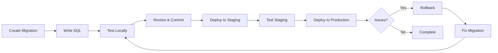

# Database Migration Guide

Complete guide for managing database schema changes, migrations, and version control in IMKitchen.

## Table of Contents

- [Migration Overview](#migration-overview)
- [Creating Migrations](#creating-migrations)
- [Migration File Structure](#migration-file-structure)
- [Running Migrations](#running-migrations)
- [Migration Best Practices](#migration-best-practices)
- [Rollback Procedures](#rollback-procedures)
- [Environment-Specific Migrations](#environment-specific-migrations)
- [Troubleshooting](#troubleshooting)

## Migration Overview

IMKitchen uses SQLx migrations for database schema version control:

- **Versioned Schema Changes**: Each migration has a timestamp and description
- **Forward and Backward**: Support for both applying and reverting changes
- **Environment Consistency**: Same schema across development, staging, and production
- **Type Safety**: Compile-time verification of SQL queries against schema

### Migration Lifecycle



## Creating Migrations

### 1. Generate Migration File

```bash
# Create new migration with descriptive name
sqlx migrate add create_users_table

# Creates file: migrations/{timestamp}_create_users_table.sql
# Example: migrations/20251129100000_create_users_table.sql
```

### 2. Migration Naming Conventions

Follow these naming patterns for consistency:

```bash
# Creating tables
sqlx migrate add create_users_table
sqlx migrate add create_recipes_table

# Adding columns
sqlx migrate add add_email_verification_to_users
sqlx migrate add add_nutrition_info_to_recipes

# Adding indexes
sqlx migrate add add_index_recipes_cuisine_type
sqlx migrate add add_index_users_email

# Data migrations
sqlx migrate add migrate_user_preferences_format
sqlx migrate add populate_recipe_categories

# Removing/dropping
sqlx migrate add drop_unused_sessions_table
sqlx migrate add remove_deprecated_user_fields
```

### 3. Migration File Template

```sql
-- migrations/20251129100000_create_users_table.sql
-- Description: Create users table with authentication fields
-- 
-- This migration creates the core users table for authentication
-- and basic user information storage.

-- Create the users table
CREATE TABLE users (
    id TEXT PRIMARY KEY,                              -- UUID primary key
    email TEXT UNIQUE NOT NULL,                       -- User email (unique)
    password_hash TEXT NOT NULL,                      -- Bcrypt password hash
    created_at TIMESTAMP NOT NULL DEFAULT CURRENT_TIMESTAMP, -- Creation time
    updated_at TIMESTAMP NOT NULL DEFAULT CURRENT_TIMESTAMP, -- Last update
    is_verified BOOLEAN DEFAULT false,                -- Email verification status
    is_active BOOLEAN DEFAULT true                    -- Account active status
);

-- Add performance indexes
CREATE INDEX idx_users_email ON users(email);
CREATE INDEX idx_users_created_at ON users(created_at);
CREATE INDEX idx_users_active ON users(is_active);

-- Add trigger for updated_at auto-update
CREATE TRIGGER users_updated_at 
    AFTER UPDATE ON users
    FOR EACH ROW
    BEGIN
        UPDATE users SET updated_at = CURRENT_TIMESTAMP WHERE id = NEW.id;
    END;
```

## Migration File Structure

### Directory Organization

```
migrations/
├── 20251129100000_create_users_table.sql
├── 20251129100001_create_user_profiles_table.sql
├── 20251129100002_create_user_sessions_table.sql
├── 20251129100003_create_recipes_table.sql
├── 20251129100004_create_recipe_ingredients_table.sql
├── 20251129100005_create_recipe_instructions_table.sql
├── 20251129100006_create_meal_plans_table.sql
├── 20251129100007_create_meal_plan_entries_table.sql
├── 20251129100008_create_shopping_lists_table.sql
├── 20251129100009_create_shopping_list_items_table.sql
├── 20251129100010_create_event_store_table.sql
├── 20251129100011_add_recipe_ratings_table.sql
├── 20251129100012_add_index_recipes_cuisine_difficulty.sql
└── 20251129100013_add_nutrition_fields_to_recipes.sql
```

### Complex Migration Example

```sql
-- migrations/20251129100011_add_recipe_ratings_table.sql
-- Description: Add recipe rating and review system
-- 
-- This migration adds the ability for users to rate and review recipes
-- with proper constraints and validation.

-- Create recipe ratings table
CREATE TABLE recipe_ratings (
    id TEXT PRIMARY KEY,
    recipe_id TEXT NOT NULL,
    user_id TEXT NOT NULL,
    rating INTEGER NOT NULL CHECK (rating >= 1 AND rating <= 5),
    review TEXT,
    created_at TIMESTAMP NOT NULL DEFAULT CURRENT_TIMESTAMP,
    updated_at TIMESTAMP NOT NULL DEFAULT CURRENT_TIMESTAMP,
    
    -- Ensure one rating per user per recipe
    UNIQUE(recipe_id, user_id),
    
    -- Foreign key constraints
    FOREIGN KEY (recipe_id) REFERENCES recipes(id) ON DELETE CASCADE,
    FOREIGN KEY (user_id) REFERENCES users(id) ON DELETE CASCADE
);

-- Add indexes for performance
CREATE INDEX idx_recipe_ratings_recipe_id ON recipe_ratings(recipe_id);
CREATE INDEX idx_recipe_ratings_user_id ON recipe_ratings(user_id);
CREATE INDEX idx_recipe_ratings_rating ON recipe_ratings(rating);

-- Add trigger for updated_at
CREATE TRIGGER recipe_ratings_updated_at 
    AFTER UPDATE ON recipe_ratings
    FOR EACH ROW
    BEGIN
        UPDATE recipe_ratings SET updated_at = CURRENT_TIMESTAMP WHERE id = NEW.id;
    END;

-- Add computed average rating view
CREATE VIEW recipe_average_ratings AS
SELECT 
    recipe_id,
    COUNT(*) as rating_count,
    AVG(rating) as average_rating,
    MIN(rating) as min_rating,
    MAX(rating) as max_rating
FROM recipe_ratings
GROUP BY recipe_id;
```

### Data Migration Example

```sql
-- migrations/20251129100020_migrate_user_preferences_format.sql
-- Description: Migrate user dietary restrictions from CSV to JSON format
-- 
-- This migration converts the dietary_restrictions field from a 
-- comma-separated string to a JSON array for better querying.

-- Add new JSON column
ALTER TABLE user_profiles ADD COLUMN dietary_restrictions_json TEXT;

-- Migrate existing data
UPDATE user_profiles 
SET dietary_restrictions_json = 
    CASE 
        WHEN dietary_restrictions IS NULL OR dietary_restrictions = '' THEN '[]'
        ELSE '[' || 
             '"' || REPLACE(dietary_restrictions, ',', '","') || '"' ||
             ']'
    END
WHERE dietary_restrictions_json IS NULL;

-- Verify migration worked correctly
-- (This would be in a separate verification step)

-- Drop old column (in a subsequent migration for safety)
-- ALTER TABLE user_profiles DROP COLUMN dietary_restrictions;

-- Rename new column
-- ALTER TABLE user_profiles RENAME COLUMN dietary_restrictions_json TO dietary_restrictions;
```

## Running Migrations

### Local Development

```bash
# Check current migration status
sqlx migrate info --database-url sqlite:imkitchen.db

# Run all pending migrations
sqlx migrate run --database-url sqlite:imkitchen.db

# Run specific migration (by specifying target version)
sqlx migrate run --database-url sqlite:imkitchen.db --target 20251129100005

# Verify migration results
sqlite3 imkitchen.db ".schema users"
```

### Using Environment Variables

```bash
# Set database URL in environment
export DATABASE_URL=sqlite:imkitchen.db

# Run migrations (will use DATABASE_URL)
sqlx migrate run

# Alternative: use .env file
echo "DATABASE_URL=sqlite:imkitchen.db" > .env
sqlx migrate run
```

### Production Migration Commands

```bash
# 1. Backup database before migration
cp production.db production.db.backup.$(date +%Y%m%d_%H%M%S)

# 2. Check migration status
sqlx migrate info --database-url sqlite:production.db

# 3. Run migrations with verbose output
sqlx migrate run --database-url sqlite:production.db --verbose

# 4. Verify critical tables exist
sqlite3 production.db "SELECT name FROM sqlite_master WHERE type='table';"
```

### CI/CD Pipeline Integration

```yaml
# .github/workflows/database.yml
name: Database Migrations

on:
  push:
    paths:
      - 'migrations/**'

jobs:
  test-migrations:
    runs-on: ubuntu-latest
    steps:
      - uses: actions/checkout@v3
      
      - name: Install SQLx CLI
        run: cargo install sqlx-cli
        
      - name: Test migrations on fresh database
        run: |
          sqlx migrate run --database-url sqlite:test.db
          
      - name: Test migration rollback
        run: |
          sqlx migrate revert --database-url sqlite:test.db
          
      - name: Verify schema integrity
        run: |
          sqlx migrate run --database-url sqlite:test.db
          sqlite3 test.db ".schema" > schema.sql
          # Add schema validation checks here
```

## Migration Best Practices

### 1. Always Test Migrations

```bash
# Test on fresh database
rm -f test.db
sqlx migrate run --database-url sqlite:test.db

# Test with existing data
cp production.db test.db
sqlx migrate run --database-url sqlite:test.db

# Test rollback capability
sqlx migrate revert --database-url sqlite:test.db
```

### 2. Use Transactions for Complex Migrations

```sql
-- migrations/20251129100025_complex_data_migration.sql
BEGIN TRANSACTION;

-- Step 1: Add new columns
ALTER TABLE recipes ADD COLUMN nutrition_calories INTEGER;
ALTER TABLE recipes ADD COLUMN nutrition_protein REAL;

-- Step 2: Migrate data with validation
UPDATE recipes 
SET nutrition_calories = 
    CASE 
        WHEN prep_time_minutes + cook_time_minutes < 30 THEN 200
        WHEN prep_time_minutes + cook_time_minutes < 60 THEN 400
        ELSE 600
    END
WHERE nutrition_calories IS NULL;

-- Step 3: Verify data integrity
-- Ensure no null values where they shouldn't be
SELECT COUNT(*) as null_calories_count 
FROM recipes 
WHERE nutrition_calories IS NULL;

-- If the above returns > 0, the migration should fail
-- (Add appropriate checks here)

COMMIT;
```

### 3. Use Safe Column Operations

```sql
-- SAFE: Adding nullable columns
ALTER TABLE recipes ADD COLUMN new_field TEXT;

-- SAFE: Adding columns with defaults
ALTER TABLE recipes ADD COLUMN created_at TIMESTAMP DEFAULT CURRENT_TIMESTAMP;

-- UNSAFE: Adding NOT NULL columns without default
-- ALTER TABLE recipes ADD COLUMN required_field TEXT NOT NULL; -- Don't do this!

-- BETTER: Add with default, then update, then modify
ALTER TABLE recipes ADD COLUMN required_field TEXT DEFAULT '';
UPDATE recipes SET required_field = 'default_value' WHERE required_field = '';
-- In next migration: Add NOT NULL constraint if needed
```

### 4. Incremental Schema Changes

Break large changes into smaller migrations:

```sql
-- Migration 1: Add column
ALTER TABLE recipes ADD COLUMN status TEXT DEFAULT 'draft';

-- Migration 2: Populate column
UPDATE recipes SET status = 'published' WHERE is_public = true;

-- Migration 3: Add constraints
-- (After verifying data is correct)
ALTER TABLE recipes ADD CONSTRAINT check_status 
    CHECK (status IN ('draft', 'published', 'archived'));

-- Migration 4: Remove old column
ALTER TABLE recipes DROP COLUMN is_public;
```

## Rollback Procedures

### Automatic Rollback

```bash
# Revert last migration
sqlx migrate revert --database-url sqlite:imkitchen.db

# Revert to specific version
sqlx migrate revert --database-url sqlite:imkitchen.db --target 20251129100010
```

### Manual Rollback Procedures

For complex migrations, document rollback steps:

```sql
-- migrations/20251129100030_add_recipe_categories.sql
-- 
-- ROLLBACK INSTRUCTIONS:
-- If this migration needs to be rolled back:
-- 1. sqlx migrate revert (automatic)
-- 2. Manual cleanup if needed:
--    - Check for orphaned category references
--    - Restore any backed-up data
--
-- DEPENDENCIES:
-- - This migration depends on recipes table existing
-- - Safe to rollback unless production data exists

CREATE TABLE recipe_categories (
    id TEXT PRIMARY KEY,
    name TEXT UNIQUE NOT NULL,
    description TEXT,
    created_at TIMESTAMP DEFAULT CURRENT_TIMESTAMP
);

-- Add foreign key to recipes
ALTER TABLE recipes ADD COLUMN category_id TEXT REFERENCES recipe_categories(id);
```

### Emergency Rollback Procedure

```bash
#!/bin/bash
# emergency-rollback.sh

# 1. Stop application
systemctl stop imkitchen

# 2. Backup current state
cp imkitchen.db imkitchen.db.emergency.$(date +%Y%m%d_%H%M%S)

# 3. Restore from backup
cp imkitchen.db.backup.latest imkitchen.db

# 4. Verify restoration
sqlite3 imkitchen.db "SELECT COUNT(*) FROM users;"

# 5. Restart application
systemctl start imkitchen

echo "Emergency rollback completed"
```

## Environment-Specific Migrations

### Development Environment

```bash
# Reset development database
rm -f imkitchen.db
sqlx migrate run --database-url sqlite:imkitchen.db

# Add test data
cargo run -- seed-test-data
```

### Staging Environment

```bash
# Staging migration with backup
cp staging.db staging.db.backup.$(date +%Y%m%d_%H%M%S)
sqlx migrate run --database-url sqlite:staging.db

# Verify staging data integrity
cargo run -- verify-database --database-url sqlite:staging.db
```

### Production Environment

```bash
# Production migration checklist:
# 1. Schedule maintenance window
# 2. Backup database
# 3. Test migration on copy
# 4. Run migration
# 5. Verify application functionality
# 6. Monitor for issues

# Production migration script
#!/bin/bash
set -e

echo "Starting production migration..."

# Backup
cp production.db production.db.backup.$(date +%Y%m%d_%H%M%S)

# Test on copy first
cp production.db migration-test.db
sqlx migrate run --database-url sqlite:migration-test.db

# If test succeeds, run on production
sqlx migrate run --database-url sqlite:production.db

echo "Production migration completed successfully"
```

## Troubleshooting

### Common Migration Issues

#### 1. Migration Already Applied

```
Error: Migration 20251129100000 has already been applied
```

**Solution:**
```bash
# Check migration status
sqlx migrate info

# If migration was partially applied, manually fix
sqlite3 imkitchen.db "DELETE FROM _sqlx_migrations WHERE version = 20251129100000;"
sqlx migrate run
```

#### 2. Constraint Violation During Migration

```
Error: UNIQUE constraint failed: users.email
```

**Solution:**
```sql
-- Add data cleaning before constraint
DELETE FROM users 
WHERE id NOT IN (
    SELECT MIN(id) 
    FROM users 
    GROUP BY email
);

-- Then add the constraint
CREATE UNIQUE INDEX idx_users_email_unique ON users(email);
```

#### 3. Foreign Key Constraint Errors

```
Error: FOREIGN KEY constraint failed
```

**Solution:**
```sql
-- Temporarily disable foreign key constraints
PRAGMA foreign_keys = OFF;

-- Run migration
-- ... migration SQL ...

-- Re-enable and verify
PRAGMA foreign_keys = ON;
PRAGMA foreign_key_check;
```

#### 4. Schema Lock Errors

```
Error: database is locked
```

**Solution:**
```bash
# Check for running processes
lsof imkitchen.db

# Stop application
systemctl stop imkitchen

# Run migration
sqlx migrate run

# Restart application
systemctl start imkitchen
```

### Migration Validation

```bash
# Validate migration files
find migrations/ -name "*.sql" -exec sqlx migrate validate {} \;

# Check for syntax errors
for file in migrations/*.sql; do
    echo "Checking $file"
    sqlite3 ":memory:" < "$file"
done

# Verify schema integrity after migration
sqlite3 imkitchen.db "PRAGMA integrity_check;"
sqlite3 imkitchen.db "PRAGMA foreign_key_check;"
```

### Recovery Procedures

```bash
# Recovery from failed migration
#!/bin/bash

echo "Starting migration recovery..."

# 1. Stop application
systemctl stop imkitchen

# 2. Restore from backup
cp imkitchen.db.backup.latest imkitchen.db

# 3. Check database integrity
if sqlite3 imkitchen.db "PRAGMA integrity_check;" | grep -q "ok"; then
    echo "Database integrity verified"
else
    echo "Database corruption detected!"
    exit 1
fi

# 4. Run migrations carefully
sqlx migrate run --database-url sqlite:imkitchen.db

# 5. Verify application starts
systemctl start imkitchen
sleep 5

if systemctl is-active --quiet imkitchen; then
    echo "Recovery successful"
else
    echo "Application failed to start"
    systemctl stop imkitchen
    exit 1
fi
```

For more migration help:
- [Database Schema Documentation](README.md)
- [Query Examples](queries.md)
- [Performance Guide](performance.md)
- [Backup and Recovery](backup.md)