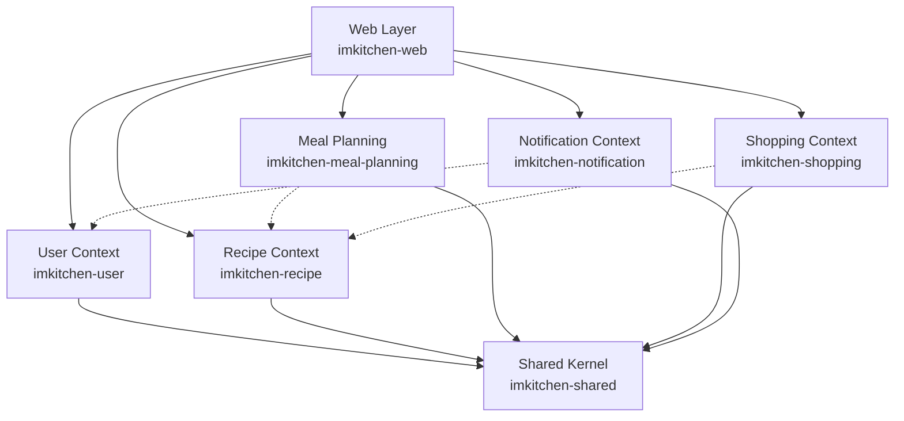

# Project Structure Guide

Comprehensive guide to IMKitchen's project organization, focusing on bounded context architecture and crate organization patterns.

## Table of Contents

- [Architecture Overview](#architecture-overview)
- [Bounded Context Organization](#bounded-context-organization)
- [Crate Structure Details](#crate-structure-details)
- [Domain-Driven Design Layout](#domain-driven-design-layout)
- [File Organization Patterns](#file-organization-patterns)
- [Dependency Management](#dependency-management)
- [Development Workflow](#development-workflow)

## Architecture Overview

IMKitchen follows a **Domain-Driven Design (DDD)** architecture with **bounded contexts** implemented as separate Rust crates:

```
imkitchen/
├── Cargo.toml                    # Workspace configuration
├── README.md                     # Project overview
├── .env.example                  # Environment template
├── Dockerfile                    # Container definition
├── src/                          # CLI binary
│   └── main.rs                   # Application entry point
├── crates/                       # Bounded context crates
│   ├── imkitchen-shared/         # Common types and utilities
│   ├── imkitchen-user/           # User management context
│   ├── imkitchen-recipe/         # Recipe management context
│   ├── imkitchen-meal-planning/  # Meal planning context
│   ├── imkitchen-shopping/       # Shopping list context
│   ├── imkitchen-notification/   # Notification context
│   └── imkitchen-web/            # Web presentation layer
├── docs/                         # Documentation
│   ├── development/              # Developer guides
│   ├── architecture/             # Technical architecture
│   ├── api/                      # API documentation
│   ├── database/                 # Database documentation
│   └── deployment/               # Deployment guides
├── migrations/                   # Database migrations
├── scripts/                      # Build and utility scripts
└── tests/                        # End-to-end tests
```

### Design Principles

1. **Bounded Contexts**: Each domain has its own crate with clear boundaries
2. **Dependency Direction**: Domain crates don't depend on the web layer
3. **Shared Kernel**: Common types and utilities in shared crate
4. **Event-Driven**: Inter-context communication through domain events
5. **CQRS**: Separate command and query responsibilities

## Bounded Context Organization

### Context Boundaries



### Context Responsibilities

#### User Context (`imkitchen-user`)
- User registration and authentication
- Profile management and preferences
- User sessions and security
- Dietary restrictions and family settings

#### Recipe Context (`imkitchen-recipe`)
- Recipe creation and management
- Ingredient and instruction handling
- Recipe categorization and search
- Recipe ratings and reviews

#### Meal Planning Context (`imkitchen-meal-planning`)
- Weekly meal plan generation
- Meal scheduling and optimization
- Nutritional analysis and tracking
- Meal plan templates and presets

#### Shopping Context (`imkitchen-shopping`)
- Shopping list generation from meal plans
- Ingredient aggregation and optimization
- Store organization and categories
- Shopping progress tracking

#### Notification Context (`imkitchen-notification`)
- Email notifications and alerts
- SMTP configuration and management
- Notification preferences and scheduling
- External API integration framework

#### Shared Kernel (`imkitchen-shared`)
- Common value objects and types
- Domain event definitions
- Shared utilities and helpers
- Cross-cutting concerns

#### Web Layer (`imkitchen-web`)
- HTTP request handling
- Template rendering
- Authentication middleware
- Static asset serving

## Crate Structure Details

### Standard Crate Layout

Each domain crate follows a consistent internal structure:

```
imkitchen-{context}/
├── Cargo.toml                    # Crate configuration
├── src/
│   ├── lib.rs                    # Public API and exports
│   ├── domain/                   # Domain layer
│   │   ├── mod.rs                # Domain module exports
│   │   ├── {aggregate}.rs        # Aggregate roots
│   │   ├── value_objects.rs      # Value objects
│   │   └── events.rs             # Domain events
│   ├── commands/                 # CQRS command handlers
│   │   ├── mod.rs                # Command exports
│   │   └── {action}_command.rs   # Individual commands
│   ├── queries/                  # CQRS query handlers
│   │   ├── mod.rs                # Query exports
│   │   └── {data}_query.rs       # Individual queries
│   ├── projections/              # Read model projections
│   │   ├── mod.rs                # Projection exports
│   │   └── {view}_projection.rs  # Individual projections
│   └── infrastructure/           # Infrastructure concerns
│       ├── mod.rs                # Infrastructure exports
│       ├── repository.rs         # Data access
│       └── services.rs           # External services
├── tests/
│   ├── integration/              # Integration tests
│   │   ├── mod.rs                # Test utilities
│   │   └── {feature}_tests.rs    # Feature test suites
│   └── unit/                     # Unit tests
│       ├── domain/               # Domain logic tests
│       └── commands/             # Command handler tests
└── migrations/                   # Context-specific migrations
    └── {timestamp}_{description}.sql
```

### Shared Crate Structure

```
imkitchen-shared/
├── Cargo.toml
├── src/
│   ├── lib.rs                    # Public exports
│   ├── types/                    # Common types
│   │   ├── mod.rs                # Type exports
│   │   ├── ids.rs                # Entity identifiers
│   │   ├── value_objects.rs      # Common value objects
│   │   └── enums.rs              # Shared enumerations
│   ├── events/                   # Domain events
│   │   ├── mod.rs                # Event exports
│   │   ├── user_events.rs        # User domain events
│   │   ├── recipe_events.rs      # Recipe domain events
│   │   └── event_store.rs        # Event store abstractions
│   ├── errors/                   # Common error types
│   │   ├── mod.rs                # Error exports
│   │   └── validation.rs         # Validation errors
│   ├── utils/                    # Utility functions
│   │   ├── mod.rs                # Utility exports
│   │   ├── datetime.rs           # Date/time utilities
│   │   └── validation.rs         # Validation helpers
│   └── external_apis/            # External API framework
│       ├── mod.rs                # API exports
│       ├── config.rs             # API configuration
│       └── client.rs             # Generic API client
└── tests/
    └── integration/
        └── external_api_tests.rs
```

### Web Crate Structure

```
imkitchen-web/
├── Cargo.toml
├── src/
│   ├── lib.rs                    # Web server library
│   ├── handlers/                 # HTTP request handlers
│   │   ├── mod.rs                # Handler exports
│   │   ├── auth.rs               # Authentication handlers
│   │   ├── recipes.rs            # Recipe handlers
│   │   ├── meal_plans.rs         # Meal planning handlers
│   │   ├── shopping.rs           # Shopping list handlers
│   │   └── api.rs                # API endpoints
│   ├── middleware/               # HTTP middleware
│   │   ├── mod.rs                # Middleware exports
│   │   ├── auth.rs               # Authentication middleware
│   │   ├── csrf.rs               # CSRF protection
│   │   ├── logging.rs            # Request logging
│   │   └── error.rs              # Error handling
│   ├── templates/                # Template data structures
│   │   ├── mod.rs                # Template exports
│   │   ├── auth.rs               # Auth template data
│   │   ├── recipes.rs            # Recipe template data
│   │   └── layout.rs             # Layout template data
│   ├── extractors/               # Custom Axum extractors
│   │   ├── mod.rs                # Extractor exports
│   │   ├── user_session.rs       # User session extractor
│   │   └── validated_form.rs     # Form validation extractor
│   └── config/                   # Web configuration
│       ├── mod.rs                # Config exports
│       └── app_state.rs          # Application state
├── templates/                    # Askama template files
│   ├── layout/                   # Base layouts
│   │   ├── base.html             # Main layout
│   │   ├── auth.html             # Authentication layout
│   │   └── modal.html            # Modal dialogs
│   ├── components/               # Reusable components
│   │   ├── _navigation.html      # Navigation bar
│   │   ├── _recipe_card.html     # Recipe card component
│   │   ├── _pagination.html      # Pagination component
│   │   └── _form_field.html      # Form field component
│   ├── auth/                     # Authentication pages
│   │   ├── login.html            # Login form
│   │   ├── register.html         # Registration form
│   │   └── profile.html          # User profile
│   ├── recipes/                  # Recipe pages
│   │   ├── list.html             # Recipe listing
│   │   ├── detail.html           # Recipe details
│   │   ├── create.html           # Recipe creation
│   │   └── edit.html             # Recipe editing
│   ├── meal_plans/               # Meal planning pages
│   │   ├── list.html             # Meal plan listing
│   │   ├── weekly.html           # Weekly calendar
│   │   └── generate.html         # Plan generation
│   ├── shopping/                 # Shopping pages
│   │   ├── list.html             # Shopping list
│   │   └── history.html          # Shopping history
│   └── errors/                   # Error pages
│       ├── 404.html              # Not found
│       ├── 422.html              # Validation error
│       └── 500.html              # Server error
├── static/                       # Static assets
│   ├── css/                      # Stylesheets
│   │   ├── input.css             # Tailwind input
│   │   └── tailwind.css          # Compiled CSS
│   ├── js/                       # JavaScript
│   │   ├── twinspark.js          # TwinSpark library
│   │   └── app.js                # Minimal custom JS
│   └── images/                   # Images and icons
│       ├── logo.svg              # Application logo
│       └── icons/                # UI icons
└── tests/
    ├── integration/              # Handler integration tests
    │   ├── auth_tests.rs          # Authentication tests
    │   ├── recipe_tests.rs        # Recipe handler tests
    │   └── template_tests.rs      # Template rendering tests
    └── unit/
        ├── middleware_tests.rs    # Middleware tests
        └── extractor_tests.rs     # Extractor tests
```

## Domain-Driven Design Layout

### Aggregate Organization

Each aggregate gets its own file within the domain directory:

```rust
// src/domain/recipe.rs
use imkitchen_shared::types::{RecipeId, UserId};
use imkitchen_shared::events::DomainEvent;

/// Recipe aggregate root
#[derive(Debug, Clone)]
pub struct Recipe {
    pub id: RecipeId,
    pub user_id: UserId,
    pub title: String,
    pub description: Option<String>,
    pub ingredients: Vec<Ingredient>,
    pub instructions: Vec<Instruction>,
    // ... other fields
}

impl Recipe {
    /// Create new recipe (factory method)
    pub fn create(command: CreateRecipeCommand) -> Result<(Self, Vec<DomainEvent>), RecipeError> {
        // Domain validation and creation logic
    }
    
    /// Update recipe (behavior method)
    pub fn update(&mut self, command: UpdateRecipeCommand) -> Result<Vec<DomainEvent>, RecipeError> {
        // Domain update logic
    }
}

/// Recipe ingredient entity
#[derive(Debug, Clone)]
pub struct Ingredient {
    pub id: IngredientId,
    pub recipe_id: RecipeId,
    pub name: String,
    pub quantity: f64,
    pub unit: String,
    pub order_index: u16,
}

/// Recipe instruction entity
#[derive(Debug, Clone)]
pub struct Instruction {
    pub id: InstructionId,
    pub recipe_id: RecipeId,
    pub step_number: u16,
    pub instruction: String,
    pub duration_minutes: Option<u16>,
}
```

### Value Object Organization

```rust
// src/domain/value_objects.rs
use serde::{Deserialize, Serialize};
use validator::Validate;

/// Cooking difficulty level
#[derive(Debug, Clone, Copy, PartialEq, Eq, Serialize, Deserialize)]
pub enum CookingDifficulty {
    Easy,
    Medium,
    Hard,
}

/// Cooking time value object
#[derive(Debug, Clone, Copy, PartialEq, Eq, Serialize, Deserialize)]
pub struct CookingTime {
    minutes: u16,
}

impl CookingTime {
    pub fn new(minutes: u16) -> Result<Self, ValidationError> {
        if minutes == 0 || minutes > 480 {  // Max 8 hours
            return Err(ValidationError::InvalidCookingTime);
        }
        Ok(Self { minutes })
    }
    
    pub fn minutes(&self) -> u16 {
        self.minutes
    }
}

/// Recipe title with validation
#[derive(Debug, Clone, PartialEq, Eq, Serialize, Deserialize)]
pub struct RecipeTitle(String);

impl RecipeTitle {
    pub fn new(value: String) -> Result<Self, ValidationError> {
        if value.trim().is_empty() || value.len() > 200 {
            return Err(ValidationError::InvalidTitle);
        }
        Ok(Self(value.trim().to_string()))
    }
    
    pub fn as_str(&self) -> &str {
        &self.0
    }
}
```

### Command Organization

```rust
// src/commands/create_recipe_command.rs
use crate::domain::{Recipe, RecipeError};
use imkitchen_shared::types::UserId;
use imkitchen_shared::events::DomainEvent;

#[derive(Debug, Validate)]
pub struct CreateRecipeCommand {
    #[validate(length(min = 1, max = 200))]
    pub title: String,
    
    #[validate(length(max = 1000))]
    pub description: Option<String>,
    
    #[validate(range(min = 1, max = 480))]
    pub prep_time_minutes: u16,
    
    #[validate(length(min = 1))]
    pub ingredients: Vec<CreateIngredientCommand>,
    
    pub user_id: UserId,
}

#[derive(Debug, Validate)]
pub struct CreateIngredientCommand {
    #[validate(length(min = 1, max = 100))]
    pub name: String,
    
    #[validate(range(min = 0.01, max = 10000.0))]
    pub quantity: f64,
    
    #[validate(length(min = 1, max = 20))]
    pub unit: String,
}

/// Command handler
pub struct CreateRecipeHandler {
    repository: RecipeRepository,
    event_store: EventStore,
}

impl CreateRecipeHandler {
    pub async fn handle(&self, command: CreateRecipeCommand) -> Result<Recipe, RecipeError> {
        // Validate command
        command.validate()?;
        
        // Create recipe aggregate
        let (recipe, events) = Recipe::create(command)?;
        
        // Persist recipe
        self.repository.save(&recipe).await?;
        
        // Store events
        for event in events {
            self.event_store.append(event).await?;
        }
        
        Ok(recipe)
    }
}
```

## File Organization Patterns

### Import Organization

Organize imports consistently across all files:

```rust
// 1. Standard library imports
use std::collections::HashMap;
use std::time::Duration;

// 2. External crate imports (alphabetical)
use axum::{extract::State, response::Html};
use serde::{Deserialize, Serialize};
use sqlx::SqlitePool;
use tracing::info;
use uuid::Uuid;
use validator::Validate;

// 3. Internal crate imports (current crate)
use crate::domain::{Recipe, RecipeError};
use crate::commands::CreateRecipeCommand;

// 4. Shared crate imports
use imkitchen_shared::types::{UserId, RecipeId};
use imkitchen_shared::events::RecipeCreated;

// 5. Other internal crates (only in web layer)
use imkitchen_recipe::RecipeService;
use imkitchen_user::UserSession;
```

### Module Declaration Patterns

```rust
// src/lib.rs - Crate root
#![deny(unsafe_code)]
#![warn(missing_docs)]

//! IMKitchen Recipe Management Context
//! 
//! This crate handles all recipe-related domain logic including
//! recipe creation, management, and querying.

pub mod domain;
pub mod commands;
pub mod queries;
pub mod projections;

// Re-exports for convenience
pub use domain::*;
pub use commands::*;
pub use queries::*;

// src/domain/mod.rs - Domain module
pub mod recipe;
pub mod ingredient;
pub mod value_objects;
pub mod events;

pub use recipe::*;
pub use ingredient::*;
pub use value_objects::*;
pub use events::*;
```

### Test Organization Patterns

```rust
// tests/integration/recipe_tests.rs
use imkitchen_recipe::{Recipe, CreateRecipeCommand, RecipeService};
use imkitchen_shared::types::UserId;

mod recipe_creation {
    use super::*;
    
    #[tokio::test]
    async fn test_create_recipe_with_valid_data() {
        // Test implementation
    }
    
    #[tokio::test]
    async fn test_create_recipe_with_invalid_title() {
        // Test implementation
    }
}

mod recipe_updates {
    use super::*;
    
    #[tokio::test]
    async fn test_update_recipe_title() {
        // Test implementation
    }
}

// tests/unit/domain/recipe_tests.rs
use crate::domain::{Recipe, CreateRecipeCommand};

#[cfg(test)]
mod recipe_domain_tests {
    use super::*;
    
    #[test]
    fn test_recipe_creation_validation() {
        // Unit test implementation
    }
}
```

## Dependency Management

### Workspace Configuration

```toml
# Cargo.toml (workspace root)
[workspace]
members = [
    "crates/imkitchen-shared",
    "crates/imkitchen-user",
    "crates/imkitchen-recipe",
    "crates/imkitchen-meal-planning",
    "crates/imkitchen-shopping",
    "crates/imkitchen-notification",
    "crates/imkitchen-web",
]

[workspace.dependencies]
# Shared dependencies with versions
tokio = { version = "1.0", features = ["full"] }
serde = { version = "1.0", features = ["derive"] }
sqlx = { version = "0.8", features = ["sqlite", "runtime-tokio-rustls", "chrono", "uuid"] }
axum = "0.8"
askama = { version = "0.14", features = ["with-axum"] }
validator = { version = "0.20", features = ["derive"] }
tracing = "0.1"
uuid = { version = "1.0", features = ["v4", "serde"] }
chrono = { version = "0.4", features = ["serde"] }
thiserror = "1.0"
```

### Crate Dependencies

```toml
# crates/imkitchen-recipe/Cargo.toml
[package]
name = "imkitchen-recipe"
version = "0.1.0"
edition = "2021"

[dependencies]
# Workspace dependencies
tokio = { workspace = true }
serde = { workspace = true }
sqlx = { workspace = true }
validator = { workspace = true }
tracing = { workspace = true }
uuid = { workspace = true }
chrono = { workspace = true }
thiserror = { workspace = true }

# Internal dependencies
imkitchen-shared = { path = "../imkitchen-shared" }

# Crate-specific dependencies
image = "0.24"  # For recipe image processing

[dev-dependencies]
tokio-test = "0.4"
```

### Dependency Rules

1. **Shared Dependencies**: Use workspace dependencies for common crates
2. **Version Consistency**: All crates use same versions of shared dependencies
3. **Domain Independence**: Domain crates only depend on shared crate
4. **Web Dependencies**: Only web crate depends on domain crates
5. **Test Dependencies**: Test-specific dependencies in `[dev-dependencies]`

## Development Workflow

### Adding New Features

1. **Identify Bounded Context**: Determine which context owns the feature
2. **Domain First**: Start with domain modeling in appropriate crate
3. **Commands/Queries**: Add command/query handlers as needed
4. **Web Integration**: Add handlers and templates in web crate
5. **Testing**: Add tests at all levels (unit, integration, e2e)

### Creating New Context

```bash
# 1. Create new crate directory
mkdir crates/imkitchen-{context}
cd crates/imkitchen-{context}

# 2. Initialize Cargo.toml
cargo init --lib

# 3. Set up standard directory structure
mkdir -p src/{domain,commands,queries,projections,infrastructure}
mkdir -p tests/{integration,unit}

# 4. Add to workspace
# Edit root Cargo.toml to include new crate

# 5. Add dependencies
# Edit crate Cargo.toml with appropriate dependencies
```

### Refactoring Guidelines

1. **Maintain Boundaries**: Keep bounded context boundaries clean
2. **Event Versioning**: Version domain events for backward compatibility
3. **Migration Strategy**: Plan database and schema changes carefully
4. **Test Coverage**: Maintain test coverage during refactoring
5. **Documentation**: Update documentation with structural changes

For more project structure information:
- [Coding Standards](coding-standards.md)
- [Architecture Overview](../architecture/README.md)
- [Testing Strategy](testing.md)
- [Deployment Structure](../deployment/README.md)