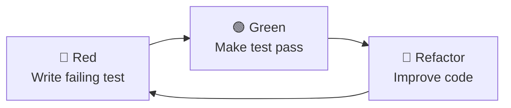

# Test-Driven Development Guide

Comprehensive guide to Test-Driven Development (TDD) practices in IMKitchen, covering the Red-Green-Refactor cycle, testing strategies, and Rust-specific testing patterns.

## Table of Contents

- [TDD Overview](#tdd-overview)
- [Red-Green-Refactor Cycle](#red-green-refactor-cycle)
- [Testing Strategy](#testing-strategy)
- [Domain Logic Testing](#domain-logic-testing)
- [Integration Testing](#integration-testing)
- [Template Testing](#template-testing)
- [Continuous Testing Workflows](#continuous-testing-workflows)
- [Testing Tools and Frameworks](#testing-tools-and-frameworks)
- [Best Practices](#best-practices)

## TDD Overview

### Why TDD for IMKitchen?

Test-Driven Development ensures:
- **Design Quality**: Tests drive better API design
- **Documentation**: Tests serve as executable documentation
- **Confidence**: Comprehensive test coverage enables fearless refactoring
- **Domain Focus**: TDD aligns with Domain-Driven Design principles

### TDD Principles

1. **Write tests first** - Tests define the expected behavior
2. **Minimal implementation** - Write just enough code to pass tests
3. **Refactor continuously** - Improve code while maintaining test coverage
4. **Fast feedback** - Quick test cycles accelerate development

### Testing Pyramid

```
        E2E Tests (Few)
       /               \
    Integration Tests (Some)
   /                         \
Unit Tests (Many)           Template Tests (Many)
```

## Red-Green-Refactor Cycle

### The TDD Cycle



### Cycle Implementation

#### 1. 🔴 Red Phase - Write Failing Test

Start with a failing test that describes the desired behavior:

```rust
// tests/unit/domain/recipe_tests.rs
#[cfg(test)]
mod recipe_creation_tests {
    use super::*;
    use crate::domain::{Recipe, CreateRecipeCommand, RecipeError};
    
    #[test]
    fn test_create_recipe_with_valid_data() {
        // Arrange
        let command = CreateRecipeCommand {
            title: "Pasta Carbonara".to_string(),
            description: Some("Classic Italian pasta dish".to_string()),
            prep_time_minutes: 15,
            cook_time_minutes: 20,
            servings: 4,
            user_id: UserId::new(),
            ingredients: vec![
                CreateIngredientCommand {
                    name: "Spaghetti".to_string(),
                    quantity: 400.0,
                    unit: "g".to_string(),
                },
            ],
        };
        
        // Act
        let result = Recipe::create(command);
        
        // Assert
        assert!(result.is_ok());
        let (recipe, events) = result.unwrap();
        assert_eq!(recipe.title, "Pasta Carbonara");
        assert_eq!(recipe.prep_time_minutes, 15);
        assert_eq!(recipe.ingredients.len(), 1);
        assert_eq!(events.len(), 1); // RecipeCreated event
    }
}
```

#### 2. 🟢 Green Phase - Make Test Pass

Implement minimal code to make the test pass:

```rust
// src/domain/recipe.rs
use imkitchen_shared::types::{RecipeId, UserId};
use imkitchen_shared::events::{DomainEvent, RecipeCreated};

#[derive(Debug, Clone)]
pub struct Recipe {
    pub id: RecipeId,
    pub title: String,
    pub description: Option<String>,
    pub prep_time_minutes: u16,
    pub cook_time_minutes: u16,
    pub servings: u16,
    pub user_id: UserId,
    pub ingredients: Vec<Ingredient>,
    pub created_at: DateTime<Utc>,
}

impl Recipe {
    pub fn create(command: CreateRecipeCommand) -> Result<(Self, Vec<DomainEvent>), RecipeError> {
        // Minimal validation
        if command.title.trim().is_empty() {
            return Err(RecipeError::InvalidTitle);
        }
        
        // Create recipe
        let recipe_id = RecipeId::new();
        let now = Utc::now();
        
        let recipe = Self {
            id: recipe_id.clone(),
            title: command.title,
            description: command.description,
            prep_time_minutes: command.prep_time_minutes,
            cook_time_minutes: command.cook_time_minutes,
            servings: command.servings,
            user_id: command.user_id.clone(),
            ingredients: command.ingredients.into_iter()
                .map(|ing| Ingredient::from_command(recipe_id.clone(), ing))
                .collect(),
            created_at: now,
        };
        
        // Create domain event
        let event = DomainEvent::RecipeCreated(RecipeCreated {
            recipe_id: recipe_id.clone(),
            user_id: command.user_id,
            title: recipe.title.clone(),
            occurred_at: now,
        });
        
        Ok((recipe, vec![event]))
    }
}
```

#### 3. 🔵 Refactor Phase - Improve Code

Refactor while maintaining green tests:

```rust
// src/domain/recipe.rs (refactored)
impl Recipe {
    pub fn create(command: CreateRecipeCommand) -> Result<(Self, Vec<DomainEvent>), RecipeError> {
        // Enhanced validation
        Self::validate_create_command(&command)?;
        
        // Create recipe with validated data
        let recipe_id = RecipeId::new();
        let now = Utc::now();
        
        let recipe = Self {
            id: recipe_id.clone(),
            title: command.title.trim().to_string(),
            description: command.description.map(|d| d.trim().to_string()),
            prep_time_minutes: command.prep_time_minutes,
            cook_time_minutes: command.cook_time_minutes,
            servings: command.servings,
            user_id: command.user_id.clone(),
            ingredients: Self::create_ingredients(recipe_id.clone(), command.ingredients)?,
            created_at: now,
        };
        
        // Create domain events
        let events = vec![
            DomainEvent::RecipeCreated(RecipeCreated {
                recipe_id: recipe_id.clone(),
                user_id: command.user_id,
                title: recipe.title.clone(),
                occurred_at: now,
            })
        ];
        
        Ok((recipe, events))
    }
    
    fn validate_create_command(command: &CreateRecipeCommand) -> Result<(), RecipeError> {
        if command.title.trim().is_empty() || command.title.len() > 200 {
            return Err(RecipeError::InvalidTitle);
        }
        
        if command.prep_time_minutes == 0 || command.prep_time_minutes > 480 {
            return Err(RecipeError::InvalidPrepTime);
        }
        
        if command.ingredients.is_empty() {
            return Err(RecipeError::NoIngredients);
        }
        
        Ok(())
    }
    
    fn create_ingredients(
        recipe_id: RecipeId, 
        ingredient_commands: Vec<CreateIngredientCommand>
    ) -> Result<Vec<Ingredient>, RecipeError> {
        ingredient_commands.into_iter()
            .enumerate()
            .map(|(index, cmd)| Ingredient::from_command(recipe_id.clone(), cmd, index as u16))
            .collect()
    }
}
```

## Testing Strategy

### Test Organization

```
crates/imkitchen-{context}/
├── tests/
│   ├── integration/           # Integration tests
│   │   ├── mod.rs            # Test utilities and setup
│   │   ├── recipe_service_tests.rs
│   │   └── command_handler_tests.rs
│   └── unit/                 # Unit tests
│       ├── domain/           # Domain logic tests
│       │   ├── recipe_tests.rs
│       │   └── value_object_tests.rs
│       └── commands/         # Command handler tests
└── src/
    ├── domain/
    │   └── recipe.rs         # Inline unit tests
    └── lib.rs
```

### Test Types and Coverage

| Test Type | Purpose | Coverage | Speed |
|-----------|---------|----------|-------|
| **Unit Tests** | Domain logic, value objects | 80% | Fastest |
| **Integration Tests** | Command/query handlers | 15% | Medium |
| **Template Tests** | Askama template rendering | 4% | Medium |
| **E2E Tests** | Complete user workflows | 1% | Slowest |

## Domain Logic Testing

### Value Object Testing

```rust
// tests/unit/domain/value_object_tests.rs
#[cfg(test)]
mod cooking_time_tests {
    use super::*;
    use crate::domain::CookingTime;
    
    #[test]
    fn test_cooking_time_creation_with_valid_minutes() {
        // Test valid range
        let time = CookingTime::new(30).unwrap();
        assert_eq!(time.minutes(), 30);
        assert_eq!(time.hours_and_minutes(), (0, 30));
    }
    
    #[test]
    fn test_cooking_time_creation_with_hours() {
        let time = CookingTime::new(90).unwrap();
        assert_eq!(time.hours_and_minutes(), (1, 30));
    }
    
    #[test]
    fn test_cooking_time_rejects_zero_minutes() {
        let result = CookingTime::new(0);
        assert!(result.is_err());
        assert_eq!(result.unwrap_err(), ValidationError::InvalidCookingTime);
    }
    
    #[test]
    fn test_cooking_time_rejects_excessive_minutes() {
        let result = CookingTime::new(481); // Over 8 hours
        assert!(result.is_err());
    }
}

#[cfg(test)]
mod recipe_title_tests {
    use super::*;
    use crate::domain::RecipeTitle;
    
    #[test]
    fn test_recipe_title_trims_whitespace() {
        let title = RecipeTitle::new("  Pasta Carbonara  ".to_string()).unwrap();
        assert_eq!(title.as_str(), "Pasta Carbonara");
    }
    
    #[test]
    fn test_recipe_title_rejects_empty_string() {
        let result = RecipeTitle::new("".to_string());
        assert!(result.is_err());
    }
    
    #[test]
    fn test_recipe_title_rejects_too_long() {
        let long_title = "a".repeat(201);
        let result = RecipeTitle::new(long_title);
        assert!(result.is_err());
    }
}
```

### Aggregate Testing

```rust
// tests/unit/domain/recipe_tests.rs
#[cfg(test)]
mod recipe_aggregate_tests {
    use super::*;
    use crate::domain::{Recipe, CreateRecipeCommand, UpdateRecipeCommand};
    use crate::test_helpers::RecipeTestBuilder;
    
    #[test]
    fn test_recipe_creation_generates_events() {
        // Arrange
        let command = RecipeTestBuilder::new()
            .with_title("Test Recipe")
            .with_user_id(UserId::new())
            .build();
        
        // Act
        let result = Recipe::create(command);
        
        // Assert
        assert!(result.is_ok());
        let (recipe, events) = result.unwrap();
        
        assert_eq!(events.len(), 1);
        match &events[0] {
            DomainEvent::RecipeCreated(event) => {
                assert_eq!(event.recipe_id, recipe.id);
                assert_eq!(event.title, "Test Recipe");
            }
            _ => panic!("Expected RecipeCreated event"),
        }
    }
    
    #[test]
    fn test_recipe_update_with_valid_changes() {
        // Arrange
        let create_command = RecipeTestBuilder::new().build();
        let (mut recipe, _) = Recipe::create(create_command).unwrap();
        
        let update_command = UpdateRecipeCommand {
            title: Some("Updated Title".to_string()),
            description: Some(Some("Updated description".to_string())),
            prep_time_minutes: Some(25),
            ..Default::default()
        };
        
        // Act
        let result = recipe.update(update_command);
        
        // Assert
        assert!(result.is_ok());
        let events = result.unwrap();
        
        assert_eq!(recipe.title, "Updated Title");
        assert_eq!(recipe.prep_time_minutes, 25);
        assert_eq!(events.len(), 1);
    }
    
    #[test]
    fn test_recipe_creation_validates_ingredients() {
        // Arrange
        let command = CreateRecipeCommand {
            title: "Recipe Without Ingredients".to_string(),
            ingredients: vec![], // Empty ingredients
            ..RecipeTestBuilder::new().build()
        };
        
        // Act
        let result = Recipe::create(command);
        
        // Assert
        assert!(result.is_err());
        assert_eq!(result.unwrap_err(), RecipeError::NoIngredients);
    }
}
```

### Test Data Builders

```rust
// tests/test_helpers/recipe_test_builder.rs
use crate::domain::{CreateRecipeCommand, CreateIngredientCommand};
use imkitchen_shared::types::UserId;

pub struct RecipeTestBuilder {
    title: String,
    description: Option<String>,
    prep_time_minutes: u16,
    cook_time_minutes: u16,
    servings: u16,
    user_id: UserId,
    ingredients: Vec<CreateIngredientCommand>,
}

impl RecipeTestBuilder {
    pub fn new() -> Self {
        Self {
            title: "Default Test Recipe".to_string(),
            description: Some("A recipe for testing purposes".to_string()),
            prep_time_minutes: 15,
            cook_time_minutes: 30,
            servings: 4,
            user_id: UserId::new(),
            ingredients: vec![
                CreateIngredientCommand {
                    name: "Test Ingredient".to_string(),
                    quantity: 100.0,
                    unit: "g".to_string(),
                }
            ],
        }
    }
    
    pub fn with_title(mut self, title: &str) -> Self {
        self.title = title.to_string();
        self
    }
    
    pub fn with_user_id(mut self, user_id: UserId) -> Self {
        self.user_id = user_id;
        self
    }
    
    pub fn with_prep_time(mut self, minutes: u16) -> Self {
        self.prep_time_minutes = minutes;
        self
    }
    
    pub fn with_ingredients(mut self, ingredients: Vec<CreateIngredientCommand>) -> Self {
        self.ingredients = ingredients;
        self
    }
    
    pub fn without_ingredients(mut self) -> Self {
        self.ingredients = vec![];
        self
    }
    
    pub fn build(self) -> CreateRecipeCommand {
        CreateRecipeCommand {
            title: self.title,
            description: self.description,
            prep_time_minutes: self.prep_time_minutes,
            cook_time_minutes: self.cook_time_minutes,
            servings: self.servings,
            user_id: self.user_id,
            ingredients: self.ingredients,
        }
    }
}

impl Default for RecipeTestBuilder {
    fn default() -> Self {
        Self::new()
    }
}
```

## Integration Testing

### Command Handler Testing

```rust
// tests/integration/recipe_service_tests.rs
use imkitchen_recipe::{RecipeService, CreateRecipeCommand};
use imkitchen_shared::types::UserId;
use sqlx::SqlitePool;

#[tokio::test]
async fn test_recipe_service_create_recipe() {
    // Arrange
    let pool = create_test_database().await;
    let service = RecipeService::new(pool.clone());
    let user_id = UserId::new();
    
    let command = CreateRecipeCommand {
        title: "Integration Test Recipe".to_string(),
        description: Some("Testing recipe creation".to_string()),
        prep_time_minutes: 20,
        cook_time_minutes: 40,
        servings: 6,
        user_id: user_id.clone(),
        ingredients: vec![
            CreateIngredientCommand {
                name: "Flour".to_string(),
                quantity: 500.0,
                unit: "g".to_string(),
            },
        ],
    };
    
    // Act
    let result = service.create_recipe(command).await;
    
    // Assert
    assert!(result.is_ok());
    let recipe = result.unwrap();
    
    assert_eq!(recipe.title, "Integration Test Recipe");
    assert_eq!(recipe.user_id, user_id);
    assert_eq!(recipe.ingredients.len(), 1);
    
    // Verify persistence
    let saved_recipe = service.find_recipe_by_id(&recipe.id).await.unwrap();
    assert!(saved_recipe.is_some());
    assert_eq!(saved_recipe.unwrap().title, "Integration Test Recipe");
}

#[tokio::test]
async fn test_recipe_service_handles_duplicate_titles() {
    // Arrange
    let pool = create_test_database().await;
    let service = RecipeService::new(pool);
    let user_id = UserId::new();
    
    let command1 = RecipeTestBuilder::new()
        .with_title("Duplicate Recipe")
        .with_user_id(user_id.clone())
        .build();
    
    let command2 = RecipeTestBuilder::new()
        .with_title("Duplicate Recipe")
        .with_user_id(user_id.clone())
        .build();
    
    // Act
    let result1 = service.create_recipe(command1).await;
    let result2 = service.create_recipe(command2).await;
    
    // Assert
    assert!(result1.is_ok());
    assert!(result2.is_err()); // Should fail due to duplicate title
    assert_eq!(result2.unwrap_err(), RecipeError::DuplicateTitle);
}

// Test database setup utility
async fn create_test_database() -> SqlitePool {
    let pool = SqlitePool::connect(":memory:").await.unwrap();
    
    // Run migrations
    sqlx::migrate!("../../migrations")
        .run(&pool)
        .await
        .unwrap();
    
    pool
}
```

### Event Store Testing

```rust
// tests/integration/event_store_tests.rs
use imkitchen_shared::events::{EventStore, DomainEvent, RecipeCreated};

#[tokio::test]
async fn test_event_store_append_and_retrieve() {
    // Arrange
    let pool = create_test_database().await;
    let event_store = EventStore::new(pool);
    let recipe_id = RecipeId::new();
    
    let event = DomainEvent::RecipeCreated(RecipeCreated {
        recipe_id: recipe_id.clone(),
        user_id: UserId::new(),
        title: "Test Recipe".to_string(),
        occurred_at: Utc::now(),
    });
    
    // Act
    let result = event_store.append(recipe_id.clone(), vec![event.clone()]).await;
    
    // Assert
    assert!(result.is_ok());
    
    // Retrieve events
    let events = event_store.get_events(&recipe_id).await.unwrap();
    assert_eq!(events.len(), 1);
    
    match &events[0] {
        DomainEvent::RecipeCreated(retrieved_event) => {
            assert_eq!(retrieved_event.recipe_id, recipe_id);
            assert_eq!(retrieved_event.title, "Test Recipe");
        }
        _ => panic!("Expected RecipeCreated event"),
    }
}
```

## Template Testing

### Askama Template Testing

```rust
// tests/integration/template_tests.rs
use imkitchen_web::templates::{RecipeDetailTemplate, RecipeListTemplate};
use askama::Template;

#[test]
fn test_recipe_detail_template_rendering() {
    // Arrange
    let recipe = create_test_recipe();
    let template = RecipeDetailTemplate {
        recipe,
        current_user: Some(create_test_user_session()),
        csrf_token: "test_token".to_string(),
        can_edit: true,
    };
    
    // Act
    let result = template.render();
    
    // Assert
    assert!(result.is_ok());
    let html = result.unwrap();
    
    assert!(html.contains("Test Recipe"));
    assert!(html.contains("test_token"));
    assert!(html.contains("Edit Recipe")); // Should show edit button
    assert!(html.contains("Test Ingredient"));
}

#[test]
fn test_recipe_list_template_with_empty_list() {
    // Arrange
    let template = RecipeListTemplate {
        recipes: vec![],
        pagination: create_test_pagination(),
        current_user: Some(create_test_user_session()),
        csrf_token: "test_token".to_string(),
    };
    
    // Act
    let result = template.render();
    
    // Assert
    assert!(result.is_ok());
    let html = result.unwrap();
    
    assert!(html.contains("No recipes found"));
    assert!(html.contains("Create Your First Recipe"));
}

#[test]
fn test_template_escapes_user_input() {
    // Arrange
    let mut recipe = create_test_recipe();
    recipe.title = "<script>alert('xss')</script>".to_string();
    
    let template = RecipeDetailTemplate {
        recipe,
        current_user: None,
        csrf_token: "test_token".to_string(),
        can_edit: false,
    };
    
    // Act
    let html = template.render().unwrap();
    
    // Assert
    assert!(!html.contains("<script>"));
    assert!(html.contains("&lt;script&gt;"));
}
```

### Template Data Testing

```rust
// tests/unit/templates/template_data_tests.rs
use imkitchen_web::templates::RecipeDetailTemplate;

#[test]
fn test_recipe_detail_template_permission_logic() {
    // Test owner can edit
    let owner_user = create_test_user_session();
    let mut recipe = create_test_recipe();
    recipe.user_id = owner_user.user_id.clone();
    
    let template = RecipeDetailTemplate::new(
        recipe,
        Some(owner_user),
        "csrf_token".to_string(),
    );
    
    assert!(template.can_edit);
}

#[test]
fn test_recipe_detail_template_non_owner_cannot_edit() {
    // Test non-owner cannot edit
    let user = create_test_user_session();
    let recipe = create_test_recipe(); // Different user_id
    
    let template = RecipeDetailTemplate::new(
        recipe,
        Some(user),
        "csrf_token".to_string(),
    );
    
    assert!(!template.can_edit);
}
```

## Continuous Testing Workflows

### Development Workflow

```bash
# Terminal 1: Continuous testing
cargo watch -x "test --workspace"

# Terminal 2: Specific test running
cargo watch -x "test -p imkitchen-recipe domain::recipe"

# Terminal 3: Integration tests
cargo watch -x "test --test integration"
```

### Test-First Development Process

1. **Start with failing test:**
   ```bash
   cargo test test_new_feature -- --nocapture
   # Should fail initially
   ```

2. **Implement minimal code:**
   ```bash
   # Write just enough code to pass
   cargo test test_new_feature
   ```

3. **Refactor while green:**
   ```bash
   # Keep tests passing during refactoring
   cargo test --workspace
   ```

### Pre-commit Testing

```bash
#!/bin/bash
# scripts/pre-commit-tests.sh

echo "Running pre-commit tests..."

# Fast unit tests first
cargo test --workspace --lib
if [ $? -ne 0 ]; then
    echo "Unit tests failed!"
    exit 1
fi

# Integration tests
cargo test --workspace --test integration
if [ $? -ne 0 ]; then
    echo "Integration tests failed!"
    exit 1
fi

# Code quality checks
cargo clippy --workspace --all-targets
cargo fmt --all -- --check

echo "All tests passed!"
```

### CI/CD Testing Pipeline

```yaml
# .github/workflows/test.yml
name: Tests

on: [push, pull_request]

jobs:
  test:
    runs-on: ubuntu-latest
    
    steps:
      - uses: actions/checkout@v3
      
      - name: Install Rust
        uses: actions-rs/toolchain@v1
        with:
          toolchain: stable
          
      - name: Cache dependencies
        uses: actions/cache@v3
        with:
          path: |
            ~/.cargo/registry
            ~/.cargo/git
            target/
          key: ${{ runner.os }}-cargo-${{ hashFiles('**/Cargo.lock') }}
          
      - name: Run unit tests
        run: cargo test --workspace --lib
        
      - name: Run integration tests
        run: cargo test --workspace --test integration
        
      - name: Run template tests
        run: cargo test -p imkitchen-web templates
        
      - name: Generate coverage report
        run: |
          cargo install cargo-tarpaulin
          cargo tarpaulin --workspace --out xml
          
      - name: Upload coverage
        uses: codecov/codecov-action@v3
```

## Testing Tools and Frameworks

### Core Testing Tools

| Tool | Purpose | Usage |
|------|---------|-------|
| **Rust Test** | Built-in unit testing | `#[test]` attribute |
| **tokio-test** | Async testing utilities | `#[tokio::test]` |
| **Askama** | Template testing | Template rendering validation |
| **SQLx** | Database testing | In-memory SQLite for tests |

### Additional Testing Utilities

```rust
// Cargo.toml [dev-dependencies]
[dev-dependencies]
tokio-test = "0.4"
tempfile = "3.0"          # Temporary files for testing
mockall = "0.12"          # Mocking framework
proptest = "1.0"          # Property-based testing
criterion = "0.5"         # Benchmarking
```

### Property-Based Testing

```rust
// tests/property/recipe_property_tests.rs
use proptest::prelude::*;

proptest! {
    #[test]
    fn test_recipe_title_length_validation(
        title in "\\PC{1,200}"  // Any printable character, 1-200 length
    ) {
        let command = RecipeTestBuilder::new()
            .with_title(&title)
            .build();
            
        let result = Recipe::create(command);
        prop_assert!(result.is_ok());
    }
    
    #[test]
    fn test_recipe_prep_time_validation(
        prep_time in 1u16..=480  // Valid range: 1-480 minutes
    ) {
        let command = RecipeTestBuilder::new()
            .with_prep_time(prep_time)
            .build();
            
        let result = Recipe::create(command);
        prop_assert!(result.is_ok());
    }
}
```

### Performance Testing

```rust
// benches/recipe_benchmarks.rs
use criterion::{black_box, criterion_group, criterion_main, Criterion};

fn bench_recipe_creation(c: &mut Criterion) {
    let command = RecipeTestBuilder::new().build();
    
    c.bench_function("recipe_creation", |b| {
        b.iter(|| {
            Recipe::create(black_box(command.clone()))
        })
    });
}

criterion_group!(benches, bench_recipe_creation);
criterion_main!(benches);
```

## Best Practices

### Test Organization

1. **Follow AAA Pattern:**
   ```rust
   #[test]
   fn test_example() {
       // Arrange - Set up test data
       let input = create_test_input();
       
       // Act - Execute the behavior
       let result = system_under_test(input);
       
       // Assert - Verify the outcome
       assert_eq!(result, expected_output);
   }
   ```

2. **Use descriptive test names:**
   ```rust
   #[test]
   fn test_recipe_creation_with_empty_title_returns_validation_error() {
       // Test implementation
   }
   ```

3. **Test one thing at a time:**
   ```rust
   // Good - focused test
   #[test]
   fn test_recipe_validates_title_length() {
       // Only test title validation
   }
   
   // Avoid - testing multiple concerns
   #[test]
   fn test_recipe_creation_validates_everything() {
       // Tests title, ingredients, times, etc.
   }
   ```

### Test Data Management

1. **Use builders for complex objects:**
   ```rust
   let recipe = RecipeTestBuilder::new()
       .with_title("Custom Recipe")
       .with_prep_time(25)
       .build();
   ```

2. **Create focused factories:**
   ```rust
   fn create_recipe_with_many_ingredients() -> CreateRecipeCommand {
       RecipeTestBuilder::new()
           .with_ingredients(create_ingredient_list(10))
           .build()
   }
   ```

3. **Isolate test data:**
   ```rust
   #[tokio::test]
   async fn test_with_isolated_database() {
       let pool = create_test_database().await;
       // Test uses its own database instance
   }
   ```

### Error Testing

```rust
#[test]
fn test_recipe_creation_error_scenarios() {
    // Test empty title
    let result = Recipe::create(RecipeTestBuilder::new()
        .with_title("")
        .build());
    assert_eq!(result.unwrap_err(), RecipeError::InvalidTitle);
    
    // Test no ingredients
    let result = Recipe::create(RecipeTestBuilder::new()
        .without_ingredients()
        .build());
    assert_eq!(result.unwrap_err(), RecipeError::NoIngredients);
}
```

### Async Testing

```rust
#[tokio::test]
async fn test_async_recipe_service() {
    let service = create_test_service().await;
    let command = RecipeTestBuilder::new().build();
    
    let result = service.create_recipe(command).await;
    
    assert!(result.is_ok());
}
```

For more testing information:
- [Coding Standards](coding-standards.md)
- [Project Structure](project-structure.md)
- [API Testing](../api/testing.md)
- [Database Testing](../database/testing.md)