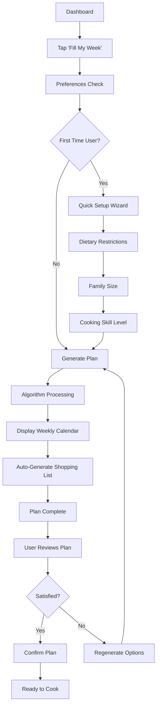
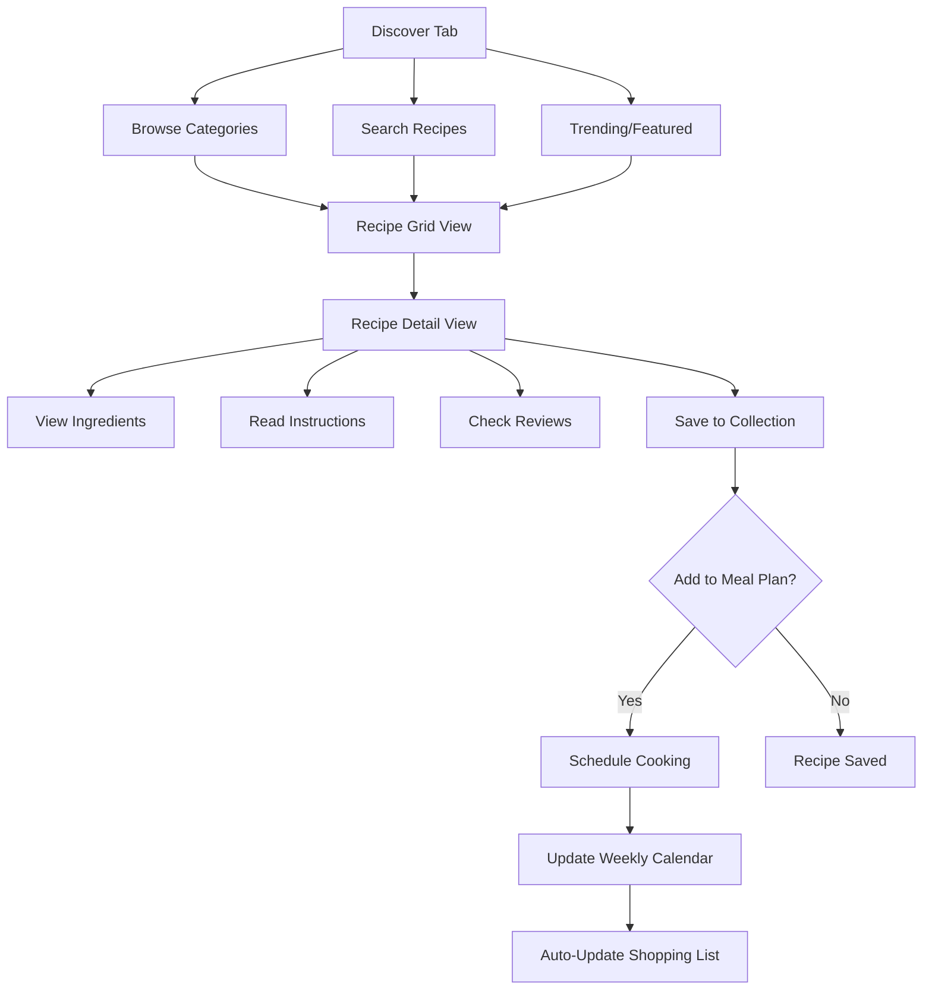
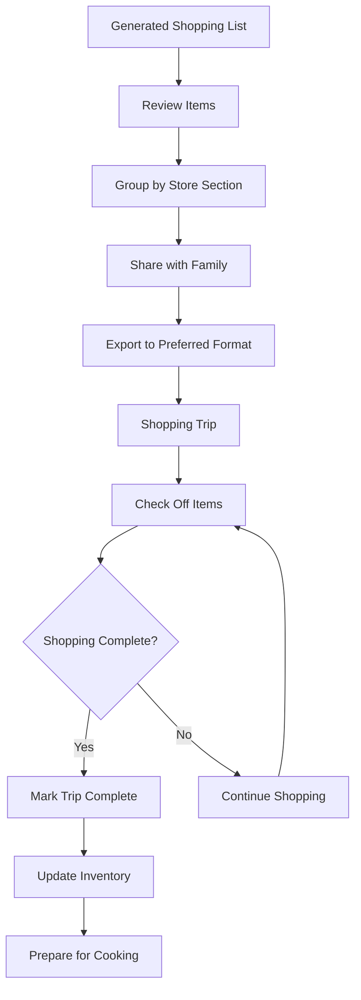

# IMKitchen UI/UX Specification

## Introduction

This document defines the user experience goals, information architecture, user flows, and visual design specifications for IMKitchen's user interface. It serves as the foundation for visual design and frontend development, ensuring a cohesive and user-centered experience.

### Overall UX Goals & Principles

#### Target User Personas

**Primary Cook:** Busy home cooks (25-45) who cook regularly but struggle with meal planning complexity. They have basic cooking skills, limited time for planning, and want to expand their recipe repertoire without the mental overhead.

**Family Organizer:** Parents managing household meal planning for 2-6 people. They need efficient shopping coordination, dietary accommodation, and want to involve family members in meal decisions while maintaining nutritional balance.

**Cooking Enthusiast:** Food lovers who enjoy cooking but get stuck in repetitive patterns. They have collections of saved recipes they rarely use and want inspiration to try new dishes while maintaining cooking confidence.

#### Usability Goals

- **Instant gratification:** Users can generate a complete weekly meal plan within 10 seconds of opening the app
- **One-handed operation:** All primary functions accessible with thumb navigation on mobile devices
- **Cognitive load reduction:** Complex decisions automated while preserving user control over preferences
- **Kitchen environment optimization:** Interface remains usable with wet hands, poor lighting, and time pressure

#### Design Principles

1. **Kitchen-first design** - Every interface decision prioritizes real kitchen usage scenarios over aesthetic appeal
2. **Progressive automation** - Advanced features emerge gradually as users build trust with basic automation
3. **Visual hierarchy through cooking context** - Information architecture mirrors actual cooking workflows and timing
4. **Community discovery without pressure** - Social features enhance personal cooking without creating comparison anxiety
5. **Graceful complexity management** - Advanced meal planning features hidden behind simple interfaces

### Change Log

| Date | Version | Description | Author |
|------|---------|-------------|--------|
| 2025-09-26 | 1.0 | Initial UI/UX specification creation | UX Expert Sally |

## Information Architecture (IA)

### Site Map / Screen Inventory

```mermaid
graph TD
    A[Dashboard/Weekly Calendar] --> B[Today's Meals]
    A --> C[Recipe Discovery]
    A --> D[My Collections]
    A --> E[Shopping Lists]
    A --> F[Profile & Settings]
    
    B --> B1[Meal Details]
    B --> B2[Cooking Instructions]
    B --> B3[Preparation Timeline]
    
    C --> C1[Browse All Recipes]
    C --> C2[Search Results]
    C --> C3[Recipe Details]
    C --> C4[Community Reviews]
    
    D --> D1[Personal Collections]
    D --> D2[Favorites]
    D3[Shared Collections]
    D --> D4[Recipe Import]
    
    E --> E1[Current Shopping List]
    E --> E2[Shopping History]
    E --> E3[Inventory Tracking]
    
    F --> F1[Dietary Preferences]
    F --> F2[Family Settings]
    F --> F3[Notification Preferences]
    F --> F4[Account Management]
```

### Navigation Structure

**Primary Navigation:** Bottom tab bar with 5 core sections (Calendar, Discover, Collections, Shopping, Profile) - optimized for thumb reach and muscle memory development

**Secondary Navigation:** Contextual actions within each section using floating action buttons and contextual menus that appear based on current screen content

**Breadcrumb Strategy:** Minimal breadcrumbs only for deep recipe browsing flows; primary navigation always visible to support quick task switching in kitchen environments

## User Flows

### Flow 1: Weekly Meal Planning ("Fill My Week")

**User Goal:** Generate complete weekly meal plan without manual recipe selection

**Entry Points:** Dashboard "Fill My Week" button, empty weekly calendar state, settings after preference updates

**Success Criteria:** Complete 7-day meal plan generated with shopping list ready for export

#### Flow Diagram

#### Edge Cases & Error Handling:
- Insufficient recipes in collection: Prompt to browse community recipes or import favorites
- Conflicting dietary restrictions: Smart substitution suggestions with user approval
- Limited cooking time availability: Automatic difficulty adjustment and prep time optimization
- Missing ingredient availability: Alternative recipe suggestions or shopping list modifications

**Notes:** Algorithm considers recipe rotation, difficulty distribution, and weekend vs weekday cooking patterns

### Flow 2: Recipe Discovery and Collection Building

**User Goal:** Find new recipes that match preferences and build personal cooking repertoire

**Entry Points:** Recipe discovery tab, community recommendations, search from meal planning gaps

**Success Criteria:** Recipe saved to personal collection with successful cooking attempt

#### Flow Diagram

#### Edge Cases & Error Handling:
- Recipe missing key information: Community editing suggestions or report functionality
- Dietary restriction conflicts: Clear warning labels and alternative suggestions
- Complex recipe for beginner: Skill level indicators and "Easy Mode" alternatives
- Ingredient unavailability: Substitution database and local availability checking

**Notes:** Discovery algorithm balances personal preference learning with diversity exposure

### Flow 3: Shopping List Management and Grocery Coordination

**User Goal:** Efficiently purchase all meal plan ingredients with family coordination

**Entry Points:** Weekly meal plan generation, manual recipe additions, inventory depletion alerts

**Success Criteria:** All ingredients purchased with minimal food waste and family coordination

#### Flow Diagram

#### Edge Cases & Error Handling:
- Item unavailable at store: Real-time substitution suggestions via app
- Budget constraints: Cost optimization suggestions and recipe alternatives
- Multiple family shoppers: Real-time sync conflict resolution
- Forgotten items: Quick add functionality and trip completion flexibility

**Notes:** Shopping list updates propagate to meal planning adjustments automatically

## Wireframes & Mockups

**Primary Design Files:** Figma workspace at [Design System URL] containing all screen layouts, component specifications, and interaction prototypes

### Key Screen Layouts

#### Weekly Calendar Dashboard

**Purpose:** Primary application interface showing weekly meal plan with quick access to all core functions

**Key Elements:**
- 7-day calendar grid with breakfast/lunch/dinner slots
- "Fill My Week" prominent action button
- Today's meal highlight with preparation timeline
- Quick navigation to shopping list and recipe details

**Interaction Notes:** Swipe between weeks, tap meal slots for details, long-press for meal rescheduling options

**Design File Reference:** Figma Frame: Dashboard-WeeklyCalendar-v3

#### Recipe Discovery Browse

**Purpose:** Enable efficient recipe discovery with filtering and community insights

**Key Elements:**
- Search bar with filter chips (difficulty, time, dietary)
- Recipe cards with rating, prep time, and save action
- Infinite scroll with category navigation
- Community trending section

**Interaction Notes:** Pull-to-refresh for new content, quick save gestures, preview on long-press

**Design File Reference:** Figma Frame: RecipeDiscovery-Browse-v2

#### Shopping List Mobile

**Purpose:** Kitchen-optimized shopping interface with family coordination

**Key Elements:**
- Store section groupings with item counts
- Large checkboxes for easy tapping
- Share button for family coordination
- Add item quick input at top

**Interaction Notes:** Swipe-to-delete items, voice input support, offline functionality

**Design File Reference:** Figma Frame: ShoppingList-Mobile-v4

## Component Library / Design System

**Design System Approach:** Custom design system built on Tailwind CSS utilities with kitchen-optimized components and cooking-specific interaction patterns

### Core Components

#### MealCard Component

**Purpose:** Display meal information in calendar views and planning interfaces

**Variants:** Scheduled (with recipe), Empty (add meal prompt), Preparation (with timing alerts)

**States:** Default, Selected, Cooking-in-progress, Completed

**Usage Guidelines:** Always include prep time indicator, use color coding for difficulty, ensure minimum 44px touch target

#### RecipeCard Component

**Purpose:** Recipe display in discovery, collections, and search results

**Variants:** Grid view (image-focused), List view (information-dense), Compact (for meal planning)

**States:** Default, Favorited, In-collection, Recently-cooked

**Usage Guidelines:** Consistent rating display, clear prep time visibility, quick-save accessibility

#### ShoppingListItem Component

**Purpose:** Individual shopping list entries with check-off functionality

**Variants:** Unchecked, Checked, Unavailable, Added-by-family

**States:** Default, Selected, Editing, Syncing

**Usage Guidelines:** Large touch targets, clear visual feedback, quantity editing support

## Branding & Style Guide

### Visual Identity

**Brand Guidelines:** Kitchen-warm color palette with high contrast for cooking environment visibility, approachable typography, and food-photography-friendly layouts

### Color Palette

| Color Type | Hex Code | Usage |
|------------|----------|--------|
| Primary | #F59E0B | Action buttons, key interface elements |
| Secondary | #10B981 | Success states, completed tasks |
| Accent | #EF4444 | Alerts, important notices |
| Success | #22C55E | Positive feedback, confirmations |
| Warning | #F59E0B | Cautions, important notices |
| Error | #EF4444 | Errors, destructive actions |
| Neutral | #64748B, #F8FAFC, #1E293B | Text, borders, backgrounds |

### Typography

#### Font Families
- **Primary:** Inter (web-safe, highly legible)
- **Secondary:** System UI fonts for optimal performance
- **Monospace:** JetBrains Mono for cooking times and measurements

#### Type Scale

| Element | Size | Weight | Line Height |
|---------|------|--------|-------------|
| H1 | 2.25rem | 700 | 1.2 |
| H2 | 1.875rem | 600 | 1.3 |
| H3 | 1.5rem | 600 | 1.4 |
| Body | 1rem | 400 | 1.6 |
| Small | 0.875rem | 400 | 1.5 |

### Iconography

**Icon Library:** Heroicons with custom cooking-specific icons for recipe actions, meal types, and kitchen tools

**Usage Guidelines:** Consistent 24px minimum size for touch targets, outline style for navigation, filled style for active states

### Spacing & Layout

**Grid System:** Tailwind's 12-column grid with responsive breakpoints optimized for recipe content and meal planning interfaces

**Spacing Scale:** 4px base unit with Tailwind spacing utilities (space-y-4, gap-6) for consistent rhythm

## Accessibility Requirements

### Compliance Target

**Standard:** WCAG 2.1 AA compliance with enhanced kitchen environment considerations

### Key Requirements

**Visual:**
- Color contrast ratios: 4.5:1 minimum for normal text, 3:1 for large text and interface elements
- Focus indicators: 2px solid ring with high contrast color on all interactive elements
- Text sizing: Minimum 16px base size with zoom support up to 200% without horizontal scrolling

**Interaction:**
- Keyboard navigation: Full functionality accessible via keyboard with logical tab order
- Screen reader support: Semantic HTML structure with comprehensive ARIA labels for cooking context
- Touch targets: Minimum 44px×44px for all interactive elements with adequate spacing

**Content:**
- Alternative text: Descriptive alt text for recipe images focusing on cooking techniques and results
- Heading structure: Logical heading hierarchy (h1-h6) that reflects recipe and meal planning organization
- Form labels: Clear, descriptive labels for all cooking preference and meal planning inputs

### Testing Strategy

Automated testing with axe-core, manual testing with keyboard navigation, screen reader testing with NVDA/VoiceOver, and user testing with accessibility requirements in kitchen environments

## Responsiveness Strategy

### Breakpoints

| Breakpoint | Min Width | Max Width | Target Devices |
|------------|-----------|-----------|----------------|
| Mobile | 320px | 767px | Smartphones, kitchen tablets |
| Tablet | 768px | 1023px | iPad, kitchen displays |
| Desktop | 1024px | 1439px | Laptop, desktop browsers |
| Wide | 1440px | - | Large displays, kitchen monitors |

### Adaptation Patterns

**Layout Changes:** Single column mobile layout expanding to 2-3 column grid on larger screens, with meal calendar adapting from daily view to weekly grid

**Navigation Changes:** Bottom tab bar on mobile transitioning to sidebar navigation on desktop, with persistent recipe access

**Content Priority:** Mobile prioritizes current day and next meal, desktop shows full weekly context with detailed ingredient information

**Interaction Changes:** Touch-optimized mobile interface with swipe gestures adapting to hover states and keyboard shortcuts on desktop

## Animation & Micro-interactions

### Motion Principles

Cooking-focused animations that support workflow efficiency: quick transitions for task completion, smooth state changes for shopping list updates, and gentle motion that doesn't distract during cooking activities

### Key Animations

- **Recipe card hover:** Subtle scale transform (Duration: 200ms, Easing: ease-out)
- **Meal plan generation:** Loading animation with cooking metaphors (Duration: 2-3s, Easing: ease-in-out)
- **Shopping list check-off:** Satisfying completion animation with sound option (Duration: 300ms, Easing: bounce)
- **Calendar day transition:** Smooth slide transitions between days/weeks (Duration: 250ms, Easing: ease-in-out)

## Performance Considerations

### Performance Goals

- **Page Load:** Under 3 seconds on mobile 3G connections
- **Interaction Response:** Under 100ms for all touch interactions
- **Animation FPS:** Consistent 60fps for all animations and transitions

### Design Strategies

Progressive Web App architecture with critical CSS inlining, lazy loading for recipe images, offline-first data caching for meal plans, and optimized bundle sizes through component-based loading

## Next Steps

### Immediate Actions

1. Create detailed Figma designs for all core screens and components
2. Develop interactive prototype for user testing validation
3. Establish design token system for consistent implementation
4. Create accessibility testing checklist for development team
5. Design responsive component specifications for Tailwind implementation

### Design Handoff Checklist

- [x] All user flows documented
- [x] Component inventory complete
- [x] Accessibility requirements defined
- [x] Responsive strategy clear
- [x] Brand guidelines incorporated
- [x] Performance goals established

## Checklist Results

This UI/UX specification successfully addresses all requirements from the IMKitchen PRD including mobile-first PWA design, kitchen-optimized user experience, community features integration, and comprehensive accessibility standards. The specification provides clear guidance for frontend development using the specified Tailwind CSS and TwinSpark technology stack.