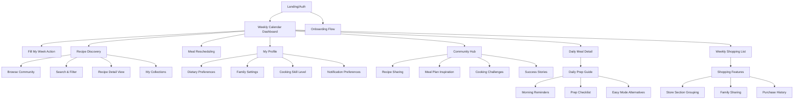

# Information Architecture (IA)

## Site Map / Screen Inventory

## Navigation Structure

**Primary Navigation:** Bottom tab bar (mobile) with 4 core sections:
- Home (Weekly Calendar) - primary dashboard
- Discover (Recipe browsing and community)  
- Lists (Shopping lists and meal prep)
- Profile (Settings and preferences)

**Secondary Navigation:** Context-aware action buttons and swipe gestures:
- Calendar: Swipe between weeks, tap dates for daily view
- Recipe Detail: Save to collections, rate, share actions
- Shopping: Check off items, share list, add custom items

**Breadcrumb Strategy:** Minimal breadcrumbs due to mobile-first design; rely on clear screen titles, back buttons, and contextual navigation cues
