# Information Architecture (IA)

## Site Map / Screen Inventory

```mermaid
graph TD
    A[Homepage/Landing] --> B[Dashboard]
    A --> C[Auth Flow]
    C --> C1[Register]
    C --> C2[Login]
    C --> C3[Password Reset]

    B --> D[Inventory]
    B --> E[Recipes]
    B --> F[Meal Planning]
    B --> G[Shopping Lists]
    B --> H[Cooking Mode]
    B --> I[Profile & Settings]

    D --> D1[Pantry View]
    D --> D2[Refrigerator View]
    D --> D3[Add/Edit Items]
    D --> D4[Expiration Alerts]
    D --> D5[Usage Analytics]

    E --> E1[Recipe Search]
    E --> E2[My Favorites]
    E --> E3[Recipe Collections]
    E --> E4[Recipe Details]
    E --> E5[Ingredient-Based Suggestions]
    E --> E6[Create Custom Recipe]

    F --> F1[Weekly Calendar]
    F --> F2[Meal Templates]
    F --> F3[Family Coordination]
    F --> F4[Meal History]

    G --> G1[Current Shopping List]
    G --> G2[Store Categories]
    G --> G3[Shopping History]
    G --> G4[Budget Tracking]

    H --> H1[Step-by-Step Guide]
    H --> H2[Timer Management]
    H --> H3[Voice Controls]
    H --> H4[Progress Tracking]

    I --> I1[Account Settings]
    I --> I2[Dietary Preferences]
    I --> I3[Household Management]
    I --> I4[Language & Localization]
    I --> I5[Notifications]
```

## Navigation Structure

**Primary Navigation:** Bottom tab bar on mobile with Dashboard, Inventory, Recipes, Meal Planning, and Shopping Lists. Desktop features horizontal top navigation with same sections plus prominent search bar.

**Secondary Navigation:** Contextual sub-navigation within each primary section (e.g., Pantry/Fridge tabs in Inventory, Search/Favorites/Collections in Recipes). Floating action buttons for quick add functions.

**Breadcrumb Strategy:** Simple breadcrumbs for deep navigation paths, especially in recipe details and cooking mode. Voice-activated "Go back" commands supported throughout.
