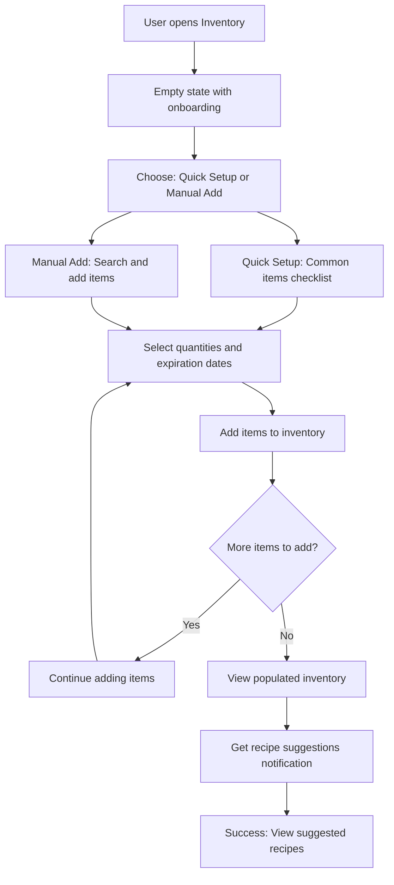
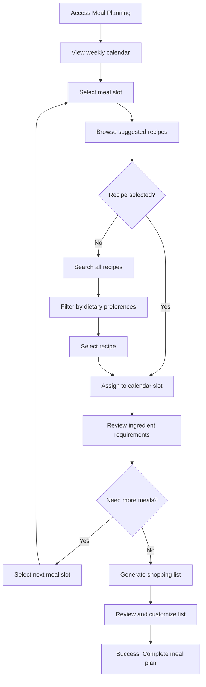

# User Flows

## Flow 1: First-Time Inventory Setup

**User Goal:** New user wants to set up their kitchen inventory to start getting personalized recipe suggestions

**Entry Points:** Dashboard onboarding, Inventory section, Recipe suggestions prompt

**Success Criteria:** User adds 10+ pantry/fridge items and receives first ingredient-based recipe recommendations

### Flow Diagram



### Edge Cases & Error Handling:

- User adds items without expiration dates - system provides smart defaults based on item type
- Duplicate item detection with merge/separate options
- Network failure during setup - offline mode saves entries locally with sync notification
- User overwhelmed by options - simplified quick setup with most common items

**Notes:** Include visual progress indicator and ability to skip/return later. Voice input option for hands-free bulk entry.

## Flow 2: Weekly Meal Planning

**User Goal:** Plan a complete week of meals using available inventory and personal preferences

**Entry Points:** Dashboard meal planning widget, Calendar view, Recipe suggestions

**Success Criteria:** User assigns meals to calendar slots and generates comprehensive shopping list

### Flow Diagram



### Edge Cases & Error Handling:

- Conflicting dietary restrictions between family members - household preference resolution
- No suitable recipes for available ingredients - expand search or suggest shopping items
- Calendar conflicts with family schedules - integration with calendar apps or manual override
- Budget constraints exceeded - alternative recipe suggestions with cost optimization

**Notes:** Drag-and-drop support for desktop, smart suggestions based on cooking time and complexity distribution across week.

## Flow 3: Hands-Free Cooking Mode

**User Goal:** Cook a recipe step-by-step using voice commands while hands are occupied

**Entry Points:** Recipe details page, meal planning execution, cooking mode shortcut

**Success Criteria:** Complete recipe execution with timer management and progress tracking without touching device

### Flow Diagram

```mermaid
graph TD
    A[Start Cooking Mode] --> B[Recipe preparation overview]
    B --> C[Voice: "Start cooking"]
    C --> D[Read first step aloud]
    D --> E[Set automatic timers]
    E --> F[Voice: "Next step" or wait for timer]
    F --> G{More steps?}
    G -->|Yes| H[Read next step]
    G -->|No| I[Recipe completion celebration]
    H --> E
    I --> J[Prompt for feedback and photos]
    J --> K[Update inventory quantities]
    K --> L[Success: Meal completed]

    E --> M[Voice: "Set timer for X minutes"]
    M --> N[Timer running with alerts]
    N --> F

    F --> O[Voice: "Repeat step"]
    O --> H

    F --> P[Voice: "Pause cooking"]
    P --> Q[Save progress and pause all timers]
    Q --> R[Resume when ready]
    R --> D
```

### Edge Cases & Error Handling:

- Voice recognition failure in noisy kitchen - visual fallback with large touch targets
- Multiple timers running simultaneously - clear verbal identification and prioritization
- Cooking ahead/behind schedule - adaptive timing suggestions and step reordering
- Emergency stop needed - immediate "stop all" command with timer cancellation

**Notes:** Ambient noise filtering, multiple wake phrases, visual progress indicators for timer status.
