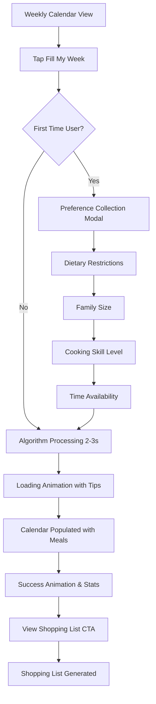
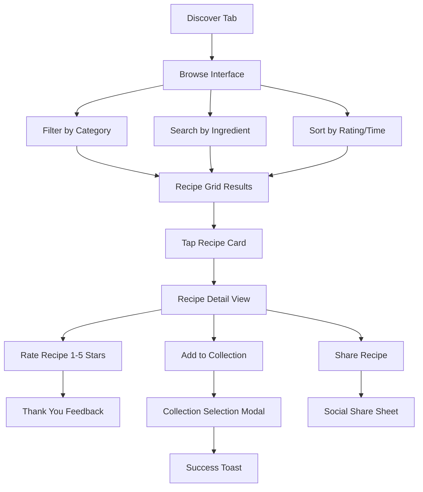

# User Flows

## Weekly Meal Planning Flow

**User Goal:** Generate a complete weekly meal plan without manual recipe selection

**Entry Points:** 
- Weekly Calendar dashboard "Fill My Week" button
- Empty calendar state with prominent call-to-action
- Onboarding completion pathway

**Success Criteria:** 
- 7 days populated with breakfast/lunch/dinner
- No duplicate recipes (until collection exhausted)  
- Color-coded prep complexity indicators visible
- Shopping list automatically generated and accessible

### Flow Diagram

### Edge Cases & Error Handling:
- Insufficient recipes in collections → suggest community recipe discovery
- Algorithm timeout (>5 seconds) → offer simplified weekly template
- All dietary restrictions → graceful degradation with substitution suggestions
- Network failure → offline mode with cached recipes, sync when available

**Notes:** Algorithm must balance variety, complexity distribution, and prep timing. Weekend meals can be more complex. Success feedback shows stats (variety improvement, time saved).

## Recipe Discovery & Rating Flow

**User Goal:** Find new recipes from community and build personal collection

**Entry Points:**
- Discover tab in primary navigation
- Empty meal slot "Browse recipes" action
- Community recommendations in weekly planning

**Success Criteria:**
- Recipe collection expanded with rated items
- Community ratings contributed for recipe quality
- Personal collections organized by user preferences

### Flow Diagram

### Edge Cases & Error Handling:
- No search results → suggest related recipes or community-suggested alternatives
- Rating submission failure → queue for offline submission, retry automatically
- Full collections → suggest creating new collection or removing old recipes
- Inappropriate content → report mechanism with community moderation

**Notes:** Discovery emphasizes visual recipe cards with ratings, prep time, and difficulty. Personal collections sync across devices. Community ratings build recipe quality intelligence.
