# Information Architecture (IA)

## Site Map / Screen Inventory

```mermaid
graph TD
    A[Home Dashboard] --> B[Meal Calendar]
    A --> C[Recipe Collection]
    A --> D[Discover Recipes]
    A --> E[Shopping Lists]
    A --> F[Prep Tasks]
    A --> G[Profile & Settings]
    
    B --> B1[Week View]
    B --> B2[Day Detail]
    B --> B3[Fill My Week]
    B --> B4[Meal Rescheduling]
    
    C --> C1[My Recipes]
    C --> C2[Favorited Recipes]
    C --> C3[Recipe Creation]
    C --> C4[Recipe Detail View]
    C --> C5[Recipe Editing]
    
    D --> D1[Browse Community]
    D --> D2[Search & Filter]
    D --> D3[Trending Recipes]
    D --> D4[Recipe Preview]
    D5[Import to Collection]
    
    E --> E1[Current Week List]
    E --> E2[Shopping History]
    E --> E3[Custom Items]
    
    F --> F1[Today's Tasks]
    F --> F2[Upcoming Prep]
    F3[Task History]
    F --> F4[Timing Insights]
    
    G --> G1[Account Settings]
    G --> G2[Notification Preferences]
    G --> G3[Dietary Preferences]
    G --> G4[Collection Management]
    
    C4 --> C4A[Ingredients & Steps]
    C4 --> C4B[Timing Timeline]
    C4 --> C4C[Community Reviews]
    C4 --> C4D[Nutritional Info]
```

## Navigation Structure

**Primary Navigation (Bottom Tab Bar - Mobile):**
- Home Dashboard (central hub with today's meals and tasks)
- Calendar (meal planning and weekly overview)
- Recipes (personal collection and creation)
- Discover (community recipes and trends)
- Profile (settings and preferences)

**Secondary Navigation:**
- Contextual actions within each primary section (search, filter, add, edit)
- Quick access floating action buttons for "Fill My Week" and "Add Recipe"
- Swipe gestures for common actions (mark task complete, reschedule meals)

**Breadcrumb Strategy:**
- Minimal breadcrumbs due to mobile-first design
- Clear "Back" navigation with contextual labels ("Back to Recipe", "Back to Calendar")
- Tab state persistence when navigating deep into sections
