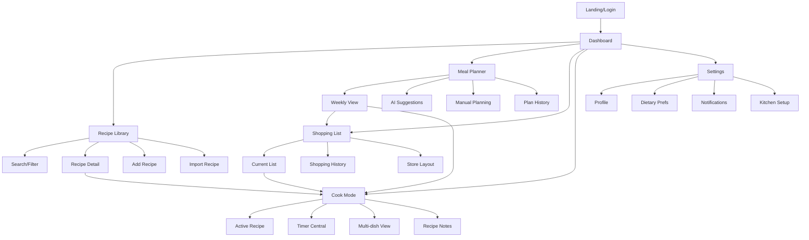

# Information Architecture (IA)

## Site Map / Screen Inventory

## Navigation Structure

**Primary Navigation:** Bottom tab bar (mobile) / Left sidebar (desktop) with 5 core sections:
- Dashboard (home icon) - Central hub and today's focus
- Recipes (book icon) - Library and recipe management
- Planning (calendar icon) - Meal planning and scheduling
- Shopping (cart icon) - Shopping lists and grocery management  
- Cook (chef hat icon) - Active cooking mode and timers

**Secondary Navigation:** Context-aware top navigation and floating action buttons based on current task phase

**Breadcrumb Strategy:** Minimal breadcrumbs only in Cook Mode to show recipe → step progression; elsewhere rely on clear back/close actions
