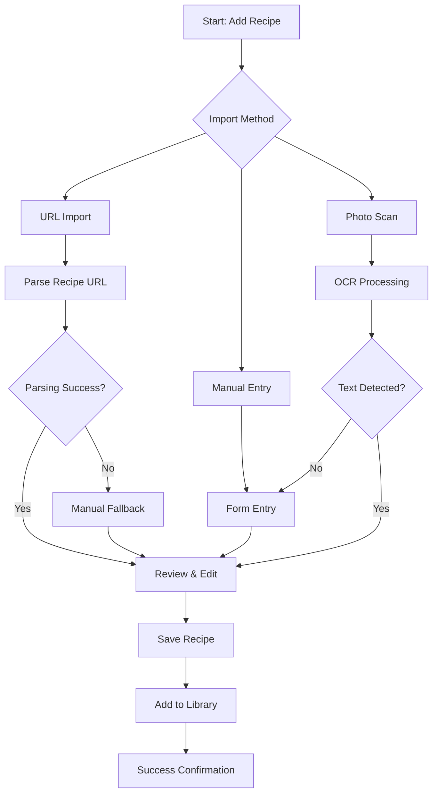
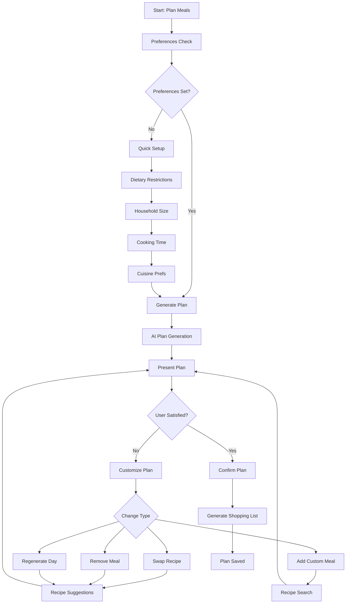
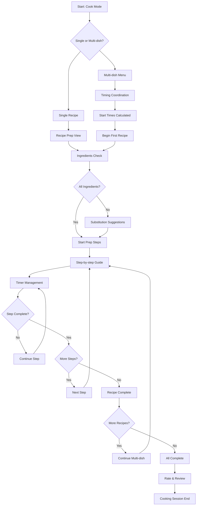

# User Flows

## Recipe Import & Management Flow

**User Goal:** Add new recipes to personal collection from various sources

**Entry Points:** Recipe Library "Add Recipe" button, URL sharing into app, dashboard quick actions

**Success Criteria:** Recipe successfully parsed, stored, and available in searchable library

### Flow Diagram

### Edge Cases & Error Handling:
- URL parsing failures trigger manual entry mode with pre-filled detected text
- Duplicate recipe detection offers merge/replace options
- Network failures during import save partial data locally for retry
- Image upload failures provide camera retry and skip options

**Notes:** Import flow emphasizes quick success with graceful fallback options for parsing failures

## Meal Planning Flow

**User Goal:** Generate and customize weekly meal plan based on preferences and constraints

**Entry Points:** Dashboard meal planning widget, dedicated Planning tab, empty meal plan state

**Success Criteria:** Complete weekly meal plan with balanced nutrition, optimized ingredients, and timing feasibility

### Flow Diagram

### Edge Cases & Error Handling:
- No suitable recipes found for constraints offers relaxed criteria options
- Conflicting dietary preferences show trade-off explanations
- Plan generation failures provide manual planning tools
- Ingredient conflicts in customization trigger optimization suggestions

**Notes:** Flow balances AI automation with user control, always allowing manual override

## Cook Mode Flow

**User Goal:** Execute recipe(s) successfully with timing coordination and step-by-step guidance

**Entry Points:** Recipe detail "Start Cooking", meal plan "Cook Now", dashboard active cooking widget

**Success Criteria:** All dishes completed within timing targets with successful coordination

### Flow Diagram

### Edge Cases & Error Handling:
- Timer failures provide manual time tracking and notifications
- Recipe modifications during cooking recalculate all dependent timings
- Emergency pause stops all timers and provides restart options
- Missing ingredients mid-cooking offer substitution or adaptation guidance

**Notes:** Cook Mode prioritizes clear progression and timing accuracy above all other features
