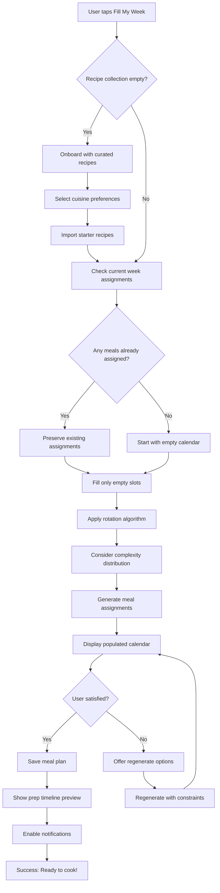
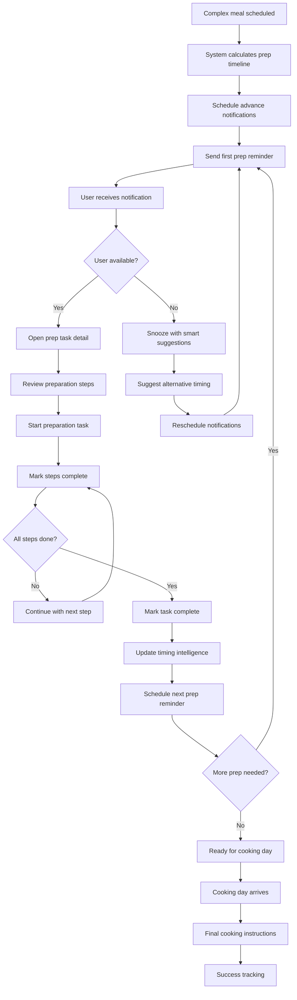
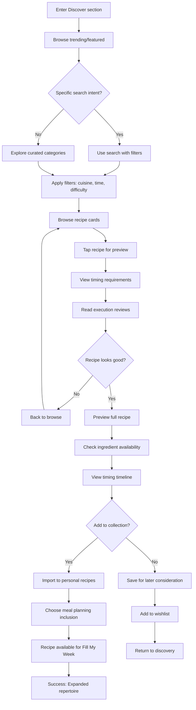

# User Flows

## Flow 1: "Fill My Week" Automation

**User Goal:** Generate a complete weekly meal plan in under 30 seconds to eliminate decision fatigue

**Entry Points:** 
- Dashboard "Fill My Week" button
- Empty calendar state prompt
- Weekly planning reminder notification

**Success Criteria:** User has 7 days of meals assigned with visible prep timing indicators

### Flow Diagram

### Edge Cases & Error Handling:
- Recipe collection too small (< 7 recipes): Prompt to add more or accept repeats
- All recipes too complex for week: Suggest simpler alternatives or spread complexity
- User dietary restrictions conflict: Filter incompatible recipes automatically
- Technical failure during generation: Graceful degradation with manual assignment option
- Network offline: Use cached recipes and sync when reconnected

## Flow 2: Timing Intelligence Workflow

**User Goal:** Successfully coordinate complex recipe preparation through automated notifications and task management

**Entry Points:**
- Meal calendar showing upcoming complex recipes
- Notification prompt for advance preparation
- Recipe detail view timing timeline

**Success Criteria:** User completes all preparation steps on time and cooks meal successfully

### Flow Diagram

### Edge Cases & Error Handling:
- User misses critical prep window: Suggest recipe modifications or substitutions
- Preparation takes longer than estimated: Learn and adjust future timing
- User reports timing inaccuracy: Collect feedback and update algorithm
- Notification delivery failure: Use multiple delivery methods and in-app fallbacks
- Life disrupts schedule: Intelligent rescheduling with minimal user input

## Flow 3: Community Recipe Discovery

**User Goal:** Find new recipes with confidence in execution success based on community feedback

**Entry Points:**
- Discover tab exploration
- Search for specific cuisine or dish
- Trending recipe notifications
- Similar recipe suggestions

**Success Criteria:** User adds new recipe to collection and successfully cooks it

### Flow Diagram

### Edge Cases & Error Handling:
- No recipes match search criteria: Suggest broader search or alternative cuisines
- Recipe has poor timing reviews: Display warnings and alternative suggestions
- Ingredient unavailability: Suggest substitutions or seasonal alternatives
- Network issues during import: Queue for later sync with clear status indication
- User reaches collection limits: Prompt for curation or premium upgrade
