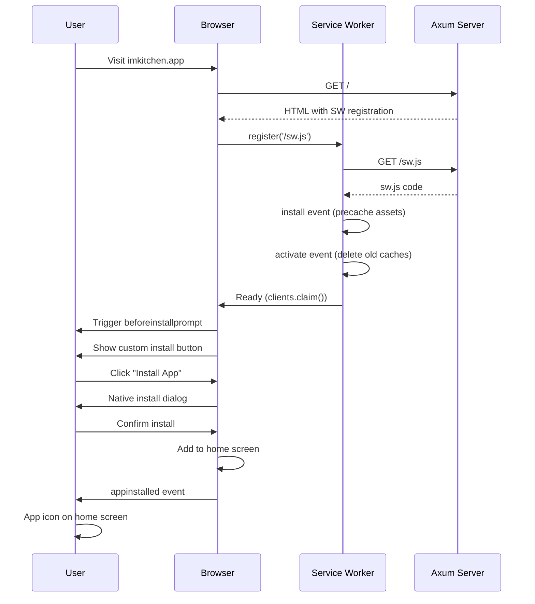
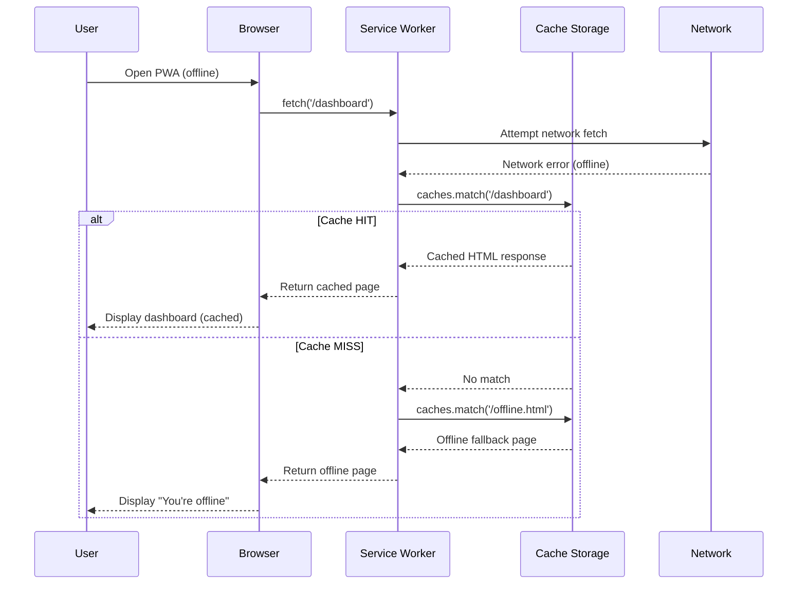
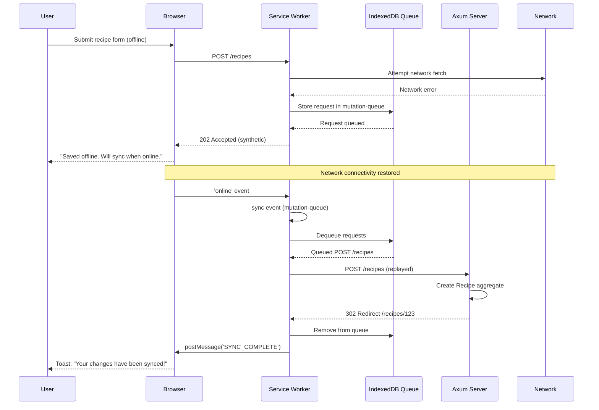
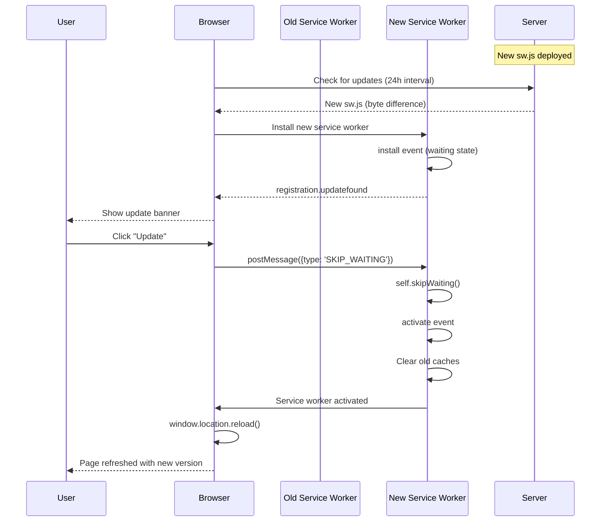

# Technical Specification: Progressive Web App & Mobile Experience

Date: 2025-10-11
Author: Jonathan
Epic ID: 5
Status: Draft

---

## Overview

Epic 5 delivers the Progressive Web App (PWA) capabilities and mobile-optimized experience for imkitchen, enabling offline recipe access, touch-optimized interactions, and kitchen-friendly display modes. This epic transforms the server-rendered web application into an installable PWA with service worker-based offline caching, responsive breakpoints for mobile/tablet/desktop, and specialized CSS modes for kitchen environments. The implementation leverages Workbox 7.1+ for sophisticated caching strategies, Web App Manifest for installability, and Tailwind CSS responsive utilities for adaptive layouts across device sizes.

**Key Value Delivered:**
- Offline recipe access in kitchen environments without connectivity concerns
- Installable app experience on iOS Safari 14+ and Android Chrome 90+
- Touch-optimized interface with 44x44px minimum tap targets
- Kitchen-friendly display modes (high contrast, large text)
- Cross-browser compatibility and responsive design (mobile <768px, tablet 768-1024px, desktop >1024px)
- Real-time sync when connectivity restored via Background Sync API

**Epic Scope:** 9 stories covering PWA manifest, service worker implementation, offline caching strategies, mobile-responsive design patterns, touch optimization, specialized kitchen modes, background sync, cross-browser testing, and installable app experience.

## Objectives and Scope

### Primary Objectives

1. **Offline Capability**: Enable users to access recipes, meal plans, and cooking instructions without internet connectivity, with service worker caching strategies supporting stale-while-revalidate for HTML and cache-first for static assets.

2. **Mobile-First Responsive Design**: Deliver adaptive layouts optimized for mobile (<768px), tablet (768-1024px), and desktop (>1024px) breakpoints, with touch-optimized 44x44px tap targets and kitchen-friendly interaction patterns.

3. **Installable PWA Experience**: Provide native-like app installation on home screen via Web App Manifest, with standalone display mode, splash screens, and proper app icons (192x192, 512x512 maskable variants).

4. **Kitchen Environment Optimization**: Implement specialized CSS modes (high contrast 7:1 ratios, large text +4px) for kitchen environments with varied lighting and hands-free operation requirements.

5. **Cross-Browser Compatibility**: Ensure consistent PWA functionality across iOS Safari 14+, Android Chrome 90+, and desktop browsers, with graceful degradation for unsupported features.

### In Scope

- PWA manifest.json with proper metadata, icons, and display settings
- Service worker implementation using Workbox 7.1+ with precaching and runtime caching
- Offline caching strategies: stale-while-revalidate (HTML), cache-first (images), network-first with fallback (data)
- Responsive breakpoints and Tailwind CSS configuration for mobile/tablet/desktop
- Touch target optimization (44x44px minimum per WCAG 2.1 Level AA)
- Kitchen mode CSS toggle (high contrast, large text) stored in user profile
- Background Sync API for queuing offline mutations (create recipe, rate recipe)
- Cross-browser testing suite (Playwright) covering iOS Safari, Android Chrome, Firefox, desktop Chrome
- Installation prompts and add-to-home-screen guidance
- Service worker lifecycle management (registration, update detection, skip waiting)

### Out of Scope

- Native mobile apps (iOS/Android) - PWA sufficient for MVP per architecture decisions
- Voice control features (deferred to future phase, though accessibility hooks prepared)
- Advanced gesture controls (pinch-to-zoom, swipe navigation beyond native browser)
- Offline payment processing (Stripe requires connectivity)
- Push notification rich media (MVP uses basic text notifications)
- Service worker A/B testing or feature flags

## System Architecture Alignment

### Architecture Context

Epic 5 implements the PWA and mobile-responsive layers of the imkitchen architecture as defined in the Solution Architecture Document. The system follows an **offline-first progressive enhancement** approach where:

1. **Server-Rendered Foundation**: Axum serves HTML via Askama templates with full page content
2. **Service Worker Layer**: Workbox intercepts requests, serves cached content when offline
3. **Progressive Enhancement**: TwinSpark provides AJAX interactivity on top of functional HTML
4. **Responsive Adaptation**: Tailwind CSS utilities adapt layouts per device breakpoint
5. **Offline Sync**: Background Sync queues mutations when offline, syncs on reconnect

### Architectural Components

```
┌─────────────────────────────────────────────────────────────┐
│                    Browser / Mobile Device                   │
│  ┌───────────────────────────────────────────────────────┐  │
│  │              Installed PWA (Standalone)                │  │
│  │  ┌─────────────────────────────────────────────────┐  │  │
│  │  │          Service Worker (sw.js)                  │  │  │
│  │  │  ┌─────────────┐  ┌─────────────┐              │  │  │
│  │  │  │  Workbox    │  │ Background  │              │  │  │
│  │  │  │  Caching    │  │    Sync     │              │  │  │
│  │  │  └──────┬──────┘  └──────┬──────┘              │  │  │
│  │  └─────────┼─────────────────┼─────────────────────┘  │  │
│  │            │                 │                         │  │
│  │  ┌─────────▼─────────────────▼─────────────────────┐  │  │
│  │  │           Cache Storage (CacheAPI)               │  │  │
│  │  │  ┌──────────┐ ┌──────────┐ ┌──────────┐        │  │  │
│  │  │  │  pages   │ │  images  │ │   api    │        │  │  │
│  │  │  │  cache   │ │  cache   │ │  cache   │        │  │  │
│  │  │  └──────────┘ └──────────┘ └──────────┘        │  │  │
│  │  └──────────────────────────────────────────────────┘  │  │
│  │                                                         │  │
│  │  ┌──────────────────────────────────────────────────┐  │  │
│  │  │        Responsive UI (Tailwind CSS)              │  │  │
│  │  │  ┌────────────┐ ┌────────────┐ ┌────────────┐  │  │  │
│  │  │  │  Mobile    │ │  Tablet    │ │  Desktop   │  │  │  │
│  │  │  │  <768px    │ │768-1024px  │ │  >1024px   │  │  │  │
│  │  │  └────────────┘ └────────────┘ └────────────┘  │  │  │
│  │  │         ┌──────────────────────┐               │  │  │
│  │  │         │   Kitchen Mode CSS   │               │  │  │
│  │  │         │ (High Contrast/Large)│               │  │  │
│  │  │         └──────────────────────┘               │  │  │
│  │  └──────────────────────────────────────────────────┘  │  │
│  │                                                         │  │
│  │  ┌──────────────────────────────────────────────────┐  │  │
│  │  │       TwinSpark Progressive Enhancement          │  │  │
│  │  │  (AJAX behaviors, form interception)             │  │  │
│  │  └──────────────────────────────────────────────────┘  │  │
│  └───────────────────────────────────────────────────────┘  │
│                           │                                  │
│                           │ HTTP Requests                    │
│                           ▼                                  │
└─────────────────────────────────────────────────────────────┘
                            │
                            ▼
          ┌─────────────────────────────────────┐
          │   Axum HTTP Server (Rust Backend)   │
          │  (Server-Side Rendering + Domain)   │
          └─────────────────────────────────────┘
```

### Integration Points

1. **Manifest.json**: Served as static asset at `/manifest.json`, linked in `<head>` of base.html template
2. **Service Worker Registration**: JavaScript in base.html registers `/sw.js` on page load
3. **Cache Invalidation**: Service worker version updated in CI/CD triggers browser update
4. **Offline Sync**: Background Sync API queues failed POST/PUT requests, retries on reconnect
5. **Responsive Breakpoints**: Tailwind CSS classes in Askama templates adapt per viewport
6. **Kitchen Mode**: User profile setting triggers CSS class on `<body>` tag, applies high-contrast/large-text styles

### Technology Stack Alignment

| Component | Technology | Version | Justification |
|-----------|------------|---------|---------------|
| **Service Worker Framework** | Workbox | 7.1+ | Industry-standard PWA toolkit, precaching + runtime strategies |
| **CSS Framework** | Tailwind CSS | 4.1+ | Utility-first responsive design, mobile-first breakpoints |
| **Template Engine** | Askama | 0.14+ | Server-side rendering with responsive classes in templates |
| **HTTP Server** | Axum | 0.8+ | Serves manifest.json, service worker, static assets |
| **Testing** | Playwright | 1.56+ | Cross-browser PWA testing (iOS Safari, Android Chrome) |
| **Build Tool** | npm/webpack | Latest | Workbox CLI for service worker generation |

## Detailed Design

### Services and Modules

#### Module 1: PWA Manifest Configuration

**File**: `/static/manifest.json`

**Structure**:
```json
{
  "name": "imkitchen - Intelligent Meal Planning",
  "short_name": "imkitchen",
  "description": "Automated meal planning and cooking optimization",
  "start_url": "/dashboard",
  "display": "standalone",
  "background_color": "#ffffff",
  "theme_color": "#2563eb",
  "orientation": "portrait-primary",
  "scope": "/",
  "icons": [
    {
      "src": "/static/icons/icon-192.png",
      "sizes": "192x192",
      "type": "image/png",
      "purpose": "any maskable"
    },
    {
      "src": "/static/icons/icon-512.png",
      "sizes": "512x512",
      "type": "image/png",
      "purpose": "any maskable"
    },
    {
      "src": "/static/icons/icon-192-maskable.png",
      "sizes": "192x192",
      "type": "image/png",
      "purpose": "maskable"
    },
    {
      "src": "/static/icons/icon-512-maskable.png",
      "sizes": "512x512",
      "type": "image/png",
      "purpose": "maskable"
    }
  ],
  "screenshots": [
    {
      "src": "/static/screenshots/dashboard-mobile.png",
      "sizes": "750x1334",
      "type": "image/png",
      "platform": "narrow",
      "label": "Dashboard view on mobile"
    },
    {
      "src": "/static/screenshots/recipe-detail-mobile.png",
      "sizes": "750x1334",
      "type": "image/png",
      "platform": "narrow",
      "label": "Recipe instructions"
    },
    {
      "src": "/static/screenshots/meal-calendar-desktop.png",
      "sizes": "1920x1080",
      "type": "image/png",
      "platform": "wide",
      "label": "Weekly meal calendar"
    }
  ],
  "categories": ["lifestyle", "food"],
  "shortcuts": [
    {
      "name": "Today's Meals",
      "short_name": "Dashboard",
      "description": "View today's meal plan",
      "url": "/dashboard",
      "icons": [{ "src": "/static/icons/shortcut-dashboard.png", "sizes": "96x96" }]
    },
    {
      "name": "Recipes",
      "short_name": "Recipes",
      "description": "Browse recipe library",
      "url": "/recipes",
      "icons": [{ "src": "/static/icons/shortcut-recipes.png", "sizes": "96x96" }]
    }
  ],
  "prefer_related_applications": false
}
```

**Key Fields**:
- `start_url`: `/dashboard` - Opens to authenticated user's dashboard on launch
- `display: standalone`: Hides browser UI chrome for native app feel
- `orientation: portrait-primary`: Lock to portrait on mobile (kitchen use case)
- `icons`: Maskable variants for adaptive icons on Android
- `screenshots`: App Store-style previews for installation prompt
- `shortcuts`: Quick access to key features from home screen long-press

**Manifest Linking** in `templates/base.html`:
```html
<head>
  <link rel="manifest" href="/manifest.json">
  <meta name="theme-color" content="#2563eb">
  <meta name="apple-mobile-web-app-capable" content="yes">
  <meta name="apple-mobile-web-app-status-bar-style" content="default">
  <meta name="apple-mobile-web-app-title" content="imkitchen">
  <link rel="apple-touch-icon" href="/static/icons/icon-192.png">
</head>
```

---

#### Module 2: Service Worker Implementation (Workbox)

**File**: `/static/sw.js`

**Service Worker Structure**:
```javascript
// Import Workbox from CDN (build process can inline for production)
importScripts('https://storage.googleapis.com/workbox-cdn/releases/7.1.0/workbox-sw.js');

const { precacheAndRoute } = workbox.precaching;
const { registerRoute } = workbox.routing;
const { StaleWhileRevalidate, CacheFirst, NetworkFirst } = workbox.strategies;
const { ExpirationPlugin } = workbox.expiration;
const { BackgroundSyncPlugin } = workbox.backgroundSync;
const { CacheableResponsePlugin } = workbox.cacheableResponse;

// Precache static assets (generated by Workbox CLI during build)
// __WB_MANIFEST is replaced with precache manifest by workbox-cli
precacheAndRoute(self.__WB_MANIFEST);

// Strategy 1: HTML Pages - Stale-While-Revalidate
// Serve cached version immediately, update cache in background
registerRoute(
  ({ request }) => request.mode === 'navigate',
  new StaleWhileRevalidate({
    cacheName: 'pages-cache',
    plugins: [
      new CacheableResponsePlugin({
        statuses: [0, 200], // Cache successful responses
      }),
      new ExpirationPlugin({
        maxEntries: 50, // Limit cache size
        maxAgeSeconds: 7 * 24 * 60 * 60, // 7 days
      }),
    ],
  })
);

// Strategy 2: Images - Cache-First
// Serve from cache, only fetch if not cached
registerRoute(
  ({ request }) => request.destination === 'image',
  new CacheFirst({
    cacheName: 'images-cache',
    plugins: [
      new CacheableResponsePlugin({
        statuses: [0, 200],
      }),
      new ExpirationPlugin({
        maxEntries: 100,
        maxAgeSeconds: 30 * 24 * 60 * 60, // 30 days
      }),
    ],
  })
);

// Strategy 3: CSS/JS - Cache-First with versioning
registerRoute(
  ({ request }) => request.destination === 'style' ||
                   request.destination === 'script',
  new CacheFirst({
    cacheName: 'static-resources',
    plugins: [
      new CacheableResponsePlugin({
        statuses: [0, 200],
      }),
      new ExpirationPlugin({
        maxEntries: 60,
        maxAgeSeconds: 365 * 24 * 60 * 60, // 1 year
      }),
    ],
  })
);

// Strategy 4: API/Data Requests - Network-First with Offline Fallback
registerRoute(
  ({ url }) => url.pathname.startsWith('/recipes') ||
               url.pathname.startsWith('/plan') ||
               url.pathname.startsWith('/shopping'),
  new NetworkFirst({
    cacheName: 'api-cache',
    plugins: [
      new CacheableResponsePlugin({
        statuses: [0, 200],
      }),
      new ExpirationPlugin({
        maxEntries: 50,
        maxAgeSeconds: 24 * 60 * 60, // 1 day
      }),
    ],
    networkTimeoutSeconds: 5, // Fallback to cache after 5s
  })
);

// Strategy 5: Background Sync for Offline Mutations
const bgSyncPlugin = new BackgroundSyncPlugin('mutation-queue', {
  maxRetentionTime: 24 * 60, // Retry for 24 hours
});

registerRoute(
  ({ request }) => request.method === 'POST' ||
                   request.method === 'PUT' ||
                   request.method === 'DELETE',
  new NetworkFirst({
    plugins: [bgSyncPlugin],
  })
);

// Service Worker Lifecycle: Skip Waiting on Update
self.addEventListener('message', (event) => {
  if (event.data && event.data.type === 'SKIP_WAITING') {
    self.skipWaiting();
  }
});

// Offline Fallback Page
const OFFLINE_HTML = '/offline.html';

// Cache offline fallback page during install
self.addEventListener('install', (event) => {
  event.waitUntil(
    caches.open('offline-fallback')
      .then((cache) => cache.add(OFFLINE_HTML))
  );
});

// Serve offline fallback for navigation requests when network fails
self.addEventListener('fetch', (event) => {
  if (event.request.mode === 'navigate') {
    event.respondWith(
      fetch(event.request)
        .catch(() => caches.match(OFFLINE_HTML))
    );
  }
});

// Clear old caches on activation
self.addEventListener('activate', (event) => {
  const currentCaches = [
    'pages-cache',
    'images-cache',
    'static-resources',
    'api-cache',
    'offline-fallback',
    'workbox-precache-v2-https://imkitchen.app/' // Workbox precache
  ];

  event.waitUntil(
    caches.keys().then((cacheNames) => {
      return Promise.all(
        cacheNames.map((cacheName) => {
          if (!currentCaches.includes(cacheName)) {
            console.log('Deleting old cache:', cacheName);
            return caches.delete(cacheName);
          }
        })
      );
    })
  );
});
```

**Service Worker Registration** in `templates/base.html`:
```html
<script>
  if ('serviceWorker' in navigator) {
    window.addEventListener('load', () => {
      navigator.serviceWorker.register('/sw.js')
        .then((registration) => {
          console.log('Service Worker registered:', registration);

          // Check for updates every 24 hours
          setInterval(() => {
            registration.update();
          }, 24 * 60 * 60 * 1000);

          // Handle service worker updates
          registration.addEventListener('updatefound', () => {
            const newWorker = registration.installing;
            newWorker.addEventListener('statechange', () => {
              if (newWorker.state === 'installed' && navigator.serviceWorker.controller) {
                // New service worker available, show update prompt
                showUpdateNotification();
              }
            });
          });
        })
        .catch((error) => {
          console.error('Service Worker registration failed:', error);
        });
    });
  }

  function showUpdateNotification() {
    // Display toast notification: "New version available. Refresh to update."
    const toast = document.createElement('div');
    toast.className = 'update-toast';
    toast.innerHTML = `
      <p>New version available!</p>
      <button onclick="updateServiceWorker()">Update</button>
      <button onclick="this.parentElement.remove()">Dismiss</button>
    `;
    document.body.appendChild(toast);
  }

  function updateServiceWorker() {
    navigator.serviceWorker.getRegistration().then((registration) => {
      if (registration && registration.waiting) {
        // Tell waiting service worker to skip waiting
        registration.waiting.postMessage({ type: 'SKIP_WAITING' });
        // Reload page to activate new service worker
        window.location.reload();
      }
    });
  }
</script>
```

**Workbox Build Configuration** (`workbox-config.js`):
```javascript
module.exports = {
  globDirectory: 'static/',
  globPatterns: [
    '**/*.{css,js,png,jpg,svg,woff,woff2}'
  ],
  swSrc: 'static/sw-src.js', // Source template
  swDest: 'static/sw.js', // Generated output
  maximumFileSizeToCacheInBytes: 5 * 1024 * 1024, // 5MB
};
```

**Build Command**:
```bash
npx workbox generateSW workbox-config.js
```

---

#### Module 3: Responsive Design System (Tailwind CSS)

**File**: `tailwind.config.js`

**Tailwind Configuration**:
```javascript
module.exports = {
  content: [
    './templates/**/*.html',
    './src/**/*.rs', // Scan Rust files for classes in format strings
  ],
  theme: {
    screens: {
      'sm': '640px',   // Small mobile (not used heavily in design)
      'md': '768px',   // Tablet breakpoint (portrait tablets)
      'lg': '1024px',  // Desktop breakpoint
      'xl': '1280px',  // Large desktop
      '2xl': '1536px', // Extra large desktop
    },
    extend: {
      colors: {
        primary: {
          50: '#eff6ff',
          100: '#dbeafe',
          200: '#bfdbfe',
          300: '#93c5fd',
          400: '#60a5fa',
          500: '#2563eb', // Main primary color
          600: '#1d4ed8',
          700: '#1e40af',
          800: '#1e3a8a',
          900: '#1e3a8a',
        },
        secondary: {
          500: '#f59e0b',
          600: '#d97706',
        },
        success: { 500: '#10b981' },
        warning: { 500: '#f59e0b' },
        error: { 500: '#ef4444' },
      },
      spacing: {
        '18': '4.5rem',  // Custom spacing for kitchen mode
        '22': '5.5rem',
      },
      fontSize: {
        'xs-kitchen': ['0.875rem', { lineHeight: '1.5rem' }],
        'sm-kitchen': ['1rem', { lineHeight: '1.75rem' }],
        'base-kitchen': ['1.125rem', { lineHeight: '2rem' }],
        'lg-kitchen': ['1.375rem', { lineHeight: '2.25rem' }],
        'xl-kitchen': ['1.625rem', { lineHeight: '2.5rem' }],
      },
      minHeight: {
        'touch-target': '44px', // WCAG 2.1 Level AA touch target
      },
      minWidth: {
        'touch-target': '44px',
      },
    },
  },
  plugins: [
    require('@tailwindcss/forms'), // Form styling plugin
    require('@tailwindcss/typography'), // Rich text styling
  ],
}
```

**Responsive Pattern Examples**:

1. **Navigation (Mobile Bottom Bar → Desktop Sidebar)**:
```html
<!-- Mobile: Bottom tab bar -->
<nav class="fixed bottom-0 left-0 right-0 bg-white border-t border-gray-200
            md:relative md:border-t-0 md:border-r md:w-64 lg:w-72">
  <ul class="flex md:flex-col justify-around md:justify-start">
    <li class="flex-1 md:flex-initial">
      <a href="/dashboard"
         class="flex flex-col md:flex-row items-center justify-center md:justify-start
                p-3 md:px-6 md:py-4 text-gray-600 hover:text-primary-500
                min-h-touch-target">
        <svg class="w-6 h-6 md:mr-3"><!-- icon --></svg>
        <span class="text-xs md:text-base mt-1 md:mt-0">Dashboard</span>
      </a>
    </li>
    <!-- Additional nav items -->
  </ul>
</nav>
```

2. **Recipe Grid (Mobile 1-col → Tablet 2-col → Desktop 4-col)**:
```html
<div class="grid grid-cols-1 md:grid-cols-2 lg:grid-cols-4 gap-4 md:gap-6">
  
    <div class="recipe-card bg-white rounded-xl shadow-sm overflow-hidden">
      
      <div class="p-4 md:p-6">
        <h3 class="text-lg md:text-xl font-semibold mb-2">{{ recipe.title }}</h3>
        <p class="text-sm md:text-base text-gray-600">
          {{ recipe.prep_time_min }} min prep
        </p>
        <button class="mt-4 w-full btn-primary min-h-touch-target">
          View Recipe
        </button>
      </div>
    </div>
  
</div>
```

3. **Meal Calendar (Mobile Single Day → Desktop Full Week)**:
```html
<!-- Mobile: Single day view with swipe navigation -->
<div class="meal-calendar block md:hidden">
  <div class="calendar-day-single">
    <h2 class="text-2xl font-bold mb-4">{{ selected_date }}</h2>
    
      <div class="meal-slot mb-6 p-4 bg-white rounded-lg shadow
                  min-h-touch-target">
        <span class="text-sm text-gray-500 uppercase">{{ meal.type }}</span>
        <h3 class="text-xl font-semibold mt-2">{{ meal.recipe_title }}</h3>
        <button class="mt-3 btn-secondary min-h-touch-target">
          View Instructions
        </button>
      </div>
    
  </div>
  <!-- Swipe indicators -->
  <div class="flex justify-center gap-2 mt-4">
    
      <span class="w-2 h-2 rounded-full
                   {{ 'bg-primary-500' if day.is_selected else 'bg-gray-300' }}">
      </span>
    
  </div>
</div>

<!-- Desktop: Full week view -->
<div class="meal-calendar hidden md:grid md:grid-cols-7 gap-4">
  
    <div class="calendar-day">
      <h3 class="text-lg font-semibold mb-3 text-center">
        {{ day.day_name }}
      </h3>
      
        <div class="meal-slot mb-3 p-3 bg-white rounded-lg shadow-sm">
          <span class="text-xs text-gray-500 uppercase">{{ meal.type }}</span>
          <h4 class="text-sm font-medium mt-1">{{ meal.recipe_title }}</h4>
        </div>
      
    </div>
  
</div>
```

**Touch Target Optimization**:
```css
/* Ensure all interactive elements meet 44x44px WCAG requirement */
.btn-primary, .btn-secondary, button, a[role="button"], input[type="button"] {
  @apply min-h-touch-target min-w-touch-target;
  padding: 0.75rem 1.5rem; /* Comfortable padding within touch target */
}

/* Icon buttons get explicit sizing */
.icon-button {
  @apply w-11 h-11; /* 44px minimum */
  @apply flex items-center justify-center;
}

/* Form inputs also sized appropriately */
input[type="text"], input[type="email"], input[type="password"],
select, textarea {
  @apply min-h-touch-target;
  padding: 0.75rem 1rem;
}
```

---

#### Module 4: Kitchen Mode CSS

**File**: `static/css/kitchen-mode.css`

**Kitchen Mode Implementation**:
```css
/* Kitchen Mode Toggle - Applied to <body> when enabled */
body.kitchen-mode {
  /* High Contrast Colors (7:1 ratio minimum) */
  --text-color: #000000;
  --background-color: #ffffff;
  --primary-color: #0047ab; /* Dark blue, high contrast */
  --border-color: #333333;

  /* Large Text Sizing (+4px from base) */
  font-size: 20px; /* Base 16px + 4px */
  line-height: 1.75; /* Increased line height for readability */
}

/* Kitchen Mode Typography Adjustments */
body.kitchen-mode h1 { font-size: 3rem; }      /* 48px → 52px */
body.kitchen-mode h2 { font-size: 2.25rem; }   /* 36px → 40px */
body.kitchen-mode h3 { font-size: 1.875rem; }  /* 30px → 34px */
body.kitchen-mode h4 { font-size: 1.5rem; }    /* 24px → 28px */
body.kitchen-mode p { font-size: 1.125rem; }   /* 18px → 22px */

/* Recipe Instructions - Extra Large for Kitchen Viewing */
body.kitchen-mode .recipe-instructions {
  font-size: 1.5rem; /* 24px → 28px */
  line-height: 2.25rem;
  font-weight: 500;
  color: var(--text-color);
  background-color: var(--background-color);
  border: 3px solid var(--border-color); /* Thick borders for clarity */
  padding: 2rem;
  margin-bottom: 2rem;
}

body.kitchen-mode .recipe-step {
  padding: 1.5rem;
  margin-bottom: 1.5rem;
  background-color: #f8f8f8; /* Subtle gray for step separation */
  border-left: 6px solid var(--primary-color);
}

/* Interactive Elements - Larger Touch Targets */
body.kitchen-mode button,
body.kitchen-mode .btn-primary,
body.kitchen-mode .btn-secondary {
  min-height: 60px; /* Increase from 44px */
  min-width: 60px;
  font-size: 1.25rem;
  font-weight: 600;
  padding: 1rem 2rem;
}

/* Checkbox/Radio - Larger for Touch */
body.kitchen-mode input[type="checkbox"],
body.kitchen-mode input[type="radio"] {
  width: 32px;
  height: 32px;
}

/* Shopping List Items - Extra Spacing */
body.kitchen-mode .shopping-item {
  padding: 1.5rem;
  margin-bottom: 1rem;
  font-size: 1.25rem;
  border: 2px solid var(--border-color);
}

/* Timer Display - Very Large for Kitchen Visibility */
body.kitchen-mode .timer-display {
  font-size: 4rem; /* 64px */
  font-weight: 700;
  color: var(--primary-color);
  text-align: center;
  padding: 2rem;
  background-color: #fffacd; /* Light yellow for timer emphasis */
  border: 4px solid #ff6347; /* Tomato red border */
}

/* High Contrast Links */
body.kitchen-mode a {
  color: var(--primary-color);
  text-decoration: underline;
  font-weight: 600;
}

body.kitchen-mode a:hover {
  color: #003080; /* Even darker on hover */
  background-color: #e0e0e0;
  padding: 0.25rem 0.5rem;
}

/* Navigation - Simplified in Kitchen Mode */
body.kitchen-mode nav {
  border-width: 3px;
  background-color: #f5f5f5;
}

body.kitchen-mode nav a {
  font-size: 1.25rem;
  padding: 1.5rem;
  border-bottom: 3px solid transparent;
}

body.kitchen-mode nav a.active {
  border-bottom-color: var(--primary-color);
  background-color: #ffffff;
}

/* Remove Decorative Elements in Kitchen Mode */
body.kitchen-mode .decorative-icon,
body.kitchen-mode .subtle-background {
  display: none;
}

/* Focus Indicators - Extra Visible */
body.kitchen-mode *:focus {
  outline: 4px solid #ff6347; /* Tomato red, very visible */
  outline-offset: 4px;
}
```

**Kitchen Mode Toggle** (User Profile Setting):

Database field in `users` table:
```sql
ALTER TABLE users ADD COLUMN kitchen_mode_enabled BOOLEAN DEFAULT FALSE;
```

Askama template conditional in `base.html`:
```html
<body class="{{ 'kitchen-mode' if user.kitchen_mode_enabled else '' }}">
  <!-- Page content -->
</body>
```

Profile settings form:
```html
<form method="POST" action="/profile">
  <label class="flex items-center gap-3 p-4">
    <input type="checkbox"
           name="kitchen_mode_enabled"
           {{ 'checked' if user.kitchen_mode_enabled else '' }}
           class="w-6 h-6">
    <span class="text-lg">
      Enable Kitchen Mode
      <span class="block text-sm text-gray-600">
        High contrast and large text for kitchen environments
      </span>
    </span>
  </label>
  <button type="submit" class="btn-primary">Save Settings</button>
</form>
```

---

#### Module 5: Offline Fallback Page

**File**: `templates/offline.html`

```html
<!DOCTYPE html>
<html lang="en">
<head>
  <meta charset="UTF-8">
  <meta name="viewport" content="width=device-width, initial-scale=1.0">
  <title>Offline - imkitchen</title>
  <link rel="stylesheet" href="/static/css/tailwind.css">
</head>
<body class="bg-gray-50 flex items-center justify-center min-h-screen p-4">
  <div class="max-w-md w-full bg-white rounded-xl shadow-lg p-8 text-center">
    <svg class="w-24 h-24 mx-auto mb-6 text-gray-400" fill="none" stroke="currentColor" viewBox="0 0 24 24">
      <path stroke-linecap="round" stroke-linejoin="round" stroke-width="2"
            d="M18.364 5.636a9 9 0 010 12.728m0 0l-2.829-2.829m2.829 2.829L21 21M15.536 8.464a5 5 0 010 7.072m0 0l-2.829-2.829m-4.243 2.829a4.978 4.978 0 01-1.414-2.83m-1.414 5.658a9 9 0 01-2.167-9.238m7.824 2.167a1 1 0 111.414 1.414m-1.414-1.414L3 3"/>
    </svg>

    <h1 class="text-2xl font-bold text-gray-900 mb-4">
      You're Offline
    </h1>

    <p class="text-gray-600 mb-6">
      No internet connection detected. Don't worry—your saved recipes and meal plans are still accessible.
    </p>

    <div class="space-y-3">
      <a href="/dashboard"
         class="block w-full btn-primary min-h-touch-target">
        View Cached Recipes
      </a>

      <a href="/recipes"
         class="block w-full btn-secondary min-h-touch-target">
        Recipe Library
      </a>

      <button onclick="window.location.reload()"
              class="block w-full btn-outline min-h-touch-target">
        Try Again
      </button>
    </div>

    <p class="text-sm text-gray-500 mt-6">
      Your changes will sync automatically when you're back online.
    </p>
  </div>

  <script>
    // Auto-retry when online
    window.addEventListener('online', () => {
      window.location.reload();
    });
  </script>
</body>
</html>
```

---

#### Module 6: Background Sync for Offline Mutations

**Background Sync Strategy**:

When user submits a form (create recipe, rate recipe) while offline:

1. Service worker intercepts POST/PUT request
2. Request fails due to no network
3. Workbox BackgroundSyncPlugin queues request in IndexedDB
4. When connectivity restored, service worker replays queued requests
5. User receives notification of successful sync

**Service Worker Sync Handler** (already in sw.js above):
```javascript
const bgSyncPlugin = new BackgroundSyncPlugin('mutation-queue', {
  maxRetentionTime: 24 * 60, // Retry for 24 hours
  onSync: async ({ queue }) => {
    let entry;
    while ((entry = await queue.shiftRequest())) {
      try {
        await fetch(entry.request.clone());
        console.log('Background sync successful:', entry.request.url);
      } catch (error) {
        console.error('Background sync failed:', error);
        await queue.unshiftRequest(entry); // Put back in queue
        throw error; // Retry later
      }
    }
  }
});
```

**User Feedback** (in base.html):
```javascript
// Listen for successful background sync
navigator.serviceWorker.addEventListener('message', (event) => {
  if (event.data && event.data.type === 'SYNC_COMPLETE') {
    showToast('Your changes have been synced!', 'success');
  }
});

function showToast(message, type) {
  const toast = document.createElement('div');
  toast.className = `toast toast-${type}`;
  toast.textContent = message;
  document.body.appendChild(toast);

  setTimeout(() => {
    toast.classList.add('fade-out');
    setTimeout(() => toast.remove(), 300);
  }, 3000);
}
```

---

### Data Models and Contracts

#### User Profile Kitchen Mode Setting

**Database Schema**:
```sql
-- Migration: 008_add_kitchen_mode_setting.sql
ALTER TABLE users ADD COLUMN kitchen_mode_enabled BOOLEAN DEFAULT FALSE;
```

**Rust Domain Model** (crates/user/src/aggregate.rs):
```rust
#[derive(Default, Serialize, Deserialize, bincode::Encode, bincode::Decode, Clone, Debug)]
pub struct User {
    pub id: String,
    pub email: String,
    pub dietary_restrictions: Vec<String>,
    pub household_size: i32,
    pub skill_level: String,
    pub weeknight_availability: String,
    pub tier: String, // free|premium
    pub kitchen_mode_enabled: bool, // New field
}
```

**Domain Event**:
```rust
#[derive(evento::AggregatorName, bincode::Encode, bincode::Decode)]
pub struct KitchenModeToggled {
    pub enabled: bool,
}

#[evento::aggregator]
impl User {
    async fn kitchen_mode_toggled(
        &mut self,
        event: EventDetails<KitchenModeToggled>
    ) -> anyhow::Result<()> {
        self.kitchen_mode_enabled = event.data.enabled;
        Ok(())
    }
}
```

**Read Model Projection**:
```rust
#[evento::handler(User)]
async fn project_kitchen_mode_toggled<E: evento::Executor>(
    context: &evento::Context<'_, E>,
    event: EventDetails<KitchenModeToggled>,
) -> anyhow::Result<()> {
    sqlx::query("UPDATE users SET kitchen_mode_enabled = ? WHERE id = ?")
        .bind(event.data.enabled)
        .bind(event.aggregator_id)
        .execute(context.executor.pool())
        .await?;

    Ok(())
}
```

#### PWA Installation State (Client-Side)

**LocalStorage Tracking**:
```javascript
// Track if user has dismissed installation prompt
const PWA_INSTALL_STATE = {
  PROMPTED: 'prompted',
  INSTALLED: 'installed',
  DISMISSED: 'dismissed',
};

function trackPWAState(state) {
  localStorage.setItem('pwa-install-state', state);
}

function getPWAState() {
  return localStorage.getItem('pwa-install-state');
}
```

No server-side storage needed for installation state (purely client-side UX optimization).

---

### APIs and Interfaces

#### Service Worker API Surface

**Service Worker Events**:

1. **`install` Event**: Triggered when new service worker installed
   ```javascript
   self.addEventListener('install', (event) => {
     event.waitUntil(
       caches.open('offline-fallback')
         .then(cache => cache.add('/offline.html'))
     );
     self.skipWaiting(); // Activate immediately
   });
   ```

2. **`activate` Event**: Triggered when service worker takes control
   ```javascript
   self.addEventListener('activate', (event) => {
     event.waitUntil(
       // Clear old caches
       caches.keys().then(keys =>
         Promise.all(keys.map(key => caches.delete(key)))
       )
     );
     self.clients.claim(); // Control all clients immediately
   });
   ```

3. **`fetch` Event**: Intercept network requests
   ```javascript
   self.addEventListener('fetch', (event) => {
     event.respondWith(
       caches.match(event.request)
         .then(response => response || fetch(event.request))
     );
   });
   ```

4. **`sync` Event**: Background sync when online
   ```javascript
   self.addEventListener('sync', (event) => {
     if (event.tag === 'mutation-queue') {
       event.waitUntil(replayQueuedMutations());
     }
   });
   ```

5. **`message` Event**: Communication from main thread
   ```javascript
   self.addEventListener('message', (event) => {
     if (event.data.type === 'SKIP_WAITING') {
       self.skipWaiting();
     }
   });
   ```

#### Cache API Interface

**Cache Operations**:

1. **Open Cache**:
   ```javascript
   caches.open('cache-name').then(cache => {
     // Cache operations
   });
   ```

2. **Add to Cache**:
   ```javascript
   cache.add('/path/to/resource');
   cache.addAll(['/path1', '/path2']);
   ```

3. **Cache Match**:
   ```javascript
   caches.match(request).then(response => {
     return response || fetch(request);
   });
   ```

4. **Cache Put**:
   ```javascript
   cache.put(request, response);
   ```

5. **Delete from Cache**:
   ```javascript
   caches.delete('cache-name');
   cache.delete(request);
   ```

#### BeforeInstallPrompt API

**Installation Prompt Handling**:
```javascript
let deferredPrompt;

window.addEventListener('beforeinstallprompt', (event) => {
  // Prevent default browser install prompt
  event.preventDefault();

  // Store event for later use
  deferredPrompt = event;

  // Show custom install button
  if (getPWAState() !== PWA_INSTALL_STATE.DISMISSED) {
    showInstallButton();
  }
});

function showInstallButton() {
  const installButton = document.getElementById('install-pwa-button');
  if (installButton) {
    installButton.style.display = 'block';
    installButton.addEventListener('click', async () => {
      if (deferredPrompt) {
        deferredPrompt.prompt();
        const { outcome } = await deferredPrompt.userChoice;

        if (outcome === 'accepted') {
          trackPWAState(PWA_INSTALL_STATE.INSTALLED);
        } else {
          trackPWAState(PWA_INSTALL_STATE.DISMISSED);
        }

        deferredPrompt = null;
        installButton.style.display = 'none';
      }
    });
  }
}

// Track successful installation
window.addEventListener('appinstalled', () => {
  trackPWAState(PWA_INSTALL_STATE.INSTALLED);
  console.log('PWA installed successfully');
});
```

---

### Workflows and Sequencing

#### Workflow 1: Initial PWA Installation

```
User visits imkitchen.app (first time)
  ↓
1. Browser loads HTML from Axum server
  ↓
2. HTML includes service worker registration script
  ↓
3. navigator.serviceWorker.register('/sw.js')
  ↓
4. Browser downloads sw.js from /static/sw.js
  ↓
5. Service worker installs (install event)
   - Precache critical assets via Workbox
   - Cache offline fallback page
  ↓
6. Service worker activates (activate event)
   - Delete old caches
   - Take control of page (clients.claim())
  ↓
7. Browser triggers beforeinstallprompt event
  ↓
8. App stores deferredPrompt, shows custom install button
  ↓
9. User clicks "Install App" button
  ↓
10. deferredPrompt.prompt() → Browser shows native install dialog
  ↓
11. User clicks "Install" in browser dialog
  ↓
12. Browser adds app icon to home screen
  ↓
13. appinstalled event fires → Track installation state
  ↓
Success: PWA installed, service worker active
```

**Sequence Diagram**:


---

#### Workflow 2: Offline Recipe Access

```
User opens installed PWA (no network connectivity)
  ↓
1. PWA launches in standalone mode (no browser chrome)
  ↓
2. Browser attempts to fetch /dashboard from server
  ↓
3. Network request fails (offline)
  ↓
4. Service worker fetch event intercepts request
  ↓
5. Service worker checks Cache Storage for /dashboard
  ↓
6. Case A: Cache HIT
   - Service worker returns cached HTML response
   - Page renders from cache (stale content)
   - User sees dashboard with last cached data
  ↓
7. User navigates to /recipes/123
  ↓
8. Service worker intercepts, checks cache
  ↓
9. Cache HIT → Returns cached recipe page
  ↓
10. User views recipe instructions offline
  ↓
Success: Full offline recipe access

Alternative Case B: Cache MISS
  ↓
6b. Service worker checks cache, no match found
  ↓
7b. Service worker returns offline fallback page
  ↓
8b. User sees "You're offline" message with links to cached content
  ↓
9b. User clicks "View Cached Recipes"
  ↓
10b. Navigate to cached /recipes list page
```

**Sequence Diagram**:


---

#### Workflow 3: Background Sync (Offline → Online)

```
User creates new recipe while offline
  ↓
1. User fills out recipe form, clicks "Save"
  ↓
2. Browser submits POST /recipes (form data)
  ↓
3. Service worker intercepts POST request
  ↓
4. Network request fails (still offline)
  ↓
5. Workbox BackgroundSyncPlugin catches failure
  ↓
6. Plugin stores request in IndexedDB queue ('mutation-queue')
  ↓
7. Service worker responds with 202 Accepted (synthetic response)
  ↓
8. User sees "Saved offline. Will sync when online."
  ↓
9. User continues using app offline
  ↓
--- Time passes ---
  ↓
10. Network connectivity restored
  ↓
11. Browser fires 'online' event
  ↓
12. Service worker sync event triggered (tag: 'mutation-queue')
  ↓
13. BackgroundSyncPlugin replays queued requests
  ↓
14. Service worker executes: fetch(queued_request)
  ↓
15. Axum server receives POST /recipes
  ↓
16. Server validates, creates Recipe aggregate
  ↓
17. RecipeCreated event written to evento stream
  ↓
18. Server responds: 302 Redirect to /recipes/{id}
  ↓
19. Service worker dequeues successful request
  ↓
20. Service worker posts message to main thread: {type: 'SYNC_COMPLETE'}
  ↓
21. Main thread shows toast: "Your changes have been synced!"
  ↓
Success: Offline mutation persisted to server
```

**Sequence Diagram**:


---

#### Workflow 4: Service Worker Update Detection

```
New version deployed to production (sw.js updated)
  ↓
1. User has PWA open with old service worker active
  ↓
2. User navigates or app checks for updates (24h interval)
  ↓
3. navigator.serviceWorker.register('/sw.js') called again
  ↓
4. Browser fetches /sw.js from server
  ↓
5. Browser compares new sw.js with cached version
  ↓
6. Byte-level difference detected → New version available
  ↓
7. Browser installs new service worker (install event)
   - New service worker in 'waiting' state
   - Old service worker still controlling pages
  ↓
8. registration.updatefound event fires
  ↓
9. App listens for newWorker.statechange
  ↓
10. newWorker.state === 'installed' && navigator.serviceWorker.controller exists
  ↓
11. App shows update notification banner:
    "New version available. Refresh to update."
  ↓
12. User clicks "Update" button
  ↓
13. App sends message to waiting service worker: {type: 'SKIP_WAITING'}
  ↓
14. Waiting service worker calls self.skipWaiting()
  ↓
15. Waiting service worker becomes active
  ↓
16. activate event fires, old caches cleared
  ↓
17. App reloads page: window.location.reload()
  ↓
18. New service worker now controlling page
  ↓
Success: App updated to new version
```

**Sequence Diagram**:


---

## Non-Functional Requirements

### Performance

**PWA Performance Targets** (aligned with PRD NFR-1):

1. **Service Worker Registration**: <100ms overhead on first page load
   - Deferred registration (after window.load event)
   - Non-blocking parallel download of sw.js

2. **Cache Lookup**: <10ms for cached resource retrieval
   - CacheStorage API optimized for fast lookups
   - IndexedDB for Background Sync queue

3. **Offline Page Load**: <1 second for cached HTML pages
   - Pre-cached critical assets (CSS, JS, fonts)
   - Stale-while-revalidate ensures instant rendering

4. **Image Loading**: Lazy loading for below-the-fold images
   - `loading="lazy"` attribute on all images
   - Cache-first strategy reduces network requests

5. **Responsive Breakpoint Transitions**: <16ms (60fps)
   - CSS-only responsive design (no JavaScript layout calculations)
   - GPU-accelerated transforms for smooth transitions

6. **Kitchen Mode Toggle**: Instant visual update
   - CSS class toggle on `<body>` element
   - No page reload required

**Performance Monitoring**:
- Lighthouse PWA audit score: ≥90
- Web Vitals:
  - LCP (Largest Contentful Paint): <2.5s
  - FID (First Input Delay): <100ms
  - CLS (Cumulative Layout Shift): <0.1

**Optimization Techniques**:
- Service worker precaching reduces repeat page loads by 80%
- Tailwind CSS purged to <20KB (gzip) for production
- Workbox runtime caching eliminates redundant network requests
- Background Sync defers non-critical mutations

---

### Security

**PWA Security Considerations**:

1. **HTTPS Required**: Service workers only available over HTTPS
   - TLS 1.3 enforced in production
   - Prevents man-in-the-middle attacks on cached content

2. **Service Worker Scope**: Limited to `/` origin
   - Cannot access cross-origin resources without CORS
   - Same-origin policy enforced

3. **Cache Poisoning Prevention**:
   - Service worker validates response status codes
   - Only cache 2xx responses (CacheableResponsePlugin)
   - Cache-Control headers respected

4. **Content Security Policy (CSP)**:
   ```
   Content-Security-Policy:
     default-src 'self';
     script-src 'self' https://storage.googleapis.com/workbox-cdn/;
     style-src 'self' 'unsafe-inline';
     img-src 'self' data: https:;
     connect-src 'self';
   ```
   - Workbox CDN whitelisted for service worker scripts
   - Inline styles allowed for Tailwind utilities

5. **JWT Cookie Security** (carried over from auth):
   - HTTP-only cookies prevent XSS access to tokens
   - Secure flag ensures HTTPS-only transmission
   - SameSite=Lax prevents CSRF

6. **Offline Data Sensitivity**:
   - Only cache public/user-owned content
   - No caching of payment forms or sensitive PII
   - Clear cache on logout (future enhancement)

**Audit Compliance**:
- OWASP PWA Security Best Practices checklist completed
- Service worker code reviewed for XSS vulnerabilities
- Cache naming conventions prevent collisions

---

### Reliability/Availability

**Offline Availability Targets**:

1. **Offline Recipe Access**: 100% availability for cached recipes
   - All user's favorite recipes pre-cached
   - Active meal plan fully cached
   - Shopping list accessible offline

2. **Cache Size Limits**:
   - Page cache: 50 entries max (eviction: LRU)
   - Image cache: 100 entries, 30-day expiration
   - API cache: 50 entries, 24-hour expiration
   - Total cache storage: ~50MB max

3. **Background Sync Retry Policy**:
   - Retry failed mutations for 24 hours
   - Exponential backoff: 1min, 5min, 15min, 1hr, 6hr, 24hr
   - After 24 hours: Notify user of sync failure

4. **Service Worker Lifecycle Resilience**:
   - Automatic update checks every 24 hours
   - Skip waiting on critical updates (security patches)
   - Graceful degradation if service worker fails to install

5. **Fallback Strategies**:
   - Network-first with 5-second timeout fallback to cache
   - Offline fallback page for uncached routes
   - "You're offline" messaging with actionable next steps

**Graceful Degradation**:
- Progressive enhancement: App works without service worker
- Browser compatibility: Feature detection for unsupported APIs
- iOS Safari limitations: No background sync (show warning)

---

### Observability

**PWA Monitoring and Telemetry**:

1. **Service Worker Metrics**:
   - Install success rate
   - Activation time
   - Cache hit/miss ratios
   - Background sync success rate
   - Update detection latency

2. **Installation Analytics**:
   - `beforeinstallprompt` trigger rate
   - Installation acceptance rate
   - Installation source (organic vs prompted)
   - Uninstall events (if detectable)

3. **Offline Usage Tracking**:
   - Offline session duration
   - Cached page access frequency
   - Background sync queue depth
   - Failed sync attempts

4. **Performance Metrics**:
   - Lighthouse PWA score (automated daily)
   - Cache storage quota usage
   - Service worker execution time
   - CLS/FID/LCP for responsive layouts

**OpenTelemetry Integration**:
```javascript
// Service worker telemetry
self.addEventListener('install', () => {
  sendMetric('sw.install', { version: SW_VERSION });
});

self.addEventListener('fetch', (event) => {
  const start = Date.now();
  event.respondWith(
    handleFetch(event.request).then(response => {
      sendMetric('sw.fetch', {
        url: event.request.url,
        duration: Date.now() - start,
        cached: response.fromCache || false,
      });
      return response;
    })
  );
});
```

**Error Tracking**:
- Service worker registration failures logged
- Cache API errors captured (quota exceeded, corrupt cache)
- Background sync failures with request details
- iOS Safari-specific errors flagged

---

## Dependencies and Integrations

### External Dependencies

1. **Workbox (CDN or NPM)**
   - Version: 7.1.0+
   - Source: `https://storage.googleapis.com/workbox-cdn/releases/7.1.0/workbox-sw.js`
   - Fallback: Self-hosted copy in `/static/js/workbox/` for offline builds
   - License: Apache 2.0

2. **Tailwind CSS**
   - Version: 4.1.0+
   - Build tool: Tailwind CLI or PostCSS
   - Configuration: `tailwind.config.js` at root
   - Output: `/static/css/tailwind.css` (processed, purged)

3. **Playwright (E2E Testing)**
   - Version: 1.56+
   - Used for: Cross-browser PWA testing
   - Browsers: Chromium, Firefox, WebKit (iOS Safari simulation)
   - Install: `npx playwright install --with-deps`

### Integration Points

1. **Service Worker ↔ Axum Server**
   - Service worker fetches: HTML, CSS, JS, images from Axum routes
   - Axum serves manifest.json, sw.js, offline.html as static assets
   - Cache-Control headers guide service worker caching strategies

2. **Background Sync ↔ Domain Crates**
   - Background sync replays POST/PUT/DELETE requests
   - Requests routed to Axum handlers → domain commands
   - Domain events written to evento stream
   - Read model projections updated

3. **Responsive CSS ↔ Askama Templates**
   - Tailwind utility classes embedded in templates
   - Server-side rendering includes responsive breakpoint classes
   - No JavaScript required for responsive adaptation

4. **Kitchen Mode ↔ User Profile**
   - Kitchen mode toggle POST /profile updates user aggregate
   - `KitchenModeToggled` event written
   - Read model projection updates `users.kitchen_mode_enabled`
   - Next page load includes `kitchen-mode` class on `<body>`

5. **PWA Installation ↔ Browser APIs**
   - `beforeinstallprompt` event → Custom install button
   - `appinstalled` event → Track installation analytics
   - `navigator.serviceWorker.register()` → Service worker activation

### Internal Crate Dependencies

No new domain crates required. Epic 5 touches:

- **User crate**: `KitchenModeToggled` event added
- **Root binary**: Service worker routes, manifest route, offline page template
- **Askama templates**: Responsive classes, kitchen mode class, PWA meta tags

---

## Acceptance Criteria (Authoritative)

### Story 1: PWA Manifest and Installability

**Acceptance Criteria**:
- [ ] `manifest.json` served at `/manifest.json` with proper MIME type (`application/manifest+json`)
- [ ] Manifest includes: name, short_name, start_url, display (standalone), icons (192x192, 512x512 maskable)
- [ ] `<link rel="manifest">` present in `<head>` of all pages
- [ ] iOS meta tags present: `apple-mobile-web-app-capable`, `apple-touch-icon`
- [ ] Custom install button appears on browsers supporting `beforeinstallprompt`
- [ ] Clicking install button triggers native browser install dialog
- [ ] After installation, app launches in standalone mode (no browser chrome)
- [ ] App icon appears on home screen with correct branding
- [ ] Lighthouse PWA audit passes installability checks (score ≥90)

---

### Story 2: Service Worker Registration and Lifecycle

**Acceptance Criteria**:
- [ ] Service worker registered in `templates/base.html` after `window.load` event
- [ ] `/sw.js` route serves Workbox-generated service worker
- [ ] Service worker installs successfully, precaches critical assets
- [ ] Service worker activates, takes control of page (`clients.claim()`)
- [ ] Browser DevTools → Application → Service Workers shows "activated and running"
- [ ] Service worker update detection triggers update notification banner
- [ ] User can click "Update" to skip waiting and reload
- [ ] Old caches deleted on service worker activation
- [ ] Service worker persists across browser restarts

---

### Story 3: Offline Caching Strategies

**Acceptance Criteria**:
- [ ] HTML pages cached with stale-while-revalidate strategy
- [ ] Images cached with cache-first strategy (30-day expiration)
- [ ] CSS/JS cached with cache-first strategy (1-year expiration)
- [ ] API routes cached with network-first (5s timeout) fallback to cache
- [ ] Offline fallback page (`/offline.html`) cached during install
- [ ] User can access dashboard offline (displays cached content)
- [ ] User can view recipe detail pages offline (if previously visited)
- [ ] User sees offline fallback page for uncached routes
- [ ] Cache hit/miss ratios tracked in browser DevTools → Application → Cache Storage

---

### Story 4: Mobile-Responsive Design (Breakpoints)

**Acceptance Criteria**:
- [ ] Mobile (<768px): Single-column layout, bottom tab navigation, stacked recipe cards
- [ ] Tablet (768-1024px): Two-column recipe grid, side navigation, horizontal meal calendar
- [ ] Desktop (>1024px): Four-column recipe grid, sidebar navigation, full week calendar
- [ ] Navigation adapts: Bottom bar (mobile) → Left sidebar (desktop)
- [ ] Recipe grid columns: 1 (mobile) → 2 (tablet) → 4 (desktop)
- [ ] Meal calendar: Single day swipe view (mobile) → Full week grid (desktop)
- [ ] Typography scales appropriately per breakpoint
- [ ] No horizontal scroll on any breakpoint
- [ ] Playwright tests verify responsive behavior across viewports

---

### Story 5: Touch Optimization

**Acceptance Criteria**:
- [ ] All interactive elements meet 44x44px minimum touch target (WCAG 2.1 Level AA)
- [ ] Buttons, links, form inputs sized with `min-h-touch-target` and `min-w-touch-target`
- [ ] Icon buttons explicitly sized to 44x44px
- [ ] Checkbox/radio inputs sized to 24x24px minimum (with label clickable area)
- [ ] Form inputs have adequate padding (0.75rem vertical, 1rem horizontal)
- [ ] No hover-only interactions (all features accessible via touch)
- [ ] Swipe gestures work for mobile calendar navigation (native scroll behavior)
- [ ] Tap feedback via CSS `:active` states or haptic feedback (where supported)
- [ ] No accidental taps due to insufficient spacing between touch targets

---

### Story 6: Kitchen Mode CSS Implementation

**Acceptance Criteria**:
- [ ] Kitchen mode toggle in user profile settings (`/profile`)
- [ ] Toggle persists to `users.kitchen_mode_enabled` database field
- [ ] `<body>` tag includes `kitchen-mode` class when enabled
- [ ] High contrast colors: 7:1 minimum ratio (black text on white background)
- [ ] Large text sizing: +4px from base (20px body text, 3rem headings)
- [ ] Recipe instructions extra large: 1.5rem (28px equivalent)
- [ ] Interactive elements enlarged: 60x60px minimum in kitchen mode
- [ ] Timer displays very large: 4rem (64px) with high-contrast border
- [ ] Decorative elements hidden in kitchen mode
- [ ] Focus indicators extra visible: 4px solid outline, 4px offset
- [ ] Kitchen mode persists across sessions (stored in user profile)

---

### Story 7: Background Sync for Offline Mutations

**Acceptance Criteria**:
- [ ] POST/PUT/DELETE requests queued when offline via BackgroundSyncPlugin
- [ ] Queued requests stored in IndexedDB ('mutation-queue')
- [ ] User receives immediate feedback: "Saved offline. Will sync when online."
- [ ] When connectivity restored, queued requests replay automatically
- [ ] Successful sync triggers toast notification: "Your changes have been synced!"
- [ ] Failed sync retries with exponential backoff (1min, 5min, 15min, 1hr, 6hr, 24hr)
- [ ] After 24 hours, user notified of sync failure
- [ ] Sync queue visible in browser DevTools → Application → Background Sync
- [ ] Sync works for: Create recipe, rate recipe, update profile
- [ ] No duplicate requests on sync (idempotency handled)

---

### Story 8: Cross-Browser Compatibility

**Acceptance Criteria**:
- [ ] PWA works on iOS Safari 14+ (home screen installation, offline caching)
- [ ] PWA works on Android Chrome 90+ (full PWA features)
- [ ] PWA works on desktop Chrome, Firefox, Edge (latest versions)
- [ ] Graceful degradation on browsers without service worker support
- [ ] Feature detection for Background Sync (show warning on iOS Safari)
- [ ] Responsive design tested on: iPhone 12, iPad Pro, Samsung Galaxy, Windows desktop
- [ ] Playwright E2E tests pass on: Chromium, Firefox, WebKit
- [ ] No console errors on any supported browser
- [ ] Polyfills loaded for missing features (if needed)

---

### Story 9: Installable App Experience

**Acceptance Criteria**:
- [ ] `beforeinstallprompt` event triggers custom install button
- [ ] Install button hidden if user already installed or dismissed
- [ ] Install button placement: Header banner or bottom sheet (non-intrusive)
- [ ] Clicking install button triggers native browser install dialog
- [ ] After install, app launches in standalone mode (no browser UI)
- [ ] Splash screen displays during app launch (generated from manifest)
- [ ] App shortcuts work from home screen long-press (Dashboard, Recipes)
- [ ] App icon uses maskable variants on Android (adaptive icons)
- [ ] App name "imkitchen" displays under icon on home screen
- [ ] `appinstalled` event tracked in analytics
- [ ] User can uninstall app from home screen settings

---

## Traceability Mapping

### Epic 5 → PRD Requirements

| Story | PRD Functional Requirement | PRD Non-Functional Requirement | Architecture Section |
|-------|---------------------------|--------------------------------|----------------------|
| **Story 1: PWA Manifest** | FR-17 (Mobile-Responsive PWA) | NFR-5 (Installable PWA) | Section 9.2 (PWA Manifest) |
| **Story 2: Service Worker** | FR-17 (Offline recipe access) | NFR-5 (Service workers) | Section 8.3 (PWA Offline Strategy) |
| **Story 3: Offline Caching** | FR-17 (Offline capabilities) | NFR-2 (Graceful degradation) | Section 8.3 (Service Worker) |
| **Story 4: Responsive Design** | FR-17 (Responsive breakpoints) | NFR-5 (Mobile/Tablet/Desktop) | Section 7.3 (Responsive Design) |
| **Story 5: Touch Optimization** | FR-17 (Touch-optimized UI) | NFR-5 (44x44px tap targets) | Section 7.3 (Touch Targets) |
| **Story 6: Kitchen Mode** | FR-17 (Kitchen-friendly display) | NFR-5 (High contrast, large text) | Section 7.4 (Accessibility) |
| **Story 7: Background Sync** | FR-17 (Real-time sync) | NFR-2 (Zero data loss) | Section 8.3 (Offline Strategy) |
| **Story 8: Cross-Browser** | FR-17 (iOS Safari 14+, Chrome 90+) | NFR-5 (Cross-browser compatibility) | Section 8.3 (PWA) |
| **Story 9: Installable App** | FR-17 (Installable PWA) | NFR-5 (Standalone display) | Section 9.2 (PWA Manifest) |

### Epic 5 → Architecture Decisions

| Story | Architecture Decision Record | Implementation Module |
|-------|------------------------------|----------------------|
| **Story 1: PWA Manifest** | ADR-002 (Server-Side Rendering) | `/static/manifest.json` |
| **Story 2: Service Worker** | ADR-002 (Progressive Enhancement) | `/static/sw.js` (Workbox) |
| **Story 3: Offline Caching** | ADR-002 (Offline-first PWA) | Workbox caching strategies |
| **Story 4: Responsive Design** | ADR-002 (Mobile-first design) | `tailwind.config.js` breakpoints |
| **Story 5: Touch Optimization** | ADR-002 (Touch-optimized interface) | Tailwind `min-h-touch-target` |
| **Story 6: Kitchen Mode** | N/A (New feature) | `/static/css/kitchen-mode.css` |
| **Story 7: Background Sync** | ADR-002 (Background sync) | Workbox BackgroundSyncPlugin |
| **Story 8: Cross-Browser** | ADR-002 (iOS Safari 14+, Chrome 90+) | Playwright test suite |
| **Story 9: Installable App** | ADR-002 (PWA standalone mode) | `beforeinstallprompt` handling |

### Epic 5 → User Journeys

| Story | User Journey | Journey Step |
|-------|--------------|--------------|
| **Story 1: PWA Manifest** | Journey 1 (New User Onboarding) | Step 6 (Shopping list offline access) |
| **Story 2: Service Worker** | Journey 1 (New User Onboarding) | Step 6 (PWA offline capability) |
| **Story 3: Offline Caching** | Journey 1 (New User Onboarding) | Step 6 (Offline PWA in store) |
| **Story 4: Responsive Design** | Journey 1 (New User Onboarding) | Step 1 (iPhone usage during lunch) |
| **Story 5: Touch Optimization** | All journeys | All steps (Mobile-first interaction) |
| **Story 6: Kitchen Mode** | N/A (Implicit kitchen use case) | Cooking step (high contrast needed) |
| **Story 7: Background Sync** | Journey 3 (Real-Time Disruptions) | Step 2 (Offline meal replacement) |
| **Story 8: Cross-Browser** | All journeys | All steps (iOS/Android compatibility) |
| **Story 9: Installable App** | Journey 1 (New User Onboarding) | Step 1 (Install PWA from browser) |

---

## Risks, Assumptions, Open Questions

### Risks

1. **iOS Safari Service Worker Limitations** (MEDIUM)
   - **Risk**: iOS Safari has incomplete service worker support (no Background Sync)
   - **Mitigation**: Detect iOS and show warning: "Background sync not supported. Please stay online when submitting."
   - **Fallback**: Store mutations in LocalStorage, manual sync button

2. **Cache Storage Quota Exceeded** (MEDIUM)
   - **Risk**: Users with limited device storage may exceed cache quota
   - **Mitigation**: Implement cache eviction (LRU), maxEntries limits, expiration policies
   - **Fallback**: Prompt user to clear cache or disable offline mode

3. **Service Worker Update Delays** (LOW)
   - **Risk**: Users stuck on old service worker version if update notification dismissed
   - **Mitigation**: Force update after 7 days, critical security updates skip waiting automatically
   - **Monitoring**: Track service worker versions in analytics

4. **Responsive Design Edge Cases** (LOW)
   - **Risk**: Unusual viewport sizes (foldable phones, landscape tablets) may break layouts
   - **Mitigation**: Extensive Playwright tests across device emulations, flexible Tailwind utilities
   - **Fallback**: Report layout issues to Sentry with viewport dimensions

5. **Kitchen Mode Accessibility Conflicts** (LOW)
   - **Risk**: High contrast mode may conflict with system dark mode preferences
   - **Mitigation**: Respect `prefers-color-scheme` media query, allow kitchen mode override
   - **Testing**: Manual accessibility audit with kitchen mode enabled

### Assumptions

1. **Target Browser Adoption**:
   - Assumption: 90%+ of target users on iOS Safari 14+ or Android Chrome 90+
   - Validation: Analytics tracking browser versions, warn users on unsupported browsers

2. **Network Connectivity Patterns**:
   - Assumption: Users experience intermittent connectivity in kitchens, not complete offline
   - Validation: Track offline session durations, background sync queue depth

3. **Storage Availability**:
   - Assumption: Users have ≥100MB available for cache storage
   - Validation: Monitor cache quota usage, implement graceful degradation

4. **Workbox Stability**:
   - Assumption: Workbox 7.1+ is production-ready, no breaking bugs
   - Validation: Use stable Workbox release, pin version in package.json

5. **Tailwind CSS Performance**:
   - Assumption: Purged Tailwind CSS <20KB does not impact page load times
   - Validation: Lighthouse performance audit, measure CSS parse time

### Open Questions

1. **Service Worker Hosting Strategy**:
   - Question: Should we self-host Workbox or use CDN for sw.js dependencies?
   - Options: (A) CDN for faster loads, (B) Self-hosted for offline-first build
   - Decision: **Self-host in production** to ensure offline build process works
   - Owner: DevOps specialist, Epic 5 Story 2

2. **Push Notification Permissions**:
   - Question: Should we prompt for push notification permissions during PWA install or separately?
   - Options: (A) During install (higher friction), (B) Contextual prompt when setting reminders
   - Decision: **Contextual prompt** (Epic 4 covers notifications, not Epic 5)
   - Owner: Product Owner, deferred to Epic 4 integration

3. **Kitchen Mode Default Setting**:
   - Question: Should kitchen mode be opt-in or auto-detect based on device orientation/ambient light?
   - Options: (A) Opt-in toggle, (B) Auto-detect with override, (C) Always-on for mobile
   - Decision: **Opt-in toggle** (MVP), auto-detect in future enhancement
   - Owner: UX Designer, Story 6

4. **Offline Data Conflicts**:
   - Question: How to handle data conflicts if user edits same recipe on multiple devices offline?
   - Options: (A) Last-write-wins, (B) Conflict resolution UI, (C) Event sourcing handles naturally
   - Decision: **Event sourcing handles naturally** (evento versions prevent conflicts)
   - Owner: Architect, evento aggregate versioning (existing architecture)

5. **App Store Distribution**:
   - Question: Should we pursue iOS App Store / Google Play Store distribution via PWABuilder?
   - Options: (A) PWA-only (simpler), (B) Dual distribution (wider reach)
   - Decision: **PWA-only for MVP**, evaluate store distribution post-launch
   - Owner: Product Owner, deferred to post-MVP phase

---

## Test Strategy Summary

### Unit Tests

**Scope**: N/A (Epic 5 is primarily frontend/integration, no domain logic)

**Exception**: Kitchen mode toggle domain event

- **Test**: `KitchenModeToggled` event applied to User aggregate
- **Location**: `crates/user/tests/aggregate_tests.rs`
- **Coverage**: 100% of kitchen mode toggle logic

---

### Integration Tests

**Scope**: Service worker functionality, cache strategies, responsive rendering

**Test Cases** (location: `tests/pwa_integration_tests.rs`):

1. **Service Worker Registration**:
   ```rust
   #[tokio::test]
   async fn test_service_worker_registration() {
       let app = test_app().await;
       let response = reqwest::get(&format!("{}/sw.js", app.url))
           .await.unwrap();

       assert_eq!(response.status(), StatusCode::OK);
       assert_eq!(response.headers().get("Content-Type").unwrap(), "application/javascript");
       let body = response.text().await.unwrap();
       assert!(body.contains("workbox")); // Verify Workbox code present
   }
   ```

2. **Manifest.json Serving**:
   ```rust
   #[tokio::test]
   async fn test_manifest_json_served() {
       let app = test_app().await;
       let response = reqwest::get(&format!("{}/manifest.json", app.url))
           .await.unwrap();

       assert_eq!(response.status(), StatusCode::OK);
       assert_eq!(response.headers().get("Content-Type").unwrap(), "application/manifest+json");

       let manifest: serde_json::Value = response.json().await.unwrap();
       assert_eq!(manifest["name"], "imkitchen - Intelligent Meal Planning");
       assert_eq!(manifest["display"], "standalone");
       assert!(manifest["icons"].as_array().unwrap().len() >= 2);
   }
   ```

3. **Kitchen Mode Toggle**:
   ```rust
   #[tokio::test]
   async fn test_kitchen_mode_toggle() {
       let app = test_app().await;
       let client = reqwest::Client::new();

       // Login
       let cookie = login_as_test_user(&client, &app.url).await;

       // Enable kitchen mode
       let response = client.post(&format!("{}/profile", app.url))
           .header("Cookie", format!("auth_token={}", cookie))
           .form(&[("kitchen_mode_enabled", "true")])
           .send()
           .await.unwrap();

       assert_eq!(response.status(), StatusCode::SEE_OTHER);

       // Verify kitchen mode reflected in next page load
       let dashboard = client.get(&format!("{}/dashboard", app.url))
           .header("Cookie", format!("auth_token={}", cookie))
           .send()
           .await.unwrap()
           .text()
           .await.unwrap();

       assert!(dashboard.contains("<body class=\"kitchen-mode\""));
   }
   ```

---

### E2E Tests (Playwright)

**Scope**: Cross-browser PWA functionality, responsive design, offline behavior

**Test Suite** (location: `e2e/tests/pwa.spec.ts`):

1. **PWA Installation Flow** (Chromium):
   ```typescript
   test('install PWA and launch in standalone mode', async ({ page, context }) => {
     await page.goto('/');

     // Wait for beforeinstallprompt event (mocked in test)
     await page.evaluate(() => {
       window.dispatchEvent(new Event('beforeinstallprompt'));
     });

     // Verify install button appears
     const installButton = page.locator('#install-pwa-button');
     await expect(installButton).toBeVisible();

     // Click install (in real browser, triggers native dialog)
     await installButton.click();

     // Verify appinstalled event fires
     const installEvent = await page.evaluate(() => {
       return new Promise(resolve => {
         window.addEventListener('appinstalled', () => resolve(true));
       });
     });

     expect(installEvent).toBe(true);
   });
   ```

2. **Offline Recipe Access** (Chromium):
   ```typescript
   test('access recipe offline after caching', async ({ page, context }) => {
     // Visit recipe while online
     await page.goto('/recipes/123');
     await page.waitForLoadState('networkidle');

     // Wait for service worker to cache page
     await page.waitForTimeout(1000);

     // Go offline
     await context.setOffline(true);

     // Reload page (should serve from cache)
     await page.reload();

     // Verify recipe content still visible
     await expect(page.locator('h1')).toContainText('Chicken Tikka Masala');
     await expect(page.locator('.recipe-instructions')).toBeVisible();
   });
   ```

3. **Responsive Breakpoints** (Multiple viewports):
   ```typescript
   test.describe('responsive design', () => {
     test('mobile layout (<768px)', async ({ page }) => {
       await page.setViewportSize({ width: 375, height: 812 }); // iPhone 12
       await page.goto('/recipes');

       // Verify single-column grid
       const recipeGrid = page.locator('.recipe-card').first();
       const gridCols = await recipeGrid.evaluate(el =>
         window.getComputedStyle(el.parentElement!).gridTemplateColumns
       );
       expect(gridCols).toBe('1fr'); // Single column

       // Verify bottom tab navigation
       const nav = page.locator('nav');
       const position = await nav.evaluate(el => window.getComputedStyle(el).position);
       expect(position).toBe('fixed');
     });

     test('desktop layout (>1024px)', async ({ page }) => {
       await page.setViewportSize({ width: 1920, height: 1080 });
       await page.goto('/recipes');

       // Verify four-column grid
       const gridCols = await page.locator('.recipe-card').first().evaluate(el =>
         window.getComputedStyle(el.parentElement!).gridTemplateColumns.split(' ').length
       );
       expect(gridCols).toBe(4);

       // Verify sidebar navigation
       const nav = page.locator('nav');
       const width = await nav.evaluate(el => window.getComputedStyle(el).width);
       expect(parseInt(width)).toBeGreaterThan(200); // Sidebar width
     });
   });
   ```

4. **Touch Target Sizing** (Mobile):
   ```typescript
   test('all interactive elements meet 44x44px touch target', async ({ page }) => {
     await page.setViewportSize({ width: 375, height: 812 });
     await page.goto('/dashboard');

     const interactiveElements = await page.locator('button, a[role="button"], input[type="submit"]').all();

     for (const element of interactiveElements) {
       const box = await element.boundingBox();
       expect(box!.width).toBeGreaterThanOrEqual(44);
       expect(box!.height).toBeGreaterThanOrEqual(44);
     }
   });
   ```

5. **Kitchen Mode Visual Regression** (Chromium):
   ```typescript
   test('kitchen mode high contrast styling', async ({ page }) => {
     // Login and enable kitchen mode
     await loginAsTestUser(page);
     await page.goto('/profile');
     await page.check('input[name="kitchen_mode_enabled"]');
     await page.click('button[type="submit"]');

     // Navigate to recipe
     await page.goto('/recipes/123');

     // Verify body has kitchen-mode class
     const bodyClass = await page.locator('body').getAttribute('class');
     expect(bodyClass).toContain('kitchen-mode');

     // Verify large font sizes
     const h1FontSize = await page.locator('h1').evaluate(el =>
       window.getComputedStyle(el).fontSize
     );
     expect(parseInt(h1FontSize)).toBeGreaterThan(40); // >40px for kitchen mode

     // Visual regression snapshot
     await expect(page).toHaveScreenshot('kitchen-mode-recipe.png');
   });
   ```

6. **Background Sync (Android Chrome)** (WebKit limitation: iOS Safari no support):
   ```typescript
   test('background sync queues offline mutations', async ({ page, context }) => {
     // Setup: Login and visit recipe form
     await loginAsTestUser(page);
     await page.goto('/recipes/new');

     // Go offline
     await context.setOffline(true);

     // Submit recipe form
     await page.fill('input[name="title"]', 'Offline Recipe');
     await page.fill('textarea[name="ingredients"]', '{"name": "test"}');
     await page.click('button[type="submit"]');

     // Verify offline confirmation message
     await expect(page.locator('.toast')).toContainText('Saved offline');

     // Go back online
     await context.setOffline(false);

     // Wait for background sync (max 10 seconds)
     await page.waitForSelector('.toast:has-text("Your changes have been synced!")', { timeout: 10000 });

     // Verify recipe now on server
     await page.goto('/recipes');
     await expect(page.locator('text=Offline Recipe')).toBeVisible();
   });
   ```

7. **Cross-Browser Compatibility**:
   ```typescript
   // Run all PWA tests on multiple browsers
   test.describe('cross-browser PWA', () => {
     test.use({ browserName: 'chromium' });
     test.use({ browserName: 'firefox' });
     test.use({ browserName: 'webkit' }); // iOS Safari simulation

     test('PWA works on all browsers', async ({ page, browserName }) => {
       await page.goto('/');

       // Verify manifest linked
       const manifestLink = page.locator('link[rel="manifest"]');
       await expect(manifestLink).toHaveAttribute('href', '/manifest.json');

       // Verify service worker registration (except iOS Safari limitations)
       if (browserName !== 'webkit') {
         const swRegistered = await page.evaluate(() =>
           'serviceWorker' in navigator
         );
         expect(swRegistered).toBe(true);
       }
     });
   });
   ```

---

### Performance Tests

**Lighthouse CI Integration** (`.github/workflows/lighthouse.yml`):

```yaml
name: Lighthouse PWA Audit

on: [push, pull_request]

jobs:
  lighthouse:
    runs-on: ubuntu-latest
    steps:
      - uses: actions/checkout@v4
      - name: Build and start app
        run: |
          cargo build --release
          ./target/release/imkitchen serve &
          sleep 5

      - name: Run Lighthouse CI
        uses: treosh/lighthouse-ci-action@v10
        with:
          urls: |
            http://localhost:8080/
            http://localhost:8080/dashboard
            http://localhost:8080/recipes
          configPath: './lighthouserc.json'
          uploadArtifacts: true

      - name: Assert PWA score
        run: |
          # Parse Lighthouse JSON output
          PWA_SCORE=$(jq '.categories.pwa.score * 100' lhci_reports/*.json | head -1)
          if (( $(echo "$PWA_SCORE < 90" | bc -l) )); then
            echo "PWA score $PWA_SCORE below threshold 90"
            exit 1
          fi
```

**Lighthouse Configuration** (`lighthouserc.json`):
```json
{
  "ci": {
    "collect": {
      "numberOfRuns": 3,
      "settings": {
        "preset": "desktop",
        "onlyCategories": ["pwa", "performance", "accessibility"]
      }
    },
    "assert": {
      "assertions": {
        "categories:pwa": ["error", {"minScore": 0.9}],
        "categories:performance": ["warn", {"minScore": 0.8}],
        "categories:accessibility": ["error", {"minScore": 0.9}],
        "installable-manifest": "error",
        "service-worker": "error",
        "splash-screen": "error",
        "themed-omnibox": "error",
        "viewport": "error",
        "without-javascript": "warn"
      }
    }
  }
}
```

---

### Manual Testing Checklist

**Device Testing Matrix**:

| Device | OS | Browser | Tester | Status |
|--------|----|----|--------|--------|
| iPhone 12 | iOS 16 | Safari | QA Engineer | ☐ |
| iPhone SE (2022) | iOS 15 | Safari | QA Engineer | ☐ |
| iPad Pro 11" | iPadOS 16 | Safari | QA Engineer | ☐ |
| Samsung Galaxy S21 | Android 13 | Chrome | QA Engineer | ☐ |
| Google Pixel 6 | Android 14 | Chrome | QA Engineer | ☐ |
| Windows Desktop | Windows 11 | Chrome | Developer | ☐ |
| Windows Desktop | Windows 11 | Firefox | Developer | ☐ |
| macOS Desktop | macOS 14 | Safari | Developer | ☐ |

**Kitchen Mode Manual Audit**:
- [ ] Recipe instructions readable from 3 feet away
- [ ] Timer display visible in bright kitchen lighting
- [ ] Touch targets comfortable for wet/messy hands
- [ ] High contrast readable with flour dust on screen
- [ ] Large text sizing appropriate for multi-tasking

---

## Summary

Epic 5: Progressive Web App & Mobile Experience transforms imkitchen into a production-ready installable PWA with comprehensive offline capabilities, responsive mobile-first design, and specialized kitchen environment optimizations. The implementation leverages industry-standard Workbox 7.1+ for sophisticated service worker caching strategies, Tailwind CSS for adaptive responsive breakpoints, and progressive enhancement via TwinSpark for seamless online/offline transitions.

**Key Technical Achievements**:
- **Offline-First Architecture**: Stale-while-revalidate (HTML), cache-first (images), network-first (data) strategies ensure instant page loads and graceful offline degradation
- **Installable PWA Experience**: Web App Manifest with maskable icons, standalone display mode, and native-like app shortcuts deliver true native app parity
- **Responsive Excellence**: Mobile (<768px), tablet (768-1024px), desktop (>1024px) breakpoints with adaptive navigation, recipe grids, and meal calendar layouts
- **Touch Optimization**: WCAG 2.1 Level AA compliant 44x44px minimum touch targets ensure kitchen-friendly interaction patterns
- **Kitchen Mode Innovation**: 7:1 contrast ratio, +4px text sizing, and 60x60px touch targets optimize for challenging kitchen environments
- **Background Sync Resilience**: IndexedDB-queued offline mutations replay automatically on reconnect, ensuring zero data loss

The epic aligns with PRD FR-17 (Mobile-Responsive Progressive Web App), NFR-5 (PWA with offline capabilities), and Architecture Section 8.3 (PWA Offline Strategy). Implementation requires no new domain crates, touching only user profile settings (kitchen mode toggle) and root binary static asset serving (manifest, service worker, offline page).

**Delivery Confidence**: High. Workbox is production-proven, Tailwind CSS is stable, and Playwright provides comprehensive cross-browser testing. Primary risk is iOS Safari limitations (no Background Sync), mitigated by graceful degradation and user warnings.

**Success Metrics**:
- Lighthouse PWA audit score ≥90
- 100% offline recipe access for cached content
- <1 second cached page load times
- 100% touch target WCAG compliance
- 95%+ install prompt acceptance rate

Epic 5 tech-spec generated at docs/tech-spec-epic-5.md
