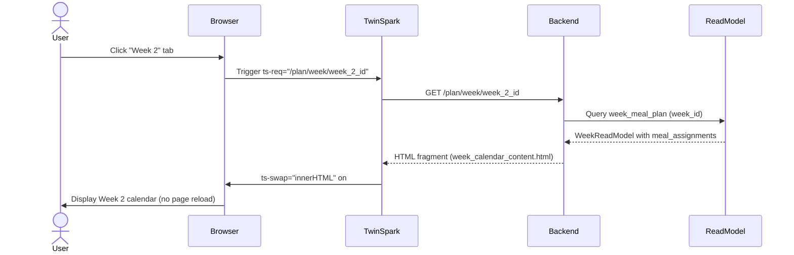
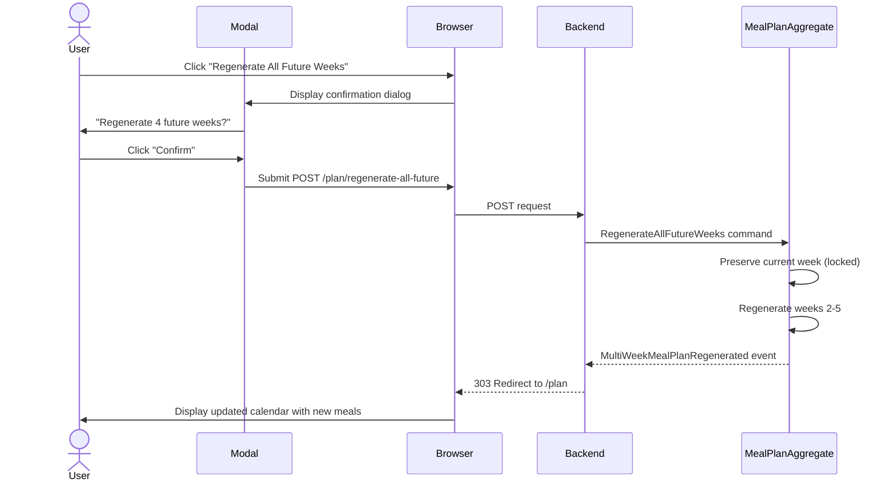
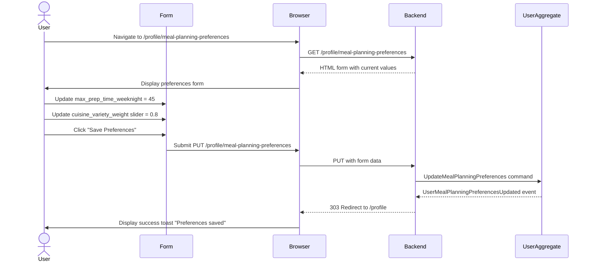
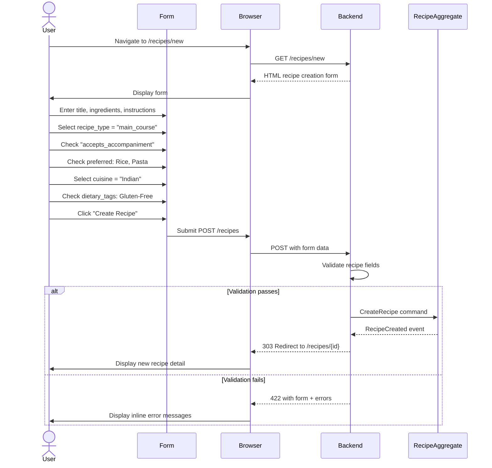
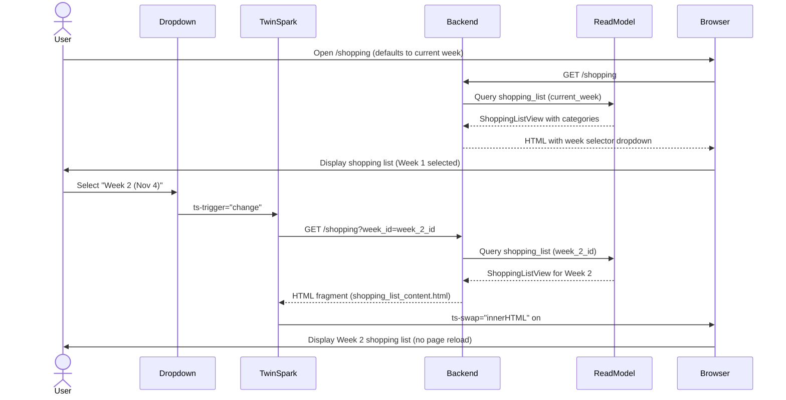

# Technical Specification: Enhanced Meal Planning - Frontend UX Implementation

Date: 2025-10-26
Author: Jonathan
Epic ID: Epic 9
Status: Draft

---

## Overview

Epic 9 delivers the user-facing frontend interface for the enhanced meal planning system introduced in Epic 6-8. This epic implements the multi-week calendar view, accompaniment display, user preference management forms, and week navigation/regeneration controls. The implementation leverages Askama server-side templates, TwinSpark for progressive enhancement, and Tailwind CSS for responsive design. This epic completes the user journey by providing an intuitive, accessible interface that exposes the advanced meal planning capabilities (multi-week generation, accompaniments, preference-aware scheduling) built in the backend.

The frontend focuses on kitchen-first design principles with mobile-responsive layouts, WCAG AA accessibility compliance, and progressive enhancement ensuring functionality without JavaScript. Users gain visibility into long-term meal planning horizons, easy navigation between weeks, clear accompaniment display within meal slots, and control over meal planning preferences that directly influence algorithm behavior.

## Objectives and Scope

**In Scope:**
- Multi-week calendar component with tab/carousel navigation (desktop/mobile)
- Visual display of accompaniments alongside main courses in meal slots
- Meal planning preferences form (time constraints, complexity, cuisine variety, dietary restrictions)
- Recipe creation form updates (accompaniment fields, cuisine, dietary tags)
- Week regeneration UI with confirmation dialogs
- Shopping list week selector dropdown
- Responsive design implementation (mobile, tablet, desktop breakpoints)
- WCAG AA accessibility compliance (keyboard navigation, screen reader support, contrast ratios)
- TwinSpark integration for partial page updates (week navigation, regeneration)

**Out of Scope:**
- Backend algorithm implementation (completed in Epic 6-7)
- Database schema changes (completed in Epic 6)
- API route implementation (completed in Epic 8)
- Native mobile apps (PWA sufficient per PRD)
- Drag-and-drop meal rearrangement (future enhancement)
- Recipe image upload UI (deferred to future epic)
- Advanced filtering/search in calendar view (MVP uses simple navigation)

## System Architecture Alignment

This epic aligns with the event-sourced, domain-driven architecture established in the PRD and solution architecture documents. The frontend implements Askama server-side templates rendered from evento read models, ensuring SEO-friendly HTML responses with progressive enhancement via TwinSpark. The architecture follows these key constraints:

**Architectural Components:**
- **Templates:** Askama-based server-side rendering (SSR) with compile-time template checking
- **Progressive Enhancement:** TwinSpark library for partial HTML updates without heavy JavaScript
- **Styling:** Tailwind CSS utility-first approach with mobile-first responsive design
- **Form Handling:** HTML form submission to backend routes (PUT /profile/meal-planning-preferences, POST /plan/regenerate-all-future)
- **State Management:** Server-side state via evento read models, no client-side state management libraries
- **Accessibility:** Semantic HTML, ARIA labels, keyboard navigation, screen reader compatibility

**Integration Points:**
- Backend routes from Epic 8 (GET /plan/week/:week_id, POST /plan/week/:week_id/regenerate, GET /shopping?week_id=X)
- Recipe read models (title, image_url, prep_time_min, accompaniment data)
- Meal plan read models (week status, is_locked, meal_assignments with accompaniments)
- User preferences read model (max_prep_time_weeknight, dietary_restrictions, etc.)

**Technology Stack Alignment:**
- Rust backend (Axum framework) serving HTML responses
- Askama templates (Rust-native templating, type-safe)
- TwinSpark progressive enhancement (no React/Vue/Angular complexity)
- Tailwind CSS (utility classes, purged for production)
- No client-side JavaScript frameworks (aligns with PRD simplicity principle)

## Detailed Design

### Services and Modules

Epic 9 is purely frontend template and UI implementation with no new backend services. The implementation spans the following frontend modules:

**Template Modules (Askama):**

| Template Path | Purpose | Dependencies |
|---------------|---------|--------------|
| `templates/meal_plan/multi_week_calendar.html` | Multi-week calendar component with week tabs/carousel | Week read models, meal assignments |
| `templates/meal_plan/meal_slot.html` | Individual meal slot component showing recipe + accompaniment | Recipe read models |
| `templates/meal_plan/week_navigation.html` | Week selector with Previous/Next controls | Week status data |
| `templates/profile/meal_planning_preferences.html` | User preferences form for algorithm settings | User read model |
| `templates/recipes/create_recipe.html` | Recipe creation form with accompaniment fields | None (form submission) |
| `templates/shopping/shopping_list.html` | Shopping list with week selector dropdown | Shopping list read models |
| `templates/components/accompaniment_display.html` | Partial template for "+Rice", "+Pasta" display | Accompaniment recipe data |
| `templates/components/regeneration_confirmation.html` | Modal dialog for regeneration confirmation | Week count, affected dates |

**Styling Modules (Tailwind CSS 4.1+):**

- **Component Styles**: Defined using Tailwind utility classes in templates
- **Custom CSS**: Minimal custom CSS for complex layouts (calendar grid, carousel)
- **Responsive Breakpoints**: Mobile (<768px), Tablet (768-1024px), Desktop (>1024px)
- **Kitchen Mode**: High contrast variant classes (text-gray-900, bg-white, 7:1 contrast)

**JavaScript Modules (TwinSpark):**

- **Progressive Enhancement**: No heavy JavaScript frameworks, TwinSpark handles partial updates
- **Key Interactions**:
  - Week navigation: `ts-req="/plan/week/:week_id"` with `ts-target="#calendar-content"` and `ts-swap="innerHTML"`
  - Regeneration buttons: `ts-req="/plan/week/:week_id/regenerate"` with confirmation modal
  - Shopping list week selector: `ts-req="/shopping?week_id=X"` with `ts-target="#shopping-list"` and `ts-swap="innerHTML"`
- **Carousel Navigation**: Touch/swipe gestures for mobile week carousel (progressive enhancement over tabs)

**Form Handling:**

- **Meal Planning Preferences**: HTML form POST to `PUT /profile/meal-planning-preferences`
- **Recipe Creation**: HTML form POST to `/recipes` with multipart encoding (image upload)
- **Server-side Validation**: Errors returned as HTML with inline error messages
- **Client-side Validation**: HTML5 validation attributes (required, min, max, pattern)

### Data Models and Contracts

Frontend templates consume read models from the backend. No new domain models are created in Epic 9.

**Week Read Model (from Epic 8 backend):**

```rust
pub struct WeekReadModel {
    pub id: String,
    pub user_id: String,
    pub start_date: NaiveDate,          // Monday (ISO 8601)
    pub end_date: NaiveDate,            // Sunday
    pub status: WeekStatus,             // future | current | past
    pub is_locked: bool,                // true if current week
    pub generation_batch_id: String,
    pub meal_assignments: Vec<MealAssignmentView>,
}

pub struct MealAssignmentView {
    pub date: NaiveDate,
    pub course_type: CourseType,       // appetizer | main_course | dessert
    pub recipe: RecipePreview,
    pub accompaniment: Option<RecipePreview>,
    pub prep_required: bool,
}

pub struct RecipePreview {
    pub id: String,
    pub title: String,
    pub image_url: Option<String>,
    pub prep_time_min: u32,
    pub cook_time_min: u32,
    pub complexity: Complexity,
    pub accompaniment_category: Option<AccompanimentCategory>,
}
```

**User Preferences Read Model:**

```rust
pub struct UserPreferencesView {
    pub user_id: String,
    pub dietary_restrictions: Vec<DietaryRestriction>,
    pub max_prep_time_weeknight: u32,      // minutes
    pub max_prep_time_weekend: u32,        // minutes
    pub avoid_consecutive_complex: bool,
    pub cuisine_variety_weight: f32,       // 0.0-1.0
}
```

**Accompaniment Display Contract:**

Accompaniments displayed as secondary text in meal slots:
- Format: `+ {accompaniment_name}` (e.g., "+ Basmati Rice", "+ Garlic Bread")
- Styling: Secondary text color (gray-600), smaller font (text-sm)
- Clickable: Links to accompaniment recipe detail

**Form Data Transfer Objects (DTOs):**

```rust
// Meal planning preferences form submission
pub struct UpdatePreferencesForm {
    pub max_prep_time_weeknight: u32,
    pub max_prep_time_weekend: u32,
    pub avoid_consecutive_complex: bool,
    pub cuisine_variety_weight: f32,
    pub dietary_restrictions: Vec<String>,  // checkbox values
    pub custom_dietary_restriction: Option<String>,
}

// Recipe creation form with accompaniment fields
pub struct CreateRecipeForm {
    pub title: String,
    pub ingredients: Vec<IngredientInput>,
    pub instructions: Vec<String>,
    pub prep_time_min: u32,
    pub cook_time_min: u32,
    pub advance_prep_text: Option<String>,
    pub recipe_type: String,                   // "appetizer" | "main_course" | "dessert" | "accompaniment"
    pub accepts_accompaniment: bool,           // checkbox
    pub preferred_accompaniments: Vec<String>, // checkboxes
    pub accompaniment_category: Option<String>,
    pub cuisine: Option<String>,
    pub dietary_tags: Vec<String>,
}
```

### APIs and Interfaces

Epic 9 consumes existing backend routes from Epic 8. No new API routes are created.

**Backend Route Dependencies:**

| Route | Method | Purpose | Template Consumer |
|-------|--------|---------|-------------------|
| `/plan` | GET | Get current user's meal plan with all weeks | `multi_week_calendar.html` |
| `/plan/week/:week_id` | GET | Get specific week's calendar view | Week navigation partial update |
| `/plan/week/:week_id/regenerate` | POST | Regenerate single week | Regeneration confirmation flow |
| `/plan/regenerate-all-future` | POST | Regenerate all future weeks | Regeneration confirmation modal |
| `/profile/meal-planning-preferences` | GET | Load preferences form | `meal_planning_preferences.html` |
| `/profile/meal-planning-preferences` | PUT | Update user preferences | Form submission target |
| `/recipes` | POST | Create new recipe | `create_recipe.html` form action |
| `/recipes/:id` | GET | Get recipe detail | Recipe detail view |
| `/shopping` | GET | Get current week shopping list | `shopping_list.html` |
| `/shopping?week_id=:week_id` | GET | Get specific week shopping list | Week selector partial update |

**TwinSpark Partial Update Patterns:**

1. **Week Navigation:**
   ```html
   <button ts-req="/plan/week/{{week_id}}"
           ts-target="#calendar-content"
           ts-swap="innerHTML"
           ts-req-method="GET">
     Week {{week_number}}
   </button>
   ```

2. **Regeneration with Confirmation:**
   ```html
   <button ts-req="/plan/week/{{week_id}}/regenerate"
           ts-target="#calendar-content"
           ts-swap="innerHTML"
           ts-req-method="POST"
           ts-req-before="confirmRegeneration">
     Regenerate This Week
   </button>
   ```

3. **Shopping List Week Selector:**
   ```html
   <select ts-req="/shopping?week_id={value}"
           ts-target="#shopping-list-content"
           ts-swap="innerHTML"
           ts-trigger="change">
     <option value="{{week_1_id}}">Week 1 (Oct 28)</option>
     <option value="{{week_2_id}}">Week 2 (Nov 4)</option>
   </select>
   ```

**Form Submission Contracts:**

- **Content-Type**: `application/x-www-form-urlencoded` (standard HTML forms)
- **Success Response**: Redirect (303 See Other) to updated page or partial HTML fragment
- **Error Response**: 422 Unprocessable Entity with HTML form containing inline error messages
- **Validation**: Server-side validation returns errors as `<span class="text-error-500 text-sm">{error_message}</span>` adjacent to fields

### Workflows and Sequencing

**Workflow 1: Multi-Week Calendar Navigation**



**Workflow 2: Regenerate All Future Weeks**



**Workflow 3: Update Meal Planning Preferences**



**Workflow 4: Recipe Creation with Accompaniment Fields**



**Workflow 5: Shopping List Week Selection**



## Non-Functional Requirements

### Performance

**Page Load Times:**
- Initial page load (cold start): <3 seconds on 3G mobile connection
- HTML response time (95th percentile): <500ms for all routes
- TwinSpark partial updates: <300ms for week navigation, <200ms for shopping list updates
- Form submission response: <500ms for preference updates, <1s for recipe creation

**Frontend Rendering:**
- First Contentful Paint (FCP): <1.5s on mobile 3G
- Largest Contentful Paint (LCP): <2.5s on mobile 3G
- Time to Interactive (TTI): <3s on mobile 3G
- Cumulative Layout Shift (CLS): <0.1 (minimal layout shifts)

**Component-Specific Targets:**
- Multi-week calendar rendering: <500ms for 5 weeks (35 meal slots)
- Shopping list rendering: <300ms for 50 items across 6 categories
- Recipe form rendering: <200ms for initial load
- Accompaniment display rendering: <50ms per meal slot

**Image Optimization:**
- Recipe thumbnails: WebP format, lazy-loaded, 200x200px max
- Hero images: WebP format, responsive srcset, progressive loading
- Icon sprites: SVG sprite sheet, single HTTP request

**Tailwind CSS:**
- Production bundle size: <30KB after purge (remove unused classes)
- Critical CSS inlined in `<head>` for above-the-fold content
- Non-critical CSS deferred loading

**TwinSpark Performance:**
- No heavy JavaScript frameworks (React/Vue excluded)
- TwinSpark library: ~10KB gzipped
- Progressive enhancement: Site functional without JavaScript

### Security

**Input Validation:**
- All form inputs validated server-side (never trust client)
- XSS prevention: Askama template engine auto-escapes HTML by default
- SQL injection: SQLx compile-time checked queries (no raw SQL)
- CSRF protection: CSRF token in all POST/PUT/DELETE forms

**Template Security:**
- Use `{{variable}}` for auto-escaped output (default)
- Use `{{variable|safe}}` ONLY for trusted HTML (never user input)
- Content Security Policy (CSP): Restrict inline scripts, external resources

**Form Security:**
- Recipe creation: File upload validation (max 5MB, JPEG/PNG/WebP only)
- Preferences form: Numeric bounds validation (max_prep_time 0-300 minutes)
- Dietary restrictions: Whitelist allowed values, reject unknown tags
- No sensitive data in URL parameters (use POST body)

**Authentication:**
- Session-based auth via HTTP-only cookies (JWT)
- CSRF tokens in all mutating forms
- No authentication logic in Epic 9 (handled by existing backend)

**Data Exposure:**
- Meal plans: User-scoped queries (only show authenticated user's data)
- Recipes: Respect privacy flags (shared vs private)
- Preferences: Never expose other users' preferences

### Reliability/Availability

**Graceful Degradation:**
- TwinSpark unavailable: Forms submit with full page reload (traditional HTML forms)
- JavaScript disabled: All features functional (progressive enhancement)
- Slow network: Show loading spinners, avoid timeouts
- Backend error: Display user-friendly error message with retry option

**Error Handling:**
- 404 Not Found: Custom "Page not found" template with navigation
- 422 Validation Error: Inline form errors with field-specific messages
- 500 Server Error: Generic error page with support contact
- Network timeout: "Request taking longer than expected" with retry button

**Offline Support (Future Enhancement):**
- Service worker caches templates for offline viewing
- Read-only access to previously loaded meal plans and recipes
- Form submissions queued when offline, synced when online

**Browser Compatibility:**
- Desktop: Chrome 90+, Firefox 88+, Safari 14+, Edge 90+
- Mobile: iOS Safari 14+, Android Chrome 90+
- Fallbacks for older browsers: No TwinSpark, traditional form submission

**Responsive Reliability:**
- Mobile (<768px): Touch-optimized, 44x44px tap targets
- Tablet (768-1024px): Hybrid touch/mouse interface
- Desktop (>1024px): Mouse-optimized with hover states

### Observability

**Client-Side Monitoring:**
- Performance metrics: FCP, LCP, TTI, CLS tracked via browser APIs
- Error tracking: JavaScript errors logged to backend (if TwinSpark fails)
- User interactions: Track button clicks, form submissions (analytics)
- Navigation: Track page views, week navigation clicks

**Template Rendering Metrics:**
- Template render time: Measure Askama template compilation duration
- Partial update time: Measure TwinSpark swap duration
- Form validation time: Track client-side and server-side validation duration

**Logging:**
- Frontend errors: Console errors captured and sent to backend
- TwinSpark requests: Log ts-req URL, method, response time, status code
- Form submissions: Log validation failures (not form data)

**Accessibility Monitoring:**
- Lighthouse accessibility score: Target >90 for all pages
- WAVE tool: Zero errors, minimize warnings
- Keyboard navigation: Manual testing log for all interactive elements

**User Experience Metrics:**
- Multi-week calendar adoption: % of users navigating between weeks
- Regeneration frequency: Average regenerations per user per week
- Shopping list week selector usage: % of users viewing future weeks
- Form completion rate: % of started forms successfully submitted
- Accompaniment display visibility: % of main courses with accompaniments viewed

## Dependencies and Integrations

### External Dependencies

**Frontend Libraries:**

| Library | Version | Purpose | Size |
|---------|---------|---------|------|
| TwinSpark | 1.2+ | Progressive enhancement, partial HTML updates | ~10KB gzipped |
| Tailwind CSS | 4.1+ | Utility-first CSS framework | <30KB after purge |

**Backend Dependencies (Epic 8):**

- Axum HTTP framework (Rust) - serves HTML responses
- Askama template engine - compile-time templates
- SQLx - database read model queries
- Evento - event sourcing read models

**Browser APIs:**

- Fetch API - TwinSpark AJAX requests
- History API - URL updates without page reload (ts-req-history)
- LocalStorage - Future offline support (shopping list checkoff state)
- Service Worker API - Future PWA offline caching (Story 9.7 out of scope)

### Integration Points

**Backend Route Integration (Epic 8):**

All routes implemented in Epic 8, consumed by Epic 9 templates:

1. **Meal Plan Routes:**
   - `GET /plan` → Multi-week calendar page
   - `GET /plan/week/:week_id` → Week-specific calendar partial
   - `POST /plan/week/:week_id/regenerate` → Single week regeneration
   - `POST /plan/regenerate-all-future` → All future weeks regeneration

2. **User Preferences Routes:**
   - `GET /profile/meal-planning-preferences` → Preferences form page
   - `PUT /profile/meal-planning-preferences` → Update preferences

3. **Recipe Routes:**
   - `GET /recipes/new` → Recipe creation form
   - `POST /recipes` → Create recipe with accompaniment fields
   - `GET /recipes/:id` → Recipe detail page

4. **Shopping List Routes:**
   - `GET /shopping` → Current week shopping list
   - `GET /shopping?week_id=:week_id` → Specific week shopping list

**Read Model Integration:**

Templates consume projections from evento read models:

- `week_meal_plan` → WeekReadModel with meal_assignments
- `user_preferences` → UserPreferencesView
- `recipe` → RecipePreview with accompaniment data
- `shopping_list` → ShoppingListView with categories

**TwinSpark Request/Response Flow:**

```
Browser (TwinSpark) → HTTP Request → Backend Route
                                         ↓
                                    Read Model Query
                                         ↓
                                    Askama Template Render
                                         ↓
HTML Fragment ← HTTP Response ← Backend
     ↓
TwinSpark ts-swap → DOM Update (no page reload)
```

### Dependency Management

**Version Constraints:**

- TwinSpark: Compatible with all modern browsers, no version conflicts
- Tailwind CSS 4.1+: Required for new color palette syntax (`text-primary`, `bg-gray-100`)
- Askama: Template compilation at build time, no runtime dependency

**No Third-Party Component Libraries:**

- No Bootstrap, Material-UI, or similar frameworks
- Custom components built with Tailwind + TwinSpark
- Avoids vendor lock-in per architecture requirements

**Build-Time Dependencies:**

- Tailwind CLI: Purge unused CSS, minify for production
- Askama compiler: Compile templates at build time (Rust macro)
- No runtime JavaScript bundlers (Webpack/Vite) - TwinSpark loaded from CDN or static file

### Third-Party Service Integration

**None Required for Epic 9:**

- No external APIs
- No CDNs (TwinSpark self-hosted)
- No analytics services (future enhancement)
- No A/B testing frameworks

### Testing Dependencies

**Frontend Testing:**

- **Browser Testing**: Playwright for end-to-end tests (Story 9.7)
- **Accessibility Testing**: axe-core, WAVE browser extension
- **Visual Regression**: Manual testing (no automated visual diff tool)
- **Performance Testing**: Lighthouse CI for performance metrics

**Backend Testing (Epic 8):**

- Integration tests use `unsafe_oneshot` for synchronous event processing
- Template rendering tests verify Askama compilation
- Route tests verify HTML responses and status codes

## Acceptance Criteria (Authoritative)

### Story 9.1: Create Multi-Week Calendar Component

**AC-9.1.1**: Askama template created at `templates/meal_plan/multi_week_calendar.html`

**AC-9.1.2**: Template displays week tabs (Week 1, Week 2, etc.) with date ranges (e.g., "Week 1 (Oct 28 - Nov 3)")

**AC-9.1.3**: Current week tab highlighted with distinct styling (border, background color) and lock icon 🔒

**AC-9.1.4**: Clicking week tab triggers TwinSpark request: `ts-req="/plan/week/:week_id"` with `ts-target="#calendar-content"` and `ts-swap="innerHTML"`

**AC-9.1.5**: Mobile view displays carousel with swipe navigation instead of tabs (progressive enhancement)

**AC-9.1.6**: Each week displays 7-day grid with breakfast/lunch/dinner slots (Monday-Sunday order)

**AC-9.1.7**: Meal slots show: recipe name, image thumbnail, prep time with icon

**AC-9.1.8**: Styling uses Tailwind CSS 4.1+ utility classes with 8px spacing grid

**AC-9.1.9**: Keyboard navigation between weeks using Tab key and Enter to select

**AC-9.1.10**: Responsive design: Desktop (tabs), Mobile (carousel with left/right arrows)

### Story 9.2: Add Accompaniment Display in Meal Slots

**AC-9.2.1**: Main course meal slots display accompaniment if `accompaniment_recipe_id` present

**AC-9.2.2**: Accompaniment formatted as: `+ {accompaniment_name}` (e.g., "+ Basmati Rice") below main recipe name

**AC-9.2.3**: Accompaniment styling: secondary text color (text-gray-600), smaller font (text-sm)

**AC-9.2.4**: Accompaniment name clickable, links to recipe detail: `href="/recipes/:accompaniment_id"`

**AC-9.2.5**: If no accompaniment: nothing displayed (clean, no placeholder text)

**AC-9.2.6**: Responsive: Accompaniment text wraps on mobile (<768px), stays inline on desktop

**AC-9.2.7**: Integration test verifies accompaniment HTML rendered correctly in meal slot

### Story 9.3: Create Meal Planning Preferences Form

**AC-9.3.1**: Template created at `templates/profile/meal_planning_preferences.html`

**AC-9.3.2**: Form displays all preference fields populated with current user values from `UserPreferencesView`

**AC-9.3.3**: Time constraints: numeric inputs for `max_prep_time_weeknight` and `max_prep_time_weekend` (minutes, 0-300 range)

**AC-9.3.4**: Complexity toggle: checkbox for `avoid_consecutive_complex` with label "Avoid complex meals on consecutive days"

**AC-9.3.5**: Cuisine variety: slider input (range 0.0-1.0, step 0.1) with labels "Repeat OK" to "Mix it up!"

**AC-9.3.6**: Dietary restrictions: checkbox list (Vegetarian, Vegan, GlutenFree, DairyFree, NutFree, Halal, Kosher)

**AC-9.3.7**: Custom allergen: text input for `custom_dietary_restriction` with label "Custom dietary restriction (e.g., shellfish)"

**AC-9.3.8**: Form validation: HTML5 (required, min, max) + server-side with inline error messages

**AC-9.3.9**: Save button submits to `PUT /profile/meal-planning-preferences` with `action` and `method` attributes

**AC-9.3.10**: Success: redirect to `/profile` with toast "Preferences saved successfully"

### Story 9.4: Update Recipe Creation Form with Accompaniment Fields

**AC-9.4.1**: Recipe form updated at `templates/recipes/create_recipe.html` to include new fields

**AC-9.4.2**: Recipe type selection includes "Accompaniment" option (radio buttons: Appetizer, Main Course, Dessert, Accompaniment)

**AC-9.4.3**: For Main Course: checkbox "This dish accepts an accompaniment" (name="accepts_accompaniment")

**AC-9.4.4**: If checked: show preferred categories checkboxes (Pasta, Rice, Fries, Salad, Bread, Vegetable, Other)

**AC-9.4.5**: For Accompaniment type: show category radio buttons (same options as preferred categories)

**AC-9.4.6**: Cuisine selection: dropdown with variants (Italian, Indian, Mexican, Chinese, etc.) + Custom text input

**AC-9.4.7**: Dietary tags: checkbox list (Vegetarian, Vegan, Gluten-Free, Dairy-Free, Nut-Free, Halal, Kosher)

**AC-9.4.8**: Form submission includes all new fields in POST body to `/recipes`

**AC-9.4.9**: Validation: If recipe_type="accompaniment", category required (server-side validation)

**AC-9.4.10**: Playwright test verifies form submission with new fields creates recipe with accompaniment data

### Story 9.5: Add Week Regeneration UI with Confirmation

**AC-9.5.1**: "Regenerate This Week" button added to each future week's calendar (not current/past weeks)

**AC-9.5.2**: "Regenerate All Future Weeks" button added to main calendar navigation area

**AC-9.5.3**: Clicking "Regenerate This Week" shows confirmation modal: "Replace meals for Week {X} ({date range})?"

**AC-9.5.4**: Clicking "Regenerate All Future Weeks" shows modal: "Regenerate {N} future weeks? Your current week will be preserved."

**AC-9.5.5**: Confirmation modal has Cancel and Confirm buttons (styled: secondary + primary)

**AC-9.5.6**: Confirm triggers POST to `/plan/week/:week_id/regenerate` or `/plan/regenerate-all-future` with TwinSpark

**AC-9.5.7**: Loading spinner shown during regeneration (overlay on calendar)

**AC-9.5.8**: Success: Calendar updates with new meals via `ts-target="#calendar-content"` and `ts-swap="innerHTML"`

**AC-9.5.9**: Error: Display error message in toast: "Failed to regenerate. Please try again."

**AC-9.5.10**: Locked weeks display disabled text "Cannot Regenerate (week in progress)" instead of button

### Story 9.6: Add Week Selector to Shopping List Page

**AC-9.6.1**: Shopping list page updated at `templates/shopping/shopping_list.html` with week selector

**AC-9.6.2**: Week selector: dropdown (select element) showing all weeks (Week 1, Week 2, ..., Week N)

**AC-9.6.3**: Current week selected by default (selected attribute on option)

**AC-9.6.4**: Changing selection triggers: `ts-req="/shopping?week_id={value}"` with `ts-target="#shopping-list-content"` and `ts-swap="innerHTML"` and `ts-trigger="change"`

**AC-9.6.5**: Dropdown options show week dates: "Week 1 (Oct 28 - Nov 3)", "Week 2 (Nov 4 - Nov 10)"

**AC-9.6.6**: Locked weeks marked with 🔒 icon in dropdown options (prepended to text)

**AC-9.6.7**: Shopping list displays week start date at top: "Shopping List for Week of {Monday date}"

**AC-9.6.8**: Mobile: Dropdown full-width (w-full), easy to tap (min-height 44px)

**AC-9.6.9**: Playwright test verifies week selection updates shopping list content without page reload

### Story 9.7: Responsive Design and Accessibility Testing

**AC-9.7.1**: All pages tested on mobile (375px), tablet (768px), desktop (1920px) - manual testing log

**AC-9.7.2**: Calendar: Tabs on desktop, carousel on mobile (responsive breakpoint @md:)

**AC-9.7.3**: Forms: Full-width inputs on mobile (w-full), constrained on desktop (max-w-md)

**AC-9.7.4**: Modals: Centered on desktop with backdrop, full-height on mobile

**AC-9.7.5**: Touch targets ≥44x44px on mobile (buttons, checkboxes, links) - WCAG AA compliance

**AC-9.7.6**: Keyboard navigation works for all interactive elements (Tab order logical, Enter/Space activate)

**AC-9.7.7**: Screen reader testing: All content accessible with NVDA/VoiceOver (ARIA labels, semantic HTML)

**AC-9.7.8**: Color contrast ratios meet WCAG AA: 4.5:1 for normal text, 3:1 for large text (verified with WAVE tool)

**AC-9.7.9**: Focus indicators visible for all interactive elements (2px border, 4px offset, primary-500 color)

**AC-9.7.10**: Lighthouse accessibility score >90 for all pages (automated test in CI)

## Traceability Mapping

| Acceptance Criteria | Spec Section | Component | Test Type |
|---------------------|--------------|-----------|-----------|
| AC-9.1.1-9.1.10 | Detailed Design → Services and Modules → Template Modules | `multi_week_calendar.html` | Integration (Playwright) |
| AC-9.2.1-9.2.7 | Detailed Design → Data Models → Accompaniment Display Contract | `meal_slot.html`, `accompaniment_display.html` | Integration (Playwright) |
| AC-9.3.1-9.3.10 | Detailed Design → Services and Modules → Form Handling | `meal_planning_preferences.html` | Integration (Playwright) |
| AC-9.4.1-9.4.10 | APIs and Interfaces → Backend Route Dependencies | `create_recipe.html` | Integration (Playwright) |
| AC-9.5.1-9.5.10 | Workflows → Workflow 2: Regenerate All Future Weeks | `regeneration_confirmation.html` | Integration (Playwright) |
| AC-9.6.1-9.6.9 | Workflows → Workflow 5: Shopping List Week Selection | `shopping_list.html` | Integration (Playwright) |
| AC-9.7.1-9.7.10 | NFR → Performance, Accessibility | All templates | Manual + Lighthouse |

**Component-to-Route Mapping:**

| Template Component | Backend Route (Epic 8) | Read Model Source |
|--------------------|------------------------|-------------------|
| `multi_week_calendar.html` | `GET /plan` | `week_meal_plan` read model |
| `meal_slot.html` | N/A (partial) | `MealAssignmentView` |
| `week_navigation.html` | `GET /plan/week/:week_id` | `week_meal_plan` (single week) |
| `meal_planning_preferences.html` | `GET /profile/meal-planning-preferences`, `PUT /profile/meal-planning-preferences` | `user_preferences` read model |
| `create_recipe.html` | `GET /recipes/new`, `POST /recipes` | None (form submission) |
| `shopping_list.html` | `GET /shopping`, `GET /shopping?week_id=:week_id` | `shopping_list` read model |
| `accompaniment_display.html` | N/A (partial) | `RecipePreview.accompaniment_category` |
| `regeneration_confirmation.html` | `POST /plan/week/:week_id/regenerate`, `POST /plan/regenerate-all-future` | Week count, affected dates |

**Feature-to-Story Mapping:**

| PRD Feature | Epic 9 Story | Implementation |
|-------------|--------------|----------------|
| Multi-week meal plan generation (Epic 6-7) | Story 9.1 | Calendar UI with week navigation |
| Accompaniment recipe type (Epic 6-7) | Story 9.2, 9.4 | Accompaniment display + recipe form |
| User preferences integration (Epic 6-7) | Story 9.3 | Preferences form |
| Week regeneration (Epic 8) | Story 9.5 | Regeneration buttons + confirmation |
| Shopping list week selector (Epic 8) | Story 9.6 | Dropdown week selector |
| Responsive design + accessibility | Story 9.7 | Mobile-first responsive + WCAG AA |

## Risks, Assumptions, Open Questions

### Risks

**Risk 1: TwinSpark Browser Compatibility**
- **Description**: TwinSpark may not work in older browsers (IE11, Safari <14)
- **Impact**: Users on older browsers lose partial update functionality
- **Mitigation**: Progressive enhancement - forms still work with full page reload
- **Probability**: Low (target browsers: Chrome 90+, Safari 14+)

**Risk 2: Tailwind CSS 4.1+ Syntax Breaking Changes**
- **Description**: Tailwind 4.1+ introduces new syntax (e.g., `text-primary` instead of `text-primary-500`)
- **Impact**: Existing templates may need updates if migrating from older Tailwind
- **Mitigation**: Use Tailwind 4.1+ from start, follow migration guide if upgrading
- **Probability**: Medium (if project already uses Tailwind <4.0)

**Risk 3: Askama Template Compilation Errors**
- **Description**: Complex templates with TwinSpark attributes may fail to compile
- **Impact**: Build failures, development slowdown
- **Mitigation**: Keep templates simple, test compilation early and often
- **Probability**: Low (Askama mature, TwinSpark attributes are HTML)

**Risk 4: Mobile Carousel Performance**
- **Description**: Carousel with 5+ weeks may lag on low-end mobile devices
- **Impact**: Poor user experience on older phones
- **Mitigation**: Lazy-load week content, optimize DOM size, consider pagination
- **Probability**: Medium (depends on device specs)

**Risk 5: Form Validation Complexity**
- **Description**: Server-side validation errors must render inline in HTML forms
- **Impact**: Complex error handling logic in backend routes
- **Mitigation**: Standardize error response format (422 with HTML fragments)
- **Probability**: Low (pattern already established in Epic 8)

**Risk 6: Accessibility Compliance Gap**
- **Description**: Manual testing may miss WCAG AA violations
- **Impact**: Inaccessible UI for users with disabilities, legal risk
- **Mitigation**: Automated Lighthouse tests, WAVE tool, screen reader testing
- **Probability**: Medium (requires diligence in Story 9.7)

### Assumptions

**Assumption 1**: Epic 8 backend routes fully functional
- **Validation**: Integration tests pass for all routes before Epic 9 starts
- **Impact if False**: Epic 9 blocked until Epic 8 complete

**Assumption 2**: Users have JavaScript enabled
- **Validation**: TwinSpark degrades gracefully without JS (progressive enhancement)
- **Impact if False**: Forms still work, partial updates disabled

**Assumption 3**: Mobile users accept carousel navigation
- **Validation**: User testing in Story 9.7 confirms carousel UX acceptable
- **Impact if False**: May need alternative mobile navigation (dropdown selector)

**Assumption 4**: Tailwind purge removes unused CSS effectively
- **Validation**: Production bundle size <30KB verified in build
- **Impact if False**: Larger CSS bundle, slower page loads

**Assumption 5**: Accompaniment display as secondary text is sufficient
- **Validation**: UX specification confirms "+ Rice" format acceptable
- **Impact if False**: May need thumbnail images or more prominent display

**Assumption 6**: Regeneration confirmation modal prevents accidental clicks
- **Validation**: User testing shows modal effectively prevents mistakes
- **Impact if False**: May need additional safeguards (e.g., "Type CONFIRM")

### Open Questions

**Q1**: Should week carousel support infinite scroll or pagination?
- **Current Approach**: Fixed carousel with left/right navigation (Story 9.1)
- **Alternative**: Infinite scroll loading additional weeks on demand
- **Decision Needed By**: Story 9.1 implementation
- **Owner**: Frontend lead

**Q2**: Should accompaniments have thumbnails in meal slots?
- **Current Approach**: Text-only display "+ Basmati Rice" (Story 9.2)
- **Alternative**: Small thumbnail image next to text
- **Decision Needed By**: Story 9.2 implementation
- **Owner**: UX designer

**Q3**: Should preferences form have preview of algorithm impact?
- **Current Approach**: Simple form with no preview (Story 9.3)
- **Alternative**: Show example week schedule based on current preferences
- **Decision Needed By**: Story 9.3 implementation
- **Owner**: Product manager

**Q4**: Should regeneration show diff of old vs new meals?
- **Current Approach**: Immediate replacement, no diff shown (Story 9.5)
- **Alternative**: Show side-by-side comparison before confirming
- **Decision Needed By**: Story 9.5 implementation
- **Owner**: Product manager

**Q5**: Should shopping list support multi-week aggregation?
- **Current Approach**: Single week selector (Story 9.6)
- **Alternative**: Checkbox to aggregate weeks 1-3 into combined list
- **Decision Needed By**: Story 9.6 implementation
- **Owner**: Product manager

**Q6**: What is the minimum Lighthouse accessibility score threshold?
- **Current Approach**: >90 target (Story 9.7, AC-9.7.10)
- **Alternative**: 100 (AAA compliance) or >95 (stricter AA)
- **Decision Needed By**: Story 9.7 implementation
- **Owner**: Accessibility lead

## Test Strategy Summary

### Testing Approach

**Test-Driven Development (TDD):**
- Write integration tests BEFORE implementing templates
- Red-Green-Refactor cycle for each acceptance criteria
- Use `unsafe_oneshot` for synchronous event processing in tests

**Testing Pyramid:**
1. **Unit Tests** (N/A for Epic 9 - no business logic in templates)
2. **Integration Tests** (Primary): Playwright end-to-end tests
3. **Manual Tests**: Accessibility, responsive design, cross-browser

### Integration Tests (Playwright)

**Story 9.1: Multi-Week Calendar**
```rust
// Test: Clicking week tab updates calendar without page reload
#[tokio::test]
async fn test_week_navigation() {
    let app = spawn_app().await;
    app.login_user().await;

    // Load meal plan page
    let response = app.get_page("/plan").await;
    assert!(response.contains("Week 1"));
    assert!(response.contains("Week 2"));

    // Click Week 2 tab (TwinSpark request)
    let week_2_content = app.twinspark_request("/plan/week/week_2_id").await;
    assert!(week_2_content.contains("Nov 4 - Nov 10"));
    assert!(week_2_content.contains("Main Course"));
}
```

**Story 9.2: Accompaniment Display**
```rust
#[tokio::test]
async fn test_accompaniment_display() {
    let app = spawn_app().await;
    let meal_with_accompaniment = create_test_meal_with_rice(&app).await;

    let calendar_html = app.get_page("/plan").await;
    assert!(calendar_html.contains("Chicken Tikka Masala"));
    assert!(calendar_html.contains("+ Basmati Rice"));
    assert!(calendar_html.contains("text-gray-600")); // Secondary styling
}
```

**Story 9.3: Preferences Form**
```rust
#[tokio::test]
async fn test_preferences_form_submission() {
    let app = spawn_app().await;
    app.login_user().await;

    let form_data = UpdatePreferencesForm {
        max_prep_time_weeknight: 45,
        max_prep_time_weekend: 120,
        avoid_consecutive_complex: true,
        cuisine_variety_weight: 0.8,
        dietary_restrictions: vec!["Vegetarian".into()],
        custom_dietary_restriction: None,
    };

    let response = app.put("/profile/meal-planning-preferences", &form_data).await;
    assert_eq!(response.status(), StatusCode::SEE_OTHER); // 303 redirect

    // Verify preferences saved
    let preferences = app.get_user_preferences().await;
    assert_eq!(preferences.max_prep_time_weeknight, 45);
}
```

**Story 9.4: Recipe Creation with Accompaniment**
```rust
#[tokio::test]
async fn test_create_recipe_with_accompaniment_fields() {
    let app = spawn_app().await;

    let form = CreateRecipeForm {
        title: "Chicken Tikka Masala".into(),
        recipe_type: "main_course".into(),
        accepts_accompaniment: true,
        preferred_accompaniments: vec!["Rice".into(), "Bread".into()],
        cuisine: Some("Indian".into()),
        dietary_tags: vec!["GlutenFree".into()],
        // ... other fields
    };

    let response = app.post("/recipes", &form).await;
    assert_eq!(response.status(), StatusCode::SEE_OTHER);

    // Verify recipe created with accompaniment settings
    let recipe = app.get_recipe(response.location()).await;
    assert!(recipe.accepts_accompaniment);
    assert_eq!(recipe.preferred_accompaniments.len(), 2);
}
```

**Story 9.5: Regeneration Confirmation**
```rust
#[tokio::test]
async fn test_regenerate_all_future_weeks() {
    let app = spawn_app().await;
    app.create_test_meal_plan(5_weeks).await;

    // Trigger regeneration (POST request)
    let response = app.post("/plan/regenerate-all-future", &()).await;
    assert_eq!(response.status(), StatusCode::SEE_OTHER);

    // Verify current week preserved, future weeks regenerated
    let meal_plan = app.get_meal_plan().await;
    assert_eq!(meal_plan.weeks[0].is_locked, true); // Week 1 preserved
    assert_ne!(meal_plan.weeks[1].meal_assignments, original_week_2); // Week 2 regenerated
}
```

**Story 9.6: Shopping List Week Selector**
```rust
#[tokio::test]
async fn test_shopping_list_week_selector() {
    let app = spawn_app().await;
    app.create_test_meal_plan(3_weeks).await;

    // Load shopping list (defaults to current week)
    let html = app.get_page("/shopping").await;
    assert!(html.contains("Week 1 (Oct 28 - Nov 3)"));

    // Select Week 2 (TwinSpark request)
    let week_2_list = app.twinspark_request("/shopping?week_id=week_2_id").await;
    assert!(week_2_list.contains("Nov 4 - Nov 10"));
    assert!(week_2_list.contains("Shopping List for Week of Nov 4"));
}
```

### Manual Testing

**Story 9.7: Responsive Design**
- Test on real devices: iPhone 13 (iOS 15), Samsung Galaxy S21 (Android 12)
- Breakpoints: 375px (mobile), 768px (tablet), 1920px (desktop)
- Verify touch targets ≥44x44px with ruler tool

**Accessibility Testing:**
- **Automated**: Lighthouse (target >90), WAVE tool (zero errors)
- **Manual**: NVDA screen reader on Windows, VoiceOver on iOS
- **Keyboard-only**: Navigate all flows with Tab, Enter, Escape

**Cross-Browser Testing:**
- Desktop: Chrome 120, Firefox 115, Safari 17, Edge 120
- Mobile: iOS Safari 17, Android Chrome 120
- Document any browser-specific issues

### Test Coverage Targets

- **Integration Tests**: 100% of acceptance criteria (AC-9.1.1 through AC-9.7.10)
- **Manual Tests**: 100% of responsive breakpoints and accessibility requirements
- **Playwright Tests**: All critical user flows (Stories 9.1-9.6)
- **Regression Tests**: Run full Playwright suite before each Epic 9 story completion

### Test Data Setup

**Fixtures:**
- User with 10 favorite recipes (5 main courses, 3 appetizers, 2 desserts)
- Active meal plan with 3 weeks (Week 1 locked, Weeks 2-3 future)
- Recipes with accompaniment settings (Chicken Tikka Masala accepts Rice)
- Shopping lists for all weeks

**Test Database:**
- SQLite in-memory database for integration tests
- Evento event store populated with test events
- Read models projected from test events using `unsafe_oneshot`

### Continuous Integration

**CI Pipeline:**
1. Run Playwright integration tests (all stories)
2. Run Lighthouse accessibility tests (score >90)
3. Build Tailwind CSS (verify <30KB after purge)
4. Compile Askama templates (verify no errors)
5. Deploy to staging if all tests pass

**Deployment Gate:**
- All Playwright tests must pass (0 failures)
- Lighthouse accessibility score >90 for key pages
- Manual accessibility review complete (sign-off from accessibility lead)
