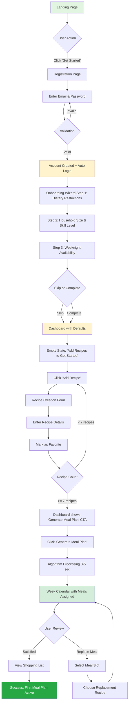
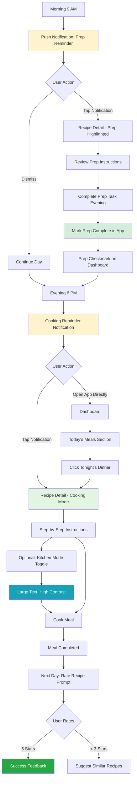
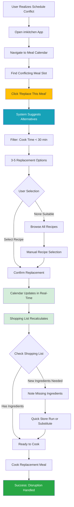
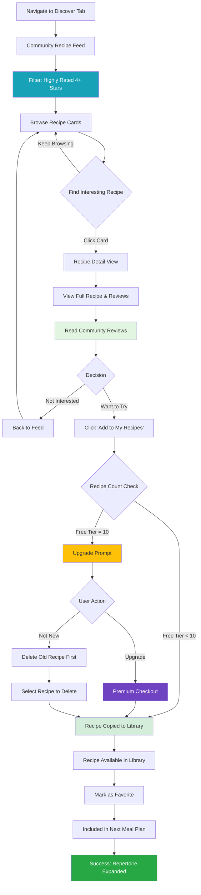
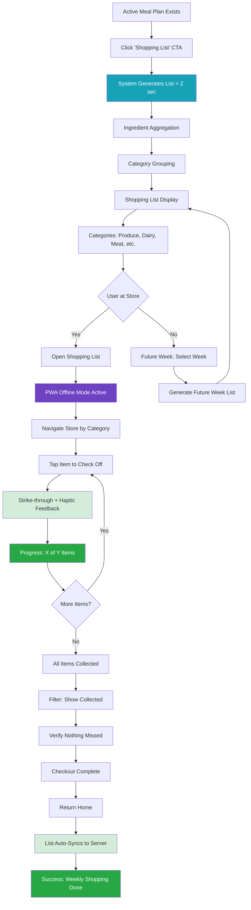

# imkitchen UX/UI Specification

_Generated on 2025-10-11 by Jonathan_

## Executive Summary

**imkitchen** is an intelligent meal planning and cooking optimization platform designed as a mobile-first Progressive Web App. The platform eliminates the mental overhead and timing complexity that prevents home cooks from exploring their full recipe repertoire by automating weekly meal scheduling, providing actionable preparation reminders, and enabling community-driven recipe discovery.

**Project Context:**
- **Type**: Progressive Web App (PWA) - installable, offline-capable
- **Level**: Level 3 (Full Product) - 59 stories across 5 epics
- **Timeline**: 6-9 months to MVP launch
- **Target Users**: Home cooking enthusiasts (ages 28-45) and busy professional families seeking to expand culinary variety without planning burden
- **Core Problem Solved**: Users artificially limit recipe choices to avoid advance preparation timing complexity, resulting in culinary monotony despite extensive recipe collections
- **Primary Value Proposition**: Intelligent automation unlocks access to complex recipes by managing timing, preparation, and scheduling complexity automatically

**Technical Foundation:**
- **Backend**: Rust with Axum HTTP server, evento (event sourcing/CQRS), SQLite database
- **Frontend**: Server-rendered HTML with Askama templates, TwinSpark for progressive enhancement, Tailwind CSS 4.1+
- **Architecture**: Event-driven monolith with DDD bounded contexts, TDD enforced
- **Deployment**: Production SaaS with freemium model (10 recipe limit, premium unlimited)

**Key UX Challenges:**
1. **Kitchen Environment**: Design for hands-free, touch-optimized, high-contrast use in varied lighting
2. **Trust Building**: Make intelligent automation transparent and understandable to build user confidence
3. **Progressive Disclosure**: Balance comprehensive features with simple, unintimidating interface
4. **Offline-First**: Ensure seamless experience regardless of connectivity in kitchen environment
5. **Mobile-First Complexity**: Design complex meal planning algorithms accessible on small screens

---

## 1. UX Goals and Principles

### 1.1 Target User Personas

**Primary Persona: Sarah - Home Cooking Enthusiast**
- **Age**: 34, working parent with 2 children
- **Context**: Saves 60+ recipes but only cooks 12 regularly due to planning overwhelm
- **Goals**:
  - Cook interesting, varied meals without stress
  - Reduce food waste and optimize grocery spending
  - Teach children diverse culinary experiences
  - Maintain healthy eating habits consistently
- **Pain Points**:
  - 15-30 minutes weekly on meal planning (wants this reduced)
  - Avoids complex recipes due to timing uncertainty (not skill limitations)
  - Decision fatigue from daily "what's for dinner" question
  - Last-minute meal decisions create household tension
- **Behaviors**:
  - Primarily uses mobile device for meal planning (80% of planning on mobile)
  - Shops groceries 1-2 times per week
  - Limited weeknight cooking time (typically 6-7pm, 45 minutes max)
- **Tech Comfort**: Intermediate - comfortable with apps but not tech-savvy

**Secondary Persona: Marcus - Recipe Explorer**
- **Age**: 29, cooking enthusiast (no children)
- **Context**: Wants to expand culinary skills beyond comfort zone
- **Goals**:
  - Try new recipes from community with confidence
  - Learn advanced techniques through successful execution
  - Share own creations with others
- **Pain Points**:
  - Hesitant about complexity of new recipes
  - Unsure which community recipes are reliable
  - Needs encouragement to attempt advance-prep recipes
- **Behaviors**:
  - Active on social cooking platforms
  - Willing to invest time in complex recipes on weekends
  - Values community ratings and reviews highly

**Tertiary Persona: Jennifer - Busy Professional**
- **Age**: 42, dual-income household, 3 children
- **Context**: Relies heavily on takeout/meal kits, wants to cook more at home
- **Goals**:
  - Reduce takeout reliance without sacrificing family time
  - Maintain family dinner traditions despite busy schedules
  - Optimize grocery budget
- **Pain Points**:
  - Unexpected schedule changes (meetings running late)
  - Need for quick meal pivots without throwing away food
  - Emergency backup meal options required
- **Behaviors**:
  - Minimal weeknight preparation time (<30 minutes)
  - Weekend meal prep when possible
  - Needs family-friendly recipes with broad appeal

### 1.2 Usability Goals

**Ease of Learning:**
- New users generate first meal plan within 10 minutes of signup
- Onboarding explains intelligent automation benefits clearly
- No prior meal planning experience required

**Efficiency for Power Users:**
- Meal plan regeneration in <5 seconds
- Single-tap meal replacement for quick schedule adjustments
- Keyboard shortcuts and gesture navigation for frequent actions

**Error Prevention:**
- Algorithm validates sufficient recipes before generation (minimum 7 favorites)
- Shopping list updates automatically when meals replaced
- Advance prep reminders prevent forgotten preparation tasks

**Accessibility Requirements:**
- WCAG 2.1 Level AA compliance across all interfaces
- Kitchen-friendly high contrast mode for varied lighting
- Voice control compatible for hands-free operation
- Screen reader compatible with proper ARIA labels

**Measurable Success Criteria:**
- 60% reduction in meal planning time (target: <10 minutes/week vs 15-30 minutes/week baseline)
- 85% recipe completion rate (users successfully cook scheduled meals)
- 90% advance prep reminder success (users complete preparation tasks)
- 3x increase in unique recipes cooked per month

### 1.3 Design Principles

**1. Kitchen-First Design**
> Every interface decision optimized for the kitchen environment. Large touch targets (44x44px minimum), high contrast for varied lighting, spill-resistant patterns avoiding hover states, hands-free voice control compatibility. If it doesn't work with messy hands at 6pm on a Tuesday, it doesn't ship.

**2. Trust Through Transparency**
> Intelligent automation must explain itself to earn user confidence. Always show why meals assigned to specific days ("Saturday: more prep time available"), indicate advance preparation timing rationale, surface algorithm constraints in human-readable language. Users trust systems they understand.

**3. Progressive Disclosure**
> Display only essential information at each step, revealing complexity gradually as needed. Dashboard shows today's meals and primary actions; detailed recipe steps expand only when cooking; advanced settings hidden behind progressive menus. Minimize cognitive load during high-stress cooking moments.

**4. Instant Feedback and Confirmation**
> Provide immediate visual confirmation for all user actions. Recipe saved → green checkmark animation. Meal replaced → calendar updates in real-time. Shopping list item tapped → strike-through with haptic feedback. Eliminate user uncertainty about system state.

**5. Graceful Failure Recovery**
> When things go wrong, offer immediate solutions rather than error messages. Can't generate meal plan → suggest adding more recipes with "Add Recipe" button. Network unavailable → show cached content with sync indicator. Failed payment → inline retry with alternative payment option.

**6. Celebration of Success**
> Acknowledge and celebrate user achievements to reinforce positive behavior. First meal plan generated → congratulations animation. Week completed → recipe variety metrics visualization. New recipe tried → community sharing prompt. Make progress visible and rewarding.

---

## 2. Information Architecture

### 2.1 Site Map

```
imkitchen (PWA)
│
├── 🔐 Public (Unauthenticated)
│   ├── Landing Page
│   ├── Login
│   ├── Register
│   ├── Password Reset
│   └── About/Features
│
├── 🏠 Dashboard (Authenticated - Default Landing)
│   ├── Today's Meals Display
│   ├── Prep Tasks for Today
│   ├── Quick Actions (Generate Plan, View Calendar, Shopping List)
│   └── Recipe Variety Metrics
│
├── 📅 Meal Planning
│   ├── Week View Calendar
│   │   ├── Individual Meal Details
│   │   ├── Replace Meal (inline)
│   │   └── Algorithm Reasoning (tooltip)
│   ├── Generate New Meal Plan
│   └── Regenerate Meal Plan
│
├── 📖 My Recipes
│   ├── Recipe Library (All Recipes)
│   │   ├── Filter by Collection
│   │   ├── Filter by Favorites
│   │   ├── Filter by Complexity/Tags
│   │   └── Search
│   ├── Create New Recipe
│   ├── Recipe Detail
│   │   ├── View/Edit Mode Toggle
│   │   ├── Share to Community Toggle
│   │   ├── Mark as Favorite
│   │   └── Delete Recipe
│   └── Manage Collections
│       ├── Create Collection
│       ├── Edit Collection
│       └── Add/Remove Recipes
│
├── 🌍 Discover (Community)
│   ├── Community Recipe Feed
│   │   ├── Filter by Rating (4+, 3+)
│   │   ├── Filter by Cuisine
│   │   ├── Filter by Prep Time
│   │   ├── Filter by Dietary
│   │   └── Search
│   ├── Recipe Detail (Community)
│   │   ├── Full Recipe View
│   │   ├── Ratings & Reviews
│   │   ├── Add to My Recipes
│   │   └── Creator Attribution
│   └── Rate & Review (Post-Cooking)
│
├── 🛒 Shopping
│   ├── Current Week Shopping List
│   │   ├── Category Groups (Produce, Dairy, etc.)
│   │   ├── Item Checkoff
│   │   ├── Progress Indicator
│   │   └── Filter (All/Remaining/Collected)
│   ├── Future Weeks (Week Selector)
│   └── Multi-Week View
│
├── 🔔 Notifications & Reminders
│   ├── Prep Reminders (Morning)
│   ├── Cooking Reminders (Day-of)
│   ├── Mark Prep Complete
│   └── Notification Settings
│
├── 👤 Profile & Settings
│   ├── User Profile
│   │   ├── Dietary Restrictions
│   │   ├── Household Size
│   │   ├── Skill Level
│   │   └── Weeknight Availability
│   ├── Account Settings
│   │   ├── Change Password
│   │   ├── Email Preferences
│   │   └── Notification Preferences
│   ├── Subscription Management
│   │   ├── Current Plan (Free/Premium)
│   │   ├── Recipe Count (X/10 or Unlimited)
│   │   └── Upgrade to Premium
│   └── Logout
│
└── ⚙️ Settings & Help
    ├── Kitchen Mode Toggle
    ├── Accessibility Options
    ├── Help & Documentation
    └── Privacy Policy / Terms
```

### 2.2 Navigation Structure

**Primary Navigation (Persistent - Bottom Tab Bar on Mobile, Sidebar on Desktop):**

1. **🏠 Home** - Dashboard with today's meals and quick actions
2. **📅 Plan** - Meal planning calendar (week view)
3. **📖 Recipes** - My recipe library and creation
4. **🌍 Discover** - Community recipe discovery
5. **🛒 Shop** - Shopping lists

**Mobile Navigation Pattern:**
- Bottom tab bar (5 primary items) - thumb-friendly positioning
- Fixed position, always accessible
- Active tab highlighted with color and icon fill
- Labels visible on all tabs (not icon-only)

**Tablet/Desktop Navigation Pattern:**
- Left sidebar with icons and labels
- Collapsible to icon-only for more screen space
- Persistent across all views
- Expandable hover states show full labels

**Secondary Navigation (Contextual):**
- **Top App Bar**: Contains context-specific actions, page title, profile/settings access
- **Floating Action Button (FAB)**: Context-aware primary action
  - Dashboard: "Generate Meal Plan"
  - Recipes: "Create Recipe"
  - Discover: Filter/Search toggle
  - Shopping: Export/Share list

**Settings & Profile Access:**
- Top-right avatar/profile icon → dropdown menu
- Contains: Profile, Settings, Subscription, Logout
- Notification bell icon (top-right) → notification center

**Breadcrumb Navigation:**
- Desktop only: Shows current location hierarchy
- Example: Home > My Recipes > Chicken Tikka Masala
- Mobile: Back button + page title

**Deep Linking & URL Structure:**
```
/                          → Dashboard (authenticated) or Landing (public)
/login                     → Login page
/register                  → Registration
/dashboard                 → User dashboard
/plan                      → Meal plan calendar
/plan/generate             → Generate meal plan flow
/recipes                   → My recipe library
/recipes/new               → Create new recipe
/recipes/{id}              → Recipe detail
/recipes/{id}/edit         → Edit recipe
/discover                  → Community discovery
/discover/{recipe-id}      → Community recipe detail
/shopping                  → Current week shopping list
/shopping?week=2025-10-20  → Specific week shopping list
/profile                   → User profile & settings
/profile/subscription      → Subscription management
```

**Navigation Gestures (Mobile/PWA):**
- Swipe right: Back to previous screen (when applicable)
- Swipe left: Forward (if history exists)
- Pull down: Refresh current view
- Long-press tab: Quick actions menu

**Accessibility Navigation:**
- Skip to main content link (keyboard users)
- Keyboard shortcuts for primary actions (documented in help)
- ARIA landmarks for screen readers (navigation, main, complementary)
- Focus trap in modals/dialogs with escape key to close

---

## 3. User Flows

### Flow 1: New User Onboarding and First Meal Plan

**User Goal:** Complete setup and generate first automated meal plan

**Entry Points:** Landing page → Register

**Flow Diagram:**



**Success Criteria:** User has active meal plan with shopping list within 10 minutes of signup

**Error States:**
- Duplicate email → "Email already registered. Try logging in?"
- Weak password → Inline validation with strength meter
- < 7 recipes → "Add {X} more recipes to generate meal plan"
- Algorithm timeout → Retry with loading state

---

### Flow 2: Daily Cooking Experience

**User Goal:** Cook today's meal with advance prep reminder support

**Entry Points:** Morning notification, Dashboard

**Flow Diagram:**



**Success Criteria:** User successfully completes advance prep and cooks meal on time

**Error States:**
- Notification permission denied → In-app reminder banner
- Prep task missed → Day-of reminder includes prep warning
- Recipe unclear → "Need help?" quick support link

---

### Flow 3: Meal Plan Disruption and Quick Recovery

**User Goal:** Adapt meal plan when schedule changes unexpectedly

**Entry Points:** Dashboard, Calendar view

**Flow Diagram:**



**Success Criteria:** User successfully replaces meal and knows exactly what to cook/buy

**Error States:**
- No suitable replacements available → "Add more quick recipes" CTA
- Shopping list update fails → Retry with offline queue
- Internet unavailable → Use cached recipe data

---

### Flow 4: Community Recipe Discovery and Addition

**User Goal:** Discover highly-rated recipe and add to personal library

**Entry Points:** Discover tab, Community notification

**Flow Diagram:**



**Success Criteria:** User adds community recipe and it appears in next meal plan generation

**Error States:**
- Recipe limit reached → Clear upgrade path or delete flow
- Network error during copy → Offline queue with retry
- Recipe no longer available → "Recipe removed by author" message

---

### Flow 5: Shopping List Generation and In-Store Use

**User Goal:** Generate weekly shopping list and use it efficiently in grocery store

**Entry Points:** Dashboard, Shopping tab

**Flow Diagram:**



**Success Criteria:** User efficiently shops with organized list, no connectivity issues

**Error States:**
- Offline mode fails → Service worker troubleshooting
- Checkoff state lost → LocalStorage fallback
- Week selector broken → Default to current week

---

## 4. Component Library and Design System

### 4.1 Design System Approach

**Strategy: Custom Component Library with Tailwind CSS Foundation**

Given the technical constraints and requirements:

1. **Custom Component Library** - Build bespoke components optimized for:
   - Server-side rendering with Askama templates
   - Progressive enhancement via TwinSpark (minimal JavaScript)
   - Kitchen-first design principles
   - Mobile-first responsive patterns

2. **Tailwind CSS 4.1+ as Foundation**
   - Utility-first styling for rapid iteration
   - Custom design tokens via Tailwind config
   - Consistent spacing, colors, typography
   - Responsive utilities (@sm, @md, @lg, @xl)

3. **No Third-Party Component Framework**
   - Avoid vendor lock-in (per architecture requirements)
   - Full control over accessibility implementation
   - Optimized for server-rendered HTML + TwinSpark reactivity
   - No heavy JavaScript dependencies (React, Vue, etc. not compatible)

**Design Token System:**

- **Spacing Scale**: 8px grid system (4, 8, 16, 24, 32, 48, 64, 96px)
- **Color Palette**: Semantic color system with kitchen-friendly high contrast variants
- **Typography**: System font stack for performance, clear hierarchy
- **Component States**: Consistent hover, active, focus, disabled, error patterns
- **Motion**: Subtle, purposeful animations (200-300ms duration)

**Component Architecture Pattern:**

```
Server-Rendered HTML (Askama Template)
  ↓
Tailwind CSS Utility Classes (styling)
  ↓
TwinSpark Attributes (interactivity)
  ↓
Progressive Enhancement (works without JS)
```

**Component Categories:**

1. **Foundation Components** (atoms): Button, Icon, Badge, Avatar, Checkbox, Radio, Input, Select, Textarea
2. **Pattern Components** (molecules): Form Field, Search Bar, Filter Chip, Rating Stars, Progress Bar
3. **Layout Components** (organisms): Card, Modal, Drawer, Toast, Bottom Sheet, App Bar, Tab Bar, Navigation Sidebar
4. **Feature Components** (templates): Recipe Card, Meal Slot, Shopping List Item, Calendar Day Cell, Onboarding Step

---

### 4.2 Core Components

#### 1. Button Component

**Purpose**: Primary interactive element for actions

**Variants:** Primary (solid, high contrast CTA), Secondary (outlined), Ghost (text only), Danger (destructive red), Icon Button (44x44px min)

**States:** Default, Hover (desktop only), Active (pressed scale), Focus (visible outline), Disabled (50% opacity), Loading (spinner)

**Sizes:** Small (36px), Medium (44px default), Large (56px)

**Accessibility:** ARIA role="button", aria-label for icon-only, keyboard Enter/Space, 44x44px minimum touch target

---

#### 2. Recipe Card Component

**Purpose**: Display recipe preview with key information

**Variants:** Grid Card (square aspect), List Card (horizontal), Meal Slot Card (compact for calendar)

**Content:** Recipe image, Title (2 line truncate), Complexity badge, Prep + Cook time, Rating stars, Favorite heart toggle, Advance prep indicator

**States:** Default (subtle shadow), Hover (elevated shadow), Active (tap feedback), Selected (border highlight), Favorited (filled heart)

**Responsive:** Mobile (100% list, 50% grid), Tablet (33% grid), Desktop (25% grid)

---

#### 3. Meal Slot Component (Calendar)

**Purpose**: Display meal assignment in weekly calendar

**Variants:** Filled Slot (meal assigned), Empty Slot (dashed border), Today Slot (highlight), Past Slot (dimmed)

**Content:** Meal type label, Recipe name (1 line truncate), Thumbnail, Prep indicator, Complexity badge, Replace button (hover)

**States:** Default, Hover (show replace), Active (selected), Prep Required (yellow accent), Today (blue border elevated)

**Interaction:** Click: Open detail modal, Long-press: Quick actions, Replace button: Open replacement flow

---

#### 4. Shopping List Item Component

**Purpose**: Display grocery item with category and checkoff

**Variants:** Unchecked (default), Checked (strike-through dimmed), Grouped (category header)

**Content:** Checkbox (44x44px), Ingredient name, Quantity + unit, Optional recipe reference

**States:** Unchecked (default), Checked (strike-through 60% opacity), Hover (background highlight), Error (red border)

**Accessibility:** Checkbox labeled, strike-through announced, haptic feedback on check (mobile)

---

#### 5. Form Input Component

**Purpose**: Text input for recipe creation and profile editing

**Variants:** Text Input (single line), Textarea (multi-line), Number Input, Select Dropdown, Date/Time Picker

**Content:** Label (always visible), Input field, Helper text (optional), Error message (conditional), Character count

**States:** Default (gray border), Focus (blue border elevated), Error (red border + message), Disabled (gray background), Valid (green checkmark)

**Validation:** Real-time on blur, inline error messages, success indicators

---

#### 6. Modal/Dialog Component

**Purpose**: Display contextual content or confirmation dialogs

**Variants:** Full Screen (mobile viewport), Center Modal (desktop with backdrop), Bottom Sheet (mobile slide-up)

**Content:** Header (title + close button), Content area (scrollable), Footer (Cancel/Confirm buttons)

**States:** Closed (hidden), Opening (fade-in 200ms), Open (backdrop dimmed), Closing (fade-out 200ms)

**Accessibility:** Focus trap, Escape to close, ARIA role="dialog" aria-modal="true", focus first element on open, return focus on close

---

#### 7. Toast/Notification Component

**Purpose**: Temporary feedback messages

**Variants:** Success (green), Error (red), Warning (yellow), Info (blue)

**Content:** Icon matching variant, Message text (1-2 lines), Optional action button (Undo, Retry), Auto-dismiss timer (4s default)

**Position:** Mobile (top below status bar), Desktop (top-right corner)

**Animation:** Slide in from top/right, auto-dismiss fade-out, swipe to dismiss (mobile)

---

#### 8. Navigation Tab Bar Component (Mobile)

**Purpose**: Primary navigation for mobile PWA

**Content:** 5 tabs (Home, Plan, Recipes, Discover, Shop), Icon + label per tab, Active indicator (filled icon + color)

**Position:** Fixed bottom, safe area inset for notched devices

**States:** Active (primary color filled icon), Inactive (gray outline icon), Tap feedback (ripple)

**Accessibility:** ARIA role="tablist", keyboard arrow navigation, active tab announced

---

#### 9. Loading Spinner Component

**Purpose**: Indicate processing state

**Variants:** Inline Spinner (24px for buttons), Page Spinner (48px full-page), Skeleton Loader (content placeholder)

**Animation:** Circular rotation (1s infinite), pulse for skeleton loaders

**Accessibility:** ARIA role="status" aria-live="polite", screen reader text "Loading..."

---

#### 10. Calendar Week View Component

**Purpose**: Display weekly meal plan

**Layout:** 7 columns (days), 3 rows per day (B/L/D), responsive: vertical stack mobile (<768px)

**Content:** Day header (date, day name), 3 Meal Slot components per day, Previous/Next week arrows, "Today" indicator

**Interaction:** Click day header: Jump to detail, Click meal slot: Open recipe, Swipe left/right: Navigate weeks (mobile)

---

## 5. Visual Design Foundation

### 5.1 Color Palette

**Semantic Color System with Kitchen-Friendly High Contrast Variants**

**Primary Colors:**
- **Primary-500** (Brand): `#2563eb` - Blue (trust, reliability)
- **Primary-600** (Dark): `#1d4ed8` - Hover/active states
- **Primary-400** (Light): `#3b82f6` - Backgrounds, subtle accents

**Secondary Colors:**
- **Secondary-500** (Accent): `#f59e0b` - Amber (warmth, cooking)
- **Secondary-600** (Dark): `#d97706` - Hover states

**Semantic Colors:**
- **Success-500**: `#10b981` - Green (meal completed, prep done, saved)
- **Warning-500**: `#f59e0b` - Amber (prep required, attention needed)
- **Error-500**: `#ef4444` - Red (validation errors, destructive actions)
- **Info-500**: `#3b82f6` - Blue (informational messages)

**Neutral Colors (Kitchen Mode High Contrast):**
- **Gray-900** (Text Primary): `#111827` - Main text, high contrast (7:1 ratio)
- **Gray-600** (Text Secondary): `#4b5563` - Labels, captions
- **Gray-400** (Borders): `#9ca3af` - Default borders, dividers
- **Gray-100** (Backgrounds): `#f3f4f6` - Card backgrounds
- **White**: `#ffffff` - Pure white

**Complexity Badge Colors:**
- **Simple**: `#10b981` (Green), **Moderate**: `#f59e0b` (Amber), **Complex**: `#ef4444` (Red)

---

### 5.2 Typography

**Font Families:**

**System Font Stack (Performance Optimized):**
```css
font-family: -apple-system, BlinkMacSystemFont, 'Segoe UI', 'Roboto',
             'Helvetica Neue', Arial, sans-serif;
```

**Rationale:** Zero network requests, native look per platform, excellent kitchen legibility

---

**Type Scale (Mobile-First, 16px base):**

| Element | Size | Weight | Line Height | Use Case |
|---------|------|--------|-------------|----------|
| **H1** | 28px (1.75rem) | 700 Bold | 1.3 (36px) | Page titles |
| **H2** | 24px (1.5rem) | 600 Semibold | 1.3 (31px) | Section headings |
| **H3** | 20px (1.25rem) | 600 Semibold | 1.4 (28px) | Card titles, recipe names |
| **Body Large** | 18px (1.125rem) | 400 Regular | 1.6 (29px) | Recipe instructions |
| **Body** | 16px (1rem) | 400 Regular | 1.5 (24px) | Default body text |
| **Body Small** | 14px (0.875rem) | 400 Regular | 1.5 (21px) | Helper text, captions |
| **Label** | 14px (0.875rem) | 500 Medium | 1.4 (20px) | Form labels, buttons |

**Kitchen Mode Adjustments:** +4px to H1, H2, H3, Body Large, Body (enhanced readability)

---

### 5.3 Spacing and Layout

**8px Grid System:**

**Spacing Scale:**
- **xs**: 4px (0.25rem) - Icon padding, tight spacing
- **sm**: 8px (0.5rem) - Inline spacing, chip gaps
- **md**: 16px (1rem) - Default spacing, card padding
- **lg**: 24px (1.5rem) - Section spacing
- **xl**: 32px (2rem) - Large section gaps
- **2xl**: 48px (3rem) - Page section spacing
- **3xl**: 64px (4rem) - Hero spacing

**Layout Grid:**

**Mobile (<768px):** 16px margins, single column, 16px card padding, 16px safe area bottom (tab bar)

**Tablet (768-1024px):** 24px margins, 2 columns (recipe cards), 960px max width centered, 20px card padding

**Desktop (>1024px):** Auto margins, 1280px max width, up to 4 columns (recipe cards), 24px card padding, 256px sidebar (collapsible to 64px)

**Container Widths:** Narrow (640px forms/modals), Medium (960px main content), Wide (1280px dashboard/calendar), Full (100% landing)

**Card Styling:**
- **Border Radius**: 12px (default), 8px (small), 16px (large)
- **Elevation**: Small (subtle shadow), Medium (card hover), Large (modal)

**Touch Targets:** 44x44px minimum (WCAG AAA), 48x48px recommended, 8px spacing between adjacent targets

---

## 6. Responsive Design

### 6.1 Breakpoints

**Mobile-First Responsive Breakpoints:**

- **Mobile (default)**: 0-767px (no prefix)
- **Tablet (md)**: 768px-1023px
- **Desktop Small (lg)**: 1024px-1279px
- **Desktop Large (xl)**: 1280px+

**Tailwind CSS:** sm: 640px, md: 768px, lg: 1024px, xl: 1280px, 2xl: 1536px

**Device Targeting:**
- Mobile Portrait: 0-767px (iPhone, Android)
- Mobile Landscape: 568px-767px
- Tablet Portrait: 768px-1023px (iPad)
- Tablet Landscape: 1024px-1279px
- Desktop: 1280px+

---

### 6.2 Adaptation Patterns

**Navigation:**
- **Mobile (<768px)**: Bottom tab bar (fixed), hamburger for secondary nav
- **Tablet (768-1023px)**: Bottom tab bar OR left sidebar (user preference)
- **Desktop (1024px+)**: Left sidebar (collapsible), top app bar

**Layout Patterns:**

**Dashboard:**
- Mobile: Single column stack (Today's Meals → Prep Tasks → Quick Actions)
- Tablet: 2-column grid (Left: Today's Meals, Right: Prep Tasks + Actions)
- Desktop: 3-column grid (Sidebar + Center: Today's Meals + Right: Prep Tasks)

**Recipe Library:**
- Mobile: List (1 col horizontal cards) OR Grid (2 cols square)
- Tablet: Grid (3 columns)
- Desktop: Grid (4 columns) + filters sidebar

**Meal Calendar:**
- Mobile: Vertical stack (1 day at a time, swipe navigation)
- Tablet: 7-day week view (compact meal slots)
- Desktop: Full 7-day week view (large meal slots), month view option

**Shopping List:**
- Mobile: Full-screen list, collapsible category sections
- Tablet: Split view (Categories sidebar 30%, Items 70%)
- Desktop: Same as tablet with larger spacing

**Recipe Detail:**
- Mobile: Tabbed interface (Ingredients, Instructions, Reviews tabs)
- Tablet: Side-by-side (Ingredients 40%, Instructions 60%)
- Desktop: Same + metadata sidebar (20% right)

**Modal Behavior:**
- Mobile: Full-screen takeover (slides up from bottom)
- Tablet/Desktop: Centered modal (max-width 640px/960px) with backdrop

---

## 7. Accessibility

### 7.1 Compliance Target

**WCAG 2.1 Level AA Compliance** across all user interfaces

**Standards:**
- **Perceivable**: Text alternatives, adaptable, distinguishable (contrast)
- **Operable**: Keyboard accessible, navigable, enough time
- **Understandable**: Readable, predictable, input assistance
- **Robust**: Compatible with assistive technologies

**Additional:** Voice control for hands-free kitchen operation, screen reader optimized (NVDA, JAWS, VoiceOver), 100% keyboard accessible

---

### 7.2 Key Requirements

**1. Color Contrast:**
- Normal text (16px): 4.5:1 minimum
- Large text (24px+): 3:1 minimum
- Kitchen Mode: 7:1 enhanced (AAA level)
- UI components: 3:1 borders, icons, focus indicators

**2. Keyboard Navigation:**
- Tab order: Logical left-to-right, top-to-bottom
- Focus indicators: Visible 2px outline, 4px offset (Primary-500)
- Skip links: "Skip to main content" at page top
- Shortcuts: `/` search, `n` new recipe, `g m` meal plan, `g s` shopping, `Esc` close modal

**3. Screen Reader Support:**
- Semantic HTML: Proper heading hierarchy (h1 → h2 → h3)
- ARIA landmarks: `<nav>`, `<main>`, `<aside>`, `<header>`, `<footer>`
- ARIA labels: Descriptive for icon-only buttons (`aria-label="Mark recipe as favorite"`)
- ARIA live regions: Toast (`aria-live="polite"`), Errors (`aria-live="assertive"`)
- Alt text: All images have descriptive alternatives
- Form labels: Explicit `<label for="input-id">` associations

**4. Touch & Interaction:**
- Touch targets: 44x44px minimum (WCAG AAA, iOS HIG)
- Gesture alternatives: Swipe gestures have button fallbacks
- No automatic timeouts without warning
- Clear error messages with correction guidance

**5. Content Accessibility:**
- Language: `<html lang="en">`
- Reading level: Plain language, 8th grade target
- Text resize: Support 200% zoom without layout break
- Reflow: Content reflows at 320px viewport, no horizontal scroll

**6. Form Accessibility:**
- Labels: Always visible (not placeholder-only)
- Required fields: `aria-required="true"` + visual indicator (*)
- Error identification: Icon + color + text, `aria-invalid="true"`, `aria-describedby="error-id"`
- Input modes: `inputmode="numeric"` for numbers, `type="email"` for email

**7. Media & Motion:**
- Recipe images: Descriptive alt text ("Chicken Tikka Masala in bowl")
- Icons: ARIA labels or visually hidden text
- Animations: Respect `prefers-reduced-motion` (disable animations if set)
- Timers: Extendable via settings, no auto-logout

**8. Voice Control (Kitchen Mode):**
- Commands: "Next step", "Mark complete", "Start timer"
- Visual feedback: Display recognized voice command
- Button activation: No wake word reliance

**9. Testing:**
- Automated: axe-core, WAVE, Lighthouse (>90 accessibility score)
- Manual: Screen reader testing (NVDA, VoiceOver), keyboard-only flows
- User testing: Include users with disabilities

**10. Documentation:**
- Accessibility statement: Public compliance documentation
- Help: Keyboard shortcuts, voice commands, assistive tech tips
- Feedback: Accessibility contact email/form

---

## 8. Interaction and Motion

### 8.1 Motion Principles

1. **Purposeful, Not Decorative** - Every animation serves functional purpose (feedback, orientation, hierarchy)
2. **Respectful of User Preferences** - Honor `prefers-reduced-motion` media query
3. **Performant** - GPU-accelerated properties (transform, opacity), avoid layout thrashing
4. **Consistent Timing** - Standard durations create predictable, learnable interface
5. **Kitchen-Appropriate** - Quick, subtle animations don't distract from cooking tasks

---

### 8.2 Key Animations

**Button Interactions:**
- Tap/Click: Scale to 0.95 (100ms), spring back (150ms)
- Loading: Spinner fade-in (200ms), rotation (1s infinite)
- Success: Checkmark scale-in (300ms) elastic easing

**Page Transitions:**
- Navigation: Fade + slide (250ms ease-out)
- Modal Open: Backdrop fade (200ms) + content slide-up (300ms)
- Modal Close: Content slide-down + backdrop fade (250ms)

**Content Updates:**
- Recipe Added: Card slide-in from bottom (300ms)
- Meal Replaced: Cross-fade old/new (250ms)
- Shopping Item Checked: Strike-through (200ms) + fade to 60%

**Feedback Animations:**
- Toast: Slide-in from top (300ms), auto-dismiss fade (250ms) after 4s
- Error: Horizontal shake (400ms) for invalid inputs
- Success: Subtle scale pulse (600ms)

**Loading States:**
- Skeleton: Pulse animation (1.5s infinite) with shimmer
- Progress: Linear indeterminate wave
- Spinner: Circular rotation (1s infinite)

**Duration Standards:** Micro (100-150ms), Short (200-300ms), Medium (400-600ms), Long (800-1000ms)

**Easing:** Ease-out (exits/transitions), Ease-in (entries), Ease-in-out (reversible), Spring (playful feedback)

**Reduced Motion:** `@media (prefers-reduced-motion: reduce)` disables all animations (0.01ms duration)

---

## 9. Design Files and Wireframes

### 9.1 Design Files

**Planned Design Tool:** Figma (collaboration and prototyping)

**File Structure:**
```
imkitchen-design-system/
├── 01-foundations/ (colors, typography, spacing, icons)
├── 02-components/ (buttons, forms, cards, navigation, modals)
├── 03-screens/ (onboarding, dashboard, recipes, calendar, shopping)
└── 04-prototypes/ (mobile-flow, desktop-flow)
```

**Design File Location:** `./docs/design/`

**Note:** High-fidelity designs to be created after UX specification approval. Reference screenshots should be placed in `docs/design/` folder per PRD Appendix C.

---

### 9.2 Key Screen Layouts

**Key Screens to Design:**
1. Landing Page - Hero, features, CTA
2. Dashboard - Today's meals, prep tasks, quick actions
3. Meal Calendar - Week view, meal slots, replace flow
4. Recipe Detail - Ingredients, instructions, kitchen mode
5. Shopping List - Category groups, checkoff, week selector
6. Recipe Creation - Form fields, ingredient entry, validation
7. Community Discovery - Recipe feed, filters, ratings
8. Onboarding - Profile setup wizard (3 steps)

---

## 10. Next Steps

### 10.1 Immediate Actions

**1. Review and Approve UX Specification** (This Document)
- Stakeholder review of personas, flows, and design decisions
- Technical team validation of component feasibility with TwinSpark + Askama
- Accessibility expert review of WCAG 2.1 AA compliance plan

**2. Create High-Fidelity Designs in Figma**
- Build design system library (colors, typography, components)
- Design key screens based on this specification
- Create interactive prototypes for user testing

**3. Generate AI Frontend Prompt** (Optional, Next Step)
- Use this UX spec to create detailed prompt for v0/Lovable
- Generate initial component implementations for rapid prototyping
- Validate generated code against accessibility requirements

**4. Begin Technical Implementation Planning**
- Map components to Askama templates
- Define TwinSpark attributes for interactivity
- Plan Tailwind CSS configuration (custom tokens)
- Create component development roadmap

**5. Accessibility Audit Setup**
- Install axe-core, WAVE, Lighthouse in CI/CD
- Set up screen reader testing environment (NVDA, VoiceOver)
- Document keyboard shortcuts and voice commands

**6. User Testing Preparation**
- Recruit target users (home cooking enthusiasts, busy families)
- Prepare usability testing scripts based on user flows
- Plan accessibility testing with users who rely on assistive tech

---

### 10.2 Design Handoff Checklist

**UX Specification Complete:**
- [x] User personas defined with goals and pain points
- [x] Information architecture and site map documented
- [x] Navigation structure specified (mobile, tablet, desktop)
- [x] 5 critical user flows with Mermaid diagrams
- [x] Component library approach defined (custom + Tailwind)
- [x] 10 core components specified with variants and states
- [x] Color palette with semantic meanings and contrast ratios
- [x] Typography system (system font stack, mobile-first scale)
- [x] Spacing and layout grid (8px system, responsive breakpoints)
- [x] Responsive adaptation patterns for all layouts
- [x] WCAG 2.1 Level AA accessibility requirements
- [x] Motion principles and animation specifications

**Ready for Next Phase:**
- [ ] High-fidelity designs created in Figma
- [ ] Interactive prototypes validated with user testing
- [ ] Component specifications reviewed by frontend team
- [ ] Accessibility requirements validated by accessibility expert
- [ ] Design tokens exported to Tailwind config format
- [ ] Icon library finalized (SVG exports)

**Development Readiness:**
- [ ] Frontend architecture can proceed with component implementation
- [ ] Story generation can include detailed UX specifications
- [ ] E2E testing can reference user flows for test scenarios
- [ ] Design QA process established (design vs implementation review)

---

## Appendix

### Related Documents

- PRD: `./docs/PRD.md`
- Epics: `./docs/epics.md`
- Brief: `./docs/brief.md`
- Analysis: `./docs/project-workflow-analysis.md`

### Version History

| Date       | Version | Changes               | Author   |
| ---------- | ------- | --------------------- | -------- |
| 2025-10-11 | 1.0     | Initial specification | Jonathan |
